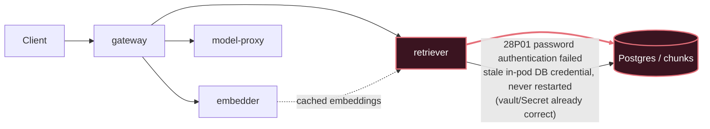

# Postmortem: RAG top-1 relevance below the 90% objective over the last hour (burn-rate alerting saturates for a loose SLO)

- **Status:** open
- **Severity:** sev2
- **Verified:** no
- **Opened:** 2026-08-03 20:19:49Z
- **Resolved:** (still open)

## Timeline (machine-generated)

All times UTC on 2026-08-03 unless a full date is shown.

| Time (UTC) | Source | Event |
| --- | --- | --- |
| 20:12:24Z | log-spike | log-spike onset: routine: "auth_failed", |
| 20:19:10Z | alert | alert firing: SLO RAG quality — below objective |

## Evidence links

- [Loki — logs over the incident window](http://localhost:3001/explore?schemaVersion=1&panes=%7B%22pm%22%3A+%7B%22datasource%22%3A+%22loki%22%2C+%22queries%22%3A+%5B%7B%22refId%22%3A+%22A%22%2C+%22datasource%22%3A+%7B%22type%22%3A+%22loki%22%2C+%22uid%22%3A+%22loki%22%7D%2C+%22expr%22%3A+%22%7Bnamespace%3D%5C%22subject%5C%22%7D+%7C~+%5C%22%28%3Fi%29error%7Cfailed%5C%22%22%7D%5D%2C+%22range%22%3A+%7B%22from%22%3A+%221785788389076%22%2C+%22to%22%3A+%221785788903953%22%7D%7D%7D&orgId=1)
- [Mimir — metrics over the incident window](http://localhost:3001/explore?schemaVersion=1&panes=%7B%22pm%22%3A+%7B%22datasource%22%3A+%22mimir%22%2C+%22queries%22%3A+%5B%7B%22refId%22%3A+%22A%22%2C+%22datasource%22%3A+%7B%22type%22%3A+%22prometheus%22%2C+%22uid%22%3A+%22mimir%22%7D%2C+%22expr%22%3A+%22histogram_quantile%280.95%2C+sum%28rate%28http_server_duration_milliseconds_bucket%5B5m%5D%29%29+by+%28le%29%29%22%7D%5D%2C+%22range%22%3A+%7B%22from%22%3A+%221785788389076%22%2C+%22to%22%3A+%221785788903953%22%7D%7D%7D&orgId=1)

## Investigation context

**Runbook match:** none — no tool narrowing applied for this alert. Available runbooks: README.md, canary-abort.md, ci-pipeline-red.md, dq-freshness-stall.md, gateway-high-error-rate.md, k8s-crashloop.md, k8s-node-failure.md, snapshot-agent-audit.md, stale-secret.md

Pre-check battery (as injected at run start)

## Pre-check leads

### recent_deploys — LEAD
No deploy in the last 60m — rule out the reflex answer.
- No deploy in the last 60m — rule out the reflex answer.

### log_spike — LEAD
error/failed log rate 200/10min vs baseline 0/10min (200x baseline) — onset:     routine: "auth_failed", at 2026-08-03T20:12:24.986364+00:00
- error/failed log rate 200/10min vs baseline 0/10min (200x baseline) — onset:     routine: "auth_failed", at 2026-08-03T20:12:24.986364+00:00

### kube_scan — UNAVAILABLE
error: You must be logged in to the server (Unauthorized)

### rollout_state — UNAVAILABLE
gateway: E0803 22:19:53.448171   57532 memcache.go:265] "Unhandled Error" err="couldn't get current server API group list: the server has asked for the client to provide credentials"
E0803 22:19:54.134175   57532 memcache.go:265] "Unhandled Error" err="couldn't get current server API group list: the server has asked for the client to provide credentials"
E0803 22:19:55.125660   57532 memcache.go:265] "Unhandled Error" err="couldn't get current server API group list: the server has asked for the client to; gateway analysis: E0803 22:19:53.289682   19736 memcache.go:265] "Unhandled Error" err="couldn't get current server API group list: the server has asked for the client to provide credentials"
E0803 22:19:54.021239   19736 memcache.go:265] "Unhandled Error"
… (section truncated)

### secret_age — UNAVAILABLE
error: You must be logged in to the server (Unauthorized)

## Narrative

## Summary
`SLO RAG quality — below objective` fired for tenant acme after top-1 retrieval relevance collapsed to ~0.15 against a 0.90 objective. No runbook matched this exact alertname, so this was worked from first principles against the telemetry.

## Impact
Retrieval-augmented answers for tenant acme (and, per the underlying auth-failure log stream, all tenants sharing the `retriever` deployment) were served with effectively no useful retrieved context: the `retrieval_relevance_score` histogram shows ~98% of samples landing in the `le=0.2` bucket across both gateway pods (10412/10593 and 10448/10644 samples), i.e. retrieval was returning near-zero-relevance results, not a modest quality dip.

## Root cause
The `retriever` pod (`retriever-dc7ddd494-jv9j7`) began failing every query against Postgres with `PostgresError: password authentication failed for user "lab"`. Postgres's own log confirms the rejection server-side: `FATAL: password authentication failed for user "lab"` (SQLSTATE `28P01`), in a sudden burst that matches the pre-check log-spike lead exactly (error/failed rate 200x baseline, `routine: "auth_failed"`). The failures are isolated to the `retriever` container — `gateway` and `model-proxy` logs show no matching auth errors in the same window — so this was not a cluster-wide credential problem.

`deploy_history` and `gitea_ci_runs` show no code deploy touching gateway/retriever/embedder in the incident window (the nearest CI activity was ~20 hours prior and unrelated to RAG components), ruling out a bad deploy. `update_db_secret` (dry-run) reported **no rotated credential pending in the vault** — the Secret object is already correct — which rules out the classic "vault rotated ahead of the Secret" desync. The remaining explanation consistent with all the evidence: the `retriever` pod was holding a stale/cached credential in its running process (from before the current, already-correct Secret value took effect) and, because Kubernetes does not restart a pod automatically when a referenced Secret changes, it kept presenting the old password to Postgres on every reconnect attempt. With every retrieval query failing outright, the RAG pipeline fell back to degraded/empty retrieval, driving top-1 relevance to near zero and burning the SLO's error budget.

Node-level `FreeDiskSpaceFailed` warnings were present on all three k3d nodes throughout the window but are a pre-existing, unrelated condition (steady-state disk pressure, not a new event correlated with onset) and were not pursued further as a cause.

## What fixed it
Diagnosis and remediation plan: roll `deployment/retriever` to force it to pick up the current (already-correct) database credential — no secret sync needed since the vault had nothing pending. The dry-run diff (`kubectl.kubernetes.io/restartedAt` annotation patch, no spec change) was reviewed and the action was **approved by the operator** (approval `apr_19fc94b6e05f9`).

**Execution failed**, however: both attempts to run the real restart (`dry_run=false`) returned `error: You must be logged in to the server (Unauthorized)` from the cluster's kubectl path. This is the same failure mode the pre-check battery already flagged as unavailable for `kube_scan`, `rollout_state`, and `secret_age` — a standing credential problem with the read/write kubectl identity used by this tooling, external to the retriever's own DB-auth issue. Retrying the identical call twice produced the identical error, so further retries were not expected to succeed without a human refreshing that cluster credential out-of-band.

**The incident is NOT resolved.** `alert_status` was re-queried after the failed execution attempts and still reports the alert active. The approved remediation (restart `retriever`) has not actually been applied to the cluster.

## Lessons
- Root-caused correctly (retriever ↔ Postgres auth, stale in-pod credential, isolated to one workload, no deploy involved) but could not close the loop because the operator tooling's own cluster credential was unauthorized — a second, independent auth problem sitting on top of the incident's actual auth problem.
- Next on-call (or a human with cluster access) needs to either refresh the kubectl/agent-ro credential used by `restart_workload`/`argo_app`/`kubectl_read`, or manually roll `deployment/retriever` in namespace `subject`, then re-check `alert_status` and the `retrieval_relevance_score` histogram for recovery.
- No runbook currently covers `SLO RAG quality — below objective`; recommend authoring one keyed to this alertname that documents the retriever→Postgres auth-failure signature (distinct from `stale-secret.md`, which assumes a pending vault rotation — here the vault/Secret were already correct and only the running pod was stale) and the fact remediation may require a fallback path when the mutating kubectl identity itself is unauthorized.

## Delivery path

Break is on the **retriever → Postgres** hop: every retrieval query fails auth, so the gateway falls back to near-zero-relevance results, tripping the RAG quality SLO even though `gateway`, `embedder`, and `model-proxy` are all healthy.
