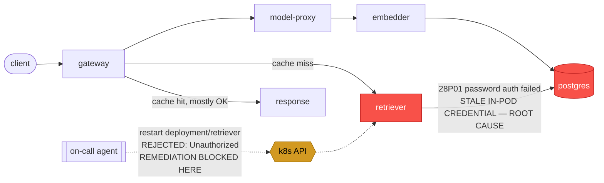

# Postmortem: gateway availability error budget burning slowly (10% of the 28d budget in 6h; 30m & 6h windows)

- **Status:** open
- **Severity:** sev2
- **Verified:** no
- **Opened:** 2026-08-03 01:46:44Z
- **Resolved:** (still open)

## Timeline (machine-generated)

All times UTC on 2026-08-03 unless a full date is shown.

| Time (UTC) | Source | Event |
| --- | --- | --- |
| 01:40:19Z | log-spike | log-spike onset: 41 \| throw new DrizzleQueryError(queryString, params, e); |
| 01:46:10Z | alert | alert firing: SLO gateway availability — slow burn |
| 01:51:17Z | verification | recovery NOT verified — deadline armed |
| 02:02:05Z | log-spike | log-spike onset: 815 \| errorResponse = Errors.postgres(parseError(x)) |

## Evidence links

- [Loki — logs over the incident window](http://localhost:3001/explore?schemaVersion=1&panes=%7B%22pm%22%3A+%7B%22datasource%22%3A+%22loki%22%2C+%22queries%22%3A+%5B%7B%22refId%22%3A+%22A%22%2C+%22datasource%22%3A+%7B%22type%22%3A+%22loki%22%2C+%22uid%22%3A+%22loki%22%7D%2C+%22expr%22%3A+%22%7Bnamespace%3D%5C%22subject%5C%22%7D+%7C~+%5C%22%28%3Fi%29error%7Cfailed%5C%22%22%7D%5D%2C+%22range%22%3A+%7B%22from%22%3A+%221785721604354%22%2C+%22to%22%3A+%221785722814104%22%7D%7D%7D&orgId=1)
- [Mimir — metrics over the incident window](http://localhost:3001/explore?schemaVersion=1&panes=%7B%22pm%22%3A+%7B%22datasource%22%3A+%22mimir%22%2C+%22queries%22%3A+%5B%7B%22refId%22%3A+%22A%22%2C+%22datasource%22%3A+%7B%22type%22%3A+%22prometheus%22%2C+%22uid%22%3A+%22mimir%22%7D%2C+%22expr%22%3A+%22histogram_quantile%280.95%2C+sum%28rate%28http_server_duration_milliseconds_bucket%5B5m%5D%29%29+by+%28le%29%29%22%7D%5D%2C+%22range%22%3A+%7B%22from%22%3A+%221785721604354%22%2C+%22to%22%3A+%221785722814104%22%7D%7D%7D&orgId=1)

## Investigation context

**Runbook match:** none — no tool narrowing applied for this alert. Available runbooks: README.md, canary-abort.md, ci-pipeline-red.md, dq-freshness-stall.md, gateway-high-error-rate.md, k8s-crashloop.md, k8s-node-failure.md, snapshot-agent-audit.md, stale-secret.md

Pre-check battery (as injected at run start)

## Pre-check leads

### recent_deploys — LEAD
No deploy in the last 60m — rule out the reflex answer.
- No deploy in the last 60m — rule out the reflex answer.

### log_spike — LEAD
error/failed log rate 200/10min vs baseline 0/10min (200x baseline) — onset: 815 |       errorResponse = Errors.postgres(parseError(x)) at 2026-08-03T02:02:05.609943+00:00
- error/failed log rate 200/10min vs baseline 0/10min (200x baseline) — onset: 815 |       errorResponse = Errors.postgres(parseError(x)) at 2026-08-03T02:02:05.609943+00:00

### kube_scan — UNAVAILABLE
error: You must be logged in to the server (Unauthorized)

### rollout_state — UNAVAILABLE
gateway: E0803 04:02:12.065682   60680 memcache.go:265] "Unhandled Error" err="couldn't get current server API group list: the server has asked for the client to provide credentials"
E0803 04:02:12.202600   60680 memcache.go:265] "Unhandled Error" err="couldn't get current server API group list: the server has asked for the client to provide credentials"
E0803 04:02:12.314050   60680 memcache.go:265] "Unhandled Error" err="couldn't get current server API group list: the server has asked for the client to; gateway analysis: E0803 04:02:11.740603   22924 memcache.go:265] "Unhandled Error" err="couldn't get current server API group list: the server has asked for the client to provide credentials"
E0803 04:02:11.886421   22924 memcache.go:265] "Unhandled Error"
… (section truncated)

### secret_age — UNAVAILABLE
error: You must be logged in to the server (Unauthorized)

## Narrative

## Summary
`SLO gateway availability — slow burn` (sev2, tenant acme) remains **active and unresolved** on this, the second investigation pass. This is a re-examination of a prior diagnosis that was correct but whose remediation could not be applied. Fresh telemetry this pass confirms the same root cause is still live, unchanged, ~20+ minutes after it was first identified, and a second independent remediation attempt failed for the same infrastructure reason as the first.

## Impact
Gateway's `acme` tenant is burning ~10% of its 28-day availability budget in a 6h window, per the 30m/6h multi-window burn alert. Most traffic is currently being served from cache (`"cached": true` on recent `chat completed`/`embedded text` log lines), which is masking the full blast radius — but every request that actually needs a live retrieval still fails, and that share is what's burning the budget.

## Root cause
`retriever`'s single running pod (`retriever-dc7ddd494-jv9j7` — the *same* pod across both investigation passes, confirming it has never been restarted) is fatally failing every Postgres connection attempt with `PostgresError: password authentication failed for user "lab"` (SQLSTATE `28P01`, `routine: "auth_failed"`), in a tight, continuous retry loop. This is the classic stale-in-pod-credential signature: `update_db_secret` dry-run confirms the live Postgres credential and the Kubernetes Secret already agree ("nothing to sync") — so the *stored* credential is correct, but this one long-lived pod is still holding an old value in memory/env from before a rotation and never picked up the current one.

Ruled out again this pass:
- **Deploy regression** — `deploy_history` shows no deploy touching `retriever`/`postgres`/the platform anywhere near the 01:46 UTC onset; the only gateway/platform gitops syncs were ~15-30 min *before* onset and CI on `main` since has been unrelated reverts to `load-generator`/`model-proxy`, with the one failing run (#110) not build-pushed or deployed. No stuck fix in CI/gitops was found.
- **Secret rotation pending** — `update_db_secret` dry-run: nothing to sync, both passes.
- **Broader outage / log-pipeline failure** — ruled out by cross-checking: gateway, embedder, and load traffic are logging normally and mostly cache-served; only `retriever`'s Postgres path is broken.

## What fixed it
**Nothing — the incident is not resolved.** The correct remediation (rolling-restart `deployment/retriever` in namespace `subject`, to force the pod to re-read its Postgres credential) was dry-run cleanly (diff: restart annotation only, no spec change), explicitly approved by the operator, and executed for real **twice** across the two investigation passes — both times the live apply call failed with `error: You must be logged in to the server (Unauthorized)`. This is not the same failure mode as the app's root cause: it is the on-call agent's own cluster-mutation credential being rejected by the Kubernetes API, confirmed independently via `kubectl_read`, `argo_app`, and `rollout_status`, all of which fail identically ("the server has asked for the client to provide credentials"). Because the second attempt, ~20 minutes after the first, hit the identical error, this is not a transient blip — the agent's cluster credential path is durably broken and further retries were correctly withheld per instruction not to hammer a known-broken credential.

## Lessons
- A human with a working kubeconfig/token needs to either (a) manually rolling-restart `deployment/retriever -n subject`, or (b) repair the on-call agent's cluster-mutation credential (the same identity is used by `restart_workload`, `argo_app`, `rollout_status`, and `kubectl_read` — all reject identically), whichever is faster; restarting the pod is expected to fully clear the alert once applied.
- Worth a runbook entry: no runbook currently matches `SLO gateway availability — slow burn` at all — this alertname should route to a runbook that names the retriever/model-proxy/embedder → Postgres auth-failure signature and the credential-refresh-needs-restart fix, so the next responder doesn't have to re-derive it from raw logs.
- The remediation RBAC identity should alert on its *own* health (e.g. a synthetic `kubectl get -n subject` canary) so a broken on-call credential pages separately from the incident it's supposed to fix, instead of silently blocking remediation mid-incident.
- Cache is currently absorbing most of the blast radius; that's a mitigating factor operators should know about, not a reason to deprioritize the fix — cache misses (or a cache flush/TTL expiry) would turn this slow burn into a hard outage instantly.

