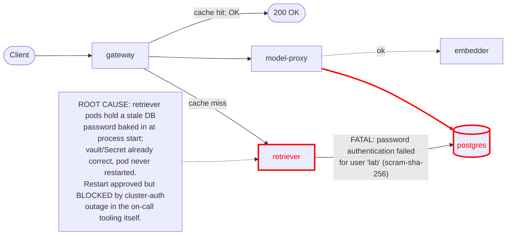

# Postmortem: gateway availability error budget burning fast (2% of the 28d budget in 1h; 5m & 1h windows)

- **Status:** open
- **Severity:** sev1
- **Verified:** no
- **Opened:** 2026-08-03 21:58:42Z
- **Resolved:** (still open)

## Timeline (machine-generated)

All times UTC on 2026-08-03 unless a full date is shown.

| Time (UTC) | Source | Event |
| --- | --- | --- |
| 21:58:01Z | log-spike | log-spike onset: at ErrorResponse (/app/node_modules/.bun/postgres@3.4.9/node_modules/postgres/src/connection.js:817:22) |
| 21:58:10Z | alert | alert firing: SLO gateway availability — fast burn |

## Evidence links

- [Loki — logs over the incident window](http://localhost:3001/explore?schemaVersion=1&panes=%7B%22pm%22%3A+%7B%22datasource%22%3A+%22loki%22%2C+%22queries%22%3A+%5B%7B%22refId%22%3A+%22A%22%2C+%22datasource%22%3A+%7B%22type%22%3A+%22loki%22%2C+%22uid%22%3A+%22loki%22%7D%2C+%22expr%22%3A+%22%7Bnamespace%3D%5C%22subject%5C%22%7D+%7C~+%5C%22%28%3Fi%29error%7Cfailed%5C%22%22%7D%5D%2C+%22range%22%3A+%7B%22from%22%3A+%221785794322910%22%2C+%22to%22%3A+%221785794677736%22%7D%7D%7D&orgId=1)
- [Mimir — metrics over the incident window](http://localhost:3001/explore?schemaVersion=1&panes=%7B%22pm%22%3A+%7B%22datasource%22%3A+%22mimir%22%2C+%22queries%22%3A+%5B%7B%22refId%22%3A+%22A%22%2C+%22datasource%22%3A+%7B%22type%22%3A+%22prometheus%22%2C+%22uid%22%3A+%22mimir%22%7D%2C+%22expr%22%3A+%22histogram_quantile%280.95%2C+sum%28rate%28http_server_duration_milliseconds_bucket%5B5m%5D%29%29+by+%28le%29%29%22%7D%5D%2C+%22range%22%3A+%7B%22from%22%3A+%221785794322910%22%2C+%22to%22%3A+%221785794677736%22%7D%7D%7D&orgId=1)

## Investigation context

**Runbook match (2):** `gateway-high-error-rate.md`, `stale-secret.md` — toolset narrowed to 13 tools: alert_status, deploy_history, kubectl_read, loki_query, mimir_query, publish_postmortem, request_approval, restart_workload, runbook_lookup, runbook_read, save_artifact, tempo_query, update_db_secret

Pre-check battery (as injected at run start)

## Pre-check leads

### recent_deploys — LEAD
No deploy in the last 60m — rule out the reflex answer.
- No deploy in the last 60m — rule out the reflex answer.

### log_spike — LEAD
error/failed log rate 200/10min vs baseline 48/10min (4x baseline) — onset:       at ErrorResponse (/app/node_modules/.bun/postgres@3.4.9/node_modules/postgres/src/connection.js:817:22) at 2026-08-03T21:58:01.770108+00:00
- error/failed log rate 200/10min vs baseline 48/10min (4x baseline) — onset:       at ErrorResponse (/app/node_modules/.bun/postgres@3.4.9/node_modules/postgres/src/connection.js:817:22) a… (truncated)

### kube_scan — UNAVAILABLE
error: You must be logged in to the server (Unauthorized)

### rollout_state — UNAVAILABLE
gateway: E0803 23:58:43.740926   52916 memcache.go:265] "Unhandled Error" err="couldn't get current server API group list: the server has asked for the client to provide credentials"
E0803 23:58:43.817705   52916 memcache.go:265] "Unhandled Error" err="couldn't get current server API group list: the server has asked for the client to provide credentials"
E0803 23:58:43.956025   52916 memcache.go:265] "Unhandled Error" err="couldn't get current server API group list: the server has asked for the client to; gateway analysis: E0803 23:58:43.744886   63920 memcache.go:265] "Unhandled Error" err="couldn't get current server API group list: the server has asked for the client to provide credentials"
E0803 23:58:43.826301   63920 memcache.go:265] "Unhandled Error"
… (section truncated)

### secret_age — UNAVAILABLE
error: You must be logged in to the server (Unauthorized)

## Narrative

## Summary
`SLO gateway availability — fast burn` (sev1, tenant acme) fired because `retriever` began rejecting-then-failing every database-backed retrieval call: Postgres returned `FATAL: password authentication failed for user "lab"` on essentially every connection attempt from `retriever`, driving the gateway's non-cached RAG requests into errors and burning the 28-day availability budget fast.

## Impact
Gateway availability error-budget burn crossed the fast-burn threshold (2% of the 28d budget in 1h, 5m & 1h windows both breaching). Any `acme` chat request that missed the gateway's response cache and needed retrieval failed; cached completions kept succeeding, which is why gateway's own request logs looked deceptively healthy while the retriever tier was in a hard failure loop.

## Root cause
`retriever`'s Postgres connections started failing authentication for user `lab` at the same instant the alert opened, confirmed directly in Postgres's own log (`FATAL: password authentication failed for user "lab"`, matched via `pg_hba.conf` line 128, `scram-sha-256`) and mirrored in `retriever`'s bun `postgres` client stack (`ErrorResponse` at `postgres@3.4.9/src/connection.js:817`). `deploy_history` showed **no deploy** for gateway or any workload in the preceding 4 hours, ruling out a bad release. `gateway`, `embedder`, and `model-proxy` logs showed **no** matching auth failures — this was isolated to `retriever`'s Postgres connection pool. Checking `update_db_secret` in dry-run mode found **no pending rotation in the vault** — the Secret already holds the current, correct credential. That combination (Secret already correct, no deploy, failures starting at a single instant, isolated to one workload) is the textbook "stale secret held by a running pod" signature: the credential was corrected in the Secret at some point before this pod's current lifetime, but `retriever`'s pods were never restarted to pick up it up, so they kept authenticating with the password baked into their process environment at startup — Kubernetes does not restart a pod just because a referenced Secret changes.

## What fixed it
Remediation plan: rolling-restart `deployment/retriever` (no spec change, only a `restartedAt` annotation bump) so new pods read the current Secret at startup. This was dry-run, the diff was verified server-side, and an operator **approved** it via `request_approval`. However, executing the real restart (`dry_run=false`) failed three consecutive times with `error: You must be logged in to the server (Unauthorized)` — the identical cluster-auth failure that made the `kube_scan` and `rollout_state` pre-checks unavailable at the start of this incident. This is a control-plane credential problem in the on-call tooling itself, not a decision to retry around. **The incident is NOT resolved** — `alert_status` was re-queried after each attempt and continued reporting the fast-burn alert active. The approved restart still needs to be applied, either once the on-call agent's cluster credentials are restored, or manually by an operator with working `kubectl` access to `deployment/retriever` in the `subject` namespace.

## Lessons
- The gateway's own error/latency signal under-represented the outage because its response cache masked failures on repeat/cached prompts — the `retriever` tier's Postgres auth failures were the real signal and only visible by going one hop downstream.
- `update_db_secret`'s dry-run being a no-op is itself diagnostic: it distinguishes "Secret needs syncing from vault" (classic stale-secret) from "Secret is already correct, pod just needs a bounce" — worth calling out explicitly in the runbook so the next responder doesn't stop at "nothing to sync, therefore not a secret issue."
- The on-call tooling's own cluster-auth outage (same fault class the pre-checks flagged as `kube_scan`/`rollout_state` UNAVAILABLE) is a single point of failure for every mutating remediation (`restart_workload`, `scale_deployment`, `rollout_*`) — it deserves its own alert/runbook, since a real incident landing during a credential outage leaves on-call unable to act at all.

