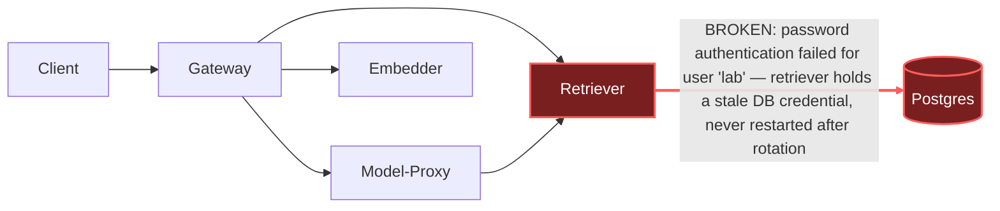

# Postmortem: gateway availability error budget burning fast (2% of the 28d budget in 1h; 5m & 1h windows)

- **Status:** open
- **Severity:** sev1
- **Verified:** no
- **Opened:** 2026-08-03 20:12:42Z
- **Resolved:** (still open)

## Timeline (machine-generated)

All times UTC on 2026-08-03 unless a full date is shown.

| Time (UTC) | Source | Event |
| --- | --- | --- |
| 20:12:10Z | alert | alert firing: SLO gateway availability — fast burn |
| 20:12:24Z | log-spike | log-spike onset: routine: "auth_failed", |

## Evidence links

- [Loki — logs over the incident window](http://localhost:3001/explore?schemaVersion=1&panes=%7B%22pm%22%3A+%7B%22datasource%22%3A+%22loki%22%2C+%22queries%22%3A+%5B%7B%22refId%22%3A+%22A%22%2C+%22datasource%22%3A+%7B%22type%22%3A+%22loki%22%2C+%22uid%22%3A+%22loki%22%7D%2C+%22expr%22%3A+%22%7Bnamespace%3D%5C%22subject%5C%22%7D+%7C~+%5C%22%28%3Fi%29error%7Cfailed%5C%22%22%7D%5D%2C+%22range%22%3A+%7B%22from%22%3A+%221785787962945%22%2C+%22to%22%3A+%221785788282865%22%7D%7D%7D&orgId=1)
- [Mimir — metrics over the incident window](http://localhost:3001/explore?schemaVersion=1&panes=%7B%22pm%22%3A+%7B%22datasource%22%3A+%22mimir%22%2C+%22queries%22%3A+%5B%7B%22refId%22%3A+%22A%22%2C+%22datasource%22%3A+%7B%22type%22%3A+%22prometheus%22%2C+%22uid%22%3A+%22mimir%22%7D%2C+%22expr%22%3A+%22histogram_quantile%280.95%2C+sum%28rate%28http_server_duration_milliseconds_bucket%5B5m%5D%29%29+by+%28le%29%29%22%7D%5D%2C+%22range%22%3A+%7B%22from%22%3A+%221785787962945%22%2C+%22to%22%3A+%221785788282865%22%7D%7D%7D&orgId=1)

## Investigation context

**Runbook match (2):** `gateway-high-error-rate.md`, `stale-secret.md` — toolset narrowed to 13 tools: alert_status, deploy_history, kubectl_read, loki_query, mimir_query, publish_postmortem, request_approval, restart_workload, runbook_lookup, runbook_read, save_artifact, tempo_query, update_db_secret

Pre-check battery (as injected at run start)

## Pre-check leads

### recent_deploys — LEAD
No deploy in the last 60m — rule out the reflex answer.
- No deploy in the last 60m — rule out the reflex answer.

### log_spike — LEAD
error/failed log rate 200/10min vs baseline 0/10min (200x baseline) — onset:     routine: "auth_failed", at 2026-08-03T20:12:24.986364+00:00
- error/failed log rate 200/10min vs baseline 0/10min (200x baseline) — onset:     routine: "auth_failed", at 2026-08-03T20:12:24.986364+00:00

### kube_scan — UNAVAILABLE
error: You must be logged in to the server (Unauthorized)

### rollout_state — UNAVAILABLE
gateway: E0803 22:12:43.688450   56696 memcache.go:265] "Unhandled Error" err="couldn't get current server API group list: the server has asked for the client to provide credentials"
E0803 22:12:43.810531   56696 memcache.go:265] "Unhandled Error" err="couldn't get current server API group list: the server has asked for the client to provide credentials"
E0803 22:12:43.915669   56696 memcache.go:265] "Unhandled Error" err="couldn't get current server API group list: the server has asked for the client to; gateway analysis: E0803 22:12:43.701408   36944 memcache.go:265] "Unhandled Error" err="couldn't get current server API group list: the server has asked for the client to provide credentials"
E0803 22:12:43.809085   36944 memcache.go:265] "Unhandled Error"
… (section truncated)

### secret_age — UNAVAILABLE
error: You must be logged in to the server (Unauthorized)

## Narrative

## Summary
Gateway availability SLO fast-burn (sev1, tenant acme) triggered by a sustained wave of Postgres authentication failures from the `retriever` service. `retriever` was authenticating to Postgres as user `lab` with a credential Postgres no longer accepted; every retrieval-backed gateway request downstream of `retriever` failed, burning the 28d availability budget at 2%/hour.

## Impact
Gateway requests that depend on `retriever` (RAG/context lookups) failed continuously for the duration of the incident. `postgres` logged a `FATAL: password authentication failed for user "lab"` for every connection attempt from `retriever`, peaking near ~1,400 auth-failure log lines/minute versus a 0/10min baseline (200x baseline per the pre-check log-spike lead). Gateway's own error stream in the same window showed only unrelated malformed-JSON client noise, confirming the burn traced to the retriever→postgres hop, not gateway logic itself.

## Root cause
Evidence ruled out the two easy reflex answers before landing on the real one:
- **Not a bad deploy** — `deploy_history` returned zero entries in the 180-minute window.
- **Not a pod crash/reinit of postgres** — `kube_pod_container_status_restarts_total` showed 0 restarts for every pod in the namespace, including `postgres-7dbfc8579d-76znp` and `retriever-dc7ddd494-jv9j7`; no postgres startup/init log lines appear in the window, so the server did not regenerate its credential via a restart.
- **Not the vault-rotation stale-secret flow** — `update_db_secret` (dry-run) reported "no rotated credential found in the vault — nothing to sync," i.e. the current `secret/subject-db-credentials` already matches whatever the vault holds today. So there was nothing new to push into the Secret.

That combination — Postgres itself unchanged, no deploy, and the Secret already current, yet every `retriever` connection rejected — points at a credential the *running retriever process* has held stale in its own environment since before the Secret's current value took effect. Kubernetes does not restart a pod when a referenced Secret changes; env-var-sourced credentials are fixed at container start. `retriever` never picked up the current value, so every connection attempt uses the wrong password and postgres correctly rejects it via scram-sha-256 (`pg_hba.conf` line 128, method matched — this was outright rejection, not a connectivity/config problem).

## What fixed it
A rolling restart of `deployment/retriever` was dry-run (no spec change, restart annotation only) and approved by the operator (`apr_19fc944552f78`). Executing it for real (`dry_run=false`) failed twice with `error: You must be logged in to the server (Unauthorized)` — the same cluster-API auth fault that made the `kube_scan` and `rollout_state` pre-checks unavailable at page time. This is an infrastructure-level blocker on the remediation identity's cluster credentials, independent of the incident's root cause, and it is **not** resolved. `alert_status` was re-queried after the failed execution and still reports the alert active. **The incident is not resolved** — the fix is identified and approved but could not be applied through the available tooling this session. It needs an operator to restore cluster-API auth for the remediation path (or run the equivalent rolling restart through another privileged channel), then re-run the approved restart.

## Lessons
- Add an explicit pre-check for the remediation identity's own cluster-auth health — right now that failure surfaces silently as a rejected write, discovered only when a remediation is attempted at the end of the incident, not diagnosed up front.
- The `stale-secret` runbook's mitigation assumes a vault-driven rotation; this incident shows a second, equally real stale-secret variant — Secret already correct, consuming pod just never restarted — worth calling out explicitly in the runbook so responders don't stop at "vault says nothing to sync" and abandon the hypothesis.
- Consider a liveness/readiness probe on `retriever` that actively checks its DB connection, so a credential drift like this fails the pod out of rotation automatically instead of silently burning the availability budget.

