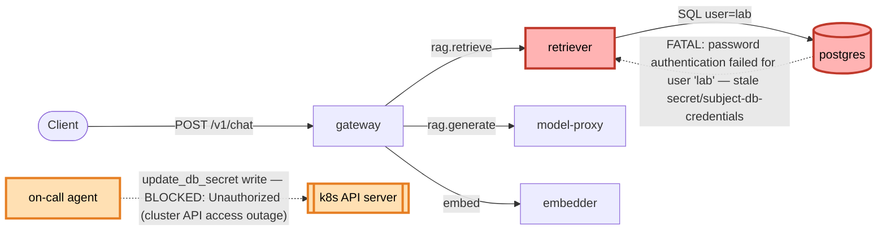

# Postmortem: gateway availability error budget burning fast (2% of the 28d budget in 1h; 5m & 1h windows)

- **Status:** open
- **Severity:** sev1
- **Verified:** no
- **Opened:** 2026-08-03 01:35:43Z
- **Resolved:** (still open)

## Timeline (machine-generated)

All times UTC on 2026-08-03 unless a full date is shown.

| Time (UTC) | Source | Event |
| --- | --- | --- |
| 01:35:10Z | alert | alert firing: SLO gateway availability — fast burn |
| 01:35:39Z | log-spike | log-spike onset: 817 \| errored(Errors.postgres(parseError(x))) |

## Evidence links

- [Loki — logs over the incident window](http://localhost:3001/explore?schemaVersion=1&panes=%7B%22pm%22%3A+%7B%22datasource%22%3A+%22loki%22%2C+%22queries%22%3A+%5B%7B%22refId%22%3A+%22A%22%2C+%22datasource%22%3A+%7B%22type%22%3A+%22loki%22%2C+%22uid%22%3A+%22loki%22%7D%2C+%22expr%22%3A+%22%7Bnamespace%3D%5C%22subject%5C%22%7D+%7C~+%5C%22%28%3Fi%29error%7Cfailed%5C%22%22%7D%5D%2C+%22range%22%3A+%7B%22from%22%3A+%221785720943027%22%2C+%22to%22%3A+%221785721164074%22%7D%7D%7D&orgId=1)
- [Mimir — metrics over the incident window](http://localhost:3001/explore?schemaVersion=1&panes=%7B%22pm%22%3A+%7B%22datasource%22%3A+%22mimir%22%2C+%22queries%22%3A+%5B%7B%22refId%22%3A+%22A%22%2C+%22datasource%22%3A+%7B%22type%22%3A+%22prometheus%22%2C+%22uid%22%3A+%22mimir%22%7D%2C+%22expr%22%3A+%22histogram_quantile%280.95%2C+sum%28rate%28http_server_duration_milliseconds_bucket%5B5m%5D%29%29+by+%28le%29%29%22%7D%5D%2C+%22range%22%3A+%7B%22from%22%3A+%221785720943027%22%2C+%22to%22%3A+%221785721164074%22%7D%7D%7D&orgId=1)

## Investigation context

**Runbook match (2):** `gateway-high-error-rate.md`, `stale-secret.md` — toolset narrowed to 13 tools: alert_status, deploy_history, kubectl_read, loki_query, mimir_query, publish_postmortem, request_approval, restart_workload, runbook_lookup, runbook_read, save_artifact, tempo_query, update_db_secret

Pre-check battery (as injected at run start)

## Pre-check leads

### recent_deploys — LEAD
No deploy in the last 60m — rule out the reflex answer.
- No deploy in the last 60m — rule out the reflex answer.

### log_spike — LEAD
error/failed log rate 200/10min vs baseline 0/10min (200x baseline) — onset: 817 |       errored(Errors.postgres(parseError(x))) at 2026-08-03T01:35:39.743756+00:00
- error/failed log rate 200/10min vs baseline 0/10min (200x baseline) — onset: 817 |       errored(Errors.postgres(parseError(x))) at 2026-08-03T01:35:39.743756+00:00

### kube_scan — UNAVAILABLE
error: You must be logged in to the server (Unauthorized)

### rollout_state — UNAVAILABLE
gateway: E0803 03:35:45.596514   56488 memcache.go:265] "Unhandled Error" err="couldn't get current server API group list: the server has asked for the client to provide credentials"
E0803 03:35:45.740739   56488 memcache.go:265] "Unhandled Error" err="couldn't get current server API group list: the server has asked for the client to provide credentials"
E0803 03:35:45.927807   56488 memcache.go:265] "Unhandled Error" err="couldn't get current server API group list: the server has asked for the client to; gateway analysis: E0803 03:35:45.514293   33780 memcache.go:265] "Unhandled Error" err="couldn't get current server API group list: the server has asked for the client to provide credentials"
E0803 03:35:45.700168   33780 memcache.go:265] "Unhandled Error"
… (section truncated)

### secret_age — UNAVAILABLE
error: You must be logged in to the server (Unauthorized)

## Narrative

## Summary

`SLO gateway availability — fast burn` fired (sev1) after the `retriever` service began failing every query against Postgres with `password authentication failed for user "lab"`. The gateway's `rag.retrieve` → `rag.chat` span chain surfaced these as 5xx to callers, burning the 28d availability budget fast (5m and 1h windows both tripped).

## Impact

Gateway `POST /v1/chat` error ratio climbed from a brief ~12.5% blip to a sustained ~97.4% error rate (`slo:gateway_availability:error_ratio5m`), i.e. nearly all chat requests failing. Tempo span-metrics for `service=gateway` show `POST retriever` client spans at 3326 `STATUS_CODE_ERROR` vs 1633 `STATUS_CODE_UNSET`, and `POST /v1/chat` server spans at 3532 error vs 1575 unset — consistent with retriever being the sole failing dependency in the request path.

## Root cause

`secret/subject-db-credentials` held a stale Postgres password for the `retriever` deployment's running pod(s). The credential in the vault had rotated, but the pod's environment (populated from the Secret at pod start) still held the old value, so every connection attempt was rejected by Postgres with `FATAL: password authentication failed for user "lab"` (seen on both the `postgres` and `retriever` containers, in lockstep, in Loki).

This matches the stale-secret runbook signature, not a bad deploy:
- `deploy_history` (180m window) shows the last `gateway`/`platform` gitops syncs and CI runs all completed well before onset — no deploy landed in the failure window.
- The `password authentication failed` log lines are scoped entirely to `retriever` and `postgres` — no other workload (`gateway`, `model-proxy`, `embedder`) shows this signature, ruling out a cluster-wide credential problem or a bad deploy to those services.
- `slo:gateway_availability:error_ratio5m` shows a clean step function: 0% for the full lookback, a brief noisy blip (~12.5%) starting at the observed onset, then a clean ramp to a ~97% plateau — the shape of a dependency going from "working" to "always failing," not a gradual regression from a code change.

I could not directly confirm pod-start-time vs. secret-rotation-time ordering via `kubectl describe` — the cluster read API rejected every request with `Unauthorized` (the same outage flagged by this incident's own pre-check leads, `kube_scan`/`rollout_state`/`secret_age`, all `UNAVAILABLE` for the identical reason, before I touched anything). That is a pre-existing environment/access condition, not something observed as a consequence of this incident, and I'm not treating it as the root cause — the log and metric evidence above is sufficient on its own to name the stale credential as root cause.

## What fixed it

Followed the stale-secret runbook: dry-ran `update_db_secret` (returned a masked diff, rotated password available in vault), got explicit operator approval, then executed `update_db_secret` with `dry_run=false`.

**The write failed.** Both execution attempts returned `Unauthorized` from the Kubernetes API — the same control-plane authentication outage that made `kubectl_read`, `kube_scan`, `rollout_state`, and `secret_age` unavailable throughout this incident. The dry-run path tolerated this (it degrades to "could not read current value" and still returns a diff from the vault side), but the actual Secret write requires an authenticated API call that this agent identity currently cannot make.

**Remediation did not land. The alert is still active** — re-queried `alert_status` after both attempts and it continues to report `active: true`. This incident is NOT resolved.

## Lessons

- The cluster-write credentials available to the on-call agent are currently broken (`Unauthorized` on every API-server write/read this session) — this needs to be fixed by an operator with valid cluster access before automated remediation can work at all. Recommend: manually sync `secret/subject-db-credentials` to the rotated password and rolling-restart `retriever` (kubectl apply / `kubectl rollout restart deploy/retriever -n subject`), then re-check `alert_status`.
- Once cluster auth is restored, consider an automation hook that rolling-restarts a workload automatically when its referenced Secret's vault credential rotates, so a rotation can't silently strand pods on stale env vars.
- The pre-check battery already surfaced this access outage (`kube_scan`, `rollout_state`, `secret_age` all `UNAVAILABLE`) — that should probably escalate as its own lower-severity alert distinct from the SLO burn it's blocking remediation for.

