# Postmortem: gateway 5xx rate above 2%

- **Status:** open
- **Severity:** sev1
- **Verified:** no
- **Opened:** 2026-08-03 20:08:40Z
- **Resolved:** (still open)

## Timeline (machine-generated)

All times UTC on 2026-08-03 unless a full date is shown.

| Time (UTC) | Source | Event |
| --- | --- | --- |
| 20:08:10Z | alert | alert firing: Gateway 5xx rate > 2% |
| 20:08:38Z | log-spike | log-spike onset: 2026-08-03 20:08:38.359 UTC [1865629] FATAL: password authentication failed for user "lab" |

## Evidence links

- [Loki — logs over the incident window](http://localhost:3001/explore?schemaVersion=1&panes=%7B%22pm%22%3A+%7B%22datasource%22%3A+%22loki%22%2C+%22queries%22%3A+%5B%7B%22refId%22%3A+%22A%22%2C+%22datasource%22%3A+%7B%22type%22%3A+%22loki%22%2C+%22uid%22%3A+%22loki%22%7D%2C+%22expr%22%3A+%22%7Bnamespace%3D%5C%22subject%5C%22%7D+%7C~+%5C%22%28%3Fi%29error%7Cfailed%5C%22%22%7D%5D%2C+%22range%22%3A+%7B%22from%22%3A+%221785787720275%22%2C+%22to%22%3A+%221785787908297%22%7D%7D%7D&orgId=1)
- [Mimir — metrics over the incident window](http://localhost:3001/explore?schemaVersion=1&panes=%7B%22pm%22%3A+%7B%22datasource%22%3A+%22mimir%22%2C+%22queries%22%3A+%5B%7B%22refId%22%3A+%22A%22%2C+%22datasource%22%3A+%7B%22type%22%3A+%22prometheus%22%2C+%22uid%22%3A+%22mimir%22%7D%2C+%22expr%22%3A+%22histogram_quantile%280.95%2C+sum%28rate%28http_server_duration_milliseconds_bucket%5B5m%5D%29%29+by+%28le%29%29%22%7D%5D%2C+%22range%22%3A+%7B%22from%22%3A+%221785787720275%22%2C+%22to%22%3A+%221785787908297%22%7D%7D%7D&orgId=1)

## Investigation context

**Runbook match (2):** `gateway-high-error-rate.md`, `stale-secret.md` — toolset narrowed to 13 tools: alert_status, deploy_history, kubectl_read, loki_query, mimir_query, publish_postmortem, request_approval, restart_workload, runbook_lookup, runbook_read, save_artifact, tempo_query, update_db_secret

Pre-check battery (as injected at run start)

## Pre-check leads

### recent_deploys — LEAD
No deploy in the last 60m — rule out the reflex answer.
- No deploy in the last 60m — rule out the reflex answer.

### log_spike — LEAD
error/failed log rate 200/10min vs baseline 0/10min (200x baseline) — onset: 2026-08-03 20:08:38.359 UTC [1865629] FATAL:  password authentication failed for user "lab" at 2026-08-03T20:08:38.360195+00:00
- error/failed log rate 200/10min vs baseline 0/10min (200x baseline) — onset: 2026-08-03 20:08:38.359 UTC [1865629] FATAL:  password authentication failed for user "lab" at 2026-08-03T20:0… (truncated)

### kube_scan — UNAVAILABLE
error: You must be logged in to the server (Unauthorized)

### rollout_state — UNAVAILABLE
gateway: E0803 22:08:45.143545   27920 memcache.go:265] "Unhandled Error" err="couldn't get current server API group list: the server has asked for the client to provide credentials"
E0803 22:08:45.336366   27920 memcache.go:265] "Unhandled Error" err="couldn't get current server API group list: the server has asked for the client to provide credentials"
E0803 22:08:45.578024   27920 memcache.go:265] "Unhandled Error" err="couldn't get current server API group list: the server has asked for the client to; gateway analysis: E0803 22:08:45.115116   30576 memcache.go:265] "Unhandled Error" err="couldn't get current server API group list: the server has asked for the client to provide credentials"
E0803 22:08:45.320459   30576 memcache.go:265] "Unhandled Error"
… (section truncated)

### secret_age — UNAVAILABLE
error: You must be logged in to the server (Unauthorized)

## Narrative

## Summary

`Gateway 5xx rate > 2%` (sev1) fired for tenant `acme`. Root cause: the `retriever` service is authenticating to Postgres with a stale copy of `secret/subject-db-credentials` — the credential was rotated in the vault but the running `retriever` pod never restarted to pick up the new value, so every DB connection attempt fails Postgres auth.

## Impact

Every `POST /v1/chat` request that requires retrieval fails: gateway spans show `status=error` on the same traces where the downstream `retriever` span errors, driving the gateway's 5xx rate over the 2% SLO threshold. The `embedder` hop is unaffected (traces show it completing normally); the failure is isolated to the retrieval leg of the request path.

## Root cause — evidence

- **Log spike**: `loki_query` for `{namespace="subject"} |= "password authentication failed"` shows `postgres` emitting `FATAL: password authentication failed for user "lab"` and `retriever` emitting matching `PostgresError: password authentication failed for user "lab"` lines, in lockstep, at ~100x baseline (0 → hundreds/min). No other service (`gateway`, `model-proxy`, `embedder`) appears in this log stream, isolating the failure to `retriever`'s DB path.
- **Rate series**: `sum(count_over_time(... |= "password authentication failed" [1m]))` climbs from 15/min to a peak of 1419/min within ~90s, then plateaus at 650–1400/min — a sustained saturation failure, not a blip (see attached `report.html`).
- **No competing deploy**: `deploy_history` over the incident window returned zero entries — ruling out a bad deploy as the cause (Argo/rollout sources were also unavailable, consistent with the same cluster-auth issue described below, not with a deploy having landed).
- **Trace correlation**: `tempo_query` for `{resource.service.name="gateway" && status=error}` returns `POST /v1/chat` traces where `gateway` and `retriever` spans both carry `status=error`, tying the gateway-side 5xx directly to the retriever's DB auth failure rather than a gateway-local bug.
- This matches the `stale-secret.md` runbook's signature exactly: log-spike lead present, no deploy in window, auth failures isolated to the DB client, matching `gw-5xx`/`Gateway 5xx rate > 2%` trigger.

## What fixed it

**Not yet fixed — remediation blocked by a cluster-auth failure, not by the diagnosis.** Per the runbook: `update_db_secret` was dry-run first (confirmed target `secret/subject-db-credentials`, diff `POSTGRES_PASSWORD: **** -> ****4254f5fe`), the diff was attached to a `request_approval` card, and the operator approved. Executing for real (`dry_run=false`) repeatedly returned `Unauthorized` from the Kubernetes API — the identical failure mode already visible in this incident's own pre-check leads (`kube_scan` and `secret_age` both reported `Unauthorized`, `rollout_state` reported credential errors). This is an access-control problem on the write path, independent of the retriever/postgres root cause, and retried three times with the same result.

Per the runbook's explicit ordering constraint ("do not restart the workload BEFORE the secret update lands — that only reproduces the same failure against a fresh pod holding the same stale value"), `restart_workload` for `retriever` was deliberately **not** executed live, even though its dry-run succeeded, because doing so without the secret sync landing first would not fix anything.

`alert_status` was re-queried after the failed remediation attempts and still reports **active**.

## Lessons

- The on-call identity used for read-only diagnosis (`agent-ro`) and the identity needed for `update_db_secret`'s write appear to hit the same `Unauthorized` wall the pre-checks already flagged — this needs its own ticket: the remediation path for stale-secret incidents is currently unusable until cluster credentials for the automation identity are fixed.
- Consider alerting directly on secret age vs. pod start time (the `secret_age` check) so this class of incident pages *before* the auth-failure storm rather than only reacting to the downstream 5xx symptom.
- Once cluster write access is restored, this incident's fix is mechanical: sync the secret, then rolling-restart `retriever` — no code or config change needed.

```mermaid
flowchart LR
    client[Client] --> gateway[gateway :8080]
    gateway --> embedder[embedder :8081 - OK]
    gateway --> retriever[retriever :8082]
    retriever -- "FAIL: password authentication failed\n(stale secret/subject-db-credentials)" --> postgres[(postgres)]
    gateway -.->|"5xx surfaced from retriever error"| client

    style retriever fill:#3a1f1f,stroke:#ff5d5d,stroke-width:2px
    style postgres fill:#3a1f1f,stroke:#ff5d5d,stroke-width:2px
    linkStyle 2 stroke:#ff5d5d,stroke-width:3px
```

