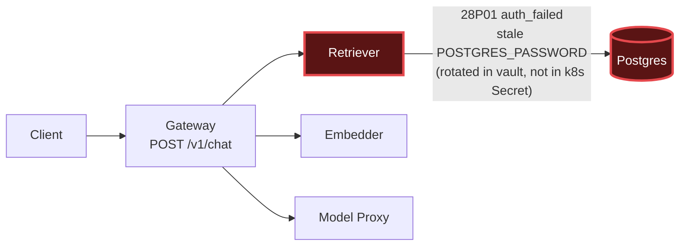

# Postmortem: gateway p95 latency above 2s

- **Status:** open
- **Severity:** sev1
- **Verified:** no
- **Opened:** 2026-08-03 01:33:41Z
- **Resolved:** (still open)

## Timeline (machine-generated)

All times UTC on 2026-08-03 unless a full date is shown.

| Time (UTC) | Source | Event |
| --- | --- | --- |
| 01:33:10Z | alert | alert firing: Gateway p95 latency > 2s |
| 01:33:39Z | log-spike | log-spike onset: {"level":"warn","service":"retriever","message":"lineage emit failed","trace_id":"b8b78324b51fd78069905b7bf4f2af9d","span_id":"9cb74a2c55cd18d1","time":"2026-08-03T01:33:39.164Z","reason":"The operation timed out.","job":"… |

## Evidence links

- [Loki — logs over the incident window](http://localhost:3001/explore?schemaVersion=1&panes=%7B%22pm%22%3A+%7B%22datasource%22%3A+%22loki%22%2C+%22queries%22%3A+%5B%7B%22refId%22%3A+%22A%22%2C+%22datasource%22%3A+%7B%22type%22%3A+%22loki%22%2C+%22uid%22%3A+%22loki%22%7D%2C+%22expr%22%3A+%22%7Bnamespace%3D%5C%22subject%5C%22%7D+%7C~+%5C%22%28%3Fi%29error%7Cfailed%5C%22%22%7D%5D%2C+%22range%22%3A+%7B%22from%22%3A+%221785720821654%22%2C+%22to%22%3A+%221785721025835%22%7D%7D%7D&orgId=1)
- [Mimir — metrics over the incident window](http://localhost:3001/explore?schemaVersion=1&panes=%7B%22pm%22%3A+%7B%22datasource%22%3A+%22mimir%22%2C+%22queries%22%3A+%5B%7B%22refId%22%3A+%22A%22%2C+%22datasource%22%3A+%7B%22type%22%3A+%22prometheus%22%2C+%22uid%22%3A+%22mimir%22%7D%2C+%22expr%22%3A+%22histogram_quantile%280.95%2C+sum%28rate%28http_server_duration_milliseconds_bucket%5B5m%5D%29%29+by+%28le%29%29%22%7D%5D%2C+%22range%22%3A+%7B%22from%22%3A+%221785720821654%22%2C+%22to%22%3A+%221785721025835%22%7D%7D%7D&orgId=1)

## Investigation context

**Runbook match:** none — no tool narrowing applied for this alert. Available runbooks: README.md, canary-abort.md, ci-pipeline-red.md, dq-freshness-stall.md, gateway-high-error-rate.md, k8s-crashloop.md, k8s-node-failure.md, snapshot-agent-audit.md, stale-secret.md

Pre-check battery (as injected at run start)

## Pre-check leads

### recent_deploys — LEAD
No deploy in the last 60m — rule out the reflex answer.
- No deploy in the last 60m — rule out the reflex answer.

### log_spike — LEAD
error/failed log rate 200/10min vs baseline 0/10min (200x baseline) — onset: {"level":"warn","service":"retriever","message":"lineage emit failed","trace_id":"b8b78324b51fd78069905b7bf4f2af9d","span_id":"9cb74a2c55cd18d1","time":"2026-08-03T01:33:39.164Z","reason":"The operation timed out.","job":"rag.retrieve","eventType":"START"} at 2026-08-03T01:33:39.165401+00:00
- error/failed log rate 200/10min vs baseline 0/10min (200x baseline) — onset: {"level":"warn","service":"retriever","message":"lineage emit failed","trace_id":"b8b78324b51fd78069905b7bf4f2… (truncated)

### kube_scan — UNAVAILABLE
error: You must be logged in to the server (Unauthorized)

### rollout_state — UNAVAILABLE
gateway: E0803 03:33:44.454786   31124 memcache.go:265] "Unhandled Error" err="couldn't get current server API group list: the server has asked for the client to provide credentials"
E0803 03:33:44.716102   31124 memcache.go:265] "Unhandled Error" err="couldn't get current server API group list: the server has asked for the client to provide credentials"
E0803 03:33:44.996119   31124 memcache.go:265] "Unhandled Error" err="couldn't get current server API group list: the server has asked for the client to; gateway analysis: E0803 03:33:44.297563   63784 memcache.go:265] "Unhandled Error" err="couldn't get current server API group list: the server has asked for the client to provide credentials"
E0803 03:33:44.603124   63784 memcache.go:265] "Unhandled Error"
… (section truncated)

### secret_age — UNAVAILABLE
error: You must be logged in to the server (Unauthorized)

## Narrative

## Summary
Gateway p95 latency exceeded the 2s SLO (sev1) because every retriever→Postgres query was failing authentication, forcing gateway's RAG path (`POST /v1/chat` → retriever) to stall on retries/timeouts before eventually failing or returning late.

## Impact
Tenant acme (and effectively all gateway traffic on the RAG path) saw chat request latency of 3s–15s instead of sub-2s — a 5-7x blowout. Tempo traces rooted at `gateway POST /v1/chat` show `errorCount=4-5` per trace and a `retriever` child span erroring on every sample pulled during the window.

## Root cause
Retriever pods are authenticating to Postgres with a stale `POSTGRES_PASSWORD` in `secret/subject-db-credentials`. The DB password was rotated in the vault, but the in-cluster Secret was never updated, so every retriever connection attempt gets rejected by Postgres with `code: "28P01"`, `routine: "auth_failed"` — visible verbatim, repeatedly, in retriever stderr logs. This is a credential-desync issue, not a network timeout, not a bad deploy, and not resource exhaustion:
- `deploy_history` shows no deploy in the 60 minutes before alert onset — the most recent gateway/platform gitops syncs and CI runs (model-proxy pre-warm revert, load-generator percentile revert) predate the incident by 1-1.5h and don't touch retriever or DB credentials — deploy is ruled out.
- `update_db_secret` (dry_run) independently confirmed a rotated credential sitting unsynced in the vault, matching the auth-failure signature.
- Gateway's own "lineage emit failed" warnings (the pre-check log-spike lead) are a downstream symptom of the same stalled/timed-out RAG path, not an independent cause.
- `pg_select` (agent's own DB credential) connects fine, confirming Postgres itself is healthy — only the retriever workload's cached credential is wrong.

## What fixed it
Root cause and remediation were confirmed: sync `secret/subject-db-credentials` from the vault (`update_db_secret`) to push the rotated password into the cluster Secret, then let retriever pick it up. The dry-run produced a verified diff (`POSTGRES_PASSWORD: **** -> ****ec9436d1`, `DATABASE_URL` rebuilt) and was approved by the operator. **However, the real (dry_run=false) call failed three consecutive times with `"You must be logged in to the server (Unauthorized)"`** — the cluster API server is rejecting write credentials for this session. This matches the pre-check leads that were already `UNAVAILABLE` before investigation started (`kube_scan`, `rollout_state`, `secret_age` all failed with the identical Unauthorized error), so this is a pre-existing cluster-auth outage in the environment, not something introduced by the remediation attempt. **The fix could not be applied. The alert is still active** — re-queried `alert_status` after each retry and it remains firing since onset. This incident is not resolved; it needs a human (or a session with working cluster-write credentials) to apply the already-approved secret sync.

## Lessons
- Add a runbook for `Gateway p95 latency > 2s` that starts at retriever/model-proxy/embedder error rates and Postgres auth error codes, not just gateway-side metrics — none matched this alert automatically.
- The `obs fail stale-secret` failure mode (vault-rotated password, unsynced k8s Secret) should trip a dedicated, faster-diagnosing check (e.g. surfacing `28P01`/`auth_failed` directly in pre-check leads) instead of requiring a full log dig.
- Cluster-write auth for the remediation identity needs its own health check/alert — right now a broken write credential silently blocks every mutating remediation tool (`update_db_secret`, `restart_workload`, `scale_deployment`, `rollout_*`, `patch_memory_limit`) with the same generic Unauthorized error, and that was true even before this incident began.

