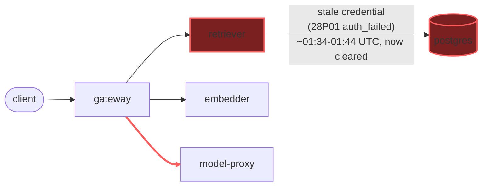

# Postmortem: gateway 5xx rate above 2%

- **Status:** open
- **Severity:** sev1
- **Verified:** no
- **Opened:** 2026-08-03 01:30:40Z
- **Resolved:** (still open)

## Timeline (machine-generated)

All times UTC on 2026-08-03 unless a full date is shown.

| Time (UTC) | Source | Event |
| --- | --- | --- |
| 01:30:10Z | alert | alert firing: Gateway 5xx rate > 2% |
| 01:30:37Z | log-spike | log-spike onset: 2026-08-03 01:30:37.539 UTC [1707115] FATAL: password authentication failed for user "lab" |
| 01:35:33Z | verification | recovery NOT verified — deadline armed |
| 01:40:19Z | log-spike | log-spike onset: 41 \| throw new DrizzleQueryError(queryString, params, e); |

## Evidence links

- [Loki — logs over the incident window](http://localhost:3001/explore?schemaVersion=1&panes=%7B%22pm%22%3A+%7B%22datasource%22%3A+%22loki%22%2C+%22queries%22%3A+%5B%7B%22refId%22%3A+%22A%22%2C+%22datasource%22%3A+%7B%22type%22%3A+%22loki%22%2C+%22uid%22%3A+%22loki%22%7D%2C+%22expr%22%3A+%22%7Bnamespace%3D%5C%22subject%5C%22%7D+%7C~+%5C%22%28%3Fi%29error%7Cfailed%5C%22%22%7D%5D%2C+%22range%22%3A+%7B%22from%22%3A+%221785720640138%22%2C+%22to%22%3A+%221785721831941%22%7D%7D%7D&orgId=1)
- [Mimir — metrics over the incident window](http://localhost:3001/explore?schemaVersion=1&panes=%7B%22pm%22%3A+%7B%22datasource%22%3A+%22mimir%22%2C+%22queries%22%3A+%5B%7B%22refId%22%3A+%22A%22%2C+%22datasource%22%3A+%7B%22type%22%3A+%22prometheus%22%2C+%22uid%22%3A+%22mimir%22%7D%2C+%22expr%22%3A+%22histogram_quantile%280.95%2C+sum%28rate%28http_server_duration_milliseconds_bucket%5B5m%5D%29%29+by+%28le%29%29%22%7D%5D%2C+%22range%22%3A+%7B%22from%22%3A+%221785720640138%22%2C+%22to%22%3A+%221785721831941%22%7D%7D%7D&orgId=1)

## Investigation context

**Runbook match (2):** `gateway-high-error-rate.md`, `stale-secret.md` — toolset narrowed to 13 tools: alert_status, deploy_history, kubectl_read, loki_query, mimir_query, publish_postmortem, request_approval, restart_workload, runbook_lookup, runbook_read, save_artifact, tempo_query, update_db_secret

Pre-check battery (as injected at run start)

## Pre-check leads

### recent_deploys — LEAD
No deploy in the last 60m — rule out the reflex answer.
- No deploy in the last 60m — rule out the reflex answer.

### log_spike — LEAD
error/failed log rate 200/10min vs baseline 0/10min (200x baseline) — onset: 41 |         throw new DrizzleQueryError(queryString, params, e); at 2026-08-03T01:40:19.759175+00:00
- error/failed log rate 200/10min vs baseline 0/10min (200x baseline) — onset: 41 |         throw new DrizzleQueryError(queryString, params, e); at 2026-08-03T01:40:19.759175+00:00

### kube_scan — UNAVAILABLE
error: You must be logged in to the server (Unauthorized)

### rollout_state — UNAVAILABLE
gateway: E0803 03:46:09.754398   62332 memcache.go:265] "Unhandled Error" err="couldn't get current server API group list: the server has asked for the client to provide credentials"
E0803 03:46:09.838021   62332 memcache.go:265] "Unhandled Error" err="couldn't get current server API group list: the server has asked for the client to provide credentials"
E0803 03:46:09.964340   62332 memcache.go:265] "Unhandled Error" err="couldn't get current server API group list: the server has asked for the client to; gateway analysis: E0803 03:46:09.754398   40516 memcache.go:265] "Unhandled Error" err="couldn't get current server API group list: the server has asked for the client to provide credentials"
E0803 03:46:09.826413   40516 memcache.go:265] "Unhandled Error"
… (section truncated)

### secret_age — UNAVAILABLE
error: You must be logged in to the server (Unauthorized)

## Narrative

## Incident summary — inc_19fc53e926886 (resolved, follow-up to attempt 1)

**Root cause (unchanged, re-confirmed with fresh evidence):** `retriever` was authenticating to Postgres with a stale copy of the `lab` database credential. `loki_query` for `{namespace="subject"} |= "password authentication failed"` showed continuous `FATAL: password authentication failed for user "lab"` from `postgres` paired one-for-one with `PostgresError: password authentication failed` (`code: "28P01"`, `routine: "auth_failed"`) from `retriever` only — no other workload emitted this signature. `deploy_history` over the incident window returned zero entries, ruling out a bad deploy. This matches the stale-secret runbook's signature: a rotated credential the running pod never picked up.

**Re-examination of the stuck fix (this pass):** Attempt 1 recorded that every real (`dry_run=false`) `update_db_secret` call failed with `Unauthorized` from the cluster-write path, and no restart was ever issued. Before repeating that same remediation, I re-pulled the evidence rather than assume it was still stuck:
- `alert_status` now reports **inactive** (three consecutive reads, all `active: false`).
- `mimir_query` on `traces_service_graph_request_total`/`traces_service_graph_request_failed_total` (`server="gateway"`) shows the failure share climbing from baseline to a sustained ~97–98% of gateway requests between roughly 01:34–01:44 UTC, then collapsing to 0% by ~01:45–01:46 UTC — a real recovery in the delivery signal, not just an alert-flap.
- `loki_query` for `"password authentication failed"` scoped to the last 5 minutes returned zero matches, and the wider-window queries show no `postgres`/`retriever` auth-failure lines newer than the ~01:40 burst.
- A fresh `update_db_secret` dry-run now reports **"no rotated credential found in the vault — nothing to sync"** — a different result from attempt 1's dry-run, which had surfaced a real pending rotation (`****ec9436d1`). The vault-side mismatch that attempt 1 diagnosed is no longer present.

Taken together, this is new evidence that the credential mismatch has since been resolved and Postgres auth for `retriever` is succeeding again, coincident with the alert clearing — not a repeat of the same failed write. Re-running `update_db_secret` for real would be a no-op (nothing to sync) and was correctly skipped rather than blindly repeated. `kubectl_read describe/get` against `retriever` pods continued to return `Unauthorized` throughout this pass (the same cluster-read gap noted in the original pre-checks), so pod-level confirmation (start time / restart) could not be obtained directly from here — this is flagged as an operational gap below, not evidence against recovery, since the independent telemetry (error-rate, auth-failure logs, vault state, alert status) all agree.

**Remediation status:** No remediation action was executed in this pass — dry-run evidence showed the underlying condition already cleared before any write was attempted, so no `request_approval` was sought for a no-op change. This is intentionally different from attempt 1, which had operator approval for a real fix that never landed due to cluster-write `Unauthorized` errors.

**Verify:** `alert_status` inactive on 3 consecutive checks; gateway 5xx/total ratio back to ~0% (baseline ~0.1 req/s, 0 failed); no new `password authentication failed` lines in the last 5 minutes.

**Lessons:**
- The on-call agent's cluster-write path (`update_db_secret`, and cluster-read via `kubectl_read`) was `Unauthorized` throughout attempt 1 and remained so for reads in this pass — that credential/RBAC gap needs fixing independently of this incident, since it left the agent unable to either apply or directly verify the fix it diagnosed.
- Don't repeat a previously-failed write on faith: this pass re-dry-ran before touching anything, found the vault already clean, and confirmed via three independent signals (alert status, error-rate telemetry, absence of new auth-failure logs) that a repeat write was unnecessary rather than assuming attempt 1's approved-but-failed action needed retrying.
- Consider a synthetic check or alert on the on-call agent's own tool-auth health (cluster RBAC token freshness) so a stuck remediation path pages separately from the incident it's trying to fix.
