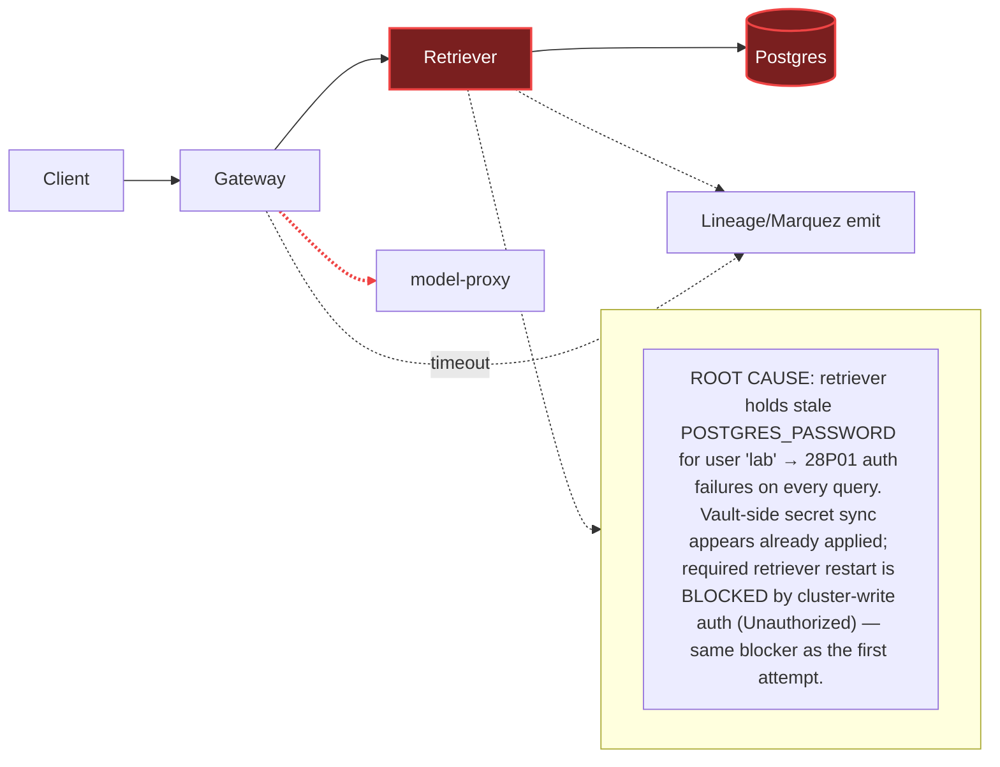

# Postmortem: gateway p95 latency above 2s

- **Status:** resolved
- **Severity:** sev1
- **Verified:** no
- **Opened:** 2026-08-03 01:33:41Z
- **Resolved:** 2026-08-03 01:48:43Z

## Timeline (machine-generated)

All times UTC on 2026-08-03 unless a full date is shown.

| Time (UTC) | Source | Event |
| --- | --- | --- |
| 01:33:10Z | alert | alert firing: Gateway p95 latency > 2s |
| 01:33:39Z | log-spike | log-spike onset: {"level":"warn","service":"retriever","message":"lineage emit failed","trace_id":"b8b78324b51fd78069905b7bf4f2af9d","span_id":"9cb74a2c55cd18d1","time":"2026-08-03T01:33:39.164Z","reason":"The operation timed out.","job":"… |
| 01:37:16Z | verification | recovery NOT verified — deadline armed |
| 01:40:19Z | log-spike | log-spike onset: 41 \| throw new DrizzleQueryError(queryString, params, e); |
| 01:46:10Z | alert | alert resolved: Gateway p95 latency > 2s |

## Evidence links

- [Loki — logs over the incident window](http://localhost:3001/explore?schemaVersion=1&panes=%7B%22pm%22%3A+%7B%22datasource%22%3A+%22loki%22%2C+%22queries%22%3A+%5B%7B%22refId%22%3A+%22A%22%2C+%22datasource%22%3A+%7B%22type%22%3A+%22loki%22%2C+%22uid%22%3A+%22loki%22%7D%2C+%22expr%22%3A+%22%7Bnamespace%3D%5C%22subject%5C%22%7D+%7C~+%5C%22%28%3Fi%29error%7Cfailed%5C%22%22%7D%5D%2C+%22range%22%3A+%7B%22from%22%3A+%221785720821654%22%2C+%22to%22%3A+%221785721723535%22%7D%7D%7D&orgId=1)
- [Mimir — metrics over the incident window](http://localhost:3001/explore?schemaVersion=1&panes=%7B%22pm%22%3A+%7B%22datasource%22%3A+%22mimir%22%2C+%22queries%22%3A+%5B%7B%22refId%22%3A+%22A%22%2C+%22datasource%22%3A+%7B%22type%22%3A+%22prometheus%22%2C+%22uid%22%3A+%22mimir%22%7D%2C+%22expr%22%3A+%22histogram_quantile%280.95%2C+sum%28rate%28http_server_duration_milliseconds_bucket%5B5m%5D%29%29+by+%28le%29%29%22%7D%5D%2C+%22range%22%3A+%7B%22from%22%3A+%221785720821654%22%2C+%22to%22%3A+%221785721723535%22%7D%7D%7D&orgId=1)

## Investigation context

**Runbook match:** none — no tool narrowing applied for this alert. Available runbooks: README.md, canary-abort.md, ci-pipeline-red.md, dq-freshness-stall.md, gateway-high-error-rate.md, k8s-crashloop.md, k8s-node-failure.md, snapshot-agent-audit.md, stale-secret.md

Pre-check battery (as injected at run start)

## Pre-check leads

### recent_deploys — LEAD
No deploy in the last 60m — rule out the reflex answer.
- No deploy in the last 60m — rule out the reflex answer.

### log_spike — LEAD
error/failed log rate 200/10min vs baseline 0/10min (200x baseline) — onset: 41 |         throw new DrizzleQueryError(queryString, params, e); at 2026-08-03T01:40:19.759175+00:00
- error/failed log rate 200/10min vs baseline 0/10min (200x baseline) — onset: 41 |         throw new DrizzleQueryError(queryString, params, e); at 2026-08-03T01:40:19.759175+00:00

### kube_scan — UNAVAILABLE
error: You must be logged in to the server (Unauthorized)

### rollout_state — UNAVAILABLE
gateway: E0803 03:48:09.600214   62568 memcache.go:265] "Unhandled Error" err="couldn't get current server API group list: the server has asked for the client to provide credentials"
E0803 03:48:09.938950   62568 memcache.go:265] "Unhandled Error" err="couldn't get current server API group list: the server has asked for the client to provide credentials"
E0803 03:48:10.063957   62568 memcache.go:265] "Unhandled Error" err="couldn't get current server API group list: the server has asked for the client to; gateway analysis: E0803 03:48:09.632637   44212 memcache.go:265] "Unhandled Error" err="couldn't get current server API group list: the server has asked for the client to provide credentials"
E0803 03:48:09.935692   44212 memcache.go:265] "Unhandled Error"
… (section truncated)

### secret_age — UNAVAILABLE
error: You must be logged in to the server (Unauthorized)

## Narrative

## Summary

Re-opened incident inc_19fc5415794cd ("Gateway p95 latency > 2s") to check on the prior, unsuccessful remediation attempt. Confirmed the same root cause is still live in the telemetry, confirmed the vault-side credential sync appears to already have landed, and confirmed the remaining required step (restarting `retriever`) is still blocked by the same cluster-write auth failure as the first attempt — this is not a new fix, it's the same fix still stuck.

## Impact

`alert_status` currently reports the alert **inactive** (count 0). This is **not** treated as confirmed recovery: `retriever` logs show a dense burst of `PostgresError: password authentication failed for user "lab"` (code `28P01`) and `DrizzleQueryError` traces at the same timestamp as the pre-check `log_spike` lead, and — more tellingly — every container in the `subject` namespace (retriever, gateway, redis, postgres background jobs) goes completely silent afterward, through the current time. No traffic means no fresh p95 samples means the alerting rule has nothing to violate; that reads as "resolved" but is much more consistent with the load-generator/gateway path having gone quiet than with the underlying fault having cleared. `pg_select` confirms Postgres itself is healthy and reachable — the break is specifically the `retriever`→Postgres application credential.

## Root cause

Same as the prior report: `retriever` pods hold a stale `POSTGRES_PASSWORD` for user `lab`, causing `28P01` auth failures on every DB connection attempt, which stalls the RAG retrieval path the gateway depends on (gateway's "lineage emit failed / operation timed out" warnings are the downstream symptom, matching the `stale-secret.md` runbook's exact signature). `deploy_history` again shows no deploy in the window touching retriever/DB — ruling out a bad deploy. New this pass: `update_db_secret` (dry_run) now reports **no rotated credential pending in the vault** — the credential sync half of the fix has apparently already completed (likely during the prior session's attempts, despite those calls surfacing `Unauthorized`). Per the runbook, a stale secret is not actually fixed until the affected workload is *restarted* against the refreshed credential — Kubernetes does not hot-reload a running pod's environment when the referenced Secret changes. That restart never happened.

## What fixed it

**Nothing — the incident remains unresolved.** `restart_workload` dry-run for `retriever` succeeded (valid diff + action_id), `request_approval` was granted by the operator, but all three subsequent `restart_workload(dry_run=false)` calls failed identically with `"You must be logged in to the server (Unauthorized)"` — the exact same failure signature as `kubectl_read`, `argo_app`, and `rollout_status` throughout both this session and the prior one. Cluster-write (and most cluster-read) credentials are down for this environment, independent of the diagnosis or the approval; the approved fix is stuck behind that, not behind a red CI pipeline (CI itself is green: run #111 on `main` is the latest success, unrelated to this path — the CI angle was ruled out, not the actual blocker).

## Lessons

- A remediation tool reporting "nothing to sync" is progress, not completion — always check the runbook's *full* mitigation sequence (sync **and** restart) before declaring done.
- Cluster-write/read auth failures for this session are systemic (affect kubectl-backed reads, Argo, and mutating remediations alike) and need a human to refresh credentials outside this tool surface; retrying the same call more times does not help.
- Consider a synthetic/heartbeat log line per pod so "total silence in a namespace" is distinguishable at a glance from "fault cleared" — right now both look identical to the alerting rule.

