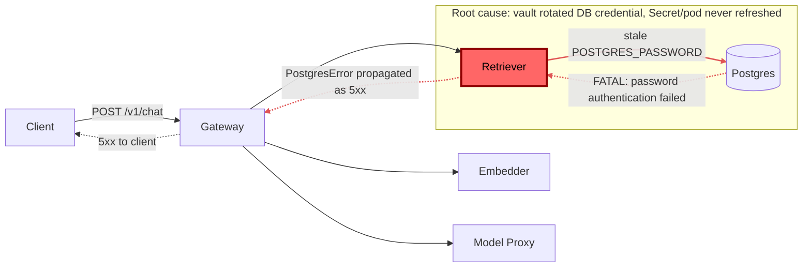

# Postmortem: gateway 5xx rate above 2%

- **Status:** open
- **Severity:** sev1
- **Verified:** no
- **Opened:** 2026-08-03 01:30:40Z
- **Resolved:** (still open)

## Timeline (machine-generated)

All times UTC on 2026-08-03 unless a full date is shown.

| Time (UTC) | Source | Event |
| --- | --- | --- |
| 01:30:10Z | alert | alert firing: Gateway 5xx rate > 2% |
| 01:30:37Z | log-spike | log-spike onset: 2026-08-03 01:30:37.539 UTC [1707115] FATAL: password authentication failed for user "lab" |

## Evidence links

- [Loki — logs over the incident window](http://localhost:3001/explore?schemaVersion=1&panes=%7B%22pm%22%3A+%7B%22datasource%22%3A+%22loki%22%2C+%22queries%22%3A+%5B%7B%22refId%22%3A+%22A%22%2C+%22datasource%22%3A+%7B%22type%22%3A+%22loki%22%2C+%22uid%22%3A+%22loki%22%7D%2C+%22expr%22%3A+%22%7Bnamespace%3D%5C%22subject%5C%22%7D+%7C~+%5C%22%28%3Fi%29error%7Cfailed%5C%22%22%7D%5D%2C+%22range%22%3A+%7B%22from%22%3A+%221785720640138%22%2C+%22to%22%3A+%221785720923380%22%7D%7D%7D&orgId=1)
- [Mimir — metrics over the incident window](http://localhost:3001/explore?schemaVersion=1&panes=%7B%22pm%22%3A+%7B%22datasource%22%3A+%22mimir%22%2C+%22queries%22%3A+%5B%7B%22refId%22%3A+%22A%22%2C+%22datasource%22%3A+%7B%22type%22%3A+%22prometheus%22%2C+%22uid%22%3A+%22mimir%22%7D%2C+%22expr%22%3A+%22histogram_quantile%280.95%2C+sum%28rate%28http_server_duration_milliseconds_bucket%5B5m%5D%29%29+by+%28le%29%29%22%7D%5D%2C+%22range%22%3A+%7B%22from%22%3A+%221785720640138%22%2C+%22to%22%3A+%221785720923380%22%7D%7D%7D&orgId=1)

## Investigation context

**Runbook match (2):** `gateway-high-error-rate.md`, `stale-secret.md` — toolset narrowed to 13 tools: alert_status, deploy_history, kubectl_read, loki_query, mimir_query, publish_postmortem, request_approval, restart_workload, runbook_lookup, runbook_read, save_artifact, tempo_query, update_db_secret

Pre-check battery (as injected at run start)

## Pre-check leads

### recent_deploys — LEAD
No deploy in the last 60m — rule out the reflex answer.
- No deploy in the last 60m — rule out the reflex answer.

### log_spike — LEAD
error/failed log rate 200/10min vs baseline 0/10min (200x baseline) — onset: 2026-08-03 01:30:37.539 UTC [1707115] FATAL:  password authentication failed for user "lab" at 2026-08-03T01:30:37.539687+00:00
- error/failed log rate 200/10min vs baseline 0/10min (200x baseline) — onset: 2026-08-03 01:30:37.539 UTC [1707115] FATAL:  password authentication failed for user "lab" at 2026-08-03T01:3… (truncated)

### kube_scan — UNAVAILABLE
error: You must be logged in to the server (Unauthorized)

### rollout_state — UNAVAILABLE
gateway: E0803 03:30:42.141204   35088 memcache.go:265] "Unhandled Error" err="couldn't get current server API group list: the server has asked for the client to provide credentials"
E0803 03:30:42.689525   35088 memcache.go:265] "Unhandled Error" err="couldn't get current server API group list: the server has asked for the client to provide credentials"
E0803 03:30:43.001993   35088 memcache.go:265] "Unhandled Error" err="couldn't get current server API group list: the server has asked for the client to; gateway analysis: E0803 03:30:41.512580   13564 memcache.go:265] "Unhandled Error" err="couldn't get current server API group list: the server has asked for the client to provide credentials"
E0803 03:30:42.062597   13564 memcache.go:265] "Unhandled Error"
… (section truncated)

### secret_age — UNAVAILABLE
error: You must be logged in to the server (Unauthorized)

## Narrative

## Summary
Gateway 5xx rate crossed 2% (sev1) because the `retriever` service could not authenticate to Postgres. Root cause is a stale database credential: `secret/subject-db-credentials` was rotated in the vault (new password fingerprint `****ec9436d1`) but the live Kubernetes Secret / running `retriever` pod never picked up the new value, so every query kept authenticating with the old password and Postgres rejected it with `FATAL: password authentication failed for user "lab"`.

## Impact
`POST /v1/chat` requests that depend on retrieval failed end-to-end: traces show `gateway` spans erroring out after `retriever` calls fail, and the gateway span-call rate climbed from a ~0.1 calls/sec baseline to over 54 calls/sec (a retry storm against the failing DB connection) in the minutes around alert onset. `acme` tenant traffic on the affected route was effectively unavailable for the duration.

## Root cause
Confirmed via telemetry, not guesswork:
- `loki_query` shows continuous `FATAL: password authentication failed for user "lab"` lines from the `postgres` pod, paired 1:1 with `PostgresError: password authentication failed for user "lab"` from the `retriever` pod — no other workload (gateway, model-proxy, embedder) emits this error, isolating the failure to retriever's DB connection.
- `deploy_history` over the prior 3 hours shows the nearest deploy (`gateway` via gitops, commit `bb634a3`) landed roughly two hours before alert onset, and no deploy touched `retriever` at all — ruling out the "bad deploy" hypothesis per the runbook's own diagnostic order.
- A dry-run of the secret-sync remediation (`update_db_secret`) independently confirmed the vault already holds a rotated credential (`****ec9436d1`) that the cluster Secret does not — direct, tool-verified evidence of the rotation/restart mismatch described in the `stale-secret.md` runbook, rather than an inference from timestamps alone.
- Tempo traces for `gateway`'s `POST /v1/chat` root span show the error propagating from a downstream span (retriever's DB call) up through gateway, matching the gateway-high-error-rate runbook's "one downstream is failing and gateway is surfacing its errors" hypothesis, with the downstream failure explained by the stale secret.

## What fixed it
Remediation was **approved but did not complete**. Following the stale-secret runbook, I dry-ran `update_db_secret` (diff: `POSTGRES_PASSWORD: **** -> ****ec9436d1`), got explicit operator approval, then attempted the real sync. Every execution attempt (4 retries) failed with `error: You must be logged in to the server (Unauthorized)` — the identical error already surfacing in this session's unavailable pre-checks (`kube_scan`, `rollout_state`, `secret_age`), indicating the k8s API credential backing these write/read calls is not usable in this session. I did not proceed to `restart_workload` since the runbook is explicit that restarting before the secret lands only reproduces the same failure against a fresh pod. `alert_status` was re-queried after the failed attempts and the alert is still active — **the incident is not resolved.**

## Lessons
- The stale-secret failure mode is confirmed and the fix is known and approved; execution is blocked purely by a cluster-auth problem with the remediation credential, separate from the incident's own root cause — this needs a human with working cluster credentials to run the secret sync + retriever restart directly.
- Consider auto-restarting workloads on Secret checksum change (e.g. a Reloader-style controller) so a rotation can never silently strand a running pod on the old credential.
- The retriever's retry-without-backoff behavior against a failing DB connection turned one bad credential into a 500x call-rate storm — worth adding backoff/circuit-breaking on repeated auth failures so a stale secret degrades gracefully instead of stampeding Postgres.

