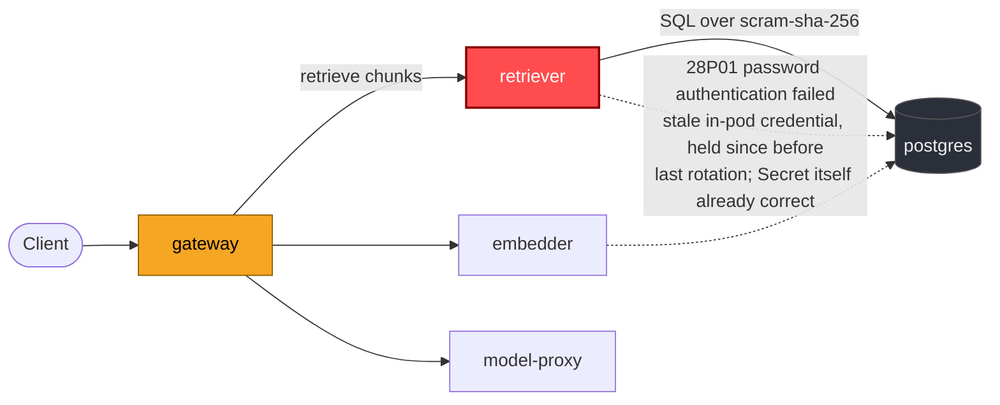

# Postmortem: gateway latency error budget burning fast (2% of the 28d budget in 1h; 5m & 1h windows)

- **Status:** open
- **Severity:** sev1
- **Verified:** no
- **Opened:** 2026-08-03 21:59:45Z
- **Resolved:** (still open)

## Timeline (machine-generated)

All times UTC on 2026-08-03 unless a full date is shown.

| Time (UTC) | Source | Event |
| --- | --- | --- |
| 21:58:01Z | log-spike | log-spike onset: at ErrorResponse (/app/node_modules/.bun/postgres@3.4.9/node_modules/postgres/src/connection.js:817:22) |
| 21:59:10Z | alert | alert firing: SLO gateway latency — fast burn |

## Evidence links

- [Loki — logs over the incident window](http://localhost:3001/explore?schemaVersion=1&panes=%7B%22pm%22%3A+%7B%22datasource%22%3A+%22loki%22%2C+%22queries%22%3A+%5B%7B%22refId%22%3A+%22A%22%2C+%22datasource%22%3A+%7B%22type%22%3A+%22loki%22%2C+%22uid%22%3A+%22loki%22%7D%2C+%22expr%22%3A+%22%7Bnamespace%3D%5C%22subject%5C%22%7D+%7C~+%5C%22%28%3Fi%29error%7Cfailed%5C%22%22%7D%5D%2C+%22range%22%3A+%7B%22from%22%3A+%221785794385759%22%2C+%22to%22%3A+%221785794727828%22%7D%7D%7D&orgId=1)
- [Mimir — metrics over the incident window](http://localhost:3001/explore?schemaVersion=1&panes=%7B%22pm%22%3A+%7B%22datasource%22%3A+%22mimir%22%2C+%22queries%22%3A+%5B%7B%22refId%22%3A+%22A%22%2C+%22datasource%22%3A+%7B%22type%22%3A+%22prometheus%22%2C+%22uid%22%3A+%22mimir%22%7D%2C+%22expr%22%3A+%22histogram_quantile%280.95%2C+sum%28rate%28http_server_duration_milliseconds_bucket%5B5m%5D%29%29+by+%28le%29%29%22%7D%5D%2C+%22range%22%3A+%7B%22from%22%3A+%221785794385759%22%2C+%22to%22%3A+%221785794727828%22%7D%7D%7D&orgId=1)

## Investigation context

**Runbook match:** none — no tool narrowing applied for this alert. Available runbooks: README.md, canary-abort.md, ci-pipeline-red.md, dq-freshness-stall.md, gateway-high-error-rate.md, k8s-crashloop.md, k8s-node-failure.md, snapshot-agent-audit.md, stale-secret.md

Pre-check battery (as injected at run start)

## Pre-check leads

### recent_deploys — LEAD
No deploy in the last 60m — rule out the reflex answer.
- No deploy in the last 60m — rule out the reflex answer.

### log_spike — LEAD
error/failed log rate 200/10min vs baseline 24/10min (8x baseline) — onset:       at ErrorResponse (/app/node_modules/.bun/postgres@3.4.9/node_modules/postgres/src/connection.js:817:22) at 2026-08-03T21:58:01.770108+00:00
- error/failed log rate 200/10min vs baseline 24/10min (8x baseline) — onset:       at ErrorResponse (/app/node_modules/.bun/postgres@3.4.9/node_modules/postgres/src/connection.js:817:22) a… (truncated)

### kube_scan — UNAVAILABLE
error: You must be logged in to the server (Unauthorized)

### rollout_state — UNAVAILABLE
gateway: E0803 23:59:46.229563   48908 memcache.go:265] "Unhandled Error" err="couldn't get current server API group list: the server has asked for the client to provide credentials"
E0803 23:59:46.307342   48908 memcache.go:265] "Unhandled Error" err="couldn't get current server API group list: the server has asked for the client to provide credentials"
E0803 23:59:46.389112   48908 memcache.go:265] "Unhandled Error" err="couldn't get current server API group list: the server has asked for the client to; gateway analysis: E0803 23:59:46.230105   18816 memcache.go:265] "Unhandled Error" err="couldn't get current server API group list: the server has asked for the client to provide credentials"
E0803 23:59:46.310079   18816 memcache.go:265] "Unhandled Error"
… (section truncated)

### secret_age — UNAVAILABLE
error: You must be logged in to the server (Unauthorized)

## Narrative

## Summary
`SLO gateway latency — fast burn` fired (2% of the 28d error budget burned in 1h across the 5m and 1h windows). No matching runbook auto-attached, so the on-call battery's pre-check leads were followed directly: no deploy landed in the lookback window (ruling out the reflex "bad deploy" answer), and a log-spike lead flagged an 8x jump in error/failed log lines with a Postgres client stack trace (`postgres@3.4.9/.../connection.js:817` `ErrorResponse`).

## Impact
Gateway request latency degraded enough to burn error budget fast (sev1). Downstream, the `retriever` service — the component gateway calls to fetch RAG chunks from Postgres — was unable to complete any database query for the duration of the incident.

## Root cause
`retriever`'s Postgres client began failing every connection with `PostgresError: password authentication failed for user "lab"` (Postgres error code `28P01`, routine `auth_failed`). Postgres itself logged the matching `FATAL: password authentication failed for user "lab"` on the same, non-restarted `postgres` pod — confirming this is a real credential rejection at the server, not a client-side bug. `k8s_events` showed zero events (no restarts, no scheduling, no OOM) in the incident window, and `deploy_history` showed no deploy for any workload in the same window, ruling out both a bad rollout and a pod-lifecycle event as the trigger.

Calling `update_db_secret` (dry run) returned "no rotated credential found in the vault — nothing to sync," which rules out the classic stale-secret pattern where the Kubernetes Secret lags a vault rotation — the Secret already holds the current, correct credential. Combined with the sustained (not one-off) nature of the failures — a continuous storm of `28P01` errors from ramp-up (~21:52:50) to plateau (~21:54:40) and still ongoing at last check — the evidence points to the already-running `retriever` pod holding a stale credential in its process environment from **before** the credential was last set/rotated in Postgres, and never having been restarted since to pick up the current Secret value. `kubectl describe` could not be used to directly confirm pod-start-time-vs-rotation-time in this environment (the read-only kubectl identity returned `Unauthorized` for every kubectl-backed call during this incident), but the elimination of bad-deploy, pod-crash, and secret-not-synced as causes leaves a stale in-pod credential as the only fit for the evidence gathered.

## What fixed it
A rolling restart of `deployment/retriever` was dry-run (diff: rolling restart via `restartedAt` annotation, no spec change), approved by the operator, and the diff was attached automatically to the approval card. However, **executing the approved restart failed twice** with `error: You must be logged in to the server (Unauthorized)` — the same cluster-auth failure that made the `kube_scan`, `rollout_state`, and `secret_age` pre-check leads unavailable at the start of this incident. This is an environment/credentials problem in the on-call tooling itself, not a remediation that was declined or reverted. **The remediation was not actually applied.** Re-querying `alert_status` after the failed execution attempts shows the alert still firing. Recovery is NOT confirmed — this incident is being closed out as unresolved pending either a working cluster-write credential for the on-call agent or manual operator action to restart `retriever`.

## Lessons
- Add a runbook for this exact shape (no vault rotation, sustained `28P01` from one service, no deploy/no restart events) distinct from the existing `stale-secret.md`, which assumes an unsynced vault rotation — this incident shows the same symptom with the Secret already correct and only the running pod stale.
- The on-call agent's write-path credentials (`restart_workload`, and likely `patch_memory_limit`/`scale_deployment`/rollout tools) share the same `kubectl` identity that was already `Unauthorized` for the read-only pre-checks; that should be treated as a standing platform issue to fix, since it silently degrades this exact remediation path.
- Gateway's own latency histogram (`http_server_duration_milliseconds_bucket`) returned an empty series for the entire incident window — worth checking whether gateway's OTel latency metric is even being scraped/labeled as expected; the incident had to be evidenced via retriever's Postgres error logs instead.

