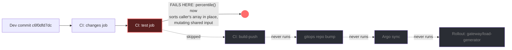

# Postmortem: a pipeline run on main failed in the last 15m - main is not shippable (test, build, or deploy job red)

- **Status:** open
- **Severity:** sev1
- **Verified:** no
- **Opened:** 2026-08-04 19:43:30Z
- **Resolved:** (still open)

## Timeline (machine-generated)

All times UTC on 2026-08-04 unless a full date is shown.

| Time (UTC) | Source | Event |
| --- | --- | --- |
| 18:56:49Z | k8s | Rollout/gateway: RolloutUpdated |
| 18:56:49Z | k8s | Rollout/gateway: RolloutNotCompleted |
| 18:56:49Z | k8s | Rollout/gateway: NewReplicaSetCreated |
| 18:56:50Z | deploy:argo | gateway synced to edb33a6699c9 |
| 18:56:50Z | k8s | Pod/gateway-dd85945b4-mm7jm: Killing |
| 18:56:50Z | k8s | ReplicaSet/gateway-dd85945b4: SuccessfulDelete |
| 18:56:50Z | k8s | Rollout/gateway: ScalingReplicaSet |
| 18:56:51Z | k8s | ReplicaSet/gateway-8444846b5f: SuccessfulCreate |
| 18:56:51Z | k8s | Rollout/gateway: ScalingReplicaSet |
| 18:56:51Z | k8s | Pod/gateway-8444846b5f-bqkg8: Scheduled |
| 18:56:52Z | k8s | Pod/gateway-8444846b5f-bqkg8: Pulled |
| 18:56:52Z | k8s | Pod/gateway-8444846b5f-bqkg8: Created |
| 18:56:53Z | k8s | Pod/gateway-8444846b5f-bqkg8: Started |
| 18:57:01Z | k8s | Rollout/gateway: RolloutStepCompleted |
| 18:57:03Z | k8s | Rollout/gateway: AnalysisRunRunning |
| 18:58:02Z | k8s | AnalysisRun/gateway-8444846b5f-21-1: MetricFailed |
| 18:58:02Z | k8s | AnalysisRun/gateway-8444846b5f-21-1: AnalysisRunFailed |
| 18:58:03Z | k8s | Rollout/gateway: RolloutAborted |
| 18:58:03Z | k8s | Rollout/gateway: AnalysisRunFailed |
| 18:58:04Z | k8s | Pod/gateway-8444846b5f-bqkg8: Killing |
| 18:58:04Z | k8s | ReplicaSet/gateway-8444846b5f: SuccessfulDelete |
| 18:58:04Z | k8s | Rollout/gateway: ScalingReplicaSet |
| 18:58:05Z | k8s | ReplicaSet/gateway-dd85945b4: SuccessfulCreate |
| 18:58:05Z | k8s | Rollout/gateway: ScalingReplicaSet |
| 18:58:05Z | k8s | Pod/gateway-dd85945b4-hw5fg: Scheduled |
| 18:58:06Z | k8s | Pod/gateway-dd85945b4-hw5fg: Started |
| 18:58:06Z | k8s | Pod/gateway-dd85945b4-hw5fg: Pulled |
| 18:58:06Z | k8s | Pod/gateway-dd85945b4-hw5fg: Created |
| 19:01:45Z | deploy:annotation | deploy gateway via gitops c025382 (argo sync) |
| 19:01:47Z | deploy:argo | gateway synced to c025382ba170 |
| 19:01:47Z | k8s | Rollout/gateway: SkipSteps |
| 19:01:47Z | k8s | Rollout/gateway: RolloutUpdated |
| 19:40:46Z | deploy:ci | CI run #114 failure on main: obs: load-generator: drop the defensive copy in percentile() |
| 19:43:00Z | alert | alert firing: CI pipeline red on main |

## Evidence links

- [Loki — logs over the incident window](http://localhost:3001/explore?schemaVersion=1&panes=%7B%22pm%22%3A+%7B%22datasource%22%3A+%22loki%22%2C+%22queries%22%3A+%5B%7B%22refId%22%3A+%22A%22%2C+%22datasource%22%3A+%7B%22type%22%3A+%22loki%22%2C+%22uid%22%3A+%22loki%22%7D%2C+%22expr%22%3A+%22%7Bnamespace%3D%5C%22subject%5C%22%7D+%7C~+%5C%22%28%3Fi%29error%7Cfailed%5C%22%22%7D%5D%2C+%22range%22%3A+%7B%22from%22%3A+%221785872610506%22%2C+%22to%22%3A+%221785872874241%22%7D%7D%7D&orgId=1)
- [Mimir — metrics over the incident window](http://localhost:3001/explore?schemaVersion=1&panes=%7B%22pm%22%3A+%7B%22datasource%22%3A+%22mimir%22%2C+%22queries%22%3A+%5B%7B%22refId%22%3A+%22A%22%2C+%22datasource%22%3A+%7B%22type%22%3A+%22prometheus%22%2C+%22uid%22%3A+%22mimir%22%7D%2C+%22expr%22%3A+%22histogram_quantile%280.95%2C+sum%28rate%28http_server_duration_milliseconds_bucket%5B5m%5D%29%29+by+%28le%29%29%22%7D%5D%2C+%22range%22%3A+%7B%22from%22%3A+%221785872610506%22%2C+%22to%22%3A+%221785872874241%22%7D%7D%7D&orgId=1)

## Investigation context

**Runbook match (1):** `ci-pipeline-red.md` — toolset narrowed to 9 tools: alert_status, deploy_history, gitea_ci_runs, gitea_compare, publish_postmortem, request_approval, runbook_lookup, runbook_read, save_artifact

<details>
<summary>Pre-check battery (as injected at run start)</summary>

## Pre-check leads

### recent_deploys — LEAD
1 deploy-window lead
- deploy annotation at 2026-08-04T19:01:45.359000+00:00: deploy gateway via gitops c025382 (argo sync)

### kube_scan — LEAD
5 kube-scan leads
- event AnalysisRun/gateway-8444846b5f-21-1: MetricFailed — Metric 'canary-error-rate' Completed. Result: Failed (at 20:58:02)
- event AnalysisRun/gateway-8444846b5f-21-1: MetricFailed — Metric 'canary-p95' Completed. Result: Failed (at 20:58:02)
- event AnalysisRun/gateway-8444846b5f-21-1: AnalysisRunFailed — Analysis Completed. Result: Failed (at 20:58:02)
- event Rollout/gateway: RolloutAborted — Rollout aborted update to revision 21: Step-based analysis phase error/failed: Metric \"canary-error-rate\" assessed Failed due to failed (2) > fai… (truncated)
- event Rollout/gateway: AnalysisRunFailed — Step Analysis Run 'gateway-8444846b5f-21-1' Status New: 'Failed' Previous: 'Running' (at 20:58:03)

### rollout_state — LEAD
1 rollout-state lead
- analysisrun for gateway (gateway-8444846b5f-21-1): Failed — Metric "canary-error-rate" assessed Failed due to failed (2) > failureLimit (1)

### log_spike — OK
error/failed log rate normal: 200/10min vs baseline 487/10min

### secret_age — OK
Secret subject-db-credentials last modified 10d 20h ago (created 10d 20h ago).

</details>

## Narrative

## Summary

`CI pipeline red on main` fired because run #114 on `obs/obs-lab` main failed its `test` job. The failing commit, `c6f0dfd7dc` ("load-generator: drop the defensive copy in percentile()"), is the **third** attempt to land this exact change — it has now failed CI three separate times (runs #110, #112, #114) and only gone green each time it was reverted (runs #111, #113).

## Impact

`main` is unshippable: the `build-push` job never ran (skipped after `test` failed), so no image was built and nothing reached gitops/Argo for this commit. No production workload was touched by this incident — the gateway/model-proxy rollouts and Argo syncs visible in `deploy_history` around the same window (e.g. gitops `c025382` synced to gateway) are unrelated deploys on a different service and are not implicated by this failure.

## Root cause

**Component:** CI `test` job on `obs/obs-lab` main, triggered by commit `c6f0dfd7dc` in `apps/load-generator/src/stats.ts`.

**Category:** genuine code regression (not flaky infra, not a dependency outage).

**Evidence:**
- `gitea_ci_runs(branch=main, limit=5)` shows an alternating fail/revert/fail/revert/fail pattern on the exact same change:
  - #110 `28686bc2ba` — fail (test)
  - #111 `d62500f603` — pass (revert of #110's commit)
  - #112 `37227bca2e` — fail (test) — same change re-landed
  - #113 `e7b48b92ce` — pass (revert of #112's commit)
  - #114 `c6f0dfd7dc` — fail (test) — same change re-landed a third time
- `gitea_compare(1393e68743, c6f0dfd7dc, include_diff=true)` shows the actual diff — one commit, `apps/load-generator/src/stats.ts`, +3/-1:
  ```diff
  -  const sorted = [...values].sort((a, b) => a - b);
  +  // Sort in place: percentile() runs three times per summary and the defensive
  +  // copy showed up in the run loop's profile.
  +  const sorted = (values as number[]).sort((a, b) => a - b);
  ```
  The change removes the defensive array copy in `percentile()` and sorts the caller's `values` array in place as a micro-optimization. Per the author's own comment, `percentile()` is called three times per summary on shared inputs — sorting in place mutates that shared array as a side effect of the first call, which is exactly the kind of behavior a test suite would (correctly) catch and fail on.
- Deterministic 3-for-3 failure on this content, 2-for-2 pass on revert — rules out a flaky-job explanation.
- `deploy_history` confirms `build-push` was `skipped` on all three failing runs, so this never reached deploy; the `AnalysisRun`/rollout-abort leads for `gateway` in this window belong to a separate, unrelated gitops sync (`c025382`) and were checked and ruled out as a cause of this alert.

## What fixed it

No autonomous remediation was executed. The matched runbook (`ci-pipeline-red.md`) is diagnosis-and-escalation only for this class of alert — fixing a red pipeline means editing source (reverting the regression), which is outside the on-call agent's fixed remediation toolset (no git-write/PR tool was available in this incident's narrowed toolset). `alert_status` was re-queried after diagnosis and `CI pipeline red on main` is still **active** — recovery requires a human or the auto-fixer flow to revert `c6f0dfd7dc` (the same fix pattern already proven twice, at `d62500f603` and `e7b48b92ce`), or otherwise fix the mutation-in-place bug in `percentile()` so it no longer mutates a shared input array.

**Recommended action:** revert commit `c6f0dfd7dc` on `main` (fastest safe path, already validated twice as the fix for the identical prior regressions).

## Lessons

- This is a repeat offender: the same optimization has now been proposed and reverted twice before landing red a third time. The commit should not be re-attempted without either (a) copying only when a call actually needs pristine input, or (b) fixing/updating the call sites and tests to tolerate in-place sorting, with a regression test added specifically for the shared-array-mutation case so it fails fast in review rather than in CI on main.
- CI leads and rollout/AnalysisRun leads for unrelated services can show up in the same time window — worth explicitly ruling out cross-workload conflation before naming a root cause, which is what the gateway AnalysisRun/canary leads required here.


