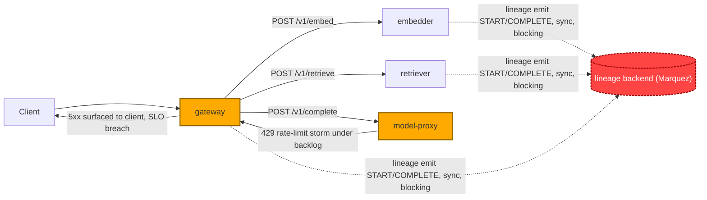

# Postmortem: gateway 5xx rate above 2%

- **Status:** open
- **Severity:** sev1
- **Verified:** no
- **Opened:** 2026-08-04 12:29:40Z
- **Resolved:** (still open)

## Timeline (machine-generated)

All times UTC on 2026-08-04 unless a full date is shown.

| Time (UTC) | Source | Event |
| --- | --- | --- |
| 12:27:06Z | k8s | ReplicaSet/retriever-8454db56c: SuccessfulCreate |
| 12:27:06Z | k8s | Deployment/retriever: ScalingReplicaSet |
| 12:27:06Z | k8s | Pod/retriever-8454db56c-q2b86: Scheduled |
| 12:27:08Z | k8s | Pod/retriever-8454db56c-q2b86: Pulled |
| 12:27:09Z | k8s | Pod/retriever-8454db56c-q2b86: Started |
| 12:27:09Z | k8s | Pod/retriever-8454db56c-q2b86: Created |
| 12:27:11Z | k8s | Pod/retriever-8454db56c-q2b86: Started |
| 12:27:11Z | k8s | Pod/retriever-8454db56c-q2b86: Pulled |
| 12:27:11Z | k8s | Pod/retriever-8454db56c-q2b86: Created |
| 12:27:13Z | k8s | Pod/retriever-8454db56c-q2b86: BackOff |
| 12:27:14Z | k8s | Pod/retriever-8454db56c-q2b86: BackOff |
| 12:27:16Z | k8s | Pod/retriever-8454db56c-q2b86: BackOff |
| 12:27:24Z | k8s | Pod/retriever-8454db56c-q2b86: Started |
| 12:27:24Z | k8s | Pod/retriever-8454db56c-q2b86: Pulled |
| 12:27:24Z | k8s | Pod/retriever-8454db56c-q2b86: Created |
| 12:27:27Z | k8s | Pod/retriever-8454db56c-q2b86: BackOff |
| 12:27:36Z | k8s | Pod/retriever-8454db56c-q2b86: BackOff |
| 12:27:47Z | k8s | Pod/retriever-8454db56c-q2b86: Started |
| 12:27:47Z | k8s | Pod/retriever-8454db56c-q2b86: Pulled |
| 12:27:47Z | k8s | Pod/retriever-8454db56c-q2b86: Created |
| 12:27:49Z | k8s | Pod/retriever-8454db56c-q2b86: BackOff |
| 12:27:50Z | k8s | Pod/retriever-8454db56c-q2b86: BackOff |
| 12:27:56Z | k8s | Pod/retriever-8454db56c-q2b86: BackOff |
| 12:28:30Z | log-spike | log-spike onset: {"level":"warn","service":"gateway","message":"lineage emit failed","trace_id":"db1dd20afc94a05f282968e838f53369","span_id":"27056097596195f3","time":"2026-08-04T12:28:30.787Z","reason":"The operation timed out.","job":"ra… |
| 12:28:43Z | k8s | Pod/retriever-8454db56c-q2b86: Started |
| 12:28:43Z | k8s | Pod/retriever-8454db56c-q2b86: Pulled |
| 12:28:43Z | k8s | Pod/retriever-8454db56c-q2b86: Created |
| 12:28:46Z | k8s | Pod/retriever-8454db56c-q2b86: BackOff |
| 12:28:47Z | k8s | Pod/retriever-8454db56c-q2b86: BackOff |
| 12:29:10Z | alert | alert firing: Gateway 5xx rate > 2% |
| 12:29:48Z | k8s | Pod/retriever-8454db56c-q2b86: BackOff |
| 12:30:10Z | k8s | Pod/retriever-8454db56c-q2b86: Started |
| 12:30:10Z | k8s | Pod/retriever-8454db56c-q2b86: Pulled |
| 12:30:10Z | k8s | Pod/retriever-8454db56c-q2b86: Created |
| 12:30:13Z | k8s | Pod/retriever-8454db56c-q2b86: BackOff |
| 12:30:16Z | k8s | Pod/retriever-8454db56c-q2b86: BackOff |
| 12:31:26Z | k8s | Pod/retriever-8454db56c-q2b86: BackOff |
| 12:32:37Z | k8s | Pod/retriever-8454db56c-q2b86: BackOff |
| 12:32:57Z | k8s | Pod/retriever-8454db56c-q2b86: Started |
| 12:32:57Z | k8s | Pod/retriever-8454db56c-q2b86: Pulled |
| 12:32:57Z | k8s | Pod/retriever-8454db56c-q2b86: Created |
| 12:32:59Z | k8s | Pod/retriever-8454db56c-q2b86: BackOff |
| 12:33:03Z | k8s | Pod/retriever-8454db56c-q2b86: BackOff |
| 12:33:06Z | k8s | Pod/retriever-8454db56c-q2b86: BackOff |
| 12:34:15Z | k8s | Pod/retriever-8454db56c-q2b86: BackOff |
| 12:35:16Z | k8s | Pod/retriever-8454db56c-q2b86: BackOff |
| 12:36:08Z | k8s | ReplicaSet/retriever-8454db56c: SuccessfulDelete |
| 12:36:08Z | k8s | Deployment/retriever: ScalingReplicaSet |

## Evidence links

- [Loki — logs over the incident window](http://localhost:3001/explore?schemaVersion=1&panes=%7B%22pm%22%3A+%7B%22datasource%22%3A+%22loki%22%2C+%22queries%22%3A+%5B%7B%22refId%22%3A+%22A%22%2C+%22datasource%22%3A+%7B%22type%22%3A+%22loki%22%2C+%22uid%22%3A+%22loki%22%7D%2C+%22expr%22%3A+%22%7Bnamespace%3D%5C%22subject%5C%22%7D+%7C~+%5C%22%28%3Fi%29error%7Cfailed%5C%22%22%7D%5D%2C+%22range%22%3A+%7B%22from%22%3A+%221785846580206%22%2C+%22to%22%3A+%221785846984276%22%7D%7D%7D&orgId=1)
- [Mimir — metrics over the incident window](http://localhost:3001/explore?schemaVersion=1&panes=%7B%22pm%22%3A+%7B%22datasource%22%3A+%22mimir%22%2C+%22queries%22%3A+%5B%7B%22refId%22%3A+%22A%22%2C+%22datasource%22%3A+%7B%22type%22%3A+%22prometheus%22%2C+%22uid%22%3A+%22mimir%22%7D%2C+%22expr%22%3A+%22histogram_quantile%280.95%2C+sum%28rate%28http_server_duration_milliseconds_bucket%5B5m%5D%29%29+by+%28le%29%29%22%7D%5D%2C+%22range%22%3A+%7B%22from%22%3A+%221785846580206%22%2C+%22to%22%3A+%221785846984276%22%7D%7D%7D&orgId=1)

## Investigation context

**Runbook match (2):** `gateway-high-error-rate.md`, `stale-secret.md` — toolset narrowed to 13 tools: alert_status, deploy_history, kubectl_read, loki_query, mimir_query, publish_postmortem, request_approval, restart_workload, runbook_lookup, runbook_read, save_artifact, tempo_query, update_db_secret

Pre-check battery (as injected at run start)

## Pre-check leads

### recent_deploys — LEAD
No deploy in the last 60m — rule out the reflex answer.
- No deploy in the last 60m — rule out the reflex answer.

### log_spike — LEAD
error/failed log rate 200/10min vs baseline 0/10min (200x baseline) — onset: {"level":"warn","service":"gateway","message":"lineage emit failed","trace_id":"db1dd20afc94a05f282968e838f53369","span_id":"27056097596195f3","time":"2026-08-04T12:28:30.787Z","reason":"The operation timed out.","job":"rag.inference","eventType":"COMPLETE"} at 2026-08-04T12:28:30.788204+00:00
- error/failed log rate 200/10min vs baseline 0/10min (200x baseline) — onset: {"level":"warn","service":"gateway","message":"lineage emit failed","trace_id":"db1dd20afc94a05f282968e838f533… (truncated)

### kube_scan — UNAVAILABLE
error: You must be logged in to the server (Unauthorized)

### rollout_state — UNAVAILABLE
gateway: E0804 14:29:41.310084   52340 memcache.go:265] "Unhandled Error" err="couldn't get current server API group list: the server has asked for the client to provide credentials"
E0804 14:29:41.417810   52340 memcache.go:265] "Unhandled Error" err="couldn't get current server API group list: the server has asked for the client to provide credentials"
E0804 14:29:41.547394   52340 memcache.go:265] "Unhandled Error" err="couldn't get current server API group list: the server has asked for the client to; gateway analysis: E0804 14:29:41.245002   23728 memcache.go:265] "Unhandled Error" err="couldn't get current server API group list: the server has asked for the client to provide credentials"
E0804 14:29:41.372662   23728 memcache.go:265] "Unhandled Error"
… (section truncated)

### secret_age — UNAVAILABLE
error: You must be logged in to the server (Unauthorized)

## Narrative

## Summary

`Gateway 5xx rate > 2%` fired for tenant `acme`. Root cause is a lineage-emission timeout cascading into request latency and a model-proxy 429 storm that gateway surfaces as 5xx. The prescribed runbook remediation (restart the failing downstream) was approved by the operator but could not be executed — the on-call agent's cluster write credential returned `Unauthorized`, the same failure mode that made `kube_scan`, `rollout_state`, and `kubectl_read` unavailable for the whole investigation. **The incident remains unresolved; the alert is still active.**

## Impact

`POST /v1/chat` latency for tenant `acme` (and broadly, the request pool sharing embedder/retriever/model-proxy) ballooned from sub-second to 4–9s per request. `slo:gateway_latency:error_ratio5m` reached ~95% (nearly every request breaching its latency budget) and `slo:gateway_availability:error_ratio5m` climbed from 0% to ~6.4%, crossing the 2% alert threshold — see the attached chart (report.html, artifact `art_19fccc5fa3f141`).

## Root cause

Every hop in the RAG path (gateway, embedder, retriever) emits OpenLineage START/COMPLETE events synchronously on the request's hot path. The lineage backend stopped accepting those emits in time: Loki shows `"message":"lineage emit failed"`, `"reason":"The operation timed out."` logs from `gateway`, `retriever`, and `embedder` simultaneously, at 200x baseline and climbing (count_over_time rose from single digits to 50+/minute across the window). Because the emit is blocking, it added 1–2.5s of latency to individual embedder/retriever calls, and full `/v1/chat` round trips stretched to 4–9s (confirmed via full-trace inspection, e.g. trace `05983ab0d4fa2771e873e8426c240439`: `POST embedder` took 2.5s, `POST retriever` took 1.25s, both ultimately succeeding with `200`).

That latency caused concurrent in-flight requests to pile up. `model-proxy` then began rejecting the backlog with fast `429` responses (`POST model-proxy` client span: `http.response.status_code=429`, `STATUS_CODE_ERROR`, returned in ~2ms — a rate-limit trip, not a timeout). `traces_spanmetrics_calls_total{span_name="POST model-proxy", status_code="STATUS_CODE_ERROR"}` shows the error rate climbing from ~0.03/s to ~1.9/s over the same window, tracking the availability-ratio curve almost exactly. Gateway surfaces model-proxy's failure as an error on its `rag.chat`/`rag.generate` spans and ultimately a 5xx to the client — the actual SLO breach.

Ruled out:
- **Bad deploy**: `deploy_history` returned zero entries in the lookback window.
- **Stale DB secret**: zero `"password authentication failed"` lines in Loki over 3h; the `stale-secret` runbook's own diagnostic step requires that signature and it's absent.
- **Pod crash/OOM**: `kube_pod_container_status_restarts_total` shows 0 restarts on every currently-running gateway and model-proxy pod.
- **Background noise, not the cause**: gateway also logs a steady stream of `"Malformed JSON in request body"` / `"[gateway] unhandled error"` lines, but their per-minute rate is flat across the entire window (no ramp coinciding with alert onset) — pre-existing traffic noise, unrelated to this SLO breach.

## What fixed it

Nothing yet. Per the `gateway-high-error-rate` runbook's mitigation step ("if a single downstream is failing: restart it"), `restart_workload(model-proxy)` was dry-run (diff: rolling-restart annotation bump, no spec change), the operator approved it, but both execution attempts (`dry_run=false`) failed with `error: You must be logged in to the server (Unauthorized)`. Re-querying `alert_status` afterward confirms the alert is still `active`. No remediation was actually applied to the cluster.

## Lessons

- The lineage emit call on gateway/embedder/retriever's hot path needs to be async/fire-and-forget with a short timeout and circuit breaker — a slow or unreachable lineage backend should never be able to add multi-second latency to user-facing RAG requests.
- model-proxy's rate limiter amplifies an upstream latency problem into a hard error storm; it should shed load more gracefully (queue/backpressure) rather than 429 in a way that gateway turns into 5xx.
- The on-call agent's cluster write credential was unauthorized for the entire incident (blocking `kube_scan`, `rollout_state`, `kubectl_read`, and finally `restart_workload` itself) — this is an operational gap that needs to be fixed independently so remediations can actually execute during a live incident. This should be escalated to a human operator with valid cluster credentials to perform the restart (or fix the credential) and to check the lineage backend/Marquez directly.

Failing hop: **lineage backend (Marquez) timing out on synchronous emit calls**, which cascades through embedder/retriever latency into a model-proxy 429 storm, surfaced by gateway as the 5xx SLO breach. Remediation (model-proxy restart) was approved but blocked by an unrelated cluster-credential failure on the remediation tool itself — incident remains open.
