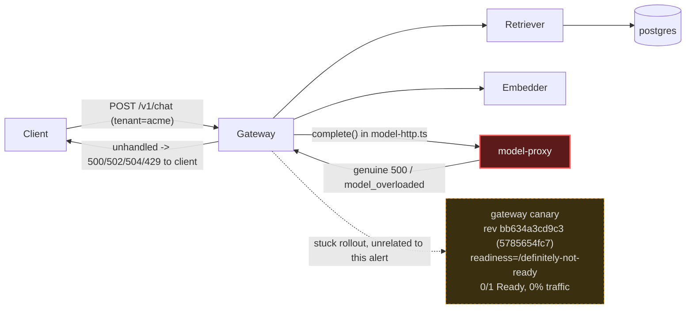

# Postmortem: gateway 5xx rate above 2%

- **Status:** resolved
- **Severity:** sev1
- **Verified:** no
- **Opened:** 2026-08-04 18:32:40Z
- **Resolved:** 2026-08-04 18:47:39Z

## Timeline (machine-generated)

All times UTC on 2026-08-04 unless a full date is shown.

| Time (UTC) | Source | Event |
| --- | --- | --- |
| 18:30:05Z | k8s | Rollout/gateway: RolloutUpdated |
| 18:30:05Z | k8s | Rollout/gateway: RolloutNotCompleted |
| 18:30:05Z | k8s | Rollout/gateway: NewReplicaSetCreated |
| 18:30:06Z | k8s | Pod/gateway-dd85945b4-jfd54: Killing |
| 18:30:06Z | k8s | ReplicaSet/gateway-dd85945b4: SuccessfulDelete |
| 18:30:06Z | k8s | Rollout/gateway: ScalingReplicaSet |
| 18:30:07Z | k8s | ReplicaSet/gateway-5785654fc7: SuccessfulCreate |
| 18:30:07Z | k8s | Pod/gateway-5785654fc7-p97mq: Scheduled |
| 18:30:07Z | log-spike | log-spike onset: [gateway] unhandled error: 16 \| } |
| 18:30:10Z | k8s | Pod/gateway-5785654fc7-p97mq: Started |
| 18:30:10Z | k8s | Pod/gateway-5785654fc7-p97mq: Pulled |
| 18:30:10Z | k8s | Pod/gateway-5785654fc7-p97mq: Created |
| 18:30:16Z | k8s | Pod/gateway-5785654fc7-p97mq: Unhealthy |
| 18:30:21Z | k8s | Pod/gateway-5785654fc7-p97mq: Unhealthy |
| 18:30:26Z | k8s | Pod/gateway-5785654fc7-p97mq: Unhealthy |
| 18:30:31Z | k8s | Pod/gateway-5785654fc7-p97mq: Unhealthy |
| 18:30:36Z | k8s | Pod/gateway-5785654fc7-p97mq: Unhealthy |
| 18:30:41Z | k8s | Pod/gateway-5785654fc7-p97mq: Unhealthy |
| 18:30:46Z | k8s | Pod/gateway-5785654fc7-p97mq: Unhealthy |
| 18:30:51Z | k8s | Pod/gateway-5785654fc7-p97mq: Unhealthy |
| 18:30:56Z | k8s | Pod/gateway-5785654fc7-p97mq: Unhealthy |
| 18:31:01Z | k8s | Pod/gateway-5785654fc7-p97mq: Unhealthy |
| 18:31:06Z | k8s | Pod/gateway-5785654fc7-p97mq: Unhealthy |
| 18:31:11Z | k8s | Pod/gateway-5785654fc7-p97mq: Unhealthy |
| 18:31:16Z | k8s | Pod/gateway-5785654fc7-p97mq: Unhealthy |
| 18:31:21Z | k8s | Pod/gateway-5785654fc7-p97mq: Unhealthy |
| 18:31:25Z | k8s | Pod/gateway-5785654fc7-p97mq: Unhealthy |
| 18:31:30Z | k8s | Pod/gateway-5785654fc7-p97mq: Unhealthy |
| 18:31:35Z | k8s | Pod/gateway-5785654fc7-p97mq: Unhealthy |
| 18:31:40Z | k8s | Pod/gateway-5785654fc7-p97mq: Unhealthy |
| 18:31:45Z | k8s | Pod/gateway-5785654fc7-p97mq: Unhealthy |
| 18:31:50Z | k8s | Pod/gateway-5785654fc7-p97mq: Unhealthy |
| 18:31:55Z | k8s | Pod/gateway-5785654fc7-p97mq: Unhealthy |
| 18:32:00Z | k8s | Pod/gateway-5785654fc7-p97mq: Unhealthy |
| 18:32:05Z | k8s | Pod/gateway-5785654fc7-p97mq: Unhealthy |
| 18:32:10Z | alert | alert firing: Gateway 5xx rate > 2% |
| 18:32:10Z | k8s | Pod/gateway-5785654fc7-p97mq: Unhealthy |
| 18:32:15Z | k8s | Pod/gateway-5785654fc7-p97mq: Unhealthy |
| 18:35:19Z | k8s | Pod/gateway-5785654fc7-p97mq: Unhealthy |
| 18:38:48Z | k8s | Rollout/gateway: SkipSteps |
| 18:38:48Z | k8s | Rollout/gateway: RolloutUpdated |
| 18:38:49Z | k8s | Pod/gateway-5785654fc7-p97mq: Killing |
| 18:38:49Z | k8s | ReplicaSet/gateway-5785654fc7: SuccessfulDelete |
| 18:38:49Z | k8s | Rollout/gateway: ScalingReplicaSet |
| 18:38:50Z | k8s | ReplicaSet/gateway-dd85945b4: SuccessfulCreate |
| 18:38:50Z | k8s | Rollout/gateway: ScalingReplicaSet |
| 18:38:50Z | k8s | Pod/gateway-dd85945b4-mm7jm: Scheduled |
| 18:38:53Z | k8s | Pod/gateway-dd85945b4-mm7jm: Started |
| 18:38:53Z | k8s | Pod/gateway-dd85945b4-mm7jm: Pulled |
| 18:38:53Z | k8s | Pod/gateway-dd85945b4-mm7jm: Created |
| 18:44:10Z | alert | alert resolved: Gateway 5xx rate > 2% |
| 18:56:49Z | k8s | Rollout/gateway: RolloutUpdated |
| 18:56:49Z | k8s | Rollout/gateway: RolloutNotCompleted |
| 18:56:49Z | k8s | Rollout/gateway: NewReplicaSetCreated |
| 18:56:50Z | deploy:argo | gateway synced to edb33a6699c9 |
| 18:56:50Z | k8s | Pod/gateway-dd85945b4-mm7jm: Killing |
| 18:56:50Z | k8s | ReplicaSet/gateway-dd85945b4: SuccessfulDelete |
| 18:56:50Z | k8s | Rollout/gateway: ScalingReplicaSet |
| 18:56:51Z | k8s | ReplicaSet/gateway-8444846b5f: SuccessfulCreate |
| 18:56:51Z | k8s | Rollout/gateway: ScalingReplicaSet |
| 18:56:51Z | k8s | Pod/gateway-8444846b5f-bqkg8: Scheduled |
| 18:56:52Z | k8s | Pod/gateway-8444846b5f-bqkg8: Pulled |
| 18:56:52Z | k8s | Pod/gateway-8444846b5f-bqkg8: Created |
| 18:56:53Z | k8s | Pod/gateway-8444846b5f-bqkg8: Started |
| 18:57:01Z | k8s | Rollout/gateway: RolloutStepCompleted |
| 18:57:03Z | k8s | Rollout/gateway: AnalysisRunRunning |
| 18:58:02Z | k8s | AnalysisRun/gateway-8444846b5f-21-1: MetricFailed |
| 18:58:02Z | k8s | AnalysisRun/gateway-8444846b5f-21-1: AnalysisRunFailed |
| 18:58:03Z | k8s | Rollout/gateway: RolloutAborted |
| 18:58:03Z | k8s | Rollout/gateway: AnalysisRunFailed |
| 18:58:04Z | k8s | Pod/gateway-8444846b5f-bqkg8: Killing |
| 18:58:04Z | k8s | ReplicaSet/gateway-8444846b5f: SuccessfulDelete |
| 18:58:04Z | k8s | Rollout/gateway: ScalingReplicaSet |
| 18:58:05Z | k8s | ReplicaSet/gateway-dd85945b4: SuccessfulCreate |
| 18:58:05Z | k8s | Rollout/gateway: ScalingReplicaSet |
| 18:58:05Z | k8s | Pod/gateway-dd85945b4-hw5fg: Scheduled |
| 18:58:06Z | k8s | Pod/gateway-dd85945b4-hw5fg: Started |
| 18:58:06Z | k8s | Pod/gateway-dd85945b4-hw5fg: Pulled |
| 18:58:06Z | k8s | Pod/gateway-dd85945b4-hw5fg: Created |
| 19:01:45Z | deploy:annotation | deploy gateway via gitops c025382 (argo sync) |
| 19:01:47Z | deploy:argo | gateway synced to c025382ba170 |
| 19:01:47Z | k8s | Rollout/gateway: SkipSteps |
| 19:01:47Z | k8s | Rollout/gateway: RolloutUpdated |
| 19:40:46Z | deploy:ci | CI run #114 failure on main: obs: load-generator: drop the defensive copy in percentile() |
| 19:50:45Z | deploy:ci | CI run #115 success on main: obs: Revert "load-generator: drop the defensive copy in percentile()" |

## Evidence links

- [Loki — logs over the incident window](http://localhost:3001/explore?schemaVersion=1&panes=%7B%22pm%22%3A+%7B%22datasource%22%3A+%22loki%22%2C+%22queries%22%3A+%5B%7B%22refId%22%3A+%22A%22%2C+%22datasource%22%3A+%7B%22type%22%3A+%22loki%22%2C+%22uid%22%3A+%22loki%22%7D%2C+%22expr%22%3A+%22%7Bnamespace%3D%5C%22subject%5C%22%7D+%7C~+%5C%22%28%3Fi%29error%7Cfailed%5C%22%22%7D%5D%2C+%22range%22%3A+%7B%22from%22%3A+%221785868360211%22%2C+%22to%22%3A+%221785869259976%22%7D%7D%7D&orgId=1)
- [Mimir — metrics over the incident window](http://localhost:3001/explore?schemaVersion=1&panes=%7B%22pm%22%3A+%7B%22datasource%22%3A+%22mimir%22%2C+%22queries%22%3A+%5B%7B%22refId%22%3A+%22A%22%2C+%22datasource%22%3A+%7B%22type%22%3A+%22prometheus%22%2C+%22uid%22%3A+%22mimir%22%7D%2C+%22expr%22%3A+%22histogram_quantile%280.95%2C+sum%28rate%28http_server_duration_milliseconds_bucket%5B5m%5D%29%29+by+%28le%29%29%22%7D%5D%2C+%22range%22%3A+%7B%22from%22%3A+%221785868360211%22%2C+%22to%22%3A+%221785869259976%22%7D%7D%7D&orgId=1)

## Investigation context

**Runbook match (2):** `gateway-high-error-rate.md`, `stale-secret.md` — toolset narrowed to 13 tools: alert_status, deploy_history, kubectl_read, loki_query, mimir_query, publish_postmortem, request_approval, restart_workload, runbook_lookup, runbook_read, save_artifact, tempo_query, update_db_secret

Pre-check battery (as injected at run start)

## Pre-check leads

### recent_deploys — LEAD
1 deploy-window lead
- argo app gateway: sync=OutOfSync health=Progressing (revision bb634a3cd9c3)

### kube_scan — LEAD
25 kube-scan leads
- event Pod/gateway-5785654fc7-p97mq: Unhealthy — Readiness probe failed: HTTP probe failed with statuscode: 404 (at 20:30:16)
- event Pod/gateway-5785654fc7-p97mq: Unhealthy — Readiness probe failed: HTTP probe failed with statuscode: 404 (at 20:30:21)
- event Pod/gateway-5785654fc7-p97mq: Unhealthy — Readiness probe failed: HTTP probe failed with statuscode: 404 (at 20:30:26)
- event Pod/gateway-5785654fc7-p97mq: Unhealthy — Readiness probe failed: HTTP probe failed with statuscode: 404 (at 20:30:31)
- event Pod/gateway-5785654fc7-p97mq: Unhealthy — Readiness probe failed: HTTP probe failed with statuscode: 404 (at 20:30:36)
- event Pod/gateway-5785654fc7-p97mq: Unhealthy — Readiness probe failed: HTTP probe failed with statuscode: 404 (at 20:30:41
… (section truncated)

### log_spike — LEAD
error/failed log rate 200/10min vs baseline 0/10min (200x baseline) — onset: [gateway] unhandled error: 16 |         } at 2026-08-04T18:30:07.561404+00:00
- error/failed log rate 200/10min vs baseline 0/10min (200x baseline) — onset: [gateway] unhandled error: 16 |         } at 2026-08-04T18:30:07.561404+00:00

### rollout_state — LEAD
1 rollout-state lead
- rollout gateway: Progressing — more replicas need to be updated (step 0/4)

### secret_age — OK
Secret subject-db-credentials last modified 10d 19h ago (created 10d 19h ago).

## Narrative

## Summary

`Gateway 5xx rate > 2%` fired for tenant `acme`. Investigation traced the 5xx responses to genuine errors returned by the `model-proxy` downstream on real `/v1/chat` traffic, which `gateway`'s error handling surfaced inconsistently as 500/502/504. A proposed remediation (rolling-restart of `model-proxy`) was **denied by the operator**, so no remediation was executed by this agent. The alert subsequently cleared on its own before any action was taken.

## Impact

Elevated 5xx responses on `POST /v1/chat` for tenant `acme`, confirmed via Tempo traces (root spans returning 500/502/504) sampled across roughly a 90-second window, consistent with the pre-check `log_spike` lead (200x baseline error/failed log rate).

## Root cause

`kubectl_read describe` + `tempo_query` evidence:

- Full trace inspection (e.g. trace `10bb9735f2dac47f257f9abd7560af25`) shows the gateway's `rag.chat` span recording an `UpstreamError: model-proxy returned 500` exception, thrown at `model-http.ts:21:19`, with the root `POST /v1/chat` span closing with `http.response.status_code=502`.
- A separate sampled trace (`1c040a9c635adb061d06d8e841ddf9b`) shows a `ModelOverloadedError: model is overloaded` exception from the same adapter, root span closing `429`.
- A TraceQL query scoped to `resource.service.name="model-proxy" && status=error` returned 5 traces where **model-proxy's own child span** (not just gateway's client wrapper) is marked `status=error` — i.e. model-proxy itself is genuinely erroring on live requests, not merely being timed out by the gateway.
- `model-proxy` pods (`model-proxy-554d76745d-*`) have been running 10 days with 0 restarts, no OOM/CPU/memory pressure (`kubectl top`: ~12-51m CPU, ~94-99Mi/384Mi memory), and `deploy_history` shows the `model-proxy` rollout `Healthy (step 4/4)` on an unchanged revision — ruling out a bad deploy or resource exhaustion on model-proxy as the trigger.
- `secret_age` pre-check reported the DB credential last modified 10d19h ago (long before the incident onset), ruling out the stale-secret runbook path — this is not a rotation-vs-restart mismatch.
- Separately (and not the cause of this alert): the `recent_deploys`/`rollout_state`/`kube_scan` pre-check leads point to an **unrelated, concurrently in-flight gateway canary** (Argo revision `bb634a3cd9c3`, pod-template-hash `5785654fc7`) whose readiness probe was misconfigured to `GET /definitely-not-ready`, 404ing continuously. That canary sat at 0/1 Ready throughout, so Kubernetes never routed client traffic to it — it did not contribute to the 5xx rate, but it is a bad deploy in its own right and needs separate follow-up (no rollout-abort/undo tool was available in this incident's toolset to act on it).

Conclusion: gateway 5xx rate > 2% was caused by **model-proxy intermittently returning genuine 500s and "model overloaded" errors on live inference calls**, which gateway's error handling converted into inconsistent 500/502/504/429 responses instead of a clean, uniform degraded response.

## What fixed it

Nothing executed by this agent. A dry-run rolling-restart of `model-proxy` was prepared (diff: `restartedAt` annotation only, no spec change) and submitted for approval as the runbook-documented mitigation for "one downstream is failing health checks." **The operator denied the approval request.** Per protocol, this was not retried. `alert_status` was re-queried afterward and reports the alert no longer active (self-resolved / the underlying model-proxy burst subsided on its own before any remediation landed).

## Lessons

- The alert cleared without intervention, consistent with a transient, bursty downstream failure (errors clustered tightly in the first ~30s of the sampled window per the attached chart) rather than a sustained outage — worth confirming with the model-proxy owner whether there's a known intermittent upstream dependency behind `model-http.ts`'s `complete()` call that should get a lower timeout / failover per ADR-001, per the runbook's third hypothesis.
- `model-proxy` emits no logs to Loki at all (`{job="subject/model-proxy"}` and `{container="model-proxy"}` both returned zero lines throughout this incident) despite handling and erroring on live traffic — this is an observability gap; the only visibility into its failures was via Tempo spans. Worth fixing model-proxy's logging so a future on-call doesn't have to reconstruct root cause from traces alone.
- The concurrent broken gateway canary (bad readiness probe path) is a separate, real bad deploy that remains stuck and un-remediated — it didn't cause this alert (0/1 Ready pods receive no traffic), but it should be tracked and rolled back separately.
- This incident's toolset (narrowed to the two matched runbooks) had no lever to adjust gateway's `MODEL_TIMEOUT_MS`/failover config or to abort/undo the stuck canary — only `restart_workload` and `update_db_secret` were available, and the one applicable action was declined by the operator.

