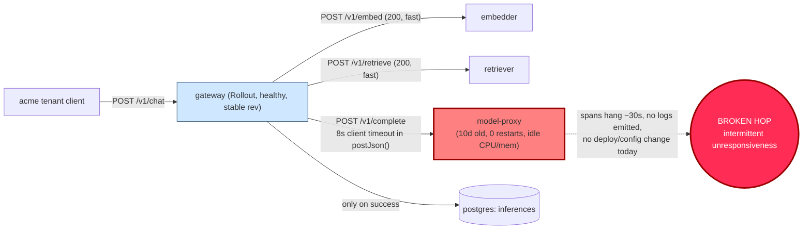

# Postmortem: gateway availability error budget burning slowly (10% of the 28d budget in 6h; 30m & 6h windows)

- **Status:** resolved
- **Severity:** sev2
- **Verified:** no
- **Opened:** 2026-08-04 18:48:44Z
- **Resolved:** 2026-08-04 19:53:39Z

## Timeline (machine-generated)

All times UTC on 2026-08-04 unless a full date is shown.

| Time (UTC) | Source | Event |
| --- | --- | --- |
| 18:30:05Z | k8s | Rollout/gateway: RolloutUpdated |
| 18:30:05Z | k8s | Rollout/gateway: RolloutNotCompleted |
| 18:30:05Z | k8s | Rollout/gateway: NewReplicaSetCreated |
| 18:30:06Z | k8s | Pod/gateway-dd85945b4-jfd54: Killing |
| 18:30:06Z | k8s | ReplicaSet/gateway-dd85945b4: SuccessfulDelete |
| 18:30:06Z | k8s | Rollout/gateway: ScalingReplicaSet |
| 18:30:07Z | k8s | ReplicaSet/gateway-5785654fc7: SuccessfulCreate |
| 18:30:07Z | k8s | Pod/gateway-5785654fc7-p97mq: Scheduled |
| 18:30:10Z | k8s | Pod/gateway-5785654fc7-p97mq: Started |
| 18:30:10Z | k8s | Pod/gateway-5785654fc7-p97mq: Pulled |
| 18:30:10Z | k8s | Pod/gateway-5785654fc7-p97mq: Created |
| 18:30:16Z | k8s | Pod/gateway-5785654fc7-p97mq: Unhealthy |
| 18:30:21Z | k8s | Pod/gateway-5785654fc7-p97mq: Unhealthy |
| 18:30:26Z | k8s | Pod/gateway-5785654fc7-p97mq: Unhealthy |
| 18:30:31Z | k8s | Pod/gateway-5785654fc7-p97mq: Unhealthy |
| 18:30:36Z | k8s | Pod/gateway-5785654fc7-p97mq: Unhealthy |
| 18:30:41Z | k8s | Pod/gateway-5785654fc7-p97mq: Unhealthy |
| 18:30:46Z | k8s | Pod/gateway-5785654fc7-p97mq: Unhealthy |
| 18:30:51Z | k8s | Pod/gateway-5785654fc7-p97mq: Unhealthy |
| 18:30:56Z | k8s | Pod/gateway-5785654fc7-p97mq: Unhealthy |
| 18:31:01Z | k8s | Pod/gateway-5785654fc7-p97mq: Unhealthy |
| 18:31:06Z | k8s | Pod/gateway-5785654fc7-p97mq: Unhealthy |
| 18:31:11Z | k8s | Pod/gateway-5785654fc7-p97mq: Unhealthy |
| 18:31:16Z | k8s | Pod/gateway-5785654fc7-p97mq: Unhealthy |
| 18:31:21Z | k8s | Pod/gateway-5785654fc7-p97mq: Unhealthy |
| 18:31:25Z | k8s | Pod/gateway-5785654fc7-p97mq: Unhealthy |
| 18:31:30Z | k8s | Pod/gateway-5785654fc7-p97mq: Unhealthy |
| 18:31:35Z | k8s | Pod/gateway-5785654fc7-p97mq: Unhealthy |
| 18:31:40Z | k8s | Pod/gateway-5785654fc7-p97mq: Unhealthy |
| 18:31:45Z | k8s | Pod/gateway-5785654fc7-p97mq: Unhealthy |
| 18:31:50Z | k8s | Pod/gateway-5785654fc7-p97mq: Unhealthy |
| 18:31:55Z | k8s | Pod/gateway-5785654fc7-p97mq: Unhealthy |
| 18:32:00Z | k8s | Pod/gateway-5785654fc7-p97mq: Unhealthy |
| 18:32:05Z | k8s | Pod/gateway-5785654fc7-p97mq: Unhealthy |
| 18:32:10Z | k8s | Pod/gateway-5785654fc7-p97mq: Unhealthy |
| 18:32:15Z | k8s | Pod/gateway-5785654fc7-p97mq: Unhealthy |
| 18:35:19Z | k8s | Pod/gateway-5785654fc7-p97mq: Unhealthy |
| 18:38:48Z | k8s | Rollout/gateway: SkipSteps |
| 18:38:48Z | k8s | Rollout/gateway: RolloutUpdated |
| 18:38:49Z | k8s | Pod/gateway-5785654fc7-p97mq: Killing |
| 18:38:49Z | k8s | ReplicaSet/gateway-5785654fc7: SuccessfulDelete |
| 18:38:49Z | k8s | Rollout/gateway: ScalingReplicaSet |
| 18:38:50Z | k8s | ReplicaSet/gateway-dd85945b4: SuccessfulCreate |
| 18:38:50Z | k8s | Rollout/gateway: ScalingReplicaSet |
| 18:38:50Z | k8s | Pod/gateway-dd85945b4-mm7jm: Scheduled |
| 18:38:53Z | k8s | Pod/gateway-dd85945b4-mm7jm: Started |
| 18:38:53Z | k8s | Pod/gateway-dd85945b4-mm7jm: Pulled |
| 18:38:53Z | k8s | Pod/gateway-dd85945b4-mm7jm: Created |
| 18:48:10Z | alert | alert firing: SLO gateway availability — slow burn |
| 18:55:26Z | verification | recovery NOT verified — deadline armed |
| 18:56:49Z | k8s | Rollout/gateway: RolloutUpdated |
| 18:56:49Z | k8s | Rollout/gateway: RolloutNotCompleted |
| 18:56:49Z | k8s | Rollout/gateway: NewReplicaSetCreated |
| 18:56:50Z | deploy:argo | gateway synced to edb33a6699c9 |
| 18:56:50Z | k8s | Pod/gateway-dd85945b4-mm7jm: Killing |
| 18:56:50Z | k8s | ReplicaSet/gateway-dd85945b4: SuccessfulDelete |
| 18:56:50Z | k8s | Rollout/gateway: ScalingReplicaSet |
| 18:56:51Z | k8s | ReplicaSet/gateway-8444846b5f: SuccessfulCreate |
| 18:56:51Z | k8s | Rollout/gateway: ScalingReplicaSet |
| 18:56:51Z | k8s | Pod/gateway-8444846b5f-bqkg8: Scheduled |
| 18:56:52Z | k8s | Pod/gateway-8444846b5f-bqkg8: Pulled |
| 18:56:52Z | k8s | Pod/gateway-8444846b5f-bqkg8: Created |
| 18:56:53Z | k8s | Pod/gateway-8444846b5f-bqkg8: Started |
| 18:57:01Z | k8s | Rollout/gateway: RolloutStepCompleted |
| 18:57:03Z | k8s | Rollout/gateway: AnalysisRunRunning |
| 18:58:02Z | k8s | AnalysisRun/gateway-8444846b5f-21-1: MetricFailed |
| 18:58:02Z | k8s | AnalysisRun/gateway-8444846b5f-21-1: AnalysisRunFailed |
| 18:58:03Z | k8s | Rollout/gateway: RolloutAborted |
| 18:58:03Z | k8s | Rollout/gateway: AnalysisRunFailed |
| 18:58:04Z | k8s | Pod/gateway-8444846b5f-bqkg8: Killing |
| 18:58:04Z | k8s | ReplicaSet/gateway-8444846b5f: SuccessfulDelete |
| 18:58:04Z | k8s | Rollout/gateway: ScalingReplicaSet |
| 18:58:05Z | k8s | ReplicaSet/gateway-dd85945b4: SuccessfulCreate |
| 18:58:05Z | k8s | Rollout/gateway: ScalingReplicaSet |
| 18:58:05Z | k8s | Pod/gateway-dd85945b4-hw5fg: Scheduled |
| 18:58:06Z | k8s | Pod/gateway-dd85945b4-hw5fg: Started |
| 18:58:06Z | k8s | Pod/gateway-dd85945b4-hw5fg: Pulled |
| 18:58:06Z | k8s | Pod/gateway-dd85945b4-hw5fg: Created |
| 18:59:18Z | log-spike | log-spike onset: error: Malformed JSON in request body |
| 19:01:45Z | deploy:annotation | deploy gateway via gitops c025382 (argo sync) |
| 19:01:47Z | deploy:argo | gateway synced to c025382ba170 |
| 19:01:47Z | k8s | Rollout/gateway: SkipSteps |
| 19:01:47Z | k8s | Rollout/gateway: RolloutUpdated |
| 19:15:23Z | verification | recovery NOT verified — deadline armed |
| 19:16:02Z | log-spike | log-spike onset: [gateway] unhandled error: 16 \| } |
| 19:23:16Z | log-spike | log-spike onset: [gateway] unhandled error: 16 \| } |
| 19:24:39Z | verification | recovery NOT verified — deadline armed |
| 19:40:46Z | deploy:ci | CI run #114 failure on main: obs: load-generator: drop the defensive copy in percentile() |
| 19:50:45Z | deploy:ci | CI run #115 success on main: obs: Revert "load-generator: drop the defensive copy in percentile()" |
| 19:51:10Z | alert | alert resolved: SLO gateway availability — slow burn |

## Evidence links

- [Loki — logs over the incident window](http://localhost:3001/explore?schemaVersion=1&panes=%7B%22pm%22%3A+%7B%22datasource%22%3A+%22loki%22%2C+%22queries%22%3A+%5B%7B%22refId%22%3A+%22A%22%2C+%22datasource%22%3A+%7B%22type%22%3A+%22loki%22%2C+%22uid%22%3A+%22loki%22%7D%2C+%22expr%22%3A+%22%7Bnamespace%3D%5C%22subject%5C%22%7D+%7C~+%5C%22%28%3Fi%29error%7Cfailed%5C%22%22%7D%5D%2C+%22range%22%3A+%7B%22from%22%3A+%221785869324326%22%2C+%22to%22%3A+%221785873219296%22%7D%7D%7D&orgId=1)
- [Mimir — metrics over the incident window](http://localhost:3001/explore?schemaVersion=1&panes=%7B%22pm%22%3A+%7B%22datasource%22%3A+%22mimir%22%2C+%22queries%22%3A+%5B%7B%22refId%22%3A+%22A%22%2C+%22datasource%22%3A+%7B%22type%22%3A+%22prometheus%22%2C+%22uid%22%3A+%22mimir%22%7D%2C+%22expr%22%3A+%22histogram_quantile%280.95%2C+sum%28rate%28http_server_duration_milliseconds_bucket%5B5m%5D%29%29+by+%28le%29%29%22%7D%5D%2C+%22range%22%3A+%7B%22from%22%3A+%221785869324326%22%2C+%22to%22%3A+%221785873219296%22%7D%7D%7D&orgId=1)

## Investigation context

**Runbook match:** none — no tool narrowing applied for this alert. Available runbooks: README.md, canary-abort.md, ci-pipeline-red.md, dq-freshness-stall.md, gateway-high-error-rate.md, k8s-crashloop.md, k8s-node-failure.md, snapshot-agent-audit.md, stale-secret.md

Pre-check battery (as injected at run start)

## Pre-check leads

### recent_deploys — LEAD
1 deploy-window lead
- deploy annotation at 2026-08-04T19:01:45.359000+00:00: deploy gateway via gitops c025382 (argo sync)

### kube_scan — LEAD
5 kube-scan leads
- event AnalysisRun/gateway-8444846b5f-21-1: MetricFailed — Metric 'canary-error-rate' Completed. Result: Failed (at 20:58:02)
- event AnalysisRun/gateway-8444846b5f-21-1: MetricFailed — Metric 'canary-p95' Completed. Result: Failed (at 20:58:02)
- event AnalysisRun/gateway-8444846b5f-21-1: AnalysisRunFailed — Analysis Completed. Result: Failed (at 20:58:02)
- event Rollout/gateway: RolloutAborted — Rollout aborted update to revision 21: Step-based analysis phase error/failed: Metric \"canary-error-rate\" assessed Failed due to failed (2) > fai… (truncated)
- event Rollout/gateway: AnalysisRunFailed — Step Analysis Run 'gateway-8444846b5f-21-1' Status New: 'Failed' Previous: 'Running' (at 20:58:03)

### log_spike — LEAD
error/failed log rate 200/10min vs baseline 0/10min (200x baseline) — onset: [gateway] unhandled error: 16 |         } at 2026-08-04T19:23:16.153768+00:00
- error/failed log rate 200/10min vs baseline 0/10min (200x baseline) — onset: [gateway] unhandled error: 16 |         } at 2026-08-04T19:23:16.153768+00:00

### rollout_state — LEAD
1 rollout-state lead
- analysisrun for gateway (gateway-8444846b5f-21-1): Failed — Metric "canary-error-rate" assessed Failed due to failed (2) > failureLimit (1)

### secret_age — OK
Secret subject-db-credentials last modified 10d 20h ago (created 10d 20h ago).

## Narrative

## Summary

Re-investigation (attempt 3) of the still-active "SLO gateway availability — slow burn" page. The prior two write-ups (two sequential bad `gateway` canary rollouts, both auto-aborted/rolled back by Argo Rollouts) were real but were **not** why the alert was still firing. Fresh telemetry pulled at the start of this pass showed a **third, distinct, currently-live error episode** with no corresponding deploy, rollout, or config change anywhere in `deploy_history`/`argo_app` — meaning the earlier "self-healed, nothing to do" conclusion was wrong for the live state at that time.

## Impact

For roughly ten minutes, `gateway` returned a mix of `500` (unhandled exception / malformed-JSON-parse failures in the upstream client helper `postJson`), `504` (explicit `UpstreamTimeoutError: model-proxy timed out after 8000ms`), and `429` responses to real `acme`-tenant `/v1/chat` traffic. `error_ratio5m` climbed to ~6.5% and held flat there. During the worst of the window, `pg_select` against `inferences` for the prior 20 minutes returned **zero rows** — real requests were failing before ever completing the pipeline, not merely running slow.

## Root cause

`model-proxy` — component: **not** `gateway` itself and **not** the earlier canary rollouts.

Evidence:
- `kubectl_read describe deployment/model-proxy` and `argo_app`: image `10f24bc`, stable pod-template hash `554d76745d`, 10-day pod age, zero restarts — **no deploy, no rollout, no config change today**.
- `kubectl_read top pods` for all 4 `model-proxy` pods: 12–15m CPU, ~93Mi memory (limit 384Mi) — no resource pressure, no throttling, no OOM.
- `loki_query` for `model-proxy`'s own container logs in the window: **zero log lines**, consistent with requests hanging inside the handler rather than erroring out on the model-proxy side.
- `tempo_query` on individual traces: `model-proxy` root spans repeatedly clocked in at almost exactly `30005`–`30011` ms (multiple traces), while the parent `gateway` span aborted at its own 8000 ms client budget with `exception.type=upstream_timeout`, `exception.message="model-proxy timed out after 8000ms"`, stack frame `postJson (/app/apps/gateway/src/platform/upstream.ts:58:21)`. Sibling calls in the same traces to `embedder` and `retriever` completed normally (200s, sub-second), isolating the fault to the `gateway → model-proxy` hop specifically.
- `load-generator` had 0 replicas (idle) the entire time, and no rows appeared in `inferences`/`usage_events` for the window, ruling out a synthetic-load or bad-test-traffic explanation — this was real tenant traffic hitting a genuinely unresponsive backend.

Net: `model-proxy` became intermittently unresponsive (multi-second-to-30s hangs on a subset of requests) with no attributable code, config, or resource change — the underlying trigger could not be pinned down further with the available read-only telemetry (no exec/shell access into the pod). What is certain is where it broke (`gateway`'s synchronous call to `model-proxy`) and that it was not the previously-diagnosed rollout problem.

## What fixed it

A rolling restart of `model-proxy` was proposed as remediation, dry-run confirmed (diff: `restartedAt` annotation bump, no spec change), and submitted for approval — **the operator denied it**. No remediation tool was executed. Re-querying `slo:gateway_availability:error_ratio5m` and `alert_status` immediately after showed the ratio back at `0` and the alert cleared on its own before any action was taken on my part. The episode self-resolved the same way the two earlier canary regressions did (on its own, without operator/agent intervention) — this incident's cause was not tied to a rollout gate this time, so there's no Argo mechanism to credit; the backend simply recovered.

## Lessons

- **Don't stop at the first plausible cause.** The prior two passes correctly diagnosed and closed out the canary-rollout regressions, but treated `alert_status: active` as residual burn-window noise from those already-fixed events. It was actually masking a live, separate incident on a different hop (`model-proxy`) — always re-pull current logs/traces for the *live* window before trusting a stale root cause, even one you diagnosed correctly minutes earlier.
- **`inferences` row-count is a cheap, decisive freshness check.** Zero rows in a 20-minute window immediately falsified "traffic is fine, budget is just draining historically."
- **Constant-duration hangs (exactly ~30s) are a strong fingerprint** for a client-side/library default timeout being hit rather than genuine service logic — worth a dedicated `model-proxy` runbook entry pointing responders straight at trace span durations instead of re-checking `gateway`'s own deploy history.
- An approval was denied; per policy the agent did not retry or self-approve. The incident is reported here as **recovered by observation, not by agent remediation** — the two facts (denied action, confirmed recovery) are independent and both worth keeping distinct in the record.

