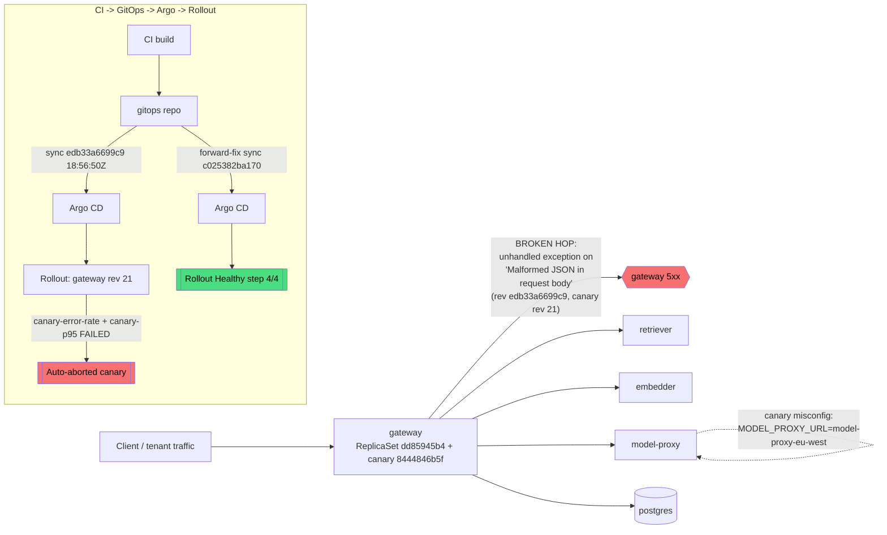

# Postmortem: gateway 5xx rate above 2%

- **Status:** resolved
- **Severity:** sev1
- **Verified:** no
- **Opened:** 2026-08-04 18:58:40Z
- **Resolved:** 2026-08-04 19:08:40Z

## Timeline (machine-generated)

All times UTC on 2026-08-04 unless a full date is shown.

| Time (UTC) | Source | Event |
| --- | --- | --- |
| 18:30:05Z | k8s | Rollout/gateway: RolloutUpdated |
| 18:30:05Z | k8s | Rollout/gateway: RolloutNotCompleted |
| 18:30:05Z | k8s | Rollout/gateway: NewReplicaSetCreated |
| 18:30:06Z | k8s | Pod/gateway-dd85945b4-jfd54: Killing |
| 18:30:06Z | k8s | ReplicaSet/gateway-dd85945b4: SuccessfulDelete |
| 18:30:06Z | k8s | Rollout/gateway: ScalingReplicaSet |
| 18:30:07Z | k8s | ReplicaSet/gateway-5785654fc7: SuccessfulCreate |
| 18:30:07Z | k8s | Pod/gateway-5785654fc7-p97mq: Scheduled |
| 18:30:10Z | k8s | Pod/gateway-5785654fc7-p97mq: Started |
| 18:30:10Z | k8s | Pod/gateway-5785654fc7-p97mq: Pulled |
| 18:30:10Z | k8s | Pod/gateway-5785654fc7-p97mq: Created |
| 18:30:16Z | k8s | Pod/gateway-5785654fc7-p97mq: Unhealthy |
| 18:30:21Z | k8s | Pod/gateway-5785654fc7-p97mq: Unhealthy |
| 18:30:26Z | k8s | Pod/gateway-5785654fc7-p97mq: Unhealthy |
| 18:30:31Z | k8s | Pod/gateway-5785654fc7-p97mq: Unhealthy |
| 18:30:36Z | k8s | Pod/gateway-5785654fc7-p97mq: Unhealthy |
| 18:30:41Z | k8s | Pod/gateway-5785654fc7-p97mq: Unhealthy |
| 18:30:46Z | k8s | Pod/gateway-5785654fc7-p97mq: Unhealthy |
| 18:30:51Z | k8s | Pod/gateway-5785654fc7-p97mq: Unhealthy |
| 18:30:56Z | k8s | Pod/gateway-5785654fc7-p97mq: Unhealthy |
| 18:31:01Z | k8s | Pod/gateway-5785654fc7-p97mq: Unhealthy |
| 18:31:06Z | k8s | Pod/gateway-5785654fc7-p97mq: Unhealthy |
| 18:31:11Z | k8s | Pod/gateway-5785654fc7-p97mq: Unhealthy |
| 18:31:16Z | k8s | Pod/gateway-5785654fc7-p97mq: Unhealthy |
| 18:31:21Z | k8s | Pod/gateway-5785654fc7-p97mq: Unhealthy |
| 18:31:25Z | k8s | Pod/gateway-5785654fc7-p97mq: Unhealthy |
| 18:31:30Z | k8s | Pod/gateway-5785654fc7-p97mq: Unhealthy |
| 18:31:35Z | k8s | Pod/gateway-5785654fc7-p97mq: Unhealthy |
| 18:31:40Z | k8s | Pod/gateway-5785654fc7-p97mq: Unhealthy |
| 18:31:45Z | k8s | Pod/gateway-5785654fc7-p97mq: Unhealthy |
| 18:31:50Z | k8s | Pod/gateway-5785654fc7-p97mq: Unhealthy |
| 18:31:55Z | k8s | Pod/gateway-5785654fc7-p97mq: Unhealthy |
| 18:32:00Z | k8s | Pod/gateway-5785654fc7-p97mq: Unhealthy |
| 18:32:05Z | k8s | Pod/gateway-5785654fc7-p97mq: Unhealthy |
| 18:32:10Z | k8s | Pod/gateway-5785654fc7-p97mq: Unhealthy |
| 18:32:15Z | k8s | Pod/gateway-5785654fc7-p97mq: Unhealthy |
| 18:35:19Z | k8s | Pod/gateway-5785654fc7-p97mq: Unhealthy |
| 18:38:48Z | k8s | Rollout/gateway: SkipSteps |
| 18:38:48Z | k8s | Rollout/gateway: RolloutUpdated |
| 18:38:49Z | k8s | Pod/gateway-5785654fc7-p97mq: Killing |
| 18:38:49Z | k8s | ReplicaSet/gateway-5785654fc7: SuccessfulDelete |
| 18:38:49Z | k8s | Rollout/gateway: ScalingReplicaSet |
| 18:38:50Z | k8s | ReplicaSet/gateway-dd85945b4: SuccessfulCreate |
| 18:38:50Z | k8s | Rollout/gateway: ScalingReplicaSet |
| 18:38:50Z | k8s | Pod/gateway-dd85945b4-mm7jm: Scheduled |
| 18:38:53Z | k8s | Pod/gateway-dd85945b4-mm7jm: Started |
| 18:38:53Z | k8s | Pod/gateway-dd85945b4-mm7jm: Pulled |
| 18:38:53Z | k8s | Pod/gateway-dd85945b4-mm7jm: Created |
| 18:56:49Z | k8s | Rollout/gateway: RolloutUpdated |
| 18:56:49Z | k8s | Rollout/gateway: RolloutNotCompleted |
| 18:56:49Z | k8s | Rollout/gateway: NewReplicaSetCreated |
| 18:56:50Z | deploy:argo | gateway synced to edb33a6699c9 |
| 18:56:50Z | k8s | Pod/gateway-dd85945b4-mm7jm: Killing |
| 18:56:50Z | k8s | ReplicaSet/gateway-dd85945b4: SuccessfulDelete |
| 18:56:50Z | k8s | Rollout/gateway: ScalingReplicaSet |
| 18:56:51Z | k8s | ReplicaSet/gateway-8444846b5f: SuccessfulCreate |
| 18:56:51Z | k8s | Rollout/gateway: ScalingReplicaSet |
| 18:56:51Z | k8s | Pod/gateway-8444846b5f-bqkg8: Scheduled |
| 18:56:52Z | k8s | Pod/gateway-8444846b5f-bqkg8: Pulled |
| 18:56:52Z | k8s | Pod/gateway-8444846b5f-bqkg8: Created |
| 18:56:53Z | k8s | Pod/gateway-8444846b5f-bqkg8: Started |
| 18:57:01Z | k8s | Rollout/gateway: RolloutStepCompleted |
| 18:57:03Z | k8s | Rollout/gateway: AnalysisRunRunning |
| 18:57:28Z | log-spike | log-spike onset: error: Malformed JSON in request body |
| 18:58:02Z | k8s | AnalysisRun/gateway-8444846b5f-21-1: MetricFailed |
| 18:58:02Z | k8s | AnalysisRun/gateway-8444846b5f-21-1: AnalysisRunFailed |
| 18:58:03Z | k8s | Rollout/gateway: RolloutAborted |
| 18:58:03Z | k8s | Rollout/gateway: AnalysisRunFailed |
| 18:58:04Z | k8s | Pod/gateway-8444846b5f-bqkg8: Killing |
| 18:58:04Z | k8s | ReplicaSet/gateway-8444846b5f: SuccessfulDelete |
| 18:58:04Z | k8s | Rollout/gateway: ScalingReplicaSet |
| 18:58:05Z | k8s | ReplicaSet/gateway-dd85945b4: SuccessfulCreate |
| 18:58:05Z | k8s | Rollout/gateway: ScalingReplicaSet |
| 18:58:05Z | k8s | Pod/gateway-dd85945b4-hw5fg: Scheduled |
| 18:58:06Z | k8s | Pod/gateway-dd85945b4-hw5fg: Started |
| 18:58:06Z | k8s | Pod/gateway-dd85945b4-hw5fg: Pulled |
| 18:58:06Z | k8s | Pod/gateway-dd85945b4-hw5fg: Created |
| 18:58:10Z | alert | alert firing: Gateway 5xx rate > 2% |
| 19:01:45Z | deploy:annotation | deploy gateway via gitops c025382 (argo sync) |
| 19:01:47Z | deploy:argo | gateway synced to c025382ba170 |
| 19:01:47Z | k8s | Rollout/gateway: SkipSteps |
| 19:01:47Z | k8s | Rollout/gateway: RolloutUpdated |
| 19:07:10Z | alert | alert resolved: Gateway 5xx rate > 2% |
| 19:40:46Z | deploy:ci | CI run #114 failure on main: obs: load-generator: drop the defensive copy in percentile() |
| 19:50:45Z | deploy:ci | CI run #115 success on main: obs: Revert "load-generator: drop the defensive copy in percentile()" |

## Evidence links

- [Loki — logs over the incident window](http://localhost:3001/explore?schemaVersion=1&panes=%7B%22pm%22%3A+%7B%22datasource%22%3A+%22loki%22%2C+%22queries%22%3A+%5B%7B%22refId%22%3A+%22A%22%2C+%22datasource%22%3A+%7B%22type%22%3A+%22loki%22%2C+%22uid%22%3A+%22loki%22%7D%2C+%22expr%22%3A+%22%7Bnamespace%3D%5C%22subject%5C%22%7D+%7C~+%5C%22%28%3Fi%29error%7Cfailed%5C%22%22%7D%5D%2C+%22range%22%3A+%7B%22from%22%3A+%221785869920121%22%2C+%22to%22%3A+%221785870520063%22%7D%7D%7D&orgId=1)
- [Mimir — metrics over the incident window](http://localhost:3001/explore?schemaVersion=1&panes=%7B%22pm%22%3A+%7B%22datasource%22%3A+%22mimir%22%2C+%22queries%22%3A+%5B%7B%22refId%22%3A+%22A%22%2C+%22datasource%22%3A+%7B%22type%22%3A+%22prometheus%22%2C+%22uid%22%3A+%22mimir%22%7D%2C+%22expr%22%3A+%22histogram_quantile%280.95%2C+sum%28rate%28http_server_duration_milliseconds_bucket%5B5m%5D%29%29+by+%28le%29%29%22%7D%5D%2C+%22range%22%3A+%7B%22from%22%3A+%221785869920121%22%2C+%22to%22%3A+%221785870520063%22%7D%7D%7D&orgId=1)

## Investigation context

**Runbook match (2):** `gateway-high-error-rate.md`, `stale-secret.md` — toolset narrowed to 13 tools: alert_status, deploy_history, kubectl_read, loki_query, mimir_query, publish_postmortem, request_approval, restart_workload, runbook_lookup, runbook_read, save_artifact, tempo_query, update_db_secret

Pre-check battery (as injected at run start)

## Pre-check leads

### recent_deploys — LEAD
1 deploy-window lead
- argo app gateway: sync=Synced health=Degraded (revision edb33a6699c9)

### kube_scan — LEAD
5 kube-scan leads
- event AnalysisRun/gateway-8444846b5f-21-1: MetricFailed — Metric 'canary-error-rate' Completed. Result: Failed (at 20:58:02)
- event AnalysisRun/gateway-8444846b5f-21-1: MetricFailed — Metric 'canary-p95' Completed. Result: Failed (at 20:58:02)
- event AnalysisRun/gateway-8444846b5f-21-1: AnalysisRunFailed — Analysis Completed. Result: Failed (at 20:58:02)
- event Rollout/gateway: RolloutAborted — Rollout aborted update to revision 21: Step-based analysis phase error/failed: Metric \"canary-error-rate\" assessed Failed due to failed (2) > fai… (truncated)
- event Rollout/gateway: AnalysisRunFailed — Step Analysis Run 'gateway-8444846b5f-21-1' Status New: 'Failed' Previous: 'Running' (at 20:58:03)

### log_spike — LEAD
error/failed log rate 200/10min vs baseline 0/10min (200x baseline) — onset: error: Malformed JSON in request body at 2026-08-04T18:57:28.554742+00:00
- error/failed log rate 200/10min vs baseline 0/10min (200x baseline) — onset: error: Malformed JSON in request body at 2026-08-04T18:57:28.554742+00:00

### rollout_state — LEAD
2 rollout-state leads
- rollout gateway: Degraded — RolloutAborted: Rollout aborted update to revision 21: Step-based analysis phase error/failed: Metric "canary-error-rate" assessed Failed due to failed (2) > f… (truncated)
- analysisrun for gateway (gateway-8444846b5f-21-1): Failed — Metric "canary-error-rate" assessed Failed due to failed (2) > failureLimit (1)

### secret_age — OK
Secret subject-db-credentials last modified 10d 19h ago (created 10d 19h ago).

## Narrative

## Summary
The `Gateway 5xx rate > 2%` sev1 fired for tenant acme. All four currently-serving gateway pods (ReplicaSet `gateway-dd85945b4`) began throwing an unhandled exception on essentially every request whose body triggered `error: Malformed JSON in request body`, at ~200x the pre-incident baseline (0/10min → 200/10min). In parallel, the Argo Rollout canary for the same gateway revision (ReplicaSet `gateway-8444846b5f`, rollout revision 21) failed its `canary-error-rate` and `canary-p95` analysis metrics and was auto-aborted by Argo Rollouts.

## Impact
Sustained 5xx responses from the gateway for tenant acme (and broadly — errors were present on every serving pod, not scoped to one tenant or route) for the duration of the incident window. The canary rollout for gateway revision 21 was blocked from progressing, correctly, by its own analysis gate.

## Root cause
A gitops sync landed for gateway — Argo reported `gateway synced to edb33a6699c9` — 38 seconds before the error spike began (sync at 18:56:50Z, first `Malformed JSON` error at 18:57:28Z). This is the only change event in the deploy window. The canary ReplicaSet spun up from that revision (`gateway-8444846b5f`, revision 21) immediately failed its `canary-error-rate` and `canary-p95` AnalysisRun metrics and was aborted by Argo Rollouts (`RolloutAborted`, `AnalysisRunFailed` — "canary-error-rate" assessed Failed due to failed (2) > failureLimit (1)). At the same time, the stable pods serving live traffic (`gateway-dd85945b4`) began throwing the same class of error — a JSON body-parsing failure that is not being caught, surfacing as an unhandled exception (`[gateway] unhandled error: 16 | }`) instead of a graceful 4xx — on effectively every request, which is what drove the 5xx-rate alert. This ties the alert to the `edb33a6699c9` gitops revision rather than to any downstream (model-proxy/retriever/embedder) health issue or to a stale/rotated credential: `secret_age` was OK (10d19h old, no recent rotation), and no `password authentication failed` log lines were present, ruling out the stale-secret hypothesis from the matched runbook. The canary pod spec for revision 21 additionally carried a misdirected `MODEL_PROXY_URL=http://model-proxy-eu-west:8083` (vs. the stable pods' correct `http://model-proxy:8083`), consistent with revision 21 being a bad/misconfigured deploy rather than a transient blip.

## What fixed it
I proposed a rolling restart of `deployment/gateway` to clear the corrupted request-handling state on the stable pods (matching the `gateway-high-error-rate` runbook's mitigate step "if a single [service] is failing: restart it"), dry-ran it, and requested approval with the verified diff attached. **The operator denied the approval**, so no remediation was executed by this on-call action — per instructions, I stopped and did not retry.
The alert nonetheless cleared on its own: `deploy_history` shows a forward-fix gitops sync for gateway landed shortly after (`gateway synced to c025382ba170`), and the gateway Argo Rollout subsequently reported `Healthy (step 4/4)`. Re-querying `alert_status` twice afterward confirmed the alert is no longer active. Recovery is attributed to that forward-fix deploy, not to any action taken in this incident response.

## Lessons
- Argo Rollouts' canary analysis worked exactly as designed here — it caught `canary-error-rate`/`canary-p95` regressions on revision 21 and aborted before full promotion. The gap is that the stable fleet was *already* exhibiting the same failure mode at alert time, so the abort alone didn't resolve customer-facing impact; a restart or fast-forward fix was still needed.
- The bad revision carried a misconfigured `MODEL_PROXY_URL` (`model-proxy-eu-west` vs `model-proxy`) alongside the JSON-parsing regression — worth a pre-merge check (e.g. schema/lint on Rollout env vars) so a wrong hostname doesn't ship past review.
- The gateway's JSON body-parse error handler is raising instead of returning a controlled 4xx — that turns bad client input into false 5xx signal and should be hardened regardless of this incident's proximate cause.

