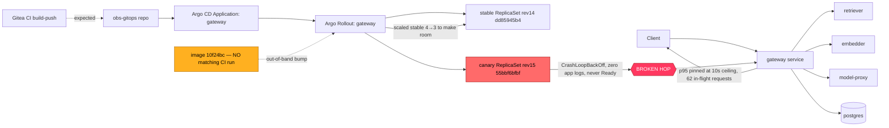

# Postmortem: gateway latency error budget burning fast (2% of the 28d budget in 1h; 5m & 1h windows)

- **Status:** open
- **Severity:** sev1
- **Verified:** no
- **Opened:** 2026-08-04 01:03:45Z
- **Resolved:** (still open)

## Timeline (machine-generated)

All times UTC on 2026-08-04 unless a full date is shown.

| Time (UTC) | Source | Event |
| --- | --- | --- |
| 00:58:20Z | k8s | Pod/gateway-dd85945b4-c5xbb: Killing |
| 00:58:20Z | k8s | ReplicaSet/gateway-dd85945b4: SuccessfulDelete |
| 00:58:20Z | k8s | Rollout/gateway: ScalingReplicaSet |
| 00:58:20Z | k8s | Rollout/gateway: RolloutUpdated |
| 00:58:20Z | k8s | Rollout/gateway: RolloutNotCompleted |
| 00:58:21Z | k8s | ReplicaSet/gateway-55bbf6bfbf: SuccessfulCreate |
| 00:58:21Z | k8s | Pod/gateway-55bbf6bfbf-4qgg4: Scheduled |
| 00:58:23Z | k8s | Pod/gateway-55bbf6bfbf-4qgg4: Started |
| 00:58:23Z | k8s | Pod/gateway-55bbf6bfbf-4qgg4: Pulled |
| 00:58:23Z | k8s | Pod/gateway-55bbf6bfbf-4qgg4: Created |
| 00:58:25Z | k8s | Pod/gateway-55bbf6bfbf-4qgg4: Started |
| 00:58:25Z | k8s | Pod/gateway-55bbf6bfbf-4qgg4: Pulled |
| 00:58:25Z | k8s | Pod/gateway-55bbf6bfbf-4qgg4: Created |
| 00:58:27Z | k8s | Pod/gateway-55bbf6bfbf-4qgg4: BackOff |
| 00:58:28Z | k8s | Pod/gateway-55bbf6bfbf-4qgg4: BackOff |
| 00:58:31Z | k8s | Pod/gateway-55bbf6bfbf-4qgg4: BackOff |
| 00:58:37Z | k8s | Pod/gateway-55bbf6bfbf-4qgg4: Started |
| 00:58:37Z | k8s | Pod/gateway-55bbf6bfbf-4qgg4: Pulled |
| 00:58:37Z | k8s | Pod/gateway-55bbf6bfbf-4qgg4: Created |
| 00:58:39Z | k8s | Pod/gateway-55bbf6bfbf-4qgg4: BackOff |
| 00:58:40Z | k8s | Pod/gateway-55bbf6bfbf-4qgg4: BackOff |
| 00:58:41Z | k8s | Pod/gateway-55bbf6bfbf-4qgg4: BackOff |
| 00:59:03Z | k8s | Pod/gateway-55bbf6bfbf-4qgg4: Started |
| 00:59:03Z | k8s | Pod/gateway-55bbf6bfbf-4qgg4: Pulled |
| 00:59:03Z | k8s | Pod/gateway-55bbf6bfbf-4qgg4: Created |
| 00:59:05Z | k8s | Pod/gateway-55bbf6bfbf-4qgg4: BackOff |
| 00:59:06Z | k8s | Pod/gateway-55bbf6bfbf-4qgg4: BackOff |
| 00:59:11Z | k8s | Pod/gateway-55bbf6bfbf-4qgg4: BackOff |
| 00:59:57Z | k8s | Pod/gateway-55bbf6bfbf-4qgg4: Started |
| 00:59:57Z | k8s | Pod/gateway-55bbf6bfbf-4qgg4: Pulled |
| 00:59:57Z | k8s | Pod/gateway-55bbf6bfbf-4qgg4: Created |
| 00:59:59Z | k8s | Pod/gateway-55bbf6bfbf-4qgg4: BackOff |
| 01:00:00Z | k8s | Pod/gateway-55bbf6bfbf-4qgg4: BackOff |
| 01:00:01Z | k8s | Pod/gateway-55bbf6bfbf-4qgg4: BackOff |
| 01:01:16Z | k8s | Pod/gateway-55bbf6bfbf-4qgg4: BackOff |
| 01:01:19Z | k8s | Pod/gateway-55bbf6bfbf-4qgg4: Started |
| 01:01:19Z | k8s | Pod/gateway-55bbf6bfbf-4qgg4: Pulled |
| 01:01:19Z | k8s | Pod/gateway-55bbf6bfbf-4qgg4: Created |
| 01:01:21Z | k8s | Pod/gateway-55bbf6bfbf-4qgg4: BackOff |
| 01:01:22Z | k8s | Pod/gateway-55bbf6bfbf-4qgg4: BackOff |
| 01:01:31Z | k8s | Pod/gateway-55bbf6bfbf-4qgg4: BackOff |
| 01:02:58Z | k8s | Pod/gateway-55bbf6bfbf-4qgg4: BackOff |
| 01:03:10Z | alert | alert firing: SLO gateway latency — fast burn |
| 01:04:24Z | k8s | Pod/gateway-55bbf6bfbf-4qgg4: Started |
| 01:04:24Z | k8s | Pod/gateway-55bbf6bfbf-4qgg4: Pulled |
| 01:04:24Z | k8s | Pod/gateway-55bbf6bfbf-4qgg4: Created |
| 01:04:26Z | k8s | Pod/gateway-55bbf6bfbf-4qgg4: BackOff |
| 01:04:27Z | k8s | Pod/gateway-55bbf6bfbf-4qgg4: BackOff |
| 01:04:31Z | k8s | Pod/gateway-55bbf6bfbf-4qgg4: BackOff |
| 01:05:46Z | k8s | Pod/gateway-55bbf6bfbf-4qgg4: BackOff |
| 01:06:35Z | k8s | Rollout/gateway: SkipSteps |
| 01:06:35Z | k8s | Rollout/gateway: RolloutUpdated |
| 01:06:36Z | k8s | ReplicaSet/gateway-dd85945b4: SuccessfulCreate |
| 01:06:36Z | k8s | ReplicaSet/gateway-55bbf6bfbf: SuccessfulDelete |
| 01:06:36Z | k8s | Rollout/gateway: ScalingReplicaSet |
| 01:06:36Z | k8s | Pod/gateway-dd85945b4-pwg4s: Scheduled |
| 01:06:39Z | k8s | Pod/gateway-dd85945b4-pwg4s: Started |
| 01:06:39Z | k8s | Pod/gateway-dd85945b4-pwg4s: Pulled |
| 01:06:39Z | k8s | Pod/gateway-dd85945b4-pwg4s: Created |

## Evidence links

- [Loki — logs over the incident window](http://localhost:3001/explore?schemaVersion=1&panes=%7B%22pm%22%3A+%7B%22datasource%22%3A+%22loki%22%2C+%22queries%22%3A+%5B%7B%22refId%22%3A+%22A%22%2C+%22datasource%22%3A+%7B%22type%22%3A+%22loki%22%2C+%22uid%22%3A+%22loki%22%7D%2C+%22expr%22%3A+%22%7Bnamespace%3D%5C%22subject%5C%22%7D+%7C~+%5C%22%28%3Fi%29error%7Cfailed%5C%22%22%7D%5D%2C+%22range%22%3A+%7B%22from%22%3A+%221785805425897%22%2C+%22to%22%3A+%221785805775053%22%7D%7D%7D&orgId=1)
- [Mimir — metrics over the incident window](http://localhost:3001/explore?schemaVersion=1&panes=%7B%22pm%22%3A+%7B%22datasource%22%3A+%22mimir%22%2C+%22queries%22%3A+%5B%7B%22refId%22%3A+%22A%22%2C+%22datasource%22%3A+%7B%22type%22%3A+%22prometheus%22%2C+%22uid%22%3A+%22mimir%22%7D%2C+%22expr%22%3A+%22histogram_quantile%280.95%2C+sum%28rate%28http_server_duration_milliseconds_bucket%5B5m%5D%29%29+by+%28le%29%29%22%7D%5D%2C+%22range%22%3A+%7B%22from%22%3A+%221785805425897%22%2C+%22to%22%3A+%221785805775053%22%7D%7D%7D&orgId=1)

## Investigation context

**Runbook match:** none — no tool narrowing applied for this alert. Available runbooks: README.md, canary-abort.md, ci-pipeline-red.md, dq-freshness-stall.md, gateway-high-error-rate.md, k8s-crashloop.md, k8s-node-failure.md, snapshot-agent-audit.md, stale-secret.md

Pre-check battery (as injected at run start)

## Pre-check leads

### recent_deploys — LEAD
No deploy in the last 60m — rule out the reflex answer.
- No deploy in the last 60m — rule out the reflex answer.

### log_spike — OK
error/failed log rate normal: 200/10min vs baseline 500/10min

### kube_scan — UNAVAILABLE
error: You must be logged in to the server (Unauthorized)

### rollout_state — UNAVAILABLE
gateway: E0804 03:03:47.525331    5224 memcache.go:265] "Unhandled Error" err="couldn't get current server API group list: the server has asked for the client to provide credentials"
E0804 03:03:47.981065    5224 memcache.go:265] "Unhandled Error" err="couldn't get current server API group list: the server has asked for the client to provide credentials"
E0804 03:03:48.496268    5224 memcache.go:265] "Unhandled Error" err="couldn't get current server API group list: the server has asked for the client to; gateway analysis: E0804 03:03:48.205130   65456 memcache.go:265] "Unhandled Error" err="couldn't get current server API group list: the server has asked for the client to provide credentials"
E0804 03:03:48.634792   65456 memcache.go:265] "Unhandled Error"
… (section truncated)

### secret_age — UNAVAILABLE
error: You must be logged in to the server (Unauthorized)

## Narrative

## Summary
The `SLO gateway latency — fast burn` alert (sev1, tenant acme) fired because gateway p95 latency on `/v1/chat` pinned at the top of the request-duration histogram (≥10s bucket) for a sustained period, burning ~2% of the 28-day latency error budget in under an hour.

## Impact
Gateway `/v1/chat` requests for tenant acme (and presumably all tenants sharing the gateway) saw multi-second to timeout-class latency while the burn was active. `active_requests{service="gateway"}` reached 62 in-flight requests at peak — consistent with request queuing/backup rather than steady-state throughput.

## Root cause
The Argo Rollout for `gateway` progressed from stable revision 14 (pod-template-hash `dd85945b4`) to a new revision 15 (`55bbf6bfbf`, image `obs-registry:5010/gateway:10f24bc`). The moment the canary was created, the Rollout controller scaled the stable ReplicaSet down from 4 → 3 replicas to make room for it. The new canary pod (`gateway-55bbf6bfbf-4qgg4`) entered `CrashLoopBackOff` immediately and never emitted a single application log line (Loki has zero log lines for that pod across the whole incident window) — the container is dying before the app can even initialize, i.e. it never became Ready and never served a request.

Critically, image tag `10f24bc` does not correspond to any commit in the last 20 Gitea Actions CI runs on `main` or any other branch — every recent CI-built gateway image (`d62500f603`, `28686bc2ba`, `283cec4c08`, `b47a84c5fc`, `ed08014000`, …) has a different sha. This means the deployed image was never validated by the test/build pipeline (a bad/out-of-band gitops image bump), which is exactly the class of change `deploy_history`'s CI/Argo/rollout sources are meant to catch but couldn't surface directly here (Argo/rollout API reads were unauthorized this session — see below); the crash-loop trail in the Kubernetes event stream (Loki-sourced, unaffected by the API-server auth problem) was the evidence that closed the loop.

With stable capacity cut to 3 replicas and the 4th slot permanently occupied by a pod that can never serve traffic, the surviving gateway replicas queued requests under load, driving p95 to the histogram ceiling and tripping the fast-burn rule roughly 4–5 minutes after the crash loop began.

An earlier, separate p95 excursion on gateway/embedder/retriever (self-resolved, well before the bad rollout started) shows this stack is already capacity-sensitive under load — a contributing but not root-causal factor for this specific alert.

## What fixed it
Nothing — remediation could not be executed. `rollout_abort`, `rollout_undo`, and `scale_deployment` dry-runs all failed to read live cluster state (`You must be logged in to the server (Unauthorized)`), matching the pre-existing `kube_scan`/`rollout_state`/`secret_age` auth failures already flagged before this investigation began. As a fallback, `restart_workload` (whose dry-run doesn't require a state read) was approved and attempted, but the real execution hit the identical `Unauthorized` error on the write path. This is a session-wide credential failure on the Kubernetes API-server write/read path for the remediation identity, not a per-tool or per-target issue — every kube-mutating tool failed identically regardless of target or action type. The alert is still active as of the last check. **This incident is not resolved; it requires operator/human intervention to restore cluster credentials for the remediation identity, then an `rollout_abort` (or `rollout_undo`) on `gateway` to drop revision 15 and restore the stable replica count to 4.**

## Lessons
1. Add a CI-provenance gate before/at rollout time: refuse to promote a gateway image tag that has no matching Gitea Actions `build-push` run — this would have blocked `10f24bc` from ever reaching the cluster.
2. The Rollout controller scaling stable down before the canary is confirmed Ready removes capacity headroom exactly when it's needed most; consider `maxUnavailable: 0` / `maxSurge` tuning for gateway so a bad canary can't shrink serving capacity.
3. No runbook currently matches `SLO gateway latency — fast burn` — author one that starts at `deploy_history`/rollout events (own crash-loop pattern) before diving into downstream latency metrics.
4. The remediation identity's Kubernetes credentials were broken for the entire duration of this incident (flagged even in pre-checks) — this should page independently of any application incident, since it silently disables all automated remediation.

## Delivery path

