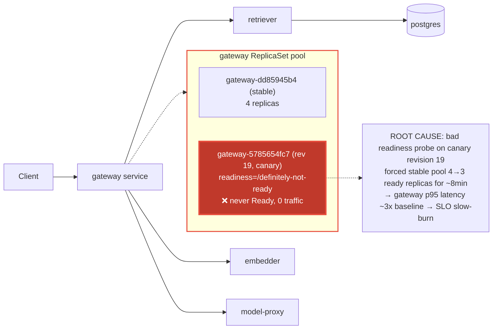

# Postmortem: gateway latency error budget burning slowly (10% of the 28d budget in 6h; 30m & 6h windows)

- **Status:** open
- **Severity:** sev2
- **Verified:** no
- **Opened:** 2026-08-04 18:48:47Z
- **Resolved:** (still open)

## Timeline (machine-generated)

All times UTC on 2026-08-04 unless a full date is shown.

| Time (UTC) | Source | Event |
| --- | --- | --- |
| 18:30:05Z | k8s | Rollout/gateway: RolloutUpdated |
| 18:30:05Z | k8s | Rollout/gateway: RolloutNotCompleted |
| 18:30:05Z | k8s | Rollout/gateway: NewReplicaSetCreated |
| 18:30:06Z | k8s | Pod/gateway-dd85945b4-jfd54: Killing |
| 18:30:06Z | k8s | ReplicaSet/gateway-dd85945b4: SuccessfulDelete |
| 18:30:06Z | k8s | Rollout/gateway: ScalingReplicaSet |
| 18:30:07Z | k8s | ReplicaSet/gateway-5785654fc7: SuccessfulCreate |
| 18:30:07Z | k8s | Pod/gateway-5785654fc7-p97mq: Scheduled |
| 18:30:10Z | k8s | Pod/gateway-5785654fc7-p97mq: Started |
| 18:30:10Z | k8s | Pod/gateway-5785654fc7-p97mq: Pulled |
| 18:30:10Z | k8s | Pod/gateway-5785654fc7-p97mq: Created |
| 18:30:16Z | k8s | Pod/gateway-5785654fc7-p97mq: Unhealthy |
| 18:30:21Z | k8s | Pod/gateway-5785654fc7-p97mq: Unhealthy |
| 18:30:26Z | k8s | Pod/gateway-5785654fc7-p97mq: Unhealthy |
| 18:30:31Z | k8s | Pod/gateway-5785654fc7-p97mq: Unhealthy |
| 18:30:36Z | k8s | Pod/gateway-5785654fc7-p97mq: Unhealthy |
| 18:30:41Z | k8s | Pod/gateway-5785654fc7-p97mq: Unhealthy |
| 18:30:46Z | k8s | Pod/gateway-5785654fc7-p97mq: Unhealthy |
| 18:30:51Z | k8s | Pod/gateway-5785654fc7-p97mq: Unhealthy |
| 18:30:56Z | k8s | Pod/gateway-5785654fc7-p97mq: Unhealthy |
| 18:31:01Z | k8s | Pod/gateway-5785654fc7-p97mq: Unhealthy |
| 18:31:06Z | k8s | Pod/gateway-5785654fc7-p97mq: Unhealthy |
| 18:31:11Z | k8s | Pod/gateway-5785654fc7-p97mq: Unhealthy |
| 18:31:16Z | k8s | Pod/gateway-5785654fc7-p97mq: Unhealthy |
| 18:31:21Z | k8s | Pod/gateway-5785654fc7-p97mq: Unhealthy |
| 18:31:25Z | k8s | Pod/gateway-5785654fc7-p97mq: Unhealthy |
| 18:31:30Z | k8s | Pod/gateway-5785654fc7-p97mq: Unhealthy |
| 18:31:35Z | k8s | Pod/gateway-5785654fc7-p97mq: Unhealthy |
| 18:31:40Z | k8s | Pod/gateway-5785654fc7-p97mq: Unhealthy |
| 18:31:45Z | k8s | Pod/gateway-5785654fc7-p97mq: Unhealthy |
| 18:31:50Z | k8s | Pod/gateway-5785654fc7-p97mq: Unhealthy |
| 18:31:55Z | k8s | Pod/gateway-5785654fc7-p97mq: Unhealthy |
| 18:32:00Z | k8s | Pod/gateway-5785654fc7-p97mq: Unhealthy |
| 18:32:05Z | k8s | Pod/gateway-5785654fc7-p97mq: Unhealthy |
| 18:32:10Z | k8s | Pod/gateway-5785654fc7-p97mq: Unhealthy |
| 18:32:15Z | k8s | Pod/gateway-5785654fc7-p97mq: Unhealthy |
| 18:35:19Z | k8s | Pod/gateway-5785654fc7-p97mq: Unhealthy |
| 18:38:48Z | k8s | Rollout/gateway: SkipSteps |
| 18:38:48Z | k8s | Rollout/gateway: RolloutUpdated |
| 18:38:49Z | k8s | Pod/gateway-5785654fc7-p97mq: Killing |
| 18:38:49Z | k8s | ReplicaSet/gateway-5785654fc7: SuccessfulDelete |
| 18:38:49Z | k8s | Rollout/gateway: ScalingReplicaSet |
| 18:38:50Z | k8s | ReplicaSet/gateway-dd85945b4: SuccessfulCreate |
| 18:38:50Z | k8s | Rollout/gateway: ScalingReplicaSet |
| 18:38:50Z | k8s | Pod/gateway-dd85945b4-mm7jm: Scheduled |
| 18:38:53Z | k8s | Pod/gateway-dd85945b4-mm7jm: Started |
| 18:38:53Z | k8s | Pod/gateway-dd85945b4-mm7jm: Pulled |
| 18:38:53Z | k8s | Pod/gateway-dd85945b4-mm7jm: Created |
| 18:48:10Z | alert | alert firing: SLO gateway latency — slow burn |

## Evidence links

- [Loki — logs over the incident window](http://localhost:3001/explore?schemaVersion=1&panes=%7B%22pm%22%3A+%7B%22datasource%22%3A+%22loki%22%2C+%22queries%22%3A+%5B%7B%22refId%22%3A+%22A%22%2C+%22datasource%22%3A+%7B%22type%22%3A+%22loki%22%2C+%22uid%22%3A+%22loki%22%7D%2C+%22expr%22%3A+%22%7Bnamespace%3D%5C%22subject%5C%22%7D+%7C~+%5C%22%28%3Fi%29error%7Cfailed%5C%22%22%7D%5D%2C+%22range%22%3A+%7B%22from%22%3A+%221785869327189%22%2C+%22to%22%3A+%221785869668837%22%7D%7D%7D&orgId=1)
- [Mimir — metrics over the incident window](http://localhost:3001/explore?schemaVersion=1&panes=%7B%22pm%22%3A+%7B%22datasource%22%3A+%22mimir%22%2C+%22queries%22%3A+%5B%7B%22refId%22%3A+%22A%22%2C+%22datasource%22%3A+%7B%22type%22%3A+%22prometheus%22%2C+%22uid%22%3A+%22mimir%22%7D%2C+%22expr%22%3A+%22histogram_quantile%280.95%2C+sum%28rate%28http_server_duration_milliseconds_bucket%5B5m%5D%29%29+by+%28le%29%29%22%7D%5D%2C+%22range%22%3A+%7B%22from%22%3A+%221785869327189%22%2C+%22to%22%3A+%221785869668837%22%7D%7D%7D&orgId=1)

## Investigation context

**Runbook match:** none — no tool narrowing applied for this alert. Available runbooks: README.md, canary-abort.md, ci-pipeline-red.md, dq-freshness-stall.md, gateway-high-error-rate.md, k8s-crashloop.md, k8s-node-failure.md, snapshot-agent-audit.md, stale-secret.md

Pre-check battery (as injected at run start)

## Pre-check leads

### recent_deploys — LEAD
No deploy in the last 60m — rule out the reflex answer.
- No deploy in the last 60m — rule out the reflex answer.

### kube_scan — LEAD
17 kube-scan leads
- event Pod/gateway-5785654fc7-p97mq: Unhealthy — Readiness probe failed: HTTP probe failed with statuscode: 404 (at 20:31:01)
- event Pod/gateway-5785654fc7-p97mq: Unhealthy — Readiness probe failed: HTTP probe failed with statuscode: 404 (at 20:31:06)
- event Pod/gateway-5785654fc7-p97mq: Unhealthy — Readiness probe failed: HTTP probe failed with statuscode: 404 (at 20:31:11)
- event Pod/gateway-5785654fc7-p97mq: Unhealthy — Readiness probe failed: HTTP probe failed with statuscode: 404 (at 20:31:16)
- event Pod/gateway-5785654fc7-p97mq: Unhealthy — Readiness probe failed: HTTP probe failed with statuscode: 404 (at 20:31:21)
- event Pod/gateway-5785654fc7-p97mq: Unhealthy — Readiness probe failed: HTTP probe failed with statuscode: 404 (at 20:31:25
… (section truncated)

### log_spike — OK
error/failed log rate normal: 2/10min vs baseline 0/10min

### rollout_state — OK
gateway and model-proxy rollouts stable, no failed analysis

### secret_age — OK
Secret subject-db-credentials last modified 10d 19h ago (created 10d 19h ago).

## Narrative

## Summary

`SLO gateway latency — slow burn` fired (sev2, tenant acme): the gateway p95 latency SLO burned ~10% of its 28-day error budget inside a 6h window. Root cause was a bad Argo Rollout canary revision for `gateway` whose pod template had a readiness probe pointed at a nonexistent path, which starved the stable pool of one replica for several minutes and pushed p95 latency to ~3x baseline. The system self-healed (Argo reconciled the Rollout back to the good template) before this investigation began; live health is fully recovered, but the burn-rate alert is still reporting active because it reflects budget already spent in its lookback window, not current state.

## Impact

For roughly 8 minutes, the `gateway` deployment ran with only 3/4 replicas Ready (one replica permanently stuck `Unhealthy` on its readiness probe and never receiving traffic), reducing serving capacity by 25%. `POST /v1/chat` p95 latency (from `traces_spanmetrics_latency_bucket`) rose from a ~3.99ms baseline to a peak of ~12.1ms (~3x) during that window, which was enough to burn 10% of the 28-day gateway-latency SLO budget as measured by the 30m/6h multi-window burn-rate rule. No error-rate impact — this was a pure capacity/latency effect, not failed requests (the broken-probe pod never got traffic since it never passed readiness).

## Root cause

`kubectl describe rs gateway-5785654fc7` (Argo Rollout revision 19, `rollouts.argoproj.io/revision: 19`) showed:
- Liveness: `http-get http://:http/health`
- Readiness: `http-get http://:http/definitely-not-ready` ← nonexistent path

This ReplicaSet was created at rollout-update time (`Rollout/gateway` event `RolloutUpdated` → "started update to revision 19 (5785654fc7)"), which simultaneously scaled the stable ReplicaSet (`gateway-dd85945b4`) down from 4→3 to make room for the incoming canary pod. The canary pod (`gateway-5785654fc7-p97mq`) then failed its readiness probe with HTTP 404 every 5 seconds continuously (60+ consecutive failures in the k8s event stream) because `/definitely-not-ready` doesn't exist on the gateway app, so it never became Ready and never joined the service endpoints — leaving the fleet running at 3 ready replicas instead of 4 for the duration.

Notably, the image tag was unchanged (`obs-registry:5010/gateway:10f24bc` on both the stable and canary ReplicaSets) — this was a pod-template/probe-spec change, not an application code deploy. `deploy_history` and Argo's own sync history show no gitops commit or Argo sync operation around this time (`argo_app` last synced revision `bb634a3cd9c3` on 2026-08-02), meaning the Rollout's pod template was mutated out-of-band from the normal CI→gitops→Argo path. Argo's continuous reconciliation against the git-defined spec subsequently restored the correct template (visible as a new revision 20 reusing the original `dd85945b4` pod-template-hash), which is why by the time this investigation started the rollout already showed `phase: Healthy`, `stableHash == canaryHash == dd85945b4`, and 4/4 ready replicas — confirmed live via `kubectl get pods -l app=gateway` (4 Running/Ready, one only 14m old) and a p95 latency instant query back at 3.9936ms baseline.

## What fixed it

Nothing manual was required — the fault was already reverted (capacity restored to 4/4, latency back to baseline) by the time of investigation, most likely via Argo CD's self-heal reconciling the out-of-band probe-path drift back to the git-defined pod template.

Two candidate remediations were dry-run and both rejected on evidence rather than executed:
- `rollout_undo` (dry-run diff: "revision 20 → revision 19") — **rejected**: revision 19 *is* the broken-probe canary, so undoing here would actively reintroduce the fault.
- `rollout_abort` (dry-run diff: "phase=Healthy step=4/4 aborted=False") — **rejected as a no-op**: there is no canary in progress to abort.

No mutating action was executed. The alert remains `active` per `alert_status` because the 30m/6h burn-rate windows still contain the historical spike; that will clear on its own as the window ages past the incident, since there is no tool available to retroactively un-burn an already-consumed SLO budget.

## Lessons

- The pod-template drift (readiness probe path) that created revision 19 did not correspond to any CI run, gitops commit, or Argo sync operation — it bypassed the normal delivery path entirely. Worth alerting on Rollout spec drift detected outside of Argo sync operations, since it's currently only visible via `kubectl describe rs`/rollout revision history.
- `rollout_undo`'s "previous revision" is whatever the Rollout controller's history says was previous, which can itself be a bad revision (as here) — **always dry-run and read the diff before trusting "undo" to mean "roll back to good."**
- No runbook currently matches `SLO gateway latency — slow burn` by exact alertname (`runbook_lookup` returned no match); `canary-abort.md` was the closest applicable guidance (matched on `rollout-stuck`) and its diagnostic steps (rollout_status → analysisrun_get → deploy_history → gitea_compare) transferred well even though this alert's trigger condition differs. Consider adding this alertname to `canary-abort.md`'s matched triggers, since "bad canary readiness probe reduces stable capacity" is exactly the failure mode it already documents mitigation for.
- No `AnalysisRun` was ever created for revision 19 — the canary never got far enough (never passed readiness) to enter analysis, consistent with the runbook's note that "an AnalysisRun stuck Inconclusive with no measurements means the canary never got traffic (a readiness problem, not a quality regression)."

