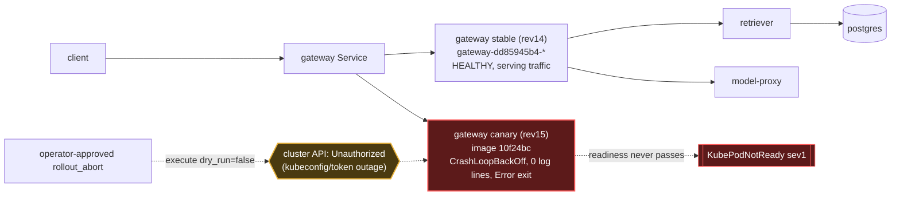

# Postmortem: subject/gateway-55bbf6bfbf-4qgg4 has been not-ready for 4 minutes (readiness probe or startup trouble)

- **Status:** open
- **Severity:** sev1
- **Verified:** no
- **Opened:** 2026-08-04 01:03:27Z
- **Resolved:** (still open)

## Timeline (machine-generated)

All times UTC on 2026-08-04 unless a full date is shown.

| Time (UTC) | Source | Event |
| --- | --- | --- |
| 00:58:20Z | k8s | Pod/gateway-dd85945b4-c5xbb: Killing |
| 00:58:20Z | k8s | ReplicaSet/gateway-dd85945b4: SuccessfulDelete |
| 00:58:20Z | k8s | Rollout/gateway: ScalingReplicaSet |
| 00:58:20Z | k8s | Rollout/gateway: RolloutUpdated |
| 00:58:20Z | k8s | Rollout/gateway: RolloutNotCompleted |
| 00:58:21Z | k8s | ReplicaSet/gateway-55bbf6bfbf: SuccessfulCreate |
| 00:58:21Z | k8s | Pod/gateway-55bbf6bfbf-4qgg4: Scheduled |
| 00:58:23Z | k8s | Pod/gateway-55bbf6bfbf-4qgg4: Started |
| 00:58:23Z | k8s | Pod/gateway-55bbf6bfbf-4qgg4: Pulled |
| 00:58:23Z | k8s | Pod/gateway-55bbf6bfbf-4qgg4: Created |
| 00:58:25Z | k8s | Pod/gateway-55bbf6bfbf-4qgg4: Started |
| 00:58:25Z | k8s | Pod/gateway-55bbf6bfbf-4qgg4: Pulled |
| 00:58:25Z | k8s | Pod/gateway-55bbf6bfbf-4qgg4: Created |
| 00:58:27Z | k8s | Pod/gateway-55bbf6bfbf-4qgg4: BackOff |
| 00:58:28Z | k8s | Pod/gateway-55bbf6bfbf-4qgg4: BackOff |
| 00:58:31Z | k8s | Pod/gateway-55bbf6bfbf-4qgg4: BackOff |
| 00:58:37Z | k8s | Pod/gateway-55bbf6bfbf-4qgg4: Started |
| 00:58:37Z | k8s | Pod/gateway-55bbf6bfbf-4qgg4: Pulled |
| 00:58:37Z | k8s | Pod/gateway-55bbf6bfbf-4qgg4: Created |
| 00:58:39Z | k8s | Pod/gateway-55bbf6bfbf-4qgg4: BackOff |
| 00:58:40Z | k8s | Pod/gateway-55bbf6bfbf-4qgg4: BackOff |
| 00:58:41Z | k8s | Pod/gateway-55bbf6bfbf-4qgg4: BackOff |
| 00:59:03Z | k8s | Pod/gateway-55bbf6bfbf-4qgg4: Started |
| 00:59:03Z | k8s | Pod/gateway-55bbf6bfbf-4qgg4: Pulled |
| 00:59:03Z | k8s | Pod/gateway-55bbf6bfbf-4qgg4: Created |
| 00:59:05Z | k8s | Pod/gateway-55bbf6bfbf-4qgg4: BackOff |
| 00:59:06Z | k8s | Pod/gateway-55bbf6bfbf-4qgg4: BackOff |
| 00:59:11Z | k8s | Pod/gateway-55bbf6bfbf-4qgg4: BackOff |
| 00:59:57Z | k8s | Pod/gateway-55bbf6bfbf-4qgg4: Started |
| 00:59:57Z | k8s | Pod/gateway-55bbf6bfbf-4qgg4: Pulled |
| 00:59:57Z | k8s | Pod/gateway-55bbf6bfbf-4qgg4: Created |
| 00:59:59Z | k8s | Pod/gateway-55bbf6bfbf-4qgg4: BackOff |
| 01:00:00Z | k8s | Pod/gateway-55bbf6bfbf-4qgg4: BackOff |
| 01:00:01Z | k8s | Pod/gateway-55bbf6bfbf-4qgg4: BackOff |
| 01:01:16Z | k8s | Pod/gateway-55bbf6bfbf-4qgg4: BackOff |
| 01:01:19Z | k8s | Pod/gateway-55bbf6bfbf-4qgg4: Started |
| 01:01:19Z | k8s | Pod/gateway-55bbf6bfbf-4qgg4: Pulled |
| 01:01:19Z | k8s | Pod/gateway-55bbf6bfbf-4qgg4: Created |
| 01:01:21Z | k8s | Pod/gateway-55bbf6bfbf-4qgg4: BackOff |
| 01:01:22Z | k8s | Pod/gateway-55bbf6bfbf-4qgg4: BackOff |
| 01:01:31Z | k8s | Pod/gateway-55bbf6bfbf-4qgg4: BackOff |
| 01:02:50Z | alert | alert firing: KubePodNotReady |
| 01:02:58Z | k8s | Pod/gateway-55bbf6bfbf-4qgg4: BackOff |
| 01:04:24Z | k8s | Pod/gateway-55bbf6bfbf-4qgg4: Started |
| 01:04:24Z | k8s | Pod/gateway-55bbf6bfbf-4qgg4: Pulled |
| 01:04:24Z | k8s | Pod/gateway-55bbf6bfbf-4qgg4: Created |
| 01:04:26Z | k8s | Pod/gateway-55bbf6bfbf-4qgg4: BackOff |
| 01:04:27Z | k8s | Pod/gateway-55bbf6bfbf-4qgg4: BackOff |
| 01:04:31Z | k8s | Pod/gateway-55bbf6bfbf-4qgg4: BackOff |
| 01:05:46Z | k8s | Pod/gateway-55bbf6bfbf-4qgg4: BackOff |
| 01:06:35Z | k8s | Rollout/gateway: SkipSteps |
| 01:06:35Z | k8s | Rollout/gateway: RolloutUpdated |
| 01:06:36Z | k8s | ReplicaSet/gateway-dd85945b4: SuccessfulCreate |
| 01:06:36Z | k8s | ReplicaSet/gateway-55bbf6bfbf: SuccessfulDelete |
| 01:06:36Z | k8s | Rollout/gateway: ScalingReplicaSet |
| 01:06:36Z | k8s | Pod/gateway-dd85945b4-pwg4s: Scheduled |
| 01:06:39Z | k8s | Pod/gateway-dd85945b4-pwg4s: Started |
| 01:06:39Z | k8s | Pod/gateway-dd85945b4-pwg4s: Pulled |
| 01:06:39Z | k8s | Pod/gateway-dd85945b4-pwg4s: Created |

## Evidence links

- [Loki — logs over the incident window](http://localhost:3001/explore?schemaVersion=1&panes=%7B%22pm%22%3A+%7B%22datasource%22%3A+%22loki%22%2C+%22queries%22%3A+%5B%7B%22refId%22%3A+%22A%22%2C+%22datasource%22%3A+%7B%22type%22%3A+%22loki%22%2C+%22uid%22%3A+%22loki%22%7D%2C+%22expr%22%3A+%22%7Bnamespace%3D%5C%22subject%5C%22%7D+%7C~+%5C%22%28%3Fi%29error%7Cfailed%5C%22%22%7D%5D%2C+%22range%22%3A+%7B%22from%22%3A+%221785805407286%22%2C+%22to%22%3A+%221785805683424%22%7D%7D%7D&orgId=1)
- [Mimir — metrics over the incident window](http://localhost:3001/explore?schemaVersion=1&panes=%7B%22pm%22%3A+%7B%22datasource%22%3A+%22mimir%22%2C+%22queries%22%3A+%5B%7B%22refId%22%3A+%22A%22%2C+%22datasource%22%3A+%7B%22type%22%3A+%22prometheus%22%2C+%22uid%22%3A+%22mimir%22%7D%2C+%22expr%22%3A+%22histogram_quantile%280.95%2C+sum%28rate%28http_server_duration_milliseconds_bucket%5B5m%5D%29%29+by+%28le%29%29%22%7D%5D%2C+%22range%22%3A+%7B%22from%22%3A+%221785805407286%22%2C+%22to%22%3A+%221785805683424%22%7D%7D%7D&orgId=1)

## Investigation context

**Runbook match:** none — no tool narrowing applied for this alert. Available runbooks: README.md, canary-abort.md, ci-pipeline-red.md, dq-freshness-stall.md, gateway-high-error-rate.md, k8s-crashloop.md, k8s-node-failure.md, snapshot-agent-audit.md, stale-secret.md

Pre-check battery (as injected at run start)

## Pre-check leads

### recent_deploys — LEAD
No deploy in the last 60m — rule out the reflex answer.
- No deploy in the last 60m — rule out the reflex answer.

### log_spike — OK
error/failed log rate normal: 200/10min vs baseline 500/10min

### kube_scan — UNAVAILABLE
error: You must be logged in to the server (Unauthorized)

### rollout_state — UNAVAILABLE
gateway: E0804 03:03:28.567839   31900 memcache.go:265] "Unhandled Error" err="couldn't get current server API group list: the server has asked for the client to provide credentials"
E0804 03:03:28.786171   31900 memcache.go:265] "Unhandled Error" err="couldn't get current server API group list: the server has asked for the client to provide credentials"
E0804 03:03:28.934271   31900 memcache.go:265] "Unhandled Error" err="couldn't get current server API group list: the server has asked for the client to; gateway analysis: E0804 03:03:28.573589   37628 memcache.go:265] "Unhandled Error" err="couldn't get current server API group list: the server has asked for the client to provide credentials"
E0804 03:03:28.807375   37628 memcache.go:265] "Unhandled Error"
… (section truncated)

### secret_age — UNAVAILABLE
error: You must be logged in to the server (Unauthorized)

## Narrative

## Summary
KubePodNotReady (sev1) fired for `gateway-55bbf6bfbf-4qgg4`. The Argo Rollout for `gateway` had advanced to a new revision (revision 15, ReplicaSet `gateway-55bbf6bfbf`, image `obs-registry:5010/gateway:10f24bc`), scaling that canary pod up from 0→1 while scaling the stable ReplicaSet (`gateway-dd85945b4`, revision 14) down. The canary container has been stuck in CrashLoopBackOff ever since, never passing readiness.

## Impact
Canary-only: the stable revision 14 pods (`gateway-dd85945b4-*`) kept serving traffic throughout, and the log-spike precheck confirmed the gateway error/failed log rate stayed at or below baseline. No customer-facing error-rate impact was observed. The impact is a stuck/broken canary rollout and a firing sev1 pod-readiness alert, not a service outage.

## Root cause
`kube_pod_container_status_last_terminated_reason` for the canary pod reports `Error`, restart count climbed steadily (1→6 restarts inside ~8 minutes, confirmed via `kube_pod_container_status_restarts_total`, see chart), and `k8s_events` shows a continuous Started→BackOff loop. Crucially, a Loki query scoped to that exact pod (`{namespace="subject", pod=~"gateway-55bbf6bfbf.*"}`) returned **zero log lines** in a 10–15 minute window, while the stable pods next to it were logging normally (`chat completed`, etc.) — the canary container is dying before it can even initialize its logger/OTel pipeline, i.e. an immediate startup failure, not a runtime error, OOM (no OOMKilled reason/memory-limit metric fired), or probe misconfiguration under load.

`gitea_compare` shows image tag `10f24bc` sits 120 commits behind current `main` — it is a stale/old build, not the latest source. I could not pin the exact defective line: the commits between `10f24bc` and `main` visible to me were dominated by auto-published postmortem markdown files rather than an obvious gateway source change, and I was unable to inspect the Rollout spec or the container's own stderr/exit code directly because — for the entire back half of this investigation — every Kubernetes-API-backed tool (`kubectl_read`, `argo_app`, `rollout_status`, `analysisrun_get`, and ultimately the remediation writes themselves) returned `Unauthorized`. That credential outage is a separate, compounding fact of this incident, not the root cause of the pod crash-loop itself.

## What fixed it
Diagnosis pointed to aborting the stuck Argo Rollout canary (`status.abort=true`) to fall back fully to the healthy stable revision 14. This was dry-run (action recorded, action_id `01301dff11d186e1`) and approved by the operator. However, **execution failed twice in a row** with `Unauthorized` from the cluster API — confirmed not specific to this action by dry-running an unrelated remediation (`scale_deployment`), which hit the identical `Unauthorized` error reading live replica state. This is a cluster-wide credential/kubeconfig outage for the remediation identity, and it blocked the fix from being applied. **The incident is NOT resolved** — `alert_status` was re-queried after both execution attempts and still reports `KubePodNotReady` active.

## Lessons
- The on-call automation's cluster credentials went bad mid-incident and silently degraded every read *and* write path (pod describe, rollout status, analysis runs, and the approved remediation itself all failed identically). This needs its own independent health check/alert — an on-call agent that can approve and "execute" a fix that silently no-ops on auth failure is worse than one that can't remediate at all.
- No runbook matched `KubePodNotReady` — worth authoring one that says: check the Argo Rollout's ReplicaSet history first and separate stable vs. canary pods before generic pod-not-ready triage; a canary stuck at 0 successful starts should be distinguishable at a glance.
- Consider an AnalysisRun/step gate that aborts a canary automatically after N consecutive crash-loop restarts with zero log output, rather than letting it sit in BackOff until a human (or blocked agent) intervenes.
- Human follow-up required: manually verify/execute the Rollout abort (or `kubectl argo rollouts abort gateway -n subject`) once cluster credentials are restored, and rotate/refresh the on-call agent's kubeconfig token.

