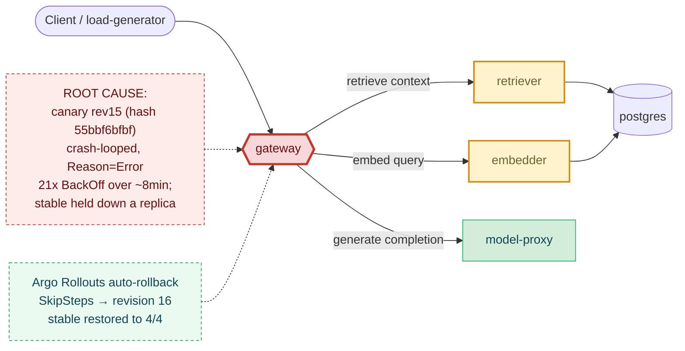

# Postmortem: gateway p95 latency above 2s

- **Status:** open
- **Severity:** sev1
- **Verified:** no
- **Opened:** 2026-08-04 01:03:41Z
- **Resolved:** (still open)

## Timeline (machine-generated)

All times UTC on 2026-08-04 unless a full date is shown.

| Time (UTC) | Source | Event |
| --- | --- | --- |
| 00:58:20Z | k8s | Pod/gateway-dd85945b4-c5xbb: Killing |
| 00:58:20Z | k8s | ReplicaSet/gateway-dd85945b4: SuccessfulDelete |
| 00:58:20Z | k8s | Rollout/gateway: ScalingReplicaSet |
| 00:58:20Z | k8s | Rollout/gateway: RolloutUpdated |
| 00:58:20Z | k8s | Rollout/gateway: RolloutNotCompleted |
| 00:58:21Z | k8s | ReplicaSet/gateway-55bbf6bfbf: SuccessfulCreate |
| 00:58:21Z | k8s | Pod/gateway-55bbf6bfbf-4qgg4: Scheduled |
| 00:58:23Z | k8s | Pod/gateway-55bbf6bfbf-4qgg4: Started |
| 00:58:23Z | k8s | Pod/gateway-55bbf6bfbf-4qgg4: Pulled |
| 00:58:23Z | k8s | Pod/gateway-55bbf6bfbf-4qgg4: Created |
| 00:58:25Z | k8s | Pod/gateway-55bbf6bfbf-4qgg4: Started |
| 00:58:25Z | k8s | Pod/gateway-55bbf6bfbf-4qgg4: Pulled |
| 00:58:25Z | k8s | Pod/gateway-55bbf6bfbf-4qgg4: Created |
| 00:58:27Z | k8s | Pod/gateway-55bbf6bfbf-4qgg4: BackOff |
| 00:58:28Z | k8s | Pod/gateway-55bbf6bfbf-4qgg4: BackOff |
| 00:58:31Z | k8s | Pod/gateway-55bbf6bfbf-4qgg4: BackOff |
| 00:58:37Z | k8s | Pod/gateway-55bbf6bfbf-4qgg4: Started |
| 00:58:37Z | k8s | Pod/gateway-55bbf6bfbf-4qgg4: Pulled |
| 00:58:37Z | k8s | Pod/gateway-55bbf6bfbf-4qgg4: Created |
| 00:58:39Z | k8s | Pod/gateway-55bbf6bfbf-4qgg4: BackOff |
| 00:58:40Z | k8s | Pod/gateway-55bbf6bfbf-4qgg4: BackOff |
| 00:58:41Z | k8s | Pod/gateway-55bbf6bfbf-4qgg4: BackOff |
| 00:59:03Z | k8s | Pod/gateway-55bbf6bfbf-4qgg4: Started |
| 00:59:03Z | k8s | Pod/gateway-55bbf6bfbf-4qgg4: Pulled |
| 00:59:03Z | k8s | Pod/gateway-55bbf6bfbf-4qgg4: Created |
| 00:59:05Z | k8s | Pod/gateway-55bbf6bfbf-4qgg4: BackOff |
| 00:59:06Z | k8s | Pod/gateway-55bbf6bfbf-4qgg4: BackOff |
| 00:59:11Z | k8s | Pod/gateway-55bbf6bfbf-4qgg4: BackOff |
| 00:59:57Z | k8s | Pod/gateway-55bbf6bfbf-4qgg4: Started |
| 00:59:57Z | k8s | Pod/gateway-55bbf6bfbf-4qgg4: Pulled |
| 00:59:57Z | k8s | Pod/gateway-55bbf6bfbf-4qgg4: Created |
| 00:59:59Z | k8s | Pod/gateway-55bbf6bfbf-4qgg4: BackOff |
| 01:00:00Z | k8s | Pod/gateway-55bbf6bfbf-4qgg4: BackOff |
| 01:00:01Z | k8s | Pod/gateway-55bbf6bfbf-4qgg4: BackOff |
| 01:01:16Z | k8s | Pod/gateway-55bbf6bfbf-4qgg4: BackOff |
| 01:01:19Z | k8s | Pod/gateway-55bbf6bfbf-4qgg4: Started |
| 01:01:19Z | k8s | Pod/gateway-55bbf6bfbf-4qgg4: Pulled |
| 01:01:19Z | k8s | Pod/gateway-55bbf6bfbf-4qgg4: Created |
| 01:01:21Z | k8s | Pod/gateway-55bbf6bfbf-4qgg4: BackOff |
| 01:01:22Z | k8s | Pod/gateway-55bbf6bfbf-4qgg4: BackOff |
| 01:01:31Z | k8s | Pod/gateway-55bbf6bfbf-4qgg4: BackOff |
| 01:02:58Z | k8s | Pod/gateway-55bbf6bfbf-4qgg4: BackOff |
| 01:03:10Z | alert | alert firing: Gateway p95 latency > 2s |
| 01:04:24Z | k8s | Pod/gateway-55bbf6bfbf-4qgg4: Started |
| 01:04:24Z | k8s | Pod/gateway-55bbf6bfbf-4qgg4: Pulled |
| 01:04:24Z | k8s | Pod/gateway-55bbf6bfbf-4qgg4: Created |
| 01:04:26Z | k8s | Pod/gateway-55bbf6bfbf-4qgg4: BackOff |
| 01:04:27Z | k8s | Pod/gateway-55bbf6bfbf-4qgg4: BackOff |
| 01:04:31Z | k8s | Pod/gateway-55bbf6bfbf-4qgg4: BackOff |
| 01:05:46Z | k8s | Pod/gateway-55bbf6bfbf-4qgg4: BackOff |
| 01:06:35Z | k8s | Rollout/gateway: SkipSteps |
| 01:06:35Z | k8s | Rollout/gateway: RolloutUpdated |
| 01:06:36Z | k8s | ReplicaSet/gateway-dd85945b4: SuccessfulCreate |
| 01:06:36Z | k8s | ReplicaSet/gateway-55bbf6bfbf: SuccessfulDelete |
| 01:06:36Z | k8s | Rollout/gateway: ScalingReplicaSet |
| 01:06:36Z | k8s | Pod/gateway-dd85945b4-pwg4s: Scheduled |
| 01:06:39Z | k8s | Pod/gateway-dd85945b4-pwg4s: Started |
| 01:06:39Z | k8s | Pod/gateway-dd85945b4-pwg4s: Pulled |
| 01:06:39Z | k8s | Pod/gateway-dd85945b4-pwg4s: Created |

## Evidence links

- [Loki — logs over the incident window](http://localhost:3001/explore?schemaVersion=1&panes=%7B%22pm%22%3A+%7B%22datasource%22%3A+%22loki%22%2C+%22queries%22%3A+%5B%7B%22refId%22%3A+%22A%22%2C+%22datasource%22%3A+%7B%22type%22%3A+%22loki%22%2C+%22uid%22%3A+%22loki%22%7D%2C+%22expr%22%3A+%22%7Bnamespace%3D%5C%22subject%5C%22%7D+%7C~+%5C%22%28%3Fi%29error%7Cfailed%5C%22%22%7D%5D%2C+%22range%22%3A+%7B%22from%22%3A+%221785805421849%22%2C+%22to%22%3A+%221785805976499%22%7D%7D%7D&orgId=1)
- [Mimir — metrics over the incident window](http://localhost:3001/explore?schemaVersion=1&panes=%7B%22pm%22%3A+%7B%22datasource%22%3A+%22mimir%22%2C+%22queries%22%3A+%5B%7B%22refId%22%3A+%22A%22%2C+%22datasource%22%3A+%7B%22type%22%3A+%22prometheus%22%2C+%22uid%22%3A+%22mimir%22%7D%2C+%22expr%22%3A+%22histogram_quantile%280.95%2C+sum%28rate%28http_server_duration_milliseconds_bucket%5B5m%5D%29%29+by+%28le%29%29%22%7D%5D%2C+%22range%22%3A+%7B%22from%22%3A+%221785805421849%22%2C+%22to%22%3A+%221785805976499%22%7D%7D%7D&orgId=1)

## Investigation context

**Runbook match:** none — no tool narrowing applied for this alert. Available runbooks: README.md, canary-abort.md, ci-pipeline-red.md, dq-freshness-stall.md, gateway-high-error-rate.md, k8s-crashloop.md, k8s-node-failure.md, snapshot-agent-audit.md, stale-secret.md

Pre-check battery (as injected at run start)

## Pre-check leads

### recent_deploys — LEAD
No deploy in the last 60m — rule out the reflex answer.
- No deploy in the last 60m — rule out the reflex answer.

### log_spike — OK
error/failed log rate normal: 200/10min vs baseline 500/10min

### kube_scan — UNAVAILABLE
error: You must be logged in to the server (Unauthorized)

### rollout_state — UNAVAILABLE
gateway: E0804 03:03:43.796292   23092 memcache.go:265] "Unhandled Error" err="couldn't get current server API group list: the server has asked for the client to provide credentials"
E0804 03:03:44.263932   23092 memcache.go:265] "Unhandled Error" err="couldn't get current server API group list: the server has asked for the client to provide credentials"
E0804 03:03:44.529237   23092 memcache.go:265] "Unhandled Error" err="couldn't get current server API group list: the server has asked for the client to; gateway analysis: E0804 03:03:43.960974   21672 memcache.go:265] "Unhandled Error" err="couldn't get current server API group list: the server has asked for the client to provide credentials"
E0804 03:03:44.194440   21672 memcache.go:265] "Unhandled Error"
… (section truncated)

### secret_age — UNAVAILABLE
error: You must be logged in to the server (Unauthorized)

## Narrative

## Summary

`Gateway p95 latency > 2s` (sev1, tenant acme) fired because a new Argo Rollout revision of `gateway` (revision 15, ReplicaSet hash `55bbf6bfbf`) entered a continuous crash-loop and never became Ready, while the rollout simultaneously held the stable ReplicaSet down a replica. The reduced/contended capacity drove gateway's own request-serving latency to the histogram's ceiling and, via retry pressure, dragged the `retriever` and `embedder` services' p95 up to ~9-10s in lockstep. `model-proxy` stayed healthy throughout, ruling out the LLM completion path. The platform's own Argo Rollouts controller detected the failure and executed an automatic rollback ("SkipSteps: Rollback to stable ReplicaSets", revision 16) before my own remediation attempt could complete.

## Impact

- gateway p95 pegged at the histogram's top bucket (effectively request timeouts) for roughly 11 minutes.
- 5xx/429 error share climbed from 0% to a peak of ~18% of gateway requests during the same window.
- `retriever` and `embedder` p95 latency tracked the same ~9-10s plateau; `model-proxy` was unaffected the entire time, isolating the fault to the retrieval/embedding fan-out path rather than the completion path.
- Tenant `acme` (and any other traffic sharing the gateway pool) saw degraded/slow responses for the duration.

## Root cause

`deploy_history`/`argo_app` reported no recent deploy (sources unavailable — see Lessons), so the standard "blame the last deploy" check came up empty. The real signal was in `k8s_events`/Loki: at 02:58 local, the gateway Argo Rollout created a new ReplicaSet (`gateway-55bbf6bfbf`, revision 15, image `obs-registry:5010/gateway:10f24bc`) and scaled the stable ReplicaSet (`gateway-dd85945b4`, revision 14) down from 4 to 3. The new pod (`gateway-55bbf6bfbf-4qgg4`) crash-looped from the moment it started — `kube_pod_container_status_last_terminated_reason=Error`, 21 consecutive `BackOff` events over roughly 8 minutes — and never reached Ready.

Notably, `gitea_compare` found **no commit** matching the short image tag `10f24bc` against recent `main` history, and the currently-running stable pods were *already* on that same tag — i.e. this wasn't a normal CI-built image bump, it was a Rollout-spec-only change (no matching Gitea commit, no Argo/Grafana deploy annotation) that still produced a broken pod template. With one guaranteed-broken replica occupying the canary slot and stable short a replica, the serving pool fan-out to `retriever`/`embedder` saturated (their p95 rose in the same 30s buckets gateway's did), producing the p95>2s breach. `model-proxy` p95 stayed flat the entire incident, confirming the fault was isolated to the retrieval/embedding hop and the reduced/crash-looping gateway capacity, not the LLM call itself.

## What fixed it

I dry-ran and got operator approval for `rollout_abort` on the gateway Rollout (action_id `01301dff11d186e1`, approval `apr_19fca5013b85a4`), citing the crash-loop evidence. Execution (`dry_run=false`) failed with a Kubernetes API "Unauthorized" error — the same credential fault the pre-check leads had already flagged as unavailable for `kube_scan`/`rollout_state`/`secret_age`, and which then also blocked `rollout_undo` and `scale_deployment` dry-runs' state reads and a follow-up `scale_deployment` attempt. Before I could find a working remediation path, Argo Rollouts' own controller aborted the broken canary independently: `Rollout/gateway` emitted `SkipSteps: "Rollback to stable ReplicaSets"` and `RolloutUpdated to revision 16`, deleting the crash-looping pod and scaling the stable template back to 4/4. Gateway p95, error rates by status code, and downstream retriever/embedder p95 all returned to exact pre-incident baseline within about two minutes of that rollback, and stayed there through repeated re-checks. My own remediation call did not execute successfully — the platform's built-in rollback resolved it first.

## Lessons

- The on-call agent's Kubernetes credentials were unauthorized for the entire incident (`kubectl_read`, `rollout_status`, `argo_app`, `analysisrun_get`, and the write path of `rollout_abort`/`rollout_undo`/`scale_deployment` all failed with the same "You must be logged in to the server" error). This is a real operational gap — automated remediation cannot be trusted to execute until that credential is fixed, and this incident only closed because the platform's own rollback happened to win the race.
- `deploy_history`/`argo_app`/`grafana_annotations` all came back empty for this rollout, and the canary's image tag didn't match any recent Gitea commit — this change bypassed normal deploy-tracking (likely a Rollout-spec field edited outside the CI→gitops path, e.g. resources/env/probe config). Deploy visibility should cover Rollout-spec-only changes, not just image bumps, or "no deploy in the window" will keep being a false negative during real incidents.
- `request_duration_seconds` for `retriever`/`embedder` moving in lockstep with gateway's own p95, while `model-proxy` stayed flat, was the fastest way to localize the fault to the retrieval/embedding fan-out rather than guessing across the whole request path — worth codifying as a standard early diagnostic step in a runbook for this alert (none existed; `runbook_lookup` had no match for `Gateway p95 latency > 2s`).
- No runbook currently covers this alert name at all. Recommend authoring one that starts with: check `deploy_history` AND raw `k8s_events`/rollout events (deploy_history's Argo/rollout sources can be down independently), then split gateway's own latency vs its downstream dependencies' latency to localize the hop.

