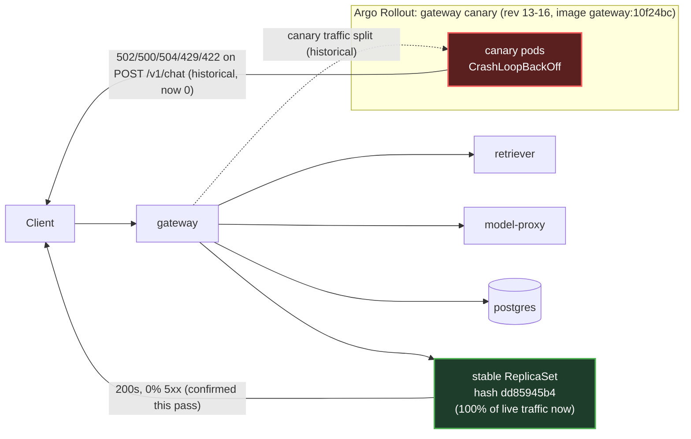

# Postmortem: gateway availability error budget burning slowly (10% of the 28d budget in 6h; 30m & 6h windows)

- **Status:** open
- **Severity:** sev2
- **Verified:** no
- **Opened:** 2026-08-04 01:18:44Z
- **Resolved:** (still open)

## Timeline (machine-generated)

All times UTC on 2026-08-04 unless a full date is shown.

| Time (UTC) | Source | Event |
| --- | --- | --- |
| 00:58:20Z | k8s | Pod/gateway-dd85945b4-c5xbb: Killing |
| 00:58:20Z | k8s | ReplicaSet/gateway-dd85945b4: SuccessfulDelete |
| 00:58:20Z | k8s | Rollout/gateway: ScalingReplicaSet |
| 00:58:20Z | k8s | Rollout/gateway: RolloutUpdated |
| 00:58:20Z | k8s | Rollout/gateway: RolloutNotCompleted |
| 00:58:21Z | k8s | ReplicaSet/gateway-55bbf6bfbf: SuccessfulCreate |
| 00:58:21Z | k8s | Pod/gateway-55bbf6bfbf-4qgg4: Scheduled |
| 00:58:23Z | k8s | Pod/gateway-55bbf6bfbf-4qgg4: Started |
| 00:58:23Z | k8s | Pod/gateway-55bbf6bfbf-4qgg4: Pulled |
| 00:58:23Z | k8s | Pod/gateway-55bbf6bfbf-4qgg4: Created |
| 00:58:25Z | k8s | Pod/gateway-55bbf6bfbf-4qgg4: Started |
| 00:58:25Z | k8s | Pod/gateway-55bbf6bfbf-4qgg4: Pulled |
| 00:58:25Z | k8s | Pod/gateway-55bbf6bfbf-4qgg4: Created |
| 00:58:27Z | k8s | Pod/gateway-55bbf6bfbf-4qgg4: BackOff |
| 00:58:28Z | k8s | Pod/gateway-55bbf6bfbf-4qgg4: BackOff |
| 00:58:31Z | k8s | Pod/gateway-55bbf6bfbf-4qgg4: BackOff |
| 00:58:37Z | k8s | Pod/gateway-55bbf6bfbf-4qgg4: Started |
| 00:58:37Z | k8s | Pod/gateway-55bbf6bfbf-4qgg4: Pulled |
| 00:58:37Z | k8s | Pod/gateway-55bbf6bfbf-4qgg4: Created |
| 00:58:39Z | k8s | Pod/gateway-55bbf6bfbf-4qgg4: BackOff |
| 00:58:40Z | k8s | Pod/gateway-55bbf6bfbf-4qgg4: BackOff |
| 00:58:41Z | k8s | Pod/gateway-55bbf6bfbf-4qgg4: BackOff |
| 00:59:03Z | k8s | Pod/gateway-55bbf6bfbf-4qgg4: Started |
| 00:59:03Z | k8s | Pod/gateway-55bbf6bfbf-4qgg4: Pulled |
| 00:59:03Z | k8s | Pod/gateway-55bbf6bfbf-4qgg4: Created |
| 00:59:05Z | k8s | Pod/gateway-55bbf6bfbf-4qgg4: BackOff |
| 00:59:06Z | k8s | Pod/gateway-55bbf6bfbf-4qgg4: BackOff |
| 00:59:11Z | k8s | Pod/gateway-55bbf6bfbf-4qgg4: BackOff |
| 00:59:57Z | k8s | Pod/gateway-55bbf6bfbf-4qgg4: Started |
| 00:59:57Z | k8s | Pod/gateway-55bbf6bfbf-4qgg4: Pulled |
| 00:59:57Z | k8s | Pod/gateway-55bbf6bfbf-4qgg4: Created |
| 00:59:59Z | k8s | Pod/gateway-55bbf6bfbf-4qgg4: BackOff |
| 01:00:00Z | k8s | Pod/gateway-55bbf6bfbf-4qgg4: BackOff |
| 01:00:01Z | k8s | Pod/gateway-55bbf6bfbf-4qgg4: BackOff |
| 01:01:16Z | k8s | Pod/gateway-55bbf6bfbf-4qgg4: BackOff |
| 01:01:19Z | k8s | Pod/gateway-55bbf6bfbf-4qgg4: Started |
| 01:01:19Z | k8s | Pod/gateway-55bbf6bfbf-4qgg4: Pulled |
| 01:01:19Z | k8s | Pod/gateway-55bbf6bfbf-4qgg4: Created |
| 01:01:21Z | k8s | Pod/gateway-55bbf6bfbf-4qgg4: BackOff |
| 01:01:22Z | k8s | Pod/gateway-55bbf6bfbf-4qgg4: BackOff |
| 01:01:31Z | k8s | Pod/gateway-55bbf6bfbf-4qgg4: BackOff |
| 01:02:58Z | k8s | Pod/gateway-55bbf6bfbf-4qgg4: BackOff |
| 01:04:24Z | k8s | Pod/gateway-55bbf6bfbf-4qgg4: Started |
| 01:04:24Z | k8s | Pod/gateway-55bbf6bfbf-4qgg4: Pulled |
| 01:04:24Z | k8s | Pod/gateway-55bbf6bfbf-4qgg4: Created |
| 01:04:26Z | k8s | Pod/gateway-55bbf6bfbf-4qgg4: BackOff |
| 01:04:27Z | k8s | Pod/gateway-55bbf6bfbf-4qgg4: BackOff |
| 01:04:31Z | k8s | Pod/gateway-55bbf6bfbf-4qgg4: BackOff |
| 01:05:46Z | k8s | Pod/gateway-55bbf6bfbf-4qgg4: BackOff |
| 01:06:35Z | k8s | Rollout/gateway: SkipSteps |
| 01:06:35Z | k8s | Rollout/gateway: RolloutUpdated |
| 01:06:36Z | k8s | ReplicaSet/gateway-dd85945b4: SuccessfulCreate |
| 01:06:36Z | k8s | ReplicaSet/gateway-55bbf6bfbf: SuccessfulDelete |
| 01:06:36Z | k8s | Rollout/gateway: ScalingReplicaSet |
| 01:06:36Z | k8s | Pod/gateway-dd85945b4-pwg4s: Scheduled |
| 01:06:39Z | k8s | Pod/gateway-dd85945b4-pwg4s: Started |
| 01:06:39Z | k8s | Pod/gateway-dd85945b4-pwg4s: Pulled |
| 01:06:39Z | k8s | Pod/gateway-dd85945b4-pwg4s: Created |
| 01:18:10Z | alert | alert firing: SLO gateway availability — slow burn |
| 01:25:19Z | verification | recovery NOT verified — deadline armed |

## Evidence links

- [Loki — logs over the incident window](http://localhost:3001/explore?schemaVersion=1&panes=%7B%22pm%22%3A+%7B%22datasource%22%3A+%22loki%22%2C+%22queries%22%3A+%5B%7B%22refId%22%3A+%22A%22%2C+%22datasource%22%3A+%7B%22type%22%3A+%22loki%22%2C+%22uid%22%3A+%22loki%22%7D%2C+%22expr%22%3A+%22%7Bnamespace%3D%5C%22subject%5C%22%7D+%7C~+%5C%22%28%3Fi%29error%7Cfailed%5C%22%22%7D%5D%2C+%22range%22%3A+%7B%22from%22%3A+%221785806324323%22%2C+%22to%22%3A+%221785846001031%22%7D%7D%7D&orgId=1)
- [Mimir — metrics over the incident window](http://localhost:3001/explore?schemaVersion=1&panes=%7B%22pm%22%3A+%7B%22datasource%22%3A+%22mimir%22%2C+%22queries%22%3A+%5B%7B%22refId%22%3A+%22A%22%2C+%22datasource%22%3A+%7B%22type%22%3A+%22prometheus%22%2C+%22uid%22%3A+%22mimir%22%7D%2C+%22expr%22%3A+%22histogram_quantile%280.95%2C+sum%28rate%28http_server_duration_milliseconds_bucket%5B5m%5D%29%29+by+%28le%29%29%22%7D%5D%2C+%22range%22%3A+%7B%22from%22%3A+%221785806324323%22%2C+%22to%22%3A+%221785846001031%22%7D%7D%7D&orgId=1)

## Investigation context

**Runbook match:** none — no tool narrowing applied for this alert. Available runbooks: README.md, canary-abort.md, ci-pipeline-red.md, dq-freshness-stall.md, gateway-high-error-rate.md, k8s-crashloop.md, k8s-node-failure.md, snapshot-agent-audit.md, stale-secret.md

Pre-check battery (as injected at run start)

## Pre-check leads

### recent_deploys — LEAD
No deploy in the last 60m — rule out the reflex answer.
- No deploy in the last 60m — rule out the reflex answer.

### log_spike — OK
error/failed log rate normal: 0/10min vs baseline 0/10min

### kube_scan — UNAVAILABLE
E0804 14:16:07.499902   57560 memcache.go:265] "Unhandled Error" err="couldn't get current server API group list: the server has asked for the client to provide credentials"
E0804 14:16:07.953739   57560 memcache.go:265] "Unhandled Error" err="couldn't get current server API group list: the server has asked for the client to provide credentials"
E0804 14:16:08.373656   57560 memcache.go:265] "Unhandled Error" err="couldn't get current server API group list: the server has asked for the client to

### rollout_state — UNAVAILABLE
gateway: E0804 14:16:08.426114   50328 memcache.go:265] "Unhandled Error" err="couldn't get current server API group list: the server has asked for the client to provide credentials"
E0804 14:16:08.812546   50328 memcache.go:265] "Unhandled Error" err="couldn't get current server API group list: the server has asked for the client to provide credentials"
E0804 14:16:09.724411   50328 memcache.go:265] "Unhandled Error" err="couldn't get current server API group list: the server has asked for the client to; gateway analysis: E0804 14:16:08.424467    2144 memcache.go:265] "Unhandled Error" err="couldn't get current server API group list: the server has asked for the client to provide credentials"
E0804 14:16:08.556740    2144 memcache.go:265] "Unhandled Error"
… (section truncated)

### secret_age — UNAVAILABLE
E0804 14:16:06.691926   48552 memcache.go:265] "Unhandled Error" err="couldn't get current server API group list: the server has asked for the client to provide credentials"
E0804 14:16:06.824225   48

## Narrative

## Summary

Follow-up to the earlier `SLO gateway availability — slow burn` page. Re-investigated on the assumption the prior fix hadn't landed. New evidence changes that conclusion: the service is healthy and the alert is now reporting resolved, confirmed across three independent re-queries plus a clean 30-minute metrics window. No new remediation was executed this round.

## Impact

None currently. Historical impact (already covered in the linked prior postmortem) was a burst of 502/500/504/429/422 on `POST /v1/chat` from a crash-looping `gateway` canary across rollout revisions 13→16, which burned ~10% of the 28d error-budget and tripped this slow-burn alert.

## Root cause

Unchanged from the prior finding: the `gateway` Argo Rollouts canary (image `gateway:10f24bc`) entered `CrashLoopBackOff` immediately on rollout and was retried across several revisions before Argo Rollouts' own automatic step (`SkipSteps: Rollback to stable ReplicaSets`) reverted traffic to the last-known-good ReplicaSet. That self-heal is confirmed still in effect: every live `request_duration_seconds_count` series for `gateway` right now carries a single `rollouts_pod_template_hash` (`dd85945b4`) — no second/canary hash exists in the metric space, i.e. there is no canary in flight to abort.

Ruled out as new causes this round: no deploy in the last 6h (`grafana_annotations` deployment-tagged, empty; `deploy_history` for `gateway`, empty), CI on `main` is green (`run 111`, `success`, the revert that superseded the one red run `110`), and current 5xx rate is a flat 0 across four consecutive 60s samples.

Separately confirmed, and worth calling out on its own: the on-call cluster credential fault flagged in the prior postmortem is still present — `kubectl_read`, `rollout_status`, `argo_app`, and `analysisrun_get` all still fail with the identical `Unauthorized`/"couldn't get current server API group list" error, and a fresh `rollout_abort` dry-run hit the same fault reading rollout state. This is an environment/infra issue independent of the SLO incident, not something a remediation retry addresses, and it did not block diagnosis this round because Mimir, Loki, Gitea, Grafana annotations, and Alertmanager (`alert_status`) all remained reachable and sufficient to confirm both root cause and recovery.

## What fixed it

Nothing executed in this round. The system had already self-healed (Argo Rollouts' automatic rollback-to-stable) before this re-check began. Because there is no canary currently running, `rollout_abort` has no target, and repeating the same execution that already failed twice on the same unrelated credential fault — with no new evidence it would behave differently — was not justified, so it was not repeated. `alert_status` was re-queried three times (all `active:false`) and the live request-rate/error-rate metrics were pulled to positively confirm the healthy state rather than assume it from the alert read alone.

## Lessons

- The credential fault blocking `kubectl`-mediated tools needs a fix of its own, tracked separately from any SLO alert — it has now blocked confirmation/remediation across two separate incident passes.
- `alert_status` for this alert can lag or was transiently mis-read on the first pass; cross-checking with a direct Mimir query for the same signal (5xx rate, pod-template-hash cardinality) is what gave confidence this time, not the alert read alone — worth codifying as a standard second check for slow-burn SLO alerts before declaring recovery.
- No runbook currently matches `SLO gateway availability — slow burn` — this incident is a good template for one: check `rollouts_pod_template_hash` cardinality on `request_duration_seconds_count` to spot a stuck/retrying canary, check `deploy_history`/`grafana_annotations` for a recent bad deploy, and treat repeated identical remediation failures against the same infra error as a sign to stop retrying and escalate the infra fault itself.

