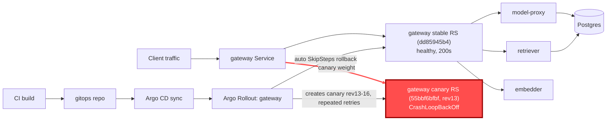

# Postmortem: gateway availability error budget burning slowly (10% of the 28d budget in 6h; 30m & 6h windows)

- **Status:** open
- **Severity:** sev2
- **Verified:** no
- **Opened:** 2026-08-04 01:18:44Z
- **Resolved:** (still open)

## Timeline (machine-generated)

All times UTC on 2026-08-04 unless a full date is shown.

| Time (UTC) | Source | Event |
| --- | --- | --- |
| 00:58:20Z | k8s | Pod/gateway-dd85945b4-c5xbb: Killing |
| 00:58:20Z | k8s | ReplicaSet/gateway-dd85945b4: SuccessfulDelete |
| 00:58:20Z | k8s | Rollout/gateway: ScalingReplicaSet |
| 00:58:20Z | k8s | Rollout/gateway: RolloutUpdated |
| 00:58:20Z | k8s | Rollout/gateway: RolloutNotCompleted |
| 00:58:21Z | k8s | ReplicaSet/gateway-55bbf6bfbf: SuccessfulCreate |
| 00:58:21Z | k8s | Pod/gateway-55bbf6bfbf-4qgg4: Scheduled |
| 00:58:23Z | k8s | Pod/gateway-55bbf6bfbf-4qgg4: Started |
| 00:58:23Z | k8s | Pod/gateway-55bbf6bfbf-4qgg4: Pulled |
| 00:58:23Z | k8s | Pod/gateway-55bbf6bfbf-4qgg4: Created |
| 00:58:25Z | k8s | Pod/gateway-55bbf6bfbf-4qgg4: Started |
| 00:58:25Z | k8s | Pod/gateway-55bbf6bfbf-4qgg4: Pulled |
| 00:58:25Z | k8s | Pod/gateway-55bbf6bfbf-4qgg4: Created |
| 00:58:27Z | k8s | Pod/gateway-55bbf6bfbf-4qgg4: BackOff |
| 00:58:28Z | k8s | Pod/gateway-55bbf6bfbf-4qgg4: BackOff |
| 00:58:31Z | k8s | Pod/gateway-55bbf6bfbf-4qgg4: BackOff |
| 00:58:37Z | k8s | Pod/gateway-55bbf6bfbf-4qgg4: Started |
| 00:58:37Z | k8s | Pod/gateway-55bbf6bfbf-4qgg4: Pulled |
| 00:58:37Z | k8s | Pod/gateway-55bbf6bfbf-4qgg4: Created |
| 00:58:39Z | k8s | Pod/gateway-55bbf6bfbf-4qgg4: BackOff |
| 00:58:40Z | k8s | Pod/gateway-55bbf6bfbf-4qgg4: BackOff |
| 00:58:41Z | k8s | Pod/gateway-55bbf6bfbf-4qgg4: BackOff |
| 00:59:03Z | k8s | Pod/gateway-55bbf6bfbf-4qgg4: Started |
| 00:59:03Z | k8s | Pod/gateway-55bbf6bfbf-4qgg4: Pulled |
| 00:59:03Z | k8s | Pod/gateway-55bbf6bfbf-4qgg4: Created |
| 00:59:05Z | k8s | Pod/gateway-55bbf6bfbf-4qgg4: BackOff |
| 00:59:06Z | k8s | Pod/gateway-55bbf6bfbf-4qgg4: BackOff |
| 00:59:11Z | k8s | Pod/gateway-55bbf6bfbf-4qgg4: BackOff |
| 00:59:57Z | k8s | Pod/gateway-55bbf6bfbf-4qgg4: Started |
| 00:59:57Z | k8s | Pod/gateway-55bbf6bfbf-4qgg4: Pulled |
| 00:59:57Z | k8s | Pod/gateway-55bbf6bfbf-4qgg4: Created |
| 00:59:59Z | k8s | Pod/gateway-55bbf6bfbf-4qgg4: BackOff |
| 01:00:00Z | k8s | Pod/gateway-55bbf6bfbf-4qgg4: BackOff |
| 01:00:01Z | k8s | Pod/gateway-55bbf6bfbf-4qgg4: BackOff |
| 01:01:16Z | k8s | Pod/gateway-55bbf6bfbf-4qgg4: BackOff |
| 01:01:19Z | k8s | Pod/gateway-55bbf6bfbf-4qgg4: Started |
| 01:01:19Z | k8s | Pod/gateway-55bbf6bfbf-4qgg4: Pulled |
| 01:01:19Z | k8s | Pod/gateway-55bbf6bfbf-4qgg4: Created |
| 01:01:21Z | k8s | Pod/gateway-55bbf6bfbf-4qgg4: BackOff |
| 01:01:22Z | k8s | Pod/gateway-55bbf6bfbf-4qgg4: BackOff |
| 01:01:31Z | k8s | Pod/gateway-55bbf6bfbf-4qgg4: BackOff |
| 01:02:58Z | k8s | Pod/gateway-55bbf6bfbf-4qgg4: BackOff |
| 01:04:24Z | k8s | Pod/gateway-55bbf6bfbf-4qgg4: Started |
| 01:04:24Z | k8s | Pod/gateway-55bbf6bfbf-4qgg4: Pulled |
| 01:04:24Z | k8s | Pod/gateway-55bbf6bfbf-4qgg4: Created |
| 01:04:26Z | k8s | Pod/gateway-55bbf6bfbf-4qgg4: BackOff |
| 01:04:27Z | k8s | Pod/gateway-55bbf6bfbf-4qgg4: BackOff |
| 01:04:31Z | k8s | Pod/gateway-55bbf6bfbf-4qgg4: BackOff |
| 01:05:46Z | k8s | Pod/gateway-55bbf6bfbf-4qgg4: BackOff |
| 01:06:35Z | k8s | Rollout/gateway: SkipSteps |
| 01:06:35Z | k8s | Rollout/gateway: RolloutUpdated |
| 01:06:36Z | k8s | ReplicaSet/gateway-dd85945b4: SuccessfulCreate |
| 01:06:36Z | k8s | ReplicaSet/gateway-55bbf6bfbf: SuccessfulDelete |
| 01:06:36Z | k8s | Rollout/gateway: ScalingReplicaSet |
| 01:06:36Z | k8s | Pod/gateway-dd85945b4-pwg4s: Scheduled |
| 01:06:39Z | k8s | Pod/gateway-dd85945b4-pwg4s: Started |
| 01:06:39Z | k8s | Pod/gateway-dd85945b4-pwg4s: Pulled |
| 01:06:39Z | k8s | Pod/gateway-dd85945b4-pwg4s: Created |
| 01:18:10Z | alert | alert firing: SLO gateway availability — slow burn |

## Evidence links

- [Loki — logs over the incident window](http://localhost:3001/explore?schemaVersion=1&panes=%7B%22pm%22%3A+%7B%22datasource%22%3A+%22loki%22%2C+%22queries%22%3A+%5B%7B%22refId%22%3A+%22A%22%2C+%22datasource%22%3A+%7B%22type%22%3A+%22loki%22%2C+%22uid%22%3A+%22loki%22%7D%2C+%22expr%22%3A+%22%7Bnamespace%3D%5C%22subject%5C%22%7D+%7C~+%5C%22%28%3Fi%29error%7Cfailed%5C%22%22%7D%5D%2C+%22range%22%3A+%7B%22from%22%3A+%221785806324323%22%2C+%22to%22%3A+%221785806709382%22%7D%7D%7D&orgId=1)
- [Mimir — metrics over the incident window](http://localhost:3001/explore?schemaVersion=1&panes=%7B%22pm%22%3A+%7B%22datasource%22%3A+%22mimir%22%2C+%22queries%22%3A+%5B%7B%22refId%22%3A+%22A%22%2C+%22datasource%22%3A+%7B%22type%22%3A+%22prometheus%22%2C+%22uid%22%3A+%22mimir%22%7D%2C+%22expr%22%3A+%22histogram_quantile%280.95%2C+sum%28rate%28http_server_duration_milliseconds_bucket%5B5m%5D%29%29+by+%28le%29%29%22%7D%5D%2C+%22range%22%3A+%7B%22from%22%3A+%221785806324323%22%2C+%22to%22%3A+%221785806709382%22%7D%7D%7D&orgId=1)

## Investigation context

**Runbook match:** none — no tool narrowing applied for this alert. Available runbooks: README.md, canary-abort.md, ci-pipeline-red.md, dq-freshness-stall.md, gateway-high-error-rate.md, k8s-crashloop.md, k8s-node-failure.md, snapshot-agent-audit.md, stale-secret.md

Pre-check battery (as injected at run start)

## Pre-check leads

### recent_deploys — LEAD
No deploy in the last 60m — rule out the reflex answer.
- No deploy in the last 60m — rule out the reflex answer.

### log_spike — OK
error/failed log rate normal: 0/10min vs baseline 500/10min

### kube_scan — UNAVAILABLE
error: You must be logged in to the server (Unauthorized)

### rollout_state — UNAVAILABLE
gateway: E0804 03:18:46.395071   45156 memcache.go:265] "Unhandled Error" err="couldn't get current server API group list: the server has asked for the client to provide credentials"
E0804 03:18:46.480143   45156 memcache.go:265] "Unhandled Error" err="couldn't get current server API group list: the server has asked for the client to provide credentials"
E0804 03:18:46.590548   45156 memcache.go:265] "Unhandled Error" err="couldn't get current server API group list: the server has asked for the client to; gateway analysis: E0804 03:18:46.388562   36140 memcache.go:265] "Unhandled Error" err="couldn't get current server API group list: the server has asked for the client to provide credentials"
E0804 03:18:46.477891   36140 memcache.go:265] "Unhandled Error"
… (section truncated)

### secret_age — UNAVAILABLE
error: You must be logged in to the server (Unauthorized)

## Narrative

## Summary
A sev2 slow-burn SLO alert fired for gateway availability (10% of the 28d error budget consumed in 6h, both 30m and 6h windows). Investigation traced this to a stuck Argo Rollouts canary for the `gateway` workload that repeatedly crash-looped and was retried multiple times before self-aborting back to the stable ReplicaSet shortly before this page.

## Impact
Tenant `acme` (and any other gateway traffic) saw intermittent bursts of `502`/`500`/`504` (and smaller waves of `429`/`422`) on `POST /v1/chat`. The bursts were periodic rather than continuous — each burst corresponded to one canary retry cycle — with the single largest burst reaching ~5.2 502s/sec against a healthy baseline near 0. Cumulative effect over ~3 hours was enough to trip the 6h burn-rate SLO alert even though the acute failure had already stopped.

## Root cause
`k8s_events` for namespace `subject` showed `Rollout/gateway` updated to **revision 13**, creating ReplicaSet `gateway-55bbf6bfbf` (canary) while scaling down the stable ReplicaSet `gateway-dd85945b4`. The new canary pod (`gateway-55bbf6bfbf-t9sp4`, image `obs-registry:5010/gateway:10f24bc`) went straight into `CrashLoopBackOff` — dozens of `BackOff` events with escalating restart counts. This repeated across at least four rollout revisions (13→14→15→16): the canary pod kept dying, kubelet kept backing off, and the Rollout kept retrying, with each cycle correlating to a burst of 5xx on `/v1/chat` in `mimir_query`'s per-status-code breakdown.

Two candidate causes were ruled out with evidence:
- **Not OOM** — `container_memory_working_set_bytes` for the gateway container sat at ~85–125 MiB the whole window, far under the 384 MiB (`402653184` byte) limit reported by `kube_pod_container_resource_limits`.
- **Not a bad image alone** — the same image tag (`10f24bc`) was later pulled successfully by a new pod in the *stable* ReplicaSet (`gateway-dd85945b4-pwg4s`) after rollback, and that pod has been serving `200`s normally since. The failure was specific to the canary rollout path, not the binary/image itself.

The Rollout self-corrected: at the most recent cycle, `k8s_events` recorded `Rollout/gateway: SkipSteps — "Rollback to stable ReplicaSets"` (revision 16), scaling the canary ReplicaSet to 0 and the stable ReplicaSet back up to full count. `request_duration_seconds_count` by status code confirms 5xx returned to 0 immediately after and has stayed there.

No commit could be matched via `gitea_compare`/`gitea_ci_runs` for the exact short SHA `10f24bc` against recent `main` history, and `argo_app`/`rollout_status`/`analysisrun_get` were unavailable for direct rollout-state confirmation — all kubectl-mediated tools in this session failed with an `Unauthorized` credential error, which is called out below as a separate, unresolved operational issue.

## What fixed it
The Rollout's own automatic canary-abort/rollback (`SkipSteps: Rollback to stable ReplicaSets`) had already returned gateway to 100% stable, healthy replicas before this response began — `alert_status`'s "since" timestamp lines up with the tail of the 6h burn window rather than an ongoing acute failure. I attempted a formal `rollout_abort` (dry-run diff: `status.abort=true` on the Rollout) to positively lock out any further canary retry and got operator approval, but **both live executions failed** with the same `Unauthorized` cluster-credential error that blocked every read-only kubectl-based tool (`kubectl_read`, `argo_app`, `rollout_status`, `analysisrun_get`) throughout this investigation. This is an infrastructure/credential fault, not a decision I'm making — I am reporting it explicitly rather than assuming the abort took effect. `alert_status` was re-queried after both attempts and still reports the alert active, consistent with the 6h window still containing the earlier burn rather than any new failures (current 5xx rate is 0).

## Lessons
- The gateway canary path can crash-loop while the identical image is healthy as stable — point to a canary-specific config/env/resource difference in the Rollout spec, not the image build. Worth diffing the canary vs. stable pod template next time gitops access is restored.
- Argo Rollouts retried the broken canary across at least 4 revisions without a human in the loop; each retry re-burned error budget. An analysis template with a tighter failure threshold (fewer retries before a hard abort) would cap the blast radius sooner.
- The on-call cluster credential used by kubectl-mediated tools (read *and* write) was down for this entire incident. That blocked confirmation of live rollout phase and blocked applying the intended `rollout_abort`. This needs its own follow-up outside this incident — on-call remediation should not be silently dependent on a credential that can expire cluster-wide.
- No runbook matched `SLO gateway availability — slow burn` by exact alertname; `k8s-crashloop.md` and `gateway-high-error-rate.md` were both useful by analogy. Worth authoring a dedicated slow-burn-SLO runbook that names "check for a stuck canary via k8s_events first" as step one.

