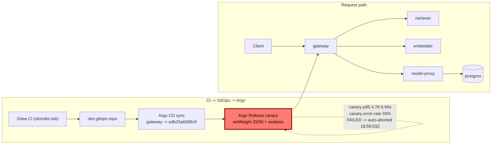

# Postmortem: gateway latency error budget burning fast (2% of the 28d budget in 1h; 5m & 1h windows)

- **Status:** open
- **Severity:** sev1
- **Verified:** no
- **Opened:** 2026-08-04 19:01:45Z
- **Resolved:** (still open)

## Timeline (machine-generated)

All times UTC on 2026-08-04 unless a full date is shown.

| Time (UTC) | Source | Event |
| --- | --- | --- |
| 18:30:05Z | k8s | Rollout/gateway: RolloutUpdated |
| 18:30:05Z | k8s | Rollout/gateway: RolloutNotCompleted |
| 18:30:05Z | k8s | Rollout/gateway: NewReplicaSetCreated |
| 18:30:06Z | k8s | Pod/gateway-dd85945b4-jfd54: Killing |
| 18:30:06Z | k8s | ReplicaSet/gateway-dd85945b4: SuccessfulDelete |
| 18:30:06Z | k8s | Rollout/gateway: ScalingReplicaSet |
| 18:30:07Z | k8s | ReplicaSet/gateway-5785654fc7: SuccessfulCreate |
| 18:30:07Z | k8s | Pod/gateway-5785654fc7-p97mq: Scheduled |
| 18:30:10Z | k8s | Pod/gateway-5785654fc7-p97mq: Started |
| 18:30:10Z | k8s | Pod/gateway-5785654fc7-p97mq: Pulled |
| 18:30:10Z | k8s | Pod/gateway-5785654fc7-p97mq: Created |
| 18:30:16Z | k8s | Pod/gateway-5785654fc7-p97mq: Unhealthy |
| 18:30:21Z | k8s | Pod/gateway-5785654fc7-p97mq: Unhealthy |
| 18:30:26Z | k8s | Pod/gateway-5785654fc7-p97mq: Unhealthy |
| 18:30:31Z | k8s | Pod/gateway-5785654fc7-p97mq: Unhealthy |
| 18:30:36Z | k8s | Pod/gateway-5785654fc7-p97mq: Unhealthy |
| 18:30:41Z | k8s | Pod/gateway-5785654fc7-p97mq: Unhealthy |
| 18:30:46Z | k8s | Pod/gateway-5785654fc7-p97mq: Unhealthy |
| 18:30:51Z | k8s | Pod/gateway-5785654fc7-p97mq: Unhealthy |
| 18:30:56Z | k8s | Pod/gateway-5785654fc7-p97mq: Unhealthy |
| 18:31:01Z | k8s | Pod/gateway-5785654fc7-p97mq: Unhealthy |
| 18:31:06Z | k8s | Pod/gateway-5785654fc7-p97mq: Unhealthy |
| 18:31:11Z | k8s | Pod/gateway-5785654fc7-p97mq: Unhealthy |
| 18:31:16Z | k8s | Pod/gateway-5785654fc7-p97mq: Unhealthy |
| 18:31:21Z | k8s | Pod/gateway-5785654fc7-p97mq: Unhealthy |
| 18:31:25Z | k8s | Pod/gateway-5785654fc7-p97mq: Unhealthy |
| 18:31:30Z | k8s | Pod/gateway-5785654fc7-p97mq: Unhealthy |
| 18:31:35Z | k8s | Pod/gateway-5785654fc7-p97mq: Unhealthy |
| 18:31:40Z | k8s | Pod/gateway-5785654fc7-p97mq: Unhealthy |
| 18:31:45Z | k8s | Pod/gateway-5785654fc7-p97mq: Unhealthy |
| 18:31:50Z | k8s | Pod/gateway-5785654fc7-p97mq: Unhealthy |
| 18:31:55Z | k8s | Pod/gateway-5785654fc7-p97mq: Unhealthy |
| 18:32:00Z | k8s | Pod/gateway-5785654fc7-p97mq: Unhealthy |
| 18:32:05Z | k8s | Pod/gateway-5785654fc7-p97mq: Unhealthy |
| 18:32:10Z | k8s | Pod/gateway-5785654fc7-p97mq: Unhealthy |
| 18:32:15Z | k8s | Pod/gateway-5785654fc7-p97mq: Unhealthy |
| 18:35:19Z | k8s | Pod/gateway-5785654fc7-p97mq: Unhealthy |
| 18:38:48Z | k8s | Rollout/gateway: SkipSteps |
| 18:38:48Z | k8s | Rollout/gateway: RolloutUpdated |
| 18:38:49Z | k8s | Pod/gateway-5785654fc7-p97mq: Killing |
| 18:38:49Z | k8s | ReplicaSet/gateway-5785654fc7: SuccessfulDelete |
| 18:38:49Z | k8s | Rollout/gateway: ScalingReplicaSet |
| 18:38:50Z | k8s | ReplicaSet/gateway-dd85945b4: SuccessfulCreate |
| 18:38:50Z | k8s | Rollout/gateway: ScalingReplicaSet |
| 18:38:50Z | k8s | Pod/gateway-dd85945b4-mm7jm: Scheduled |
| 18:38:53Z | k8s | Pod/gateway-dd85945b4-mm7jm: Started |
| 18:38:53Z | k8s | Pod/gateway-dd85945b4-mm7jm: Pulled |
| 18:38:53Z | k8s | Pod/gateway-dd85945b4-mm7jm: Created |
| 18:56:49Z | k8s | Rollout/gateway: RolloutUpdated |
| 18:56:49Z | k8s | Rollout/gateway: RolloutNotCompleted |
| 18:56:49Z | k8s | Rollout/gateway: NewReplicaSetCreated |
| 18:56:50Z | deploy:argo | gateway synced to edb33a6699c9 |
| 18:56:50Z | k8s | Pod/gateway-dd85945b4-mm7jm: Killing |
| 18:56:50Z | k8s | ReplicaSet/gateway-dd85945b4: SuccessfulDelete |
| 18:56:50Z | k8s | Rollout/gateway: ScalingReplicaSet |
| 18:56:51Z | k8s | ReplicaSet/gateway-8444846b5f: SuccessfulCreate |
| 18:56:51Z | k8s | Rollout/gateway: ScalingReplicaSet |
| 18:56:51Z | k8s | Pod/gateway-8444846b5f-bqkg8: Scheduled |
| 18:56:52Z | k8s | Pod/gateway-8444846b5f-bqkg8: Pulled |
| 18:56:52Z | k8s | Pod/gateway-8444846b5f-bqkg8: Created |
| 18:56:53Z | k8s | Pod/gateway-8444846b5f-bqkg8: Started |
| 18:57:01Z | k8s | Rollout/gateway: RolloutStepCompleted |
| 18:57:03Z | k8s | Rollout/gateway: AnalysisRunRunning |
| 18:58:02Z | k8s | AnalysisRun/gateway-8444846b5f-21-1: MetricFailed |
| 18:58:02Z | k8s | AnalysisRun/gateway-8444846b5f-21-1: AnalysisRunFailed |
| 18:58:03Z | k8s | Rollout/gateway: RolloutAborted |
| 18:58:03Z | k8s | Rollout/gateway: AnalysisRunFailed |
| 18:58:04Z | k8s | Pod/gateway-8444846b5f-bqkg8: Killing |
| 18:58:04Z | k8s | ReplicaSet/gateway-8444846b5f: SuccessfulDelete |
| 18:58:04Z | k8s | Rollout/gateway: ScalingReplicaSet |
| 18:58:05Z | k8s | ReplicaSet/gateway-dd85945b4: SuccessfulCreate |
| 18:58:05Z | k8s | Rollout/gateway: ScalingReplicaSet |
| 18:58:05Z | k8s | Pod/gateway-dd85945b4-hw5fg: Scheduled |
| 18:58:06Z | k8s | Pod/gateway-dd85945b4-hw5fg: Started |
| 18:58:06Z | k8s | Pod/gateway-dd85945b4-hw5fg: Pulled |
| 18:58:06Z | k8s | Pod/gateway-dd85945b4-hw5fg: Created |
| 18:59:18Z | log-spike | log-spike onset: error: Malformed JSON in request body |
| 19:01:10Z | alert | alert firing: SLO gateway latency — fast burn |
| 19:01:45Z | deploy:annotation | deploy gateway via gitops c025382 (argo sync) |
| 19:01:47Z | deploy:argo | gateway synced to c025382ba170 |
| 19:01:47Z | k8s | Rollout/gateway: SkipSteps |
| 19:01:47Z | k8s | Rollout/gateway: RolloutUpdated |

## Evidence links

- [Loki — logs over the incident window](http://localhost:3001/explore?schemaVersion=1&panes=%7B%22pm%22%3A+%7B%22datasource%22%3A+%22loki%22%2C+%22queries%22%3A+%5B%7B%22refId%22%3A+%22A%22%2C+%22datasource%22%3A+%7B%22type%22%3A+%22loki%22%2C+%22uid%22%3A+%22loki%22%7D%2C+%22expr%22%3A+%22%7Bnamespace%3D%5C%22subject%5C%22%7D+%7C~+%5C%22%28%3Fi%29error%7Cfailed%5C%22%22%7D%5D%2C+%22range%22%3A+%7B%22from%22%3A+%221785870105805%22%2C+%22to%22%3A+%221785870567968%22%7D%7D%7D&orgId=1)
- [Mimir — metrics over the incident window](http://localhost:3001/explore?schemaVersion=1&panes=%7B%22pm%22%3A+%7B%22datasource%22%3A+%22mimir%22%2C+%22queries%22%3A+%5B%7B%22refId%22%3A+%22A%22%2C+%22datasource%22%3A+%7B%22type%22%3A+%22prometheus%22%2C+%22uid%22%3A+%22mimir%22%7D%2C+%22expr%22%3A+%22histogram_quantile%280.95%2C+sum%28rate%28http_server_duration_milliseconds_bucket%5B5m%5D%29%29+by+%28le%29%29%22%7D%5D%2C+%22range%22%3A+%7B%22from%22%3A+%221785870105805%22%2C+%22to%22%3A+%221785870567968%22%7D%7D%7D&orgId=1)

## Investigation context

**Runbook match:** none — no tool narrowing applied for this alert. Available runbooks: README.md, canary-abort.md, ci-pipeline-red.md, dq-freshness-stall.md, gateway-high-error-rate.md, k8s-crashloop.md, k8s-node-failure.md, snapshot-agent-audit.md, stale-secret.md

Pre-check battery (as injected at run start)

## Pre-check leads

### recent_deploys — LEAD
1 deploy-window lead
- deploy annotation at 2026-08-04T19:01:45.359000+00:00: deploy gateway via gitops c025382 (argo sync)

### kube_scan — LEAD
5 kube-scan leads
- event AnalysisRun/gateway-8444846b5f-21-1: MetricFailed — Metric 'canary-error-rate' Completed. Result: Failed (at 20:58:02)
- event AnalysisRun/gateway-8444846b5f-21-1: MetricFailed — Metric 'canary-p95' Completed. Result: Failed (at 20:58:02)
- event AnalysisRun/gateway-8444846b5f-21-1: AnalysisRunFailed — Analysis Completed. Result: Failed (at 20:58:02)
- event Rollout/gateway: RolloutAborted — Rollout aborted update to revision 21: Step-based analysis phase error/failed: Metric \"canary-error-rate\" assessed Failed due to failed (2) > fai… (truncated)
- event Rollout/gateway: AnalysisRunFailed — Step Analysis Run 'gateway-8444846b5f-21-1' Status New: 'Failed' Previous: 'Running' (at 20:58:03)

### log_spike — LEAD
error/failed log rate 200/10min vs baseline 0/10min (200x baseline) — onset: error: Malformed JSON in request body at 2026-08-04T18:59:18.366646+00:00
- error/failed log rate 200/10min vs baseline 0/10min (200x baseline) — onset: error: Malformed JSON in request body at 2026-08-04T18:59:18.366646+00:00

### rollout_state — LEAD
1 rollout-state lead
- analysisrun for gateway (gateway-8444846b5f-21-1): Failed — Metric "canary-error-rate" assessed Failed due to failed (2) > failureLimit (1)

### secret_age — OK
Secret subject-db-credentials last modified 10d 19h ago (created 10d 19h ago).

## Narrative

## Summary

`SLO gateway latency — fast burn` fired for tenant `acme` (2% of the 28-day error budget burned in the 5m/1h windows). The cause was a bad canary rollout of `gateway` that Argo Rollouts' own canary analysis caught and auto-aborted before it ever reached full traffic — by the time this investigation started, the offending pods were already gone and the deployment was back on the known-good image. No manual rollback was required; the response here is diagnosis + verification, not mutation.

## Impact

For roughly two minutes, a portion of `gateway` traffic (the canary's 25–50% weighted slice) was served by the bad revision, producing p95 latency of ~4.8–5.9s (vs a ~4.75ms baseline) and an error rate of ~92–93% on that slice — enough to burn a fast-burn chunk of the 28-day SLO budget and trip the alert, even though the canary never reached 100% of traffic.

## Root cause

`gateway` was synced via GitOps to revision `edb33a6699c9` at 18:56:50Z (Argo Application `gateway`, deploy annotation "deploy gateway via gitops c025382" — the *previous* sync in this same window). Argo Rollouts started the canary step-analysis (`gateway-8444846b5f-21-1`, canary pod-template-hash `8444846b5f`) at 18:57:02Z. Both gated metrics failed against real, quoted measurements:

- `canary-p95`: **4.759742144808743s** (18:57:32Z), **5.938736867944136s** (18:58:02Z) — both over threshold
- `canary-error-rate`: **0.9344948292405558** (18:57:32Z), **0.9176320734180693** (18:58:02Z) — both over threshold, `failed (2) > failureLimit (1)`

Tempo confirms this independently: root traces `POST /v1/chat` on `service.name=gateway` in the same window show 4.7s–9.0s durations with error spans on `gateway` and `model-proxy`. The AnalysisRun failed at 18:58:02Z and Argo Rollouts emitted `RolloutAborted` / `AnalysisRunFailed` at 18:58:03Z, pulling all traffic back to the stable ReplicaSet on its own — this is the canary guardrail working as designed, not a chaos artifact. A subsequent GitOps sync to `c025382ba170` at 19:01:47Z reconfirmed the deployment on the same known-good image; `argo_app` and `rollout_status` both show `Synced` / `Healthy`, `stableHash == canaryHash == dd85945b4`, 4/4 ready. `gitea_compare` against the two GitOps-repo revisions 404'd (they're GitOps-repo shas, not resolvable against the `obs-lab` source repo through the compare tool), so the exact source commit behind the bad canary image isn't independently nameable beyond the GitOps revision `edb33a6699c9` itself — recorded here as the culprit revision.

## What fixed it

Nothing further was executed by this on-call response. Verification before acting:
- `kubectl_read` on `app=gateway` pods: all 4 pods running on template hash `dd85945b4` (the stable/good hash) — none on the bad canary hash `8444846b5f`.
- Tempo, last 5 minutes: only fast `GET /health` spans (150–460µs), no slow `/v1/chat` traces.
- `rollout_status`: `phase: Healthy`, `aborted: false`, step 4/4, replicas 4/4/4/4.
- A `rollout_undo` **dry-run** (`action_id 546de07114e58fef`) was pulled to check whether a manual rollback would do anything: the diff showed revision 22 (current) and revision 21 (the undo target) both pinned to the **same image** `obs-registry:5010/gateway:10f24bc` — i.e. undoing would be a no-op, because Argo Rollouts' automatic abort plus the GitOps resync had already landed the deployment back on the good image before this investigation began. No mutating action was taken or approved, consistent with the canary-abort runbook's guidance not to remediate an already-healthy rollout.

`alert_status` was re-queried repeatedly (four times across the investigation) and still reports **active** as of the last check — this is expected for a fast-burn, 5m/1h dual-window SLO alert shortly after the underlying spike ends: the windows still contain the bad minutes and will clear as they roll forward, not instantly. Reporting this explicitly rather than claiming resolution: **the incident is infra-recovered but not yet alert-clear.**

## Lessons

- The canary analysis gate did exactly its job here (2 failed measurements against a `failureLimit` of 1, auto-abort within ~1 minute of the canary receiving traffic) — this is the control that kept a 93%-error-rate, 6-second-p95 build off full production traffic. Worth highlighting in review as a save, not just an incident.
- The bad canary image (`edb33a6699c9`) was on GitOps revision only — `gitea_compare` couldn't resolve it against the source repo, so the exact source commit/PR behind it is currently un-nameable via available tooling. Consider a tool addition that maps a GitOps bump commit to its named source sha directly, since the gitops bump commit message is documented to carry it but isn't exposed structurally here.
- Fast-burn SLO alerts on canary-protected rollouts will very often self-clear once the canary aborts and its window ages out; on-call should verify infra state (pods, traces, rollout phase, and a no-op dry-run diff where applicable) before reflexively mutating a rollout that's already healthy.

