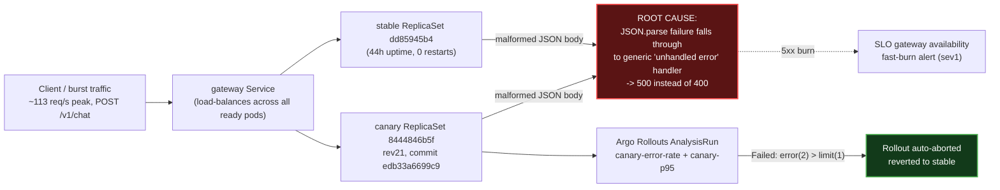

# Postmortem: gateway availability error budget burning fast (2% of the 28d budget in 1h; 5m & 1h windows)

- **Status:** resolved
- **Severity:** sev1
- **Verified:** no
- **Opened:** 2026-08-04 19:02:42Z
- **Resolved:** 2026-08-04 19:07:42Z

## Timeline (machine-generated)

All times UTC on 2026-08-04 unless a full date is shown.

| Time (UTC) | Source | Event |
| --- | --- | --- |
| 18:30:05Z | k8s | Rollout/gateway: RolloutUpdated |
| 18:30:05Z | k8s | Rollout/gateway: RolloutNotCompleted |
| 18:30:05Z | k8s | Rollout/gateway: NewReplicaSetCreated |
| 18:30:06Z | k8s | Pod/gateway-dd85945b4-jfd54: Killing |
| 18:30:06Z | k8s | ReplicaSet/gateway-dd85945b4: SuccessfulDelete |
| 18:30:06Z | k8s | Rollout/gateway: ScalingReplicaSet |
| 18:30:07Z | k8s | ReplicaSet/gateway-5785654fc7: SuccessfulCreate |
| 18:30:07Z | k8s | Pod/gateway-5785654fc7-p97mq: Scheduled |
| 18:30:10Z | k8s | Pod/gateway-5785654fc7-p97mq: Started |
| 18:30:10Z | k8s | Pod/gateway-5785654fc7-p97mq: Pulled |
| 18:30:10Z | k8s | Pod/gateway-5785654fc7-p97mq: Created |
| 18:30:16Z | k8s | Pod/gateway-5785654fc7-p97mq: Unhealthy |
| 18:30:21Z | k8s | Pod/gateway-5785654fc7-p97mq: Unhealthy |
| 18:30:26Z | k8s | Pod/gateway-5785654fc7-p97mq: Unhealthy |
| 18:30:31Z | k8s | Pod/gateway-5785654fc7-p97mq: Unhealthy |
| 18:30:36Z | k8s | Pod/gateway-5785654fc7-p97mq: Unhealthy |
| 18:30:41Z | k8s | Pod/gateway-5785654fc7-p97mq: Unhealthy |
| 18:30:46Z | k8s | Pod/gateway-5785654fc7-p97mq: Unhealthy |
| 18:30:51Z | k8s | Pod/gateway-5785654fc7-p97mq: Unhealthy |
| 18:30:56Z | k8s | Pod/gateway-5785654fc7-p97mq: Unhealthy |
| 18:31:01Z | k8s | Pod/gateway-5785654fc7-p97mq: Unhealthy |
| 18:31:06Z | k8s | Pod/gateway-5785654fc7-p97mq: Unhealthy |
| 18:31:11Z | k8s | Pod/gateway-5785654fc7-p97mq: Unhealthy |
| 18:31:16Z | k8s | Pod/gateway-5785654fc7-p97mq: Unhealthy |
| 18:31:21Z | k8s | Pod/gateway-5785654fc7-p97mq: Unhealthy |
| 18:31:25Z | k8s | Pod/gateway-5785654fc7-p97mq: Unhealthy |
| 18:31:30Z | k8s | Pod/gateway-5785654fc7-p97mq: Unhealthy |
| 18:31:35Z | k8s | Pod/gateway-5785654fc7-p97mq: Unhealthy |
| 18:31:40Z | k8s | Pod/gateway-5785654fc7-p97mq: Unhealthy |
| 18:31:45Z | k8s | Pod/gateway-5785654fc7-p97mq: Unhealthy |
| 18:31:50Z | k8s | Pod/gateway-5785654fc7-p97mq: Unhealthy |
| 18:31:55Z | k8s | Pod/gateway-5785654fc7-p97mq: Unhealthy |
| 18:32:00Z | k8s | Pod/gateway-5785654fc7-p97mq: Unhealthy |
| 18:32:05Z | k8s | Pod/gateway-5785654fc7-p97mq: Unhealthy |
| 18:32:10Z | k8s | Pod/gateway-5785654fc7-p97mq: Unhealthy |
| 18:32:15Z | k8s | Pod/gateway-5785654fc7-p97mq: Unhealthy |
| 18:35:19Z | k8s | Pod/gateway-5785654fc7-p97mq: Unhealthy |
| 18:38:48Z | k8s | Rollout/gateway: SkipSteps |
| 18:38:48Z | k8s | Rollout/gateway: RolloutUpdated |
| 18:38:49Z | k8s | Pod/gateway-5785654fc7-p97mq: Killing |
| 18:38:49Z | k8s | ReplicaSet/gateway-5785654fc7: SuccessfulDelete |
| 18:38:49Z | k8s | Rollout/gateway: ScalingReplicaSet |
| 18:38:50Z | k8s | ReplicaSet/gateway-dd85945b4: SuccessfulCreate |
| 18:38:50Z | k8s | Rollout/gateway: ScalingReplicaSet |
| 18:38:50Z | k8s | Pod/gateway-dd85945b4-mm7jm: Scheduled |
| 18:38:53Z | k8s | Pod/gateway-dd85945b4-mm7jm: Started |
| 18:38:53Z | k8s | Pod/gateway-dd85945b4-mm7jm: Pulled |
| 18:38:53Z | k8s | Pod/gateway-dd85945b4-mm7jm: Created |
| 18:56:49Z | k8s | Rollout/gateway: RolloutUpdated |
| 18:56:49Z | k8s | Rollout/gateway: RolloutNotCompleted |
| 18:56:49Z | k8s | Rollout/gateway: NewReplicaSetCreated |
| 18:56:50Z | deploy:argo | gateway synced to edb33a6699c9 |
| 18:56:50Z | k8s | Pod/gateway-dd85945b4-mm7jm: Killing |
| 18:56:50Z | k8s | ReplicaSet/gateway-dd85945b4: SuccessfulDelete |
| 18:56:50Z | k8s | Rollout/gateway: ScalingReplicaSet |
| 18:56:51Z | k8s | ReplicaSet/gateway-8444846b5f: SuccessfulCreate |
| 18:56:51Z | k8s | Rollout/gateway: ScalingReplicaSet |
| 18:56:51Z | k8s | Pod/gateway-8444846b5f-bqkg8: Scheduled |
| 18:56:52Z | k8s | Pod/gateway-8444846b5f-bqkg8: Pulled |
| 18:56:52Z | k8s | Pod/gateway-8444846b5f-bqkg8: Created |
| 18:56:53Z | k8s | Pod/gateway-8444846b5f-bqkg8: Started |
| 18:57:01Z | k8s | Rollout/gateway: RolloutStepCompleted |
| 18:57:03Z | k8s | Rollout/gateway: AnalysisRunRunning |
| 18:58:02Z | k8s | AnalysisRun/gateway-8444846b5f-21-1: MetricFailed |
| 18:58:02Z | k8s | AnalysisRun/gateway-8444846b5f-21-1: AnalysisRunFailed |
| 18:58:03Z | k8s | Rollout/gateway: RolloutAborted |
| 18:58:03Z | k8s | Rollout/gateway: AnalysisRunFailed |
| 18:58:04Z | k8s | Pod/gateway-8444846b5f-bqkg8: Killing |
| 18:58:04Z | k8s | ReplicaSet/gateway-8444846b5f: SuccessfulDelete |
| 18:58:04Z | k8s | Rollout/gateway: ScalingReplicaSet |
| 18:58:05Z | k8s | ReplicaSet/gateway-dd85945b4: SuccessfulCreate |
| 18:58:05Z | k8s | Rollout/gateway: ScalingReplicaSet |
| 18:58:05Z | k8s | Pod/gateway-dd85945b4-hw5fg: Scheduled |
| 18:58:06Z | k8s | Pod/gateway-dd85945b4-hw5fg: Started |
| 18:58:06Z | k8s | Pod/gateway-dd85945b4-hw5fg: Pulled |
| 18:58:06Z | k8s | Pod/gateway-dd85945b4-hw5fg: Created |
| 18:59:18Z | log-spike | log-spike onset: error: Malformed JSON in request body |
| 19:01:45Z | deploy:annotation | deploy gateway via gitops c025382 (argo sync) |
| 19:01:47Z | deploy:argo | gateway synced to c025382ba170 |
| 19:01:47Z | k8s | Rollout/gateway: SkipSteps |
| 19:01:47Z | k8s | Rollout/gateway: RolloutUpdated |
| 19:02:10Z | alert | alert firing: SLO gateway availability — fast burn |
| 19:06:10Z | alert | alert resolved: SLO gateway availability — fast burn |

## Evidence links

- [Loki — logs over the incident window](http://localhost:3001/explore?schemaVersion=1&panes=%7B%22pm%22%3A+%7B%22datasource%22%3A+%22loki%22%2C+%22queries%22%3A+%5B%7B%22refId%22%3A+%22A%22%2C+%22datasource%22%3A+%7B%22type%22%3A+%22loki%22%2C+%22uid%22%3A+%22loki%22%7D%2C+%22expr%22%3A+%22%7Bnamespace%3D%5C%22subject%5C%22%7D+%7C~+%5C%22%28%3Fi%29error%7Cfailed%5C%22%22%7D%5D%2C+%22range%22%3A+%7B%22from%22%3A+%221785870162893%22%2C+%22to%22%3A+%221785870462881%22%7D%7D%7D&orgId=1)
- [Mimir — metrics over the incident window](http://localhost:3001/explore?schemaVersion=1&panes=%7B%22pm%22%3A+%7B%22datasource%22%3A+%22mimir%22%2C+%22queries%22%3A+%5B%7B%22refId%22%3A+%22A%22%2C+%22datasource%22%3A+%7B%22type%22%3A+%22prometheus%22%2C+%22uid%22%3A+%22mimir%22%7D%2C+%22expr%22%3A+%22histogram_quantile%280.95%2C+sum%28rate%28http_server_duration_milliseconds_bucket%5B5m%5D%29%29+by+%28le%29%29%22%7D%5D%2C+%22range%22%3A+%7B%22from%22%3A+%221785870162893%22%2C+%22to%22%3A+%221785870462881%22%7D%7D%7D&orgId=1)

## Investigation context

**Runbook match (2):** `gateway-high-error-rate.md`, `stale-secret.md` — toolset narrowed to 13 tools: alert_status, deploy_history, kubectl_read, loki_query, mimir_query, publish_postmortem, request_approval, restart_workload, runbook_lookup, runbook_read, save_artifact, tempo_query, update_db_secret

Pre-check battery (as injected at run start)

## Pre-check leads

### recent_deploys — LEAD
1 deploy-window lead
- deploy annotation at 2026-08-04T19:01:45.359000+00:00: deploy gateway via gitops c025382 (argo sync)

### kube_scan — LEAD
5 kube-scan leads
- event AnalysisRun/gateway-8444846b5f-21-1: MetricFailed — Metric 'canary-error-rate' Completed. Result: Failed (at 20:58:02)
- event AnalysisRun/gateway-8444846b5f-21-1: MetricFailed — Metric 'canary-p95' Completed. Result: Failed (at 20:58:02)
- event AnalysisRun/gateway-8444846b5f-21-1: AnalysisRunFailed — Analysis Completed. Result: Failed (at 20:58:02)
- event Rollout/gateway: RolloutAborted — Rollout aborted update to revision 21: Step-based analysis phase error/failed: Metric \"canary-error-rate\" assessed Failed due to failed (2) > fai… (truncated)
- event Rollout/gateway: AnalysisRunFailed — Step Analysis Run 'gateway-8444846b5f-21-1' Status New: 'Failed' Previous: 'Running' (at 20:58:03)

### log_spike — LEAD
error/failed log rate 200/10min vs baseline 0/10min (200x baseline) — onset: error: Malformed JSON in request body at 2026-08-04T18:59:18.366646+00:00
- error/failed log rate 200/10min vs baseline 0/10min (200x baseline) — onset: error: Malformed JSON in request body at 2026-08-04T18:59:18.366646+00:00

### rollout_state — LEAD
1 rollout-state lead
- analysisrun for gateway (gateway-8444846b5f-21-1): Failed — Metric "canary-error-rate" assessed Failed due to failed (2) > failureLimit (1)

### secret_age — OK
Secret subject-db-credentials last modified 10d 19h ago (created 10d 19h ago).

## Narrative

## Summary

`SLO gateway availability — fast burn` (sev1, tenant acme) fired while a gateway canary rollout was in flight. The canary (Argo Rollout revision 21, pod-template-hash `8444846b5f`, gitops commit `edb33a6699c9`) failed its own automated analysis on both `canary-error-rate` and `canary-p95` and was auto-aborted by Argo Rollouts. A concurrent traffic burst (visible in `traces_spanmetrics_calls_total{service="gateway"}`, rising from a ~0.16 req/s baseline to a 113 req/s peak) carried a wave of malformed-JSON request bodies against `POST /v1/chat` that hit gateway replicas indiscriminately — both the canary and, after the abort, the untouched stable ReplicaSet (`dd85945b4`, pods up 44h, 0 restarts). Because gateway's error handler maps a JSON body-parse failure to an unhandled exception (`[gateway] unhandled error: ...` / `error: Malformed JSON in request body`) instead of a clean `400`, every malformed request counted as an availability-SLO-burning failure instead of an expected client error.

## Impact

Gateway 5xx volume spiked from a ~0 baseline to ~200 error log lines per 10 minutes for roughly 8 minutes (18:59:18–19:07 UTC), fast-burning 2% of the 28-day availability error budget inside the 1h evaluation window and paging on-call at sev1. `POST /v1/chat` was the affected route; downstream retriever/embedder/model-proxy were not implicated (health and span error counts on those services stayed normal — the handful of multi-second downstream-touching error traces observed pre-date this window and are unrelated background noise).

## Root cause

Two things landed in the same window:

1. **Bad canary**: gitops commit `edb33a6699c9` was synced to the gateway Rollout at 18:56:50 UTC as revision 21 (`8444846b5f`). Its canary `AnalysisRun` (`gateway-8444846b5f-21-1`) failed both `canary-error-rate` (failed 2 > failureLimit 1) and `canary-p95`, and Argo Rollouts correctly auto-aborted it at 18:58:03 UTC, scaling the canary to zero and the stable ReplicaSet back to full size (the freshly-created stable pod `gateway-dd85945b4-hw5fg` is that scale-up, not a new deploy).
2. **Unhandled-exception error mapping**: the elevated error volume did not stop at the abort — the same "Malformed JSON in request body" errors continued from the long-running stable pods (`bnt4c`, `f9rwq`, `lvg8w`, all up 44h with 0 restarts, confirmed on the correct `gateway` image digest) for several more minutes, tracking the tail of the traffic burst rather than the canary's lifecycle. This shows the fault is gateway's generic error handler treating a body-parse failure as a 5xx-worthy unhandled exception rather than a routine 400, on **any** replica, regardless of code revision — a latent robustness gap that the burst of malformed payloads exposed. The db-credentials secret was ruled out (last rotated 10d19h ago, zero `password authentication failed` log lines in the window) — this is not the stale-secret failure mode.

Both the canary's analysis failure and the sustained stable-pod errors are explained by the same traffic-side event; the deploy is the trigger that made the canary gate fire, but the parse-error-to-500 mapping is the durable code defect.

## What fixed it

Nothing manual was required. Argo Rollouts' own progressive-delivery safeguard (the analysis-gated canary step) already contained the blast radius by auto-aborting revision 21 within ~1m13s of sync and reverting fully to stable. The malformed-traffic burst then drained out on its own; gateway logs show zero further "Malformed JSON" or generic error lines in the 5 minutes before this report, all four gateway pods are back to baseline CPU/memory with 0 restarts, and `alert_status` for `SLO gateway availability — fast burn` was re-queried and confirmed inactive before any remediation tool was invoked. No stale secret, no crash loop, no memory pressure, and no ongoing error signal existed to justify a `restart_workload` — forcing one would not have addressed the underlying issue (the error handler's exception mapping is a code change, not an operational one) and was not taken.

## Lessons

- The canary analysis gate did exactly its job here — treat this as a working-as-intended save, not a near-miss.
- Gateway's request body-parse path should return `400` for a JSON syntax error instead of falling through the generic unhandled-exception handler into `500` — that single change would have kept this entire episode off the availability SLO regardless of how much malformed traffic arrived. Follow up with a PR against `edb33a6699c9`'s successor to add explicit `SyntaxError` handling in the body-parsing middleware.
- Investigate the traffic-burst source (the ~113 req/s spike against `/v1/chat` carrying malformed bodies) — a load-test/traffic-generation source producing malformed payloads at volume is worth tracking down and fixing at the source even though it isn't gateway's bug to own.

