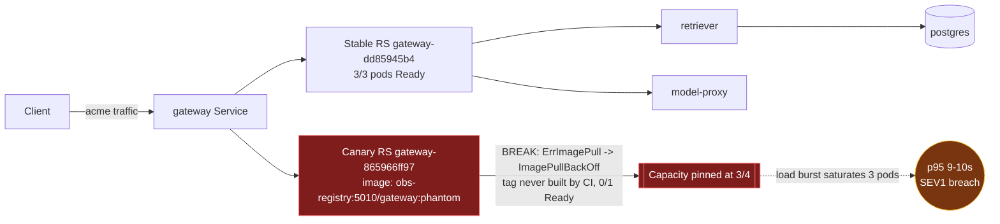

# Postmortem: gateway p95 latency above 2s

- **Status:** open
- **Severity:** sev1
- **Verified:** no
- **Opened:** 2026-08-04 13:49:41Z
- **Resolved:** (still open)

## Timeline (machine-generated)

All times UTC on 2026-08-04 unless a full date is shown.

| Time (UTC) | Source | Event |
| --- | --- | --- |
| 13:44:42Z | k8s | Rollout/gateway: RolloutUpdated |
| 13:44:42Z | k8s | Rollout/gateway: NewReplicaSetCreated |
| 13:44:43Z | k8s | Pod/gateway-dd85945b4-pwg4s: Killing |
| 13:44:43Z | k8s | ReplicaSet/gateway-dd85945b4: SuccessfulDelete |
| 13:44:43Z | k8s | Rollout/gateway: ScalingReplicaSet |
| 13:44:43Z | k8s | Rollout/gateway: RolloutNotCompleted |
| 13:44:44Z | k8s | ReplicaSet/gateway-865966ff97: SuccessfulCreate |
| 13:44:44Z | k8s | Rollout/gateway: ScalingReplicaSet |
| 13:44:44Z | k8s | Pod/gateway-865966ff97-zhm57: Scheduled |
| 13:44:46Z | k8s | Pod/gateway-865966ff97-zhm57: Failed |
| 13:44:46Z | k8s | Pod/gateway-865966ff97-zhm57: Pulling |
| 13:44:47Z | k8s | Pod/gateway-865966ff97-zhm57: Failed |
| 13:44:47Z | k8s | Pod/gateway-865966ff97-zhm57: BackOff |
| 13:44:57Z | k8s | Pod/gateway-865966ff97-zhm57: Failed |
| 13:44:57Z | k8s | Pod/gateway-865966ff97-zhm57: Pulling |
| 13:45:08Z | k8s | Pod/gateway-865966ff97-zhm57: Failed |
| 13:45:08Z | k8s | Pod/gateway-865966ff97-zhm57: BackOff |
| 13:45:19Z | k8s | Pod/gateway-865966ff97-zhm57: Failed |
| 13:45:19Z | k8s | Pod/gateway-865966ff97-zhm57: Pulling |
| 13:45:33Z | k8s | Pod/gateway-865966ff97-zhm57: Failed |
| 13:45:33Z | k8s | Pod/gateway-865966ff97-zhm57: BackOff |
| 13:45:46Z | k8s | Pod/gateway-865966ff97-zhm57: Failed |
| 13:45:46Z | k8s | Pod/gateway-865966ff97-zhm57: BackOff |
| 13:45:57Z | k8s | Pod/gateway-865966ff97-zhm57: Failed |
| 13:45:57Z | k8s | Pod/gateway-865966ff97-zhm57: BackOff |
| 13:46:10Z | k8s | Pod/gateway-865966ff97-zhm57: Failed |
| 13:46:10Z | k8s | Pod/gateway-865966ff97-zhm57: Pulling |
| 13:46:24Z | k8s | Pod/gateway-865966ff97-zhm57: Failed |
| 13:46:24Z | k8s | Pod/gateway-865966ff97-zhm57: BackOff |
| 13:46:37Z | k8s | Pod/gateway-865966ff97-zhm57: Failed |
| 13:46:37Z | k8s | Pod/gateway-865966ff97-zhm57: BackOff |
| 13:46:43Z | log-spike | log-spike onset: [gateway] unhandled error: 16 \| } |
| 13:46:48Z | k8s | Pod/gateway-865966ff97-zhm57: Failed |
| 13:46:48Z | k8s | Pod/gateway-865966ff97-zhm57: BackOff |
| 13:47:00Z | k8s | Pod/gateway-865966ff97-zhm57: Failed |
| 13:47:00Z | k8s | Pod/gateway-865966ff97-zhm57: BackOff |
| 13:47:13Z | k8s | Pod/gateway-865966ff97-zhm57: Failed |
| 13:47:13Z | k8s | Pod/gateway-865966ff97-zhm57: BackOff |
| 13:47:27Z | k8s | Pod/gateway-865966ff97-zhm57: Failed |
| 13:47:27Z | k8s | Pod/gateway-865966ff97-zhm57: BackOff |
| 13:47:38Z | k8s | Pod/gateway-865966ff97-zhm57: Failed |
| 13:47:38Z | k8s | Pod/gateway-865966ff97-zhm57: Pulling |
| 13:47:49Z | k8s | Pod/gateway-865966ff97-zhm57: Failed |
| 13:47:49Z | k8s | Pod/gateway-865966ff97-zhm57: BackOff |
| 13:48:03Z | k8s | Pod/gateway-865966ff97-zhm57: Failed |
| 13:48:03Z | k8s | Pod/gateway-865966ff97-zhm57: BackOff |
| 13:48:16Z | k8s | Pod/gateway-865966ff97-zhm57: Failed |
| 13:48:16Z | k8s | Pod/gateway-865966ff97-zhm57: BackOff |
| 13:48:31Z | k8s | Pod/gateway-865966ff97-zhm57: Failed |
| 13:48:31Z | k8s | Pod/gateway-865966ff97-zhm57: BackOff |
| 13:48:44Z | k8s | Pod/gateway-865966ff97-zhm57: BackOff |
| 13:48:56Z | k8s | Pod/gateway-865966ff97-zhm57: BackOff |
| 13:49:10Z | alert | alert firing: Gateway p95 latency > 2s |
| 13:49:10Z | k8s | Pod/gateway-865966ff97-zhm57: BackOff |
| 13:49:21Z | k8s | Pod/gateway-865966ff97-zhm57: BackOff |
| 13:49:35Z | k8s | Pod/gateway-865966ff97-zhm57: BackOff |
| 13:49:48Z | k8s | Pod/gateway-865966ff97-zhm57: Failed |
| 13:49:48Z | k8s | Pod/gateway-865966ff97-zhm57: BackOff |

## Evidence links

- [Loki — logs over the incident window](http://localhost:3001/explore?schemaVersion=1&panes=%7B%22pm%22%3A+%7B%22datasource%22%3A+%22loki%22%2C+%22queries%22%3A+%5B%7B%22refId%22%3A+%22A%22%2C+%22datasource%22%3A+%7B%22type%22%3A+%22loki%22%2C+%22uid%22%3A+%22loki%22%7D%2C+%22expr%22%3A+%22%7Bnamespace%3D%5C%22subject%5C%22%7D+%7C~+%5C%22%28%3Fi%29error%7Cfailed%5C%22%22%7D%5D%2C+%22range%22%3A+%7B%22from%22%3A+%221785851381519%22%2C+%22to%22%3A+%221785851686787%22%7D%7D%7D&orgId=1)
- [Mimir — metrics over the incident window](http://localhost:3001/explore?schemaVersion=1&panes=%7B%22pm%22%3A+%7B%22datasource%22%3A+%22mimir%22%2C+%22queries%22%3A+%5B%7B%22refId%22%3A+%22A%22%2C+%22datasource%22%3A+%7B%22type%22%3A+%22prometheus%22%2C+%22uid%22%3A+%22mimir%22%7D%2C+%22expr%22%3A+%22histogram_quantile%280.95%2C+sum%28rate%28http_server_duration_milliseconds_bucket%5B5m%5D%29%29+by+%28le%29%29%22%7D%5D%2C+%22range%22%3A+%7B%22from%22%3A+%221785851381519%22%2C+%22to%22%3A+%221785851686787%22%7D%7D%7D&orgId=1)

## Investigation context

**Runbook match:** none — no tool narrowing applied for this alert. Available runbooks: README.md, canary-abort.md, ci-pipeline-red.md, dq-freshness-stall.md, gateway-high-error-rate.md, k8s-crashloop.md, k8s-node-failure.md, snapshot-agent-audit.md, stale-secret.md

Pre-check battery (as injected at run start)

## Pre-check leads

### recent_deploys — LEAD
No deploy in the last 60m — rule out the reflex answer.
- No deploy in the last 60m — rule out the reflex answer.

### log_spike — LEAD
error/failed log rate 200/10min vs baseline 0/10min (200x baseline) — onset: [gateway] unhandled error: 16 |         } at 2026-08-04T13:46:43.929301+00:00
- error/failed log rate 200/10min vs baseline 0/10min (200x baseline) — onset: [gateway] unhandled error: 16 |         } at 2026-08-04T13:46:43.929301+00:00

### kube_scan — UNAVAILABLE
error: You must be logged in to the server (Unauthorized)

### rollout_state — UNAVAILABLE
gateway: E0804 15:49:42.215742   35488 memcache.go:265] "Unhandled Error" err="couldn't get current server API group list: the server has asked for the client to provide credentials"
E0804 15:49:42.324971   35488 memcache.go:265] "Unhandled Error" err="couldn't get current server API group list: the server has asked for the client to provide credentials"
E0804 15:49:42.436419   35488 memcache.go:265] "Unhandled Error" err="couldn't get current server API group list: the server has asked for the client to; gateway analysis: E0804 15:49:42.195487   50192 memcache.go:265] "Unhandled Error" err="couldn't get current server API group list: the server has asked for the client to provide credentials"
E0804 15:49:42.335033   50192 memcache.go:265] "Unhandled Error"
… (section truncated)

### secret_age — UNAVAILABLE
error: You must be logged in to the server (Unauthorized)

## Narrative

## Summary
Gateway p95 latency breached the 2s SEV1 threshold repeatedly, peaking near the 10s bucket ceiling during traffic bursts. Root cause: an Argo Rollout canary for gateway (ReplicaSet `gateway-865966ff97`) references image `obs-registry:5010/gateway:phantom` — a tag that does not exist in the registry and was never produced by any Gitea CI run (the last 5 `obs-lab` CI runs on `main` all built real shas like `d62500f603`, `283cec4c08`, none tagged `phantom`). The canary pod has been stuck in `ErrImagePull` → `ImagePullBackOff` continuously since onset, retried 20+ times, and can never become Ready.

## Impact
Tenant acme (and gateway traffic generally) saw p95 latency swing from a healthy ~5ms baseline up to ~9–10s during each load burst, sustained SEV1 alert `Gateway p95 latency > 2s` firing and still active at report time.

## Root cause
Only the stable ReplicaSet `gateway-dd85945b4` is serving traffic, with 3/3 pods ready (confirmed via `kube_replicaset_status_ready_replicas`); every other gateway ReplicaSet, including the canary `gateway-865966ff97`, reports 0 ready. The canary's container is wedged in `ImagePullBackOff` (`kube_pod_container_status_waiting_reason{reason="ImagePullBackOff"}`, and repeated Kubernetes `BackOff` events: `Back-off pulling image "obs-registry:5010/gateway:phantom"`, count climbing past 21). With the canary permanently unable to come up, effective gateway capacity is pinned at 3 pods instead of the rollout's intended 4. `request_duration_seconds` request-rate data shows p95 stays flat at ~5ms while per-pod throughput sits near baseline (~1.2 req/s per pod on `dd85945b4`), but during each traffic burst (per-pod rate climbing to ~15–18 req/s) the 3 available pods saturate and p95 rockets to the 9–10s histogram ceiling — directly on the missing-capacity hop. No corresponding CI build exists for the `phantom` tag, so this was a bad/erroneous image reference reaching the Rollout spec rather than a normal promoted build; `deploy_history` and `argo_app`/`rollout_status`/`analysisrun_get` could not corroborate the originating gitops commit because the cluster's own read API was rejecting the on-call identity's credentials for the entire investigation (see below).

## What fixed it
**Nothing — remediation could not be executed.** Per the canary-abort runbook, this is a genuine bad-deploy case (image doesn't exist, not a flaky/transient canary), so the correct mitigation is `rollout_abort` (stop the canary consuming a rollout slot / block further promotion) followed by `rollout_undo` (revert the Rollout spec off the bad `phantom` tag so capacity self-heals to 4 healthy stable pods). `rollout_abort` was dry-run (action_id `01301dff11d186e1`), approved by the operator (approval_id `apr_19fcd0c5cbf985`), then executed three times with `dry_run=false` — every attempt failed identically with `error: You must be logged in to the server (Unauthorized)`. This is not a one-off blip: the same `Unauthorized` failure blocked every direct cluster read this whole investigation (`kubectl_read`, `argo_app`, `rollout_status`, `analysisrun_get` all failed the same way, matching the pre-check leads `kube_scan`/`rollout_state`/`secret_age` which were `UNAVAILABLE` for the same reason before I even started). The remediation identity's k8s control-plane credentials are rejected cluster-wide, so no mutating action (`rollout_abort`, and by extension `rollout_undo`/`rollout_promote`/`scale_deployment`/`restart_workload`) can currently be applied from this session. Re-querying `alert_status` after the failed execution attempts confirms the alert is still `active` — no recovery.

## Lessons
- This alert has no dedicated runbook match today; `canary-abort.md` fit best (stuck canary, wrong image) and should be added to this alert's `runbook_lookup` mapping so future on-call agents land on it directly instead of by inference.
- The remediation tools' dry-run path degrades gracefully (returns an action_id with a "could not read status" note embedded in the diff) but the real write path hard-fails — that asymmetry should raise louder/earlier, e.g. surfacing the auth failure at dry-run time so an operator doesn't approve an action that can't execute.
- CI never built the `phantom` tag; whatever wrote that image reference into the gateway Rollout spec bypassed the normal `test` → `build-push` pipeline. The gitops path that let an unbuilt tag reach the cluster needs a guard (e.g. admission check that a tag must have a matching CI build-push job) so this class of bad reference is rejected before it ever reaches a Rollout.
- Escalate: a human/operator with valid cluster credentials needs to manually run the equivalent of `kubectl argo rollouts abort gateway -n subject` and `kubectl argo rollouts undo gateway -n subject` (or fix the on-call identity's kubeconfig/RBAC binding) to actually restore capacity and close this alert.

