# Postmortem: gateway latency error budget burning fast (2% of the 28d budget in 1h; 5m & 1h windows)

- **Status:** open
- **Severity:** sev1
- **Verified:** no
- **Opened:** 2026-08-04 13:49:45Z
- **Resolved:** (still open)

## Timeline (machine-generated)

All times UTC on 2026-08-04 unless a full date is shown.

| Time (UTC) | Source | Event |
| --- | --- | --- |
| 13:44:42Z | k8s | Rollout/gateway: RolloutUpdated |
| 13:44:42Z | k8s | Rollout/gateway: NewReplicaSetCreated |
| 13:44:43Z | k8s | Pod/gateway-dd85945b4-pwg4s: Killing |
| 13:44:43Z | k8s | ReplicaSet/gateway-dd85945b4: SuccessfulDelete |
| 13:44:43Z | k8s | Rollout/gateway: ScalingReplicaSet |
| 13:44:43Z | k8s | Rollout/gateway: RolloutNotCompleted |
| 13:44:44Z | k8s | ReplicaSet/gateway-865966ff97: SuccessfulCreate |
| 13:44:44Z | k8s | Rollout/gateway: ScalingReplicaSet |
| 13:44:44Z | k8s | Pod/gateway-865966ff97-zhm57: Scheduled |
| 13:44:46Z | k8s | Pod/gateway-865966ff97-zhm57: Failed |
| 13:44:46Z | k8s | Pod/gateway-865966ff97-zhm57: Pulling |
| 13:44:47Z | k8s | Pod/gateway-865966ff97-zhm57: Failed |
| 13:44:47Z | k8s | Pod/gateway-865966ff97-zhm57: BackOff |
| 13:44:57Z | k8s | Pod/gateway-865966ff97-zhm57: Failed |
| 13:44:57Z | k8s | Pod/gateway-865966ff97-zhm57: Pulling |
| 13:45:08Z | k8s | Pod/gateway-865966ff97-zhm57: Failed |
| 13:45:08Z | k8s | Pod/gateway-865966ff97-zhm57: BackOff |
| 13:45:19Z | k8s | Pod/gateway-865966ff97-zhm57: Failed |
| 13:45:19Z | k8s | Pod/gateway-865966ff97-zhm57: Pulling |
| 13:45:33Z | k8s | Pod/gateway-865966ff97-zhm57: Failed |
| 13:45:33Z | k8s | Pod/gateway-865966ff97-zhm57: BackOff |
| 13:45:46Z | k8s | Pod/gateway-865966ff97-zhm57: Failed |
| 13:45:46Z | k8s | Pod/gateway-865966ff97-zhm57: BackOff |
| 13:45:57Z | k8s | Pod/gateway-865966ff97-zhm57: Failed |
| 13:45:57Z | k8s | Pod/gateway-865966ff97-zhm57: BackOff |
| 13:46:10Z | k8s | Pod/gateway-865966ff97-zhm57: Failed |
| 13:46:10Z | k8s | Pod/gateway-865966ff97-zhm57: Pulling |
| 13:46:24Z | k8s | Pod/gateway-865966ff97-zhm57: Failed |
| 13:46:24Z | k8s | Pod/gateway-865966ff97-zhm57: BackOff |
| 13:46:37Z | k8s | Pod/gateway-865966ff97-zhm57: Failed |
| 13:46:37Z | k8s | Pod/gateway-865966ff97-zhm57: BackOff |
| 13:46:44Z | log-spike | log-spike onset: [gateway] unhandled error: 16 \| } |
| 13:46:48Z | k8s | Pod/gateway-865966ff97-zhm57: Failed |
| 13:46:48Z | k8s | Pod/gateway-865966ff97-zhm57: BackOff |
| 13:47:00Z | k8s | Pod/gateway-865966ff97-zhm57: Failed |
| 13:47:00Z | k8s | Pod/gateway-865966ff97-zhm57: BackOff |
| 13:47:13Z | k8s | Pod/gateway-865966ff97-zhm57: Failed |
| 13:47:13Z | k8s | Pod/gateway-865966ff97-zhm57: BackOff |
| 13:47:27Z | k8s | Pod/gateway-865966ff97-zhm57: Failed |
| 13:47:27Z | k8s | Pod/gateway-865966ff97-zhm57: BackOff |
| 13:47:38Z | k8s | Pod/gateway-865966ff97-zhm57: Failed |
| 13:47:38Z | k8s | Pod/gateway-865966ff97-zhm57: Pulling |
| 13:47:49Z | k8s | Pod/gateway-865966ff97-zhm57: Failed |
| 13:47:49Z | k8s | Pod/gateway-865966ff97-zhm57: BackOff |
| 13:48:03Z | k8s | Pod/gateway-865966ff97-zhm57: Failed |
| 13:48:03Z | k8s | Pod/gateway-865966ff97-zhm57: BackOff |
| 13:48:16Z | k8s | Pod/gateway-865966ff97-zhm57: Failed |
| 13:48:16Z | k8s | Pod/gateway-865966ff97-zhm57: BackOff |
| 13:48:31Z | k8s | Pod/gateway-865966ff97-zhm57: Failed |
| 13:48:31Z | k8s | Pod/gateway-865966ff97-zhm57: BackOff |
| 13:48:44Z | k8s | Pod/gateway-865966ff97-zhm57: BackOff |
| 13:48:56Z | k8s | Pod/gateway-865966ff97-zhm57: BackOff |
| 13:49:10Z | alert | alert firing: SLO gateway latency — fast burn |
| 13:49:10Z | k8s | Pod/gateway-865966ff97-zhm57: BackOff |
| 13:49:21Z | k8s | Pod/gateway-865966ff97-zhm57: BackOff |
| 13:49:35Z | k8s | Pod/gateway-865966ff97-zhm57: BackOff |
| 13:49:48Z | k8s | Pod/gateway-865966ff97-zhm57: Failed |
| 13:49:48Z | k8s | Pod/gateway-865966ff97-zhm57: BackOff |
| 13:54:47Z | k8s | Pod/gateway-865966ff97-zhm57: Failed |
| 13:54:47Z | k8s | Pod/gateway-865966ff97-zhm57: BackOff |
| 13:55:31Z | k8s | Rollout/gateway: SkipSteps |
| 13:55:31Z | k8s | Rollout/gateway: RolloutUpdated |
| 13:55:32Z | k8s | ReplicaSet/gateway-dd85945b4: SuccessfulCreate |
| 13:55:32Z | k8s | ReplicaSet/gateway-865966ff97: SuccessfulDelete |
| 13:55:32Z | k8s | Rollout/gateway: ScalingReplicaSet |
| 13:55:32Z | k8s | Pod/gateway-dd85945b4-jfd54: Scheduled |
| 13:55:35Z | k8s | Pod/gateway-dd85945b4-jfd54: Started |
| 13:55:35Z | k8s | Pod/gateway-dd85945b4-jfd54: Pulled |
| 13:55:35Z | k8s | Pod/gateway-dd85945b4-jfd54: Created |

## Evidence links

- [Loki — logs over the incident window](http://localhost:3001/explore?schemaVersion=1&panes=%7B%22pm%22%3A+%7B%22datasource%22%3A+%22loki%22%2C+%22queries%22%3A+%5B%7B%22refId%22%3A+%22A%22%2C+%22datasource%22%3A+%7B%22type%22%3A+%22loki%22%2C+%22uid%22%3A+%22loki%22%7D%2C+%22expr%22%3A+%22%7Bnamespace%3D%5C%22subject%5C%22%7D+%7C~+%5C%22%28%3Fi%29error%7Cfailed%5C%22%22%7D%5D%2C+%22range%22%3A+%7B%22from%22%3A+%221785851385786%22%2C+%22to%22%3A+%221785851773105%22%7D%7D%7D&orgId=1)
- [Mimir — metrics over the incident window](http://localhost:3001/explore?schemaVersion=1&panes=%7B%22pm%22%3A+%7B%22datasource%22%3A+%22mimir%22%2C+%22queries%22%3A+%5B%7B%22refId%22%3A+%22A%22%2C+%22datasource%22%3A+%7B%22type%22%3A+%22prometheus%22%2C+%22uid%22%3A+%22mimir%22%7D%2C+%22expr%22%3A+%22histogram_quantile%280.95%2C+sum%28rate%28http_server_duration_milliseconds_bucket%5B5m%5D%29%29+by+%28le%29%29%22%7D%5D%2C+%22range%22%3A+%7B%22from%22%3A+%221785851385786%22%2C+%22to%22%3A+%221785851773105%22%7D%7D%7D&orgId=1)

## Investigation context

**Runbook match:** none — no tool narrowing applied for this alert. Available runbooks: README.md, canary-abort.md, ci-pipeline-red.md, dq-freshness-stall.md, gateway-high-error-rate.md, k8s-crashloop.md, k8s-node-failure.md, snapshot-agent-audit.md, stale-secret.md

Pre-check battery (as injected at run start)

## Pre-check leads

### recent_deploys — LEAD
No deploy in the last 60m — rule out the reflex answer.
- No deploy in the last 60m — rule out the reflex answer.

### log_spike — LEAD
error/failed log rate 200/10min vs baseline 0/10min (200x baseline) — onset: [gateway] unhandled error: 16 |         } at 2026-08-04T13:46:44.656582+00:00
- error/failed log rate 200/10min vs baseline 0/10min (200x baseline) — onset: [gateway] unhandled error: 16 |         } at 2026-08-04T13:46:44.656582+00:00

### kube_scan — UNAVAILABLE
error: You must be logged in to the server (Unauthorized)

### rollout_state — UNAVAILABLE
gateway: E0804 15:49:47.241294   54348 memcache.go:265] "Unhandled Error" err="couldn't get current server API group list: the server has asked for the client to provide credentials"
E0804 15:49:47.324994   54348 memcache.go:265] "Unhandled Error" err="couldn't get current server API group list: the server has asked for the client to provide credentials"
E0804 15:49:47.441580   54348 memcache.go:265] "Unhandled Error" err="couldn't get current server API group list: the server has asked for the client to; gateway analysis: E0804 15:49:47.229671   66180 memcache.go:265] "Unhandled Error" err="couldn't get current server API group list: the server has asked for the client to provide credentials"
E0804 15:49:47.306409   66180 memcache.go:265] "Unhandled Error"
… (section truncated)

### secret_age — UNAVAILABLE
error: You must be logged in to the server (Unauthorized)

## Narrative

## Summary
Gateway's Argo Rollout advanced to revision 17, pointing its canary ReplicaSet at image `obs-registry:5010/gateway:phantom` — a tag that does not exist in the registry. The canary pod never became Ready, stuck in a permanent `ImagePullBackOff` loop, while the rollout controller had already scaled the stable ReplicaSet down from 4 to 3 to make room for it. The net effect was a sustained loss of gateway serving capacity, and the `SLO gateway latency — fast burn` alert fired as the 5m/1h burn-rate windows crossed threshold.

## Impact
Tenant-visible gateway request latency degraded starting at the rollout event and has not self-recovered. `slo:gateway_latency:error_ratio5m` had been noisy-but-recovering for the hour before the rollout (sparse-traffic quantization swinging between ~0 and ~0.86–0.94 and always returning to baseline); from the rollout onward it settled into a sustained ~0.92–0.94 plateau with no recovery — a qualitatively different, non-recovering regime. This is corroborated by k8s events on `Pod/gateway-865966ff97-zhm57` showing 21+ repeated `ImagePullBackOff`/`ErrImagePull` cycles pulling `obs-registry:5010/gateway:phantom`, and by `Rollout/gateway` events (`RolloutUpdated` → revision 17, `NewReplicaSetCreated` → `gateway-865966ff97`, `ScalingReplicaSet` → stable `gateway-dd85945b4` cut 4→3, `RolloutNotCompleted`). No application code deploy landed in `obs/obs-lab` CI in the preceding window (last successful run was the day before) — this was a bad image reference introduced directly at the rollout/registry layer, not a code regression.

## Root cause
Argo Rollout `gateway` revision 17 referenced a non-existent image tag (`gateway:phantom`) in the canary step. Kubernetes could never pull it, so the canary replica contributed zero capacity indefinitely while the stable replica count was already reduced for the canary step — a net capacity/latency regression with no automatic rollback because the rollout was stuck mid-step rather than failing outright.

## What fixed it
**Remediation was not completed.** The identified fix — abort the Argo Rollout (`status.abort=true`) to kill the bad ReplicaSet and return full traffic/capacity to stable revision 16 — was dry-run successfully and approved by the operator (`rollout_abort`, action_id `01301dff11d186e1`, approval `apr_19fcd0b54e696f`). Executing it for real failed twice with `Unauthorized` from the cluster API server. This matches every other live-cluster read attempted during this incident (`kubectl_read`, `rollout_status`, `argo_app`, `analysisrun_get` all failed identically) — a session-wide credential/auth outage against the cluster API, independent of the operator's approval. `alert_status` was re-queried after both attempts and still reports the alert active. **The incident remains open; a human operator with working cluster credentials needs to either abort the Argo Rollout for `gateway` or delete/fix ReplicaSet `gateway-865966ff97`'s image reference, then re-verify the SLO burn rate recovers.**

## Lessons
- Canary image tags should be validated against the registry (or a pre-pull/exists check) before the Rollout controller scales down the stable ReplicaSet — right now a bad tag causes a capacity cut with no compensating rollback.
- The on-call tooling's cluster credentials failed silently across every live-read tool for this whole incident (pre-check leads already flagged `kube_scan`/`rollout_state`/`secret_age` as UNAVAILABLE with the same Unauthorized error) — this should itself be an alertable condition, since it also blocks remediation execution, not just diagnostics.
- The `slo:gateway_latency:error_ratio5m` recording rule is noisy at low traffic volume (quantized swings between ~0 and ~0.9 even in healthy periods); distinguishing a real incident required looking for a *sustained, non-recovering* plateau rather than the first high sample — worth a longer-window or higher-cardinality SLI to reduce false starts.

```mermaid
flowchart LR
    subgraph Delivery Pipeline
        CI["CI: obs-lab main<br/>(no new run in window)"] --> GITOPS["GitOps manifest<br/>gateway image tag"]
        GITOPS --> ARGOCD["Argo CD: gateway Application"]
        ARGOCD --> ROLLOUT["Argo Rollout: gateway<br/>revision 17"]
    end
    ROLLOUT -->|"canary RS gateway-865966ff97<br/>image tag: phantom (does not exist)"| BROKEN["❌ ImagePullBackOff<br/>pod never Ready, 21+ retries"]
    ROLLOUT -->|"stable RS gateway-dd85945b4<br/>scaled 4 → 3"| STABLE["Stable pods: 3 replicas"]
    subgraph Serving Path
        CLIENT[Client] --> GW[gateway]
        GW --> RET[retriever]
        GW --> EMB[embedder]
        GW --> MP[model-proxy]
        MP --> PG[(postgres)]
    end
    STABLE --> GW
    BROKEN -.->|"lost capacity ⇒ queueing ⇒ latency SLO burn"| GW
    REMEDY["rollout_abort (approved)<br/>❌ failed: cluster Unauthorized"] -.-> ROLLOUT
    style BROKEN fill:#f66,stroke:#900,stroke-width:2px
    style REMEDY fill:#443,stroke:#aa4,stroke-width:2px,stroke-dasharray: 4 3
```

