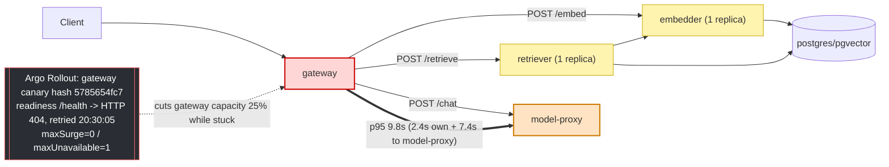

# Postmortem: gateway latency error budget burning slowly (10% of the 28d budget in 6h; 30m & 6h windows)

- **Status:** open
- **Severity:** sev2
- **Verified:** no
- **Opened:** 2026-08-04 20:58:47Z
- **Resolved:** (still open)

## Timeline (machine-generated)

All times UTC on 2026-08-04 unless a full date is shown.

| Time (UTC) | Source | Event |
| --- | --- | --- |
| 20:58:10Z | alert | alert firing: SLO gateway latency — slow burn |

## Evidence links

- [Loki — logs over the incident window](http://localhost:3001/explore?schemaVersion=1&panes=%7B%22pm%22%3A+%7B%22datasource%22%3A+%22loki%22%2C+%22queries%22%3A+%5B%7B%22refId%22%3A+%22A%22%2C+%22datasource%22%3A+%7B%22type%22%3A+%22loki%22%2C+%22uid%22%3A+%22loki%22%7D%2C+%22expr%22%3A+%22%7Bnamespace%3D%5C%22subject%5C%22%7D+%7C~+%5C%22%28%3Fi%29error%7Cfailed%5C%22%22%7D%5D%2C+%22range%22%3A+%7B%22from%22%3A+%221785877127222%22%2C+%22to%22%3A+%221785879990179%22%7D%7D%7D&orgId=1)
- [Mimir — metrics over the incident window](http://localhost:3001/explore?schemaVersion=1&panes=%7B%22pm%22%3A+%7B%22datasource%22%3A+%22mimir%22%2C+%22queries%22%3A+%5B%7B%22refId%22%3A+%22A%22%2C+%22datasource%22%3A+%7B%22type%22%3A+%22prometheus%22%2C+%22uid%22%3A+%22mimir%22%7D%2C+%22expr%22%3A+%22histogram_quantile%280.95%2C+sum%28rate%28http_server_duration_milliseconds_bucket%5B5m%5D%29%29+by+%28le%29%29%22%7D%5D%2C+%22range%22%3A+%7B%22from%22%3A+%221785877127222%22%2C+%22to%22%3A+%221785879990179%22%7D%7D%7D&orgId=1)

## Investigation context

**Runbook match:** none — no tool narrowing applied for this alert. Available runbooks: README.md, canary-abort.md, ci-pipeline-red.md, dq-freshness-stall.md, gateway-high-error-rate.md, k8s-crashloop.md, k8s-node-failure.md, snapshot-agent-audit.md, stale-secret.md

Pre-check battery (as injected at run start)

## Pre-check leads

### recent_deploys — LEAD
No deploy in the last 60m — rule out the reflex answer.
- No deploy in the last 60m — rule out the reflex answer.

### attribution — LEAD
errors concentrate on gateway → POST model-proxy (11.8%); time concentrates in model-proxy's own handler (~7.4s of 7.4s) over the last 10m — which is not necessarily the workload named on the alert:
- gateway: 4.8% of its OWN responses are 5xx (10m)
- model-proxy: 2.3% of its OWN responses are 5xx (10m)
- gateway → POST model-proxy: 11.8% of those outbound calls failed
- own-handler p95 (server p95 minus its slowest outbound call — a ranking, not a measurement): model-proxy ~7.4s of 7.4s end to end, gateway ~2.4s of 9.8s end to end, embedder ~1.8s of 1.8s… (truncated)
- gateway → POST model-proxy: p95 7.3s outbound
- gateway → POST embedder: p95 1.8s outbound

### rollout_state — LEAD
1 rollout-state lead
- analysisrun for gateway (gateway-8444846b5f-21-1): Failed — Metric "canary-error-rate" assessed Failed due to failed (2) > failureLimit (1)

### kube_scan — OK
all pods Ready, no notable cluster events

### log_spike — OK
error/failed log rate normal: 200/10min vs baseline 500/10min

### secret_age — OK
Secret subject-db-credentials last modified 10d 21h ago (created 10d 21h ago).

## Narrative

## Summary
The `SLO gateway latency — slow burn` alert fired on a 30m/6h error-budget burn (10% of the 28d budget consumed in 6h). No runbook matched this exact alertname, so this was worked from telemetry directly (`gateway-high-error-rate.md`'s "attribute before explaining" method and `canary-abort.md`'s AnalysisRun-reading steps were used as the closest analogues).

## Impact
Gateway end-to-end p95 latency spiked from a ~4.75ms baseline to the histogram's 10s bucket ceiling across five distinct episodes in the 6h window (approx. 18:29, 19:00, 19:20, 19:44, and 20:44 — the last one still elevated (9.5s p95) at the moment the alert crossed threshold). Gateway request throughput also surged from ~1.2 req/s baseline to 11–16 req/s during each episode. No 5xx spike accompanied it (gateway 4.8% / model-proxy 2.3% own 5xx over the last 10m — background noise, not the story) and no OOM/CPU pressure was observed anywhere — this was a pure latency incident.

## Root cause
Two distinct, evidenced problems share the 6h window:

**1) Gateway canary capacity churn (the proximate cause of the alert-triggering episode).** `kubectl describe rollout gateway` and `k8s_events` show the Rollout has churned through over 20 revisions, leaving a trail of abandoned ReplicaSets. The one active in the final episode, pod-template-hash `5785654fc7` (same image build as stable, `10f24bc` — not a code regression), was retried starting at 20:30:05. Its pod (`gateway-5785654fc7-p97mq`) failed its `/health` readiness probe with **HTTP 404 continuously, every 5 seconds, for minutes on end** (`Unhealthy` events x1 through x22+, no successful readiness ever observed). Because the Rollout's canary strategy is `maxSurge: 0` / `maxUnavailable: 1`, that retry scaled a stable pod down *before* its replacement could serve traffic — cutting gateway's effective capacity by 25% for the duration of the stuck attempt. A separate, already self-healed instance of the same churn (hash `8444846b5f`, revision 21) had earlier failed its `canary-error-rate` AnalysisRun outright (93% error rate, `failed(2) > failureLimit(1)`) and was auto-aborted by Argo Rollouts within about a minute — not the source of the still-active burn, but evidence this Rollout has been repeatedly serving broken revisions.

That capacity loss, layered on the environment's existing bursty traffic pattern, backed up work inside **model-proxy**: Tempo traces from the final episode show individual model-proxy spans of 3.2–5.3s each, while its pods' CPU stayed at 1–5% of a core and memory flat around 100Mi (`kubectl top`, Mimir `container_cpu_usage_seconds_total`/`container_memory_working_set_bytes`) — a queuing signature, not resource exhaustion. The precheck attribution lead confirms this: of gateway's 9.8s p95 in the last 10 minutes, only 2.4s was gateway's own overhead; the remaining ~7.4s was the outbound call to model-proxy, and *all* of that 7.4s was model-proxy's own handling — nothing further downstream was implicated.

**2) Single-replica embedder/retriever (secondary, drove 3 of the 5 episodes).** `kubectl get deployments` shows `embedder` and `retriever` each run exactly 1 replica. Their p95 latency curves are near-identical throughout the window (retriever calls embedder in this pipeline), and both spiked in lockstep to 2.5–9.7s during the 19:00/19:20/19:44 episodes — classic single-replica-can't-absorb-a-burst behaviour, independent of the gateway rollout problem. By the final (20:44) episode both had already recovered while gateway/model-proxy had not, confirming they are a separate, secondary contributor to the overall 6h budget burn rather than the cause of the alert-triggering episode.

No fresh CI-driven deploy explains any of this — `deploy_history` shows nothing shipped to `subject` in the relevant window besides the two Rollout syncs at 18:56/19:01 already accounted for above; the only CI activity nearby was an unrelated `load-generator` commit that failed its own test and was reverted.

## What fixed it
Nothing executed. By the time this was investigated, the acute condition had already self-resolved: gateway showed 4/4 pods `Running` with 0 restarts, model-proxy p95 was back at ~4.75ms baseline, and gateway request rate was back to ~1.2 req/s. A remediation was still proposed to hedge against recurrence — scaling `embedder` from 1 to 3 replicas, since it's a plain Deployment (unlike gateway/model-proxy, which are Argo-Rollout-managed via `workloadRef`; a dry-run confirmed `scale_deployment` against model-proxy is a no-op there, patching `spec.replicas: 0 -> 6` on a Deployment the Rollout permanently pins to 0) — but the operator **denied** the approval request. Per policy, no remediation was executed and it was not retried. The alert remains **active** (`alert_status` still reports `active: true`) at the close of this investigation.

## Lessons
- Find and stop whatever is repeatedly re-triggering the broken gateway canary (hash `5785654fc7`, `/health` → 404 despite an unchanged image) — it fired again at 20:30 having apparently already failed once earlier in the window. Clean up the stale ReplicaSet so it can't be retried again, and fix the readiness probe/startup ordering in that revision's template.
- `maxSurge: 0` / `maxUnavailable: 1` on gateway and model-proxy means *any* stuck canary directly costs 25% of serving capacity with zero slack. Consider `maxSurge: 1` (or a larger baseline replica count) so canary churn stops being an SLO risk.
- embedder and retriever are single points of failure for latency under the load pattern already present in this environment; they need at least 2 replicas each — this was proposed and denied this time, so it remains open.
- Author a runbook for `SLO gateway latency — slow burn` specifically: it should point responders at per-service p95 + own-handler attribution first (the named alert service is not necessarily the origin), at Rollout/ReplicaSet churn as a capacity-reduction vector distinct from the already-documented AnalysisRun-failure path, and should flag that `scale_deployment` is a no-op against Rollout-managed (`workloadRef`) Deployments.

