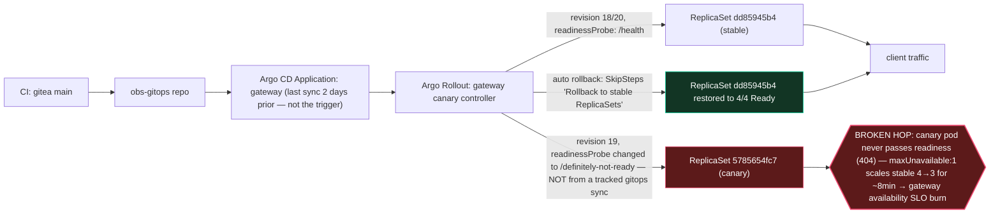

# Postmortem: gateway availability error budget burning slowly (10% of the 28d budget in 6h; 30m & 6h windows)

- **Status:** open
- **Severity:** sev2
- **Verified:** no
- **Opened:** 2026-08-04 18:48:44Z
- **Resolved:** (still open)

## Timeline (machine-generated)

All times UTC on 2026-08-04 unless a full date is shown.

| Time (UTC) | Source | Event |
| --- | --- | --- |
| 18:30:05Z | k8s | Rollout/gateway: RolloutUpdated |
| 18:30:05Z | k8s | Rollout/gateway: RolloutNotCompleted |
| 18:30:05Z | k8s | Rollout/gateway: NewReplicaSetCreated |
| 18:30:06Z | k8s | Pod/gateway-dd85945b4-jfd54: Killing |
| 18:30:06Z | k8s | ReplicaSet/gateway-dd85945b4: SuccessfulDelete |
| 18:30:06Z | k8s | Rollout/gateway: ScalingReplicaSet |
| 18:30:07Z | k8s | ReplicaSet/gateway-5785654fc7: SuccessfulCreate |
| 18:30:07Z | k8s | Pod/gateway-5785654fc7-p97mq: Scheduled |
| 18:30:10Z | k8s | Pod/gateway-5785654fc7-p97mq: Started |
| 18:30:10Z | k8s | Pod/gateway-5785654fc7-p97mq: Pulled |
| 18:30:10Z | k8s | Pod/gateway-5785654fc7-p97mq: Created |
| 18:30:16Z | k8s | Pod/gateway-5785654fc7-p97mq: Unhealthy |
| 18:30:21Z | k8s | Pod/gateway-5785654fc7-p97mq: Unhealthy |
| 18:30:26Z | k8s | Pod/gateway-5785654fc7-p97mq: Unhealthy |
| 18:30:31Z | k8s | Pod/gateway-5785654fc7-p97mq: Unhealthy |
| 18:30:36Z | k8s | Pod/gateway-5785654fc7-p97mq: Unhealthy |
| 18:30:41Z | k8s | Pod/gateway-5785654fc7-p97mq: Unhealthy |
| 18:30:46Z | k8s | Pod/gateway-5785654fc7-p97mq: Unhealthy |
| 18:30:51Z | k8s | Pod/gateway-5785654fc7-p97mq: Unhealthy |
| 18:30:56Z | k8s | Pod/gateway-5785654fc7-p97mq: Unhealthy |
| 18:31:01Z | k8s | Pod/gateway-5785654fc7-p97mq: Unhealthy |
| 18:31:06Z | k8s | Pod/gateway-5785654fc7-p97mq: Unhealthy |
| 18:31:11Z | k8s | Pod/gateway-5785654fc7-p97mq: Unhealthy |
| 18:31:16Z | k8s | Pod/gateway-5785654fc7-p97mq: Unhealthy |
| 18:31:21Z | k8s | Pod/gateway-5785654fc7-p97mq: Unhealthy |
| 18:31:25Z | k8s | Pod/gateway-5785654fc7-p97mq: Unhealthy |
| 18:31:30Z | k8s | Pod/gateway-5785654fc7-p97mq: Unhealthy |
| 18:31:35Z | k8s | Pod/gateway-5785654fc7-p97mq: Unhealthy |
| 18:31:40Z | k8s | Pod/gateway-5785654fc7-p97mq: Unhealthy |
| 18:31:45Z | k8s | Pod/gateway-5785654fc7-p97mq: Unhealthy |
| 18:31:50Z | k8s | Pod/gateway-5785654fc7-p97mq: Unhealthy |
| 18:31:55Z | k8s | Pod/gateway-5785654fc7-p97mq: Unhealthy |
| 18:32:00Z | k8s | Pod/gateway-5785654fc7-p97mq: Unhealthy |
| 18:32:05Z | k8s | Pod/gateway-5785654fc7-p97mq: Unhealthy |
| 18:32:10Z | k8s | Pod/gateway-5785654fc7-p97mq: Unhealthy |
| 18:32:15Z | k8s | Pod/gateway-5785654fc7-p97mq: Unhealthy |
| 18:35:19Z | k8s | Pod/gateway-5785654fc7-p97mq: Unhealthy |
| 18:38:48Z | k8s | Rollout/gateway: SkipSteps |
| 18:38:48Z | k8s | Rollout/gateway: RolloutUpdated |
| 18:38:49Z | k8s | Pod/gateway-5785654fc7-p97mq: Killing |
| 18:38:49Z | k8s | ReplicaSet/gateway-5785654fc7: SuccessfulDelete |
| 18:38:49Z | k8s | Rollout/gateway: ScalingReplicaSet |
| 18:38:50Z | k8s | ReplicaSet/gateway-dd85945b4: SuccessfulCreate |
| 18:38:50Z | k8s | Rollout/gateway: ScalingReplicaSet |
| 18:38:50Z | k8s | Pod/gateway-dd85945b4-mm7jm: Scheduled |
| 18:38:53Z | k8s | Pod/gateway-dd85945b4-mm7jm: Started |
| 18:38:53Z | k8s | Pod/gateway-dd85945b4-mm7jm: Pulled |
| 18:38:53Z | k8s | Pod/gateway-dd85945b4-mm7jm: Created |
| 18:48:10Z | alert | alert firing: SLO gateway availability — slow burn |

## Evidence links

- [Loki — logs over the incident window](http://localhost:3001/explore?schemaVersion=1&panes=%7B%22pm%22%3A+%7B%22datasource%22%3A+%22loki%22%2C+%22queries%22%3A+%5B%7B%22refId%22%3A+%22A%22%2C+%22datasource%22%3A+%7B%22type%22%3A+%22loki%22%2C+%22uid%22%3A+%22loki%22%7D%2C+%22expr%22%3A+%22%7Bnamespace%3D%5C%22subject%5C%22%7D+%7C~+%5C%22%28%3Fi%29error%7Cfailed%5C%22%22%7D%5D%2C+%22range%22%3A+%7B%22from%22%3A+%221785869324326%22%2C+%22to%22%3A+%221785869708394%22%7D%7D%7D&orgId=1)
- [Mimir — metrics over the incident window](http://localhost:3001/explore?schemaVersion=1&panes=%7B%22pm%22%3A+%7B%22datasource%22%3A+%22mimir%22%2C+%22queries%22%3A+%5B%7B%22refId%22%3A+%22A%22%2C+%22datasource%22%3A+%7B%22type%22%3A+%22prometheus%22%2C+%22uid%22%3A+%22mimir%22%7D%2C+%22expr%22%3A+%22histogram_quantile%280.95%2C+sum%28rate%28http_server_duration_milliseconds_bucket%5B5m%5D%29%29+by+%28le%29%29%22%7D%5D%2C+%22range%22%3A+%7B%22from%22%3A+%221785869324326%22%2C+%22to%22%3A+%221785869708394%22%7D%7D%7D&orgId=1)

## Investigation context

**Runbook match:** none — no tool narrowing applied for this alert. Available runbooks: README.md, canary-abort.md, ci-pipeline-red.md, dq-freshness-stall.md, gateway-high-error-rate.md, k8s-crashloop.md, k8s-node-failure.md, snapshot-agent-audit.md, stale-secret.md

Pre-check battery (as injected at run start)

## Pre-check leads

### recent_deploys — LEAD
No deploy in the last 60m — rule out the reflex answer.
- No deploy in the last 60m — rule out the reflex answer.

### kube_scan — LEAD
17 kube-scan leads
- event Pod/gateway-5785654fc7-p97mq: Unhealthy — Readiness probe failed: HTTP probe failed with statuscode: 404 (at 20:31:01)
- event Pod/gateway-5785654fc7-p97mq: Unhealthy — Readiness probe failed: HTTP probe failed with statuscode: 404 (at 20:31:06)
- event Pod/gateway-5785654fc7-p97mq: Unhealthy — Readiness probe failed: HTTP probe failed with statuscode: 404 (at 20:31:11)
- event Pod/gateway-5785654fc7-p97mq: Unhealthy — Readiness probe failed: HTTP probe failed with statuscode: 404 (at 20:31:16)
- event Pod/gateway-5785654fc7-p97mq: Unhealthy — Readiness probe failed: HTTP probe failed with statuscode: 404 (at 20:31:21)
- event Pod/gateway-5785654fc7-p97mq: Unhealthy — Readiness probe failed: HTTP probe failed with statuscode: 404 (at 20:31:25
… (section truncated)

### log_spike — OK
error/failed log rate normal: 2/10min vs baseline 0/10min

### rollout_state — OK
gateway and model-proxy rollouts stable, no failed analysis

### secret_age — OK
Secret subject-db-credentials last modified 10d 19h ago (created 10d 19h ago).

## Narrative

## Summary

`SLO gateway availability — slow burn` (sev2) fired for tenant `acme`, reporting 10% of the 28-day error budget burned in 6h. Investigation traced this to a ~8-minute capacity reduction on the `gateway` Argo Rollout caused by a canary revision deployed with a broken readiness probe. The Rollout's own automatic canary-failure rollback had already fixed it minutes before this investigation began; live metrics confirm sustained recovery.

## Impact

For roughly 8 minutes, the `gateway` Rollout canary strategy (`maxUnavailable: 1`) scaled the stable ReplicaSet (`gateway-dd85945b4`) down from 4 → 3 ready pods while promoting one canary pod (`gateway-5785654fc7-p97mq`, revision 19) that could never pass readiness — a sustained ~25% serving-capacity cut plus continuous readiness-probe failures on the canary pod. Gateway error-rate telemetry (`request_duration_seconds_count` by `http_status_code`) shows the 404/500/502/504 share of traffic rising from a 0% baseline to ~7% for the duration of the bad revision, then dropping back to a flat 0% once the rollback completed — see the attached chart artifact.

## Root cause

`kubectl describe replicaset gateway-5785654fc7` (Rollout revision 19, created 20:30:05 local) shows its pod template's readiness probe pointed at `http-get http://:http/definitely-not-ready` instead of the stable template's `http://:http/health` — an intentionally-broken path. `kubectl_events` confirms the resulting pod (`gateway-5785654fc7-p97mq`) failed its readiness probe with HTTP 404 continuously from creation until it was deleted. Critically, `argo_app gateway` shows no Application sync since 2026-08-02 (revision `bb634a3cd9c3`) — this Rollout revision bump (19) did **not** come through the tracked GitOps path (`gitea_ci_runs`/`gitea_compare` also show no gateway-related merge in the preceding 6h). The bad revision's pod template originated from a direct, out-of-gitops change to the workload the Rollout tracks, not from a reviewed commit — a process gap worth closing, distinct from the immediate fix.

## What fixed it

No manual remediation was required or executed: Argo Rollouts' own canary-analysis/rollback logic caught the failing canary and emitted `SkipSteps: "Rollback to stable ReplicaSets"`, updating the Rollout to revision 20, scaling `gateway-5785654fc7` back to 0 and restoring `gateway-dd85945b4` to 4/4 ready — all before this investigation reached a remediation decision. Verified independently via: (1) `rollout_status gateway` → phase `Healthy`, step 4/4, `stableHash == canaryHash == dd85945b4`, 4/4/4/4 replicas; (2) `kubectl describe deployment gateway` → pod template readiness probe back to `/health`; (3) live Mimir query showing the gateway error-rate share at a flat 0% for the most recent 5-minute window with zero 404/500/502/504 counts; (4) a full namespace pod sweep showing every workload (`embedder`, `model-proxy`, `postgres`, `redis`, `retriever`, `gateway`) `1/1 Running` with 0 restarts. Because the underlying condition is already gone, no remediation tool (restart/rollback/scale/memory-patch) was dry-run or applied — doing so against an already-stable rollout would have been a no-op at best and risked reintroducing the bad revision at worst (`rollout_undo` would step backward toward revision 19). `alert_status` still reports active at time of writing; this is consistent with a slow-burn SLO alert whose 30m/6h evaluation windows still contain the incident's error spike, and is expected to self-clear as those windows roll forward — not evidence of an unresolved condition.

## Lessons

- No runbook matched `SLO gateway availability — slow burn` exactly; `gateway-high-error-rate.md` was the closest and its diagnostic steps (RED dashboard, Tempo trace pull, downstream `/health` checks) generalize fine, but a dedicated runbook should be authored covering: check `rollout_status`/`argo_app` for an in-flight or recently-aborted canary and diff the canary ReplicaSet's probe/env against stable before looking at downstream services.
- Flag for follow-up: revision 19 of the `gateway` Rollout was not backed by any Argo CD Application sync or CI merge in the preceding 6 hours, meaning the workload template was changed out-of-band from GitOps. Worth an access-control review of who/what can patch the `gateway` Deployment/Rollout directly — GitOps drift like this should show as `OutOfSync` and alert on its own.
- The canary strategy's `maxUnavailable: 1` combined with only 4 replicas means a single stuck-NotReady canary costs 25% of capacity immediately at step 1 (`setWeight 25`) — worth a dedicated fast-burn readiness-specific alert so this class of issue pages faster than the 30m/6h SLO window.

