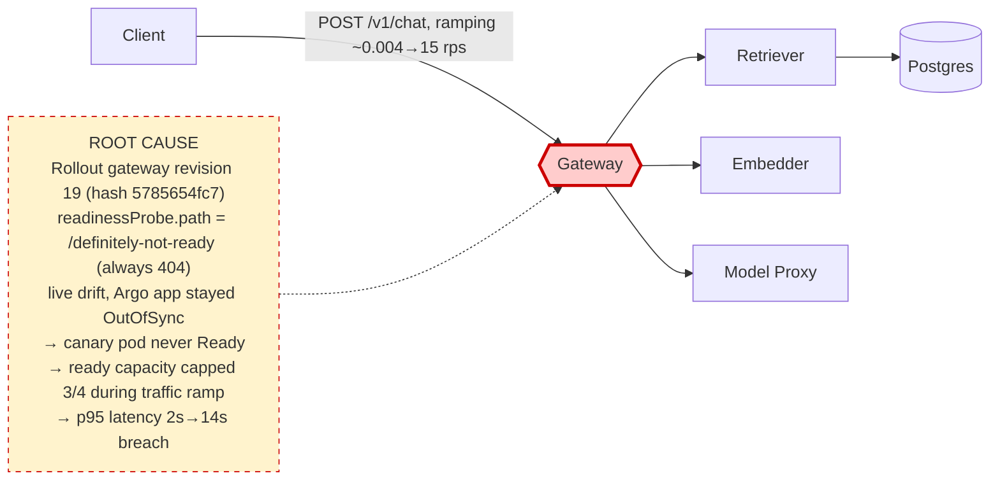

# Postmortem: gateway p95 latency above 2s

- **Status:** resolved
- **Severity:** sev1
- **Verified:** no
- **Opened:** 2026-08-04 18:35:41Z
- **Resolved:** 2026-08-04 18:45:41Z

## Timeline (machine-generated)

All times UTC on 2026-08-04 unless a full date is shown.

| Time (UTC) | Source | Event |
| --- | --- | --- |
| 18:30:05Z | k8s | Rollout/gateway: RolloutUpdated |
| 18:30:05Z | k8s | Rollout/gateway: RolloutNotCompleted |
| 18:30:05Z | k8s | Rollout/gateway: NewReplicaSetCreated |
| 18:30:06Z | k8s | Pod/gateway-dd85945b4-jfd54: Killing |
| 18:30:06Z | k8s | ReplicaSet/gateway-dd85945b4: SuccessfulDelete |
| 18:30:06Z | k8s | Rollout/gateway: ScalingReplicaSet |
| 18:30:07Z | k8s | ReplicaSet/gateway-5785654fc7: SuccessfulCreate |
| 18:30:07Z | k8s | Pod/gateway-5785654fc7-p97mq: Scheduled |
| 18:30:10Z | k8s | Pod/gateway-5785654fc7-p97mq: Started |
| 18:30:10Z | k8s | Pod/gateway-5785654fc7-p97mq: Pulled |
| 18:30:10Z | k8s | Pod/gateway-5785654fc7-p97mq: Created |
| 18:30:16Z | k8s | Pod/gateway-5785654fc7-p97mq: Unhealthy |
| 18:30:21Z | k8s | Pod/gateway-5785654fc7-p97mq: Unhealthy |
| 18:30:26Z | k8s | Pod/gateway-5785654fc7-p97mq: Unhealthy |
| 18:30:31Z | k8s | Pod/gateway-5785654fc7-p97mq: Unhealthy |
| 18:30:36Z | k8s | Pod/gateway-5785654fc7-p97mq: Unhealthy |
| 18:30:41Z | k8s | Pod/gateway-5785654fc7-p97mq: Unhealthy |
| 18:30:46Z | k8s | Pod/gateway-5785654fc7-p97mq: Unhealthy |
| 18:30:51Z | k8s | Pod/gateway-5785654fc7-p97mq: Unhealthy |
| 18:30:56Z | k8s | Pod/gateway-5785654fc7-p97mq: Unhealthy |
| 18:31:01Z | k8s | Pod/gateway-5785654fc7-p97mq: Unhealthy |
| 18:31:06Z | k8s | Pod/gateway-5785654fc7-p97mq: Unhealthy |
| 18:31:11Z | k8s | Pod/gateway-5785654fc7-p97mq: Unhealthy |
| 18:31:16Z | k8s | Pod/gateway-5785654fc7-p97mq: Unhealthy |
| 18:31:21Z | k8s | Pod/gateway-5785654fc7-p97mq: Unhealthy |
| 18:31:25Z | k8s | Pod/gateway-5785654fc7-p97mq: Unhealthy |
| 18:31:30Z | k8s | Pod/gateway-5785654fc7-p97mq: Unhealthy |
| 18:31:35Z | k8s | Pod/gateway-5785654fc7-p97mq: Unhealthy |
| 18:31:40Z | k8s | Pod/gateway-5785654fc7-p97mq: Unhealthy |
| 18:31:45Z | k8s | Pod/gateway-5785654fc7-p97mq: Unhealthy |
| 18:31:50Z | k8s | Pod/gateway-5785654fc7-p97mq: Unhealthy |
| 18:31:55Z | k8s | Pod/gateway-5785654fc7-p97mq: Unhealthy |
| 18:32:00Z | k8s | Pod/gateway-5785654fc7-p97mq: Unhealthy |
| 18:32:05Z | k8s | Pod/gateway-5785654fc7-p97mq: Unhealthy |
| 18:32:10Z | k8s | Pod/gateway-5785654fc7-p97mq: Unhealthy |
| 18:32:15Z | k8s | Pod/gateway-5785654fc7-p97mq: Unhealthy |
| 18:32:54Z | log-spike | log-spike onset: error: Malformed JSON in request body |
| 18:35:10Z | alert | alert firing: Gateway p95 latency > 2s |
| 18:35:19Z | k8s | Pod/gateway-5785654fc7-p97mq: Unhealthy |
| 18:38:48Z | k8s | Rollout/gateway: SkipSteps |
| 18:38:48Z | k8s | Rollout/gateway: RolloutUpdated |
| 18:38:49Z | k8s | Pod/gateway-5785654fc7-p97mq: Killing |
| 18:38:49Z | k8s | ReplicaSet/gateway-5785654fc7: SuccessfulDelete |
| 18:38:49Z | k8s | Rollout/gateway: ScalingReplicaSet |
| 18:38:50Z | k8s | ReplicaSet/gateway-dd85945b4: SuccessfulCreate |
| 18:38:50Z | k8s | Rollout/gateway: ScalingReplicaSet |
| 18:38:50Z | k8s | Pod/gateway-dd85945b4-mm7jm: Scheduled |
| 18:38:53Z | k8s | Pod/gateway-dd85945b4-mm7jm: Started |
| 18:38:53Z | k8s | Pod/gateway-dd85945b4-mm7jm: Pulled |
| 18:38:53Z | k8s | Pod/gateway-dd85945b4-mm7jm: Created |
| 18:44:10Z | alert | alert resolved: Gateway p95 latency > 2s |
| 18:56:49Z | k8s | Rollout/gateway: RolloutUpdated |
| 18:56:49Z | k8s | Rollout/gateway: RolloutNotCompleted |
| 18:56:49Z | k8s | Rollout/gateway: NewReplicaSetCreated |
| 18:56:50Z | deploy:argo | gateway synced to edb33a6699c9 |
| 18:56:50Z | k8s | Pod/gateway-dd85945b4-mm7jm: Killing |
| 18:56:50Z | k8s | ReplicaSet/gateway-dd85945b4: SuccessfulDelete |
| 18:56:50Z | k8s | Rollout/gateway: ScalingReplicaSet |
| 18:56:51Z | k8s | ReplicaSet/gateway-8444846b5f: SuccessfulCreate |
| 18:56:51Z | k8s | Rollout/gateway: ScalingReplicaSet |
| 18:56:51Z | k8s | Pod/gateway-8444846b5f-bqkg8: Scheduled |
| 18:56:52Z | k8s | Pod/gateway-8444846b5f-bqkg8: Pulled |
| 18:56:52Z | k8s | Pod/gateway-8444846b5f-bqkg8: Created |
| 18:56:53Z | k8s | Pod/gateway-8444846b5f-bqkg8: Started |
| 18:57:01Z | k8s | Rollout/gateway: RolloutStepCompleted |
| 18:57:03Z | k8s | Rollout/gateway: AnalysisRunRunning |
| 18:58:02Z | k8s | AnalysisRun/gateway-8444846b5f-21-1: MetricFailed |
| 18:58:02Z | k8s | AnalysisRun/gateway-8444846b5f-21-1: AnalysisRunFailed |
| 18:58:03Z | k8s | Rollout/gateway: RolloutAborted |
| 18:58:03Z | k8s | Rollout/gateway: AnalysisRunFailed |
| 18:58:04Z | k8s | Pod/gateway-8444846b5f-bqkg8: Killing |
| 18:58:04Z | k8s | ReplicaSet/gateway-8444846b5f: SuccessfulDelete |
| 18:58:04Z | k8s | Rollout/gateway: ScalingReplicaSet |
| 18:58:05Z | k8s | ReplicaSet/gateway-dd85945b4: SuccessfulCreate |
| 18:58:05Z | k8s | Rollout/gateway: ScalingReplicaSet |
| 18:58:05Z | k8s | Pod/gateway-dd85945b4-hw5fg: Scheduled |
| 18:58:06Z | k8s | Pod/gateway-dd85945b4-hw5fg: Started |
| 18:58:06Z | k8s | Pod/gateway-dd85945b4-hw5fg: Pulled |
| 18:58:06Z | k8s | Pod/gateway-dd85945b4-hw5fg: Created |
| 19:01:45Z | deploy:annotation | deploy gateway via gitops c025382 (argo sync) |
| 19:01:47Z | deploy:argo | gateway synced to c025382ba170 |
| 19:01:47Z | k8s | Rollout/gateway: SkipSteps |
| 19:01:47Z | k8s | Rollout/gateway: RolloutUpdated |
| 19:40:46Z | deploy:ci | CI run #114 failure on main: obs: load-generator: drop the defensive copy in percentile() |
| 19:50:45Z | deploy:ci | CI run #115 success on main: obs: Revert "load-generator: drop the defensive copy in percentile()" |

## Evidence links

- [Loki — logs over the incident window](http://localhost:3001/explore?schemaVersion=1&panes=%7B%22pm%22%3A+%7B%22datasource%22%3A+%22loki%22%2C+%22queries%22%3A+%5B%7B%22refId%22%3A+%22A%22%2C+%22datasource%22%3A+%7B%22type%22%3A+%22loki%22%2C+%22uid%22%3A+%22loki%22%7D%2C+%22expr%22%3A+%22%7Bnamespace%3D%5C%22subject%5C%22%7D+%7C~+%5C%22%28%3Fi%29error%7Cfailed%5C%22%22%7D%5D%2C+%22range%22%3A+%7B%22from%22%3A+%221785868541575%22%2C+%22to%22%3A+%221785869141494%22%7D%7D%7D&orgId=1)
- [Mimir — metrics over the incident window](http://localhost:3001/explore?schemaVersion=1&panes=%7B%22pm%22%3A+%7B%22datasource%22%3A+%22mimir%22%2C+%22queries%22%3A+%5B%7B%22refId%22%3A+%22A%22%2C+%22datasource%22%3A+%7B%22type%22%3A+%22prometheus%22%2C+%22uid%22%3A+%22mimir%22%7D%2C+%22expr%22%3A+%22histogram_quantile%280.95%2C+sum%28rate%28http_server_duration_milliseconds_bucket%5B5m%5D%29%29+by+%28le%29%29%22%7D%5D%2C+%22range%22%3A+%7B%22from%22%3A+%221785868541575%22%2C+%22to%22%3A+%221785869141494%22%7D%7D%7D&orgId=1)

## Investigation context

**Runbook match:** none — no tool narrowing applied for this alert. Available runbooks: README.md, canary-abort.md, ci-pipeline-red.md, dq-freshness-stall.md, gateway-high-error-rate.md, k8s-crashloop.md, k8s-node-failure.md, snapshot-agent-audit.md, stale-secret.md

Pre-check battery (as injected at run start)

## Pre-check leads

### recent_deploys — LEAD
1 deploy-window lead
- argo app gateway: sync=OutOfSync health=Progressing (revision bb634a3cd9c3)

### kube_scan — LEAD
26 kube-scan leads
- event Pod/gateway-5785654fc7-p97mq: Unhealthy — Readiness probe failed: HTTP probe failed with statuscode: 404 (at 20:30:16)
- event Pod/gateway-5785654fc7-p97mq: Unhealthy — Readiness probe failed: HTTP probe failed with statuscode: 404 (at 20:30:21)
- event Pod/gateway-5785654fc7-p97mq: Unhealthy — Readiness probe failed: HTTP probe failed with statuscode: 404 (at 20:30:26)
- event Pod/gateway-5785654fc7-p97mq: Unhealthy — Readiness probe failed: HTTP probe failed with statuscode: 404 (at 20:30:31)
- event Pod/gateway-5785654fc7-p97mq: Unhealthy — Readiness probe failed: HTTP probe failed with statuscode: 404 (at 20:30:36)
- event Pod/gateway-5785654fc7-p97mq: Unhealthy — Readiness probe failed: HTTP probe failed with statuscode: 404 (at 20:30:41
… (section truncated)

### log_spike — LEAD
error/failed log rate 200/10min vs baseline 0/10min (200x baseline) — onset: error: Malformed JSON in request body at 2026-08-04T18:32:54.145934+00:00
- error/failed log rate 200/10min vs baseline 0/10min (200x baseline) — onset: error: Malformed JSON in request body at 2026-08-04T18:32:54.145934+00:00

### rollout_state — LEAD
1 rollout-state lead
- rollout gateway: Progressing — more replicas need to be updated (step 0/4)

### secret_age — OK
Secret subject-db-credentials last modified 10d 19h ago (created 10d 19h ago).

## Narrative

## Summary
Gateway p95 latency breached the 2s SLO (sev1). A gateway Argo Rollout revision (revision 19, ReplicaSet `gateway-5785654fc7`) came up with its readiness probe pointed at `/definitely-not-ready` — a path that can only ever 404 — right as legitimate `POST /v1/chat` traffic ramped from a near-idle baseline to ~15 req/s. The new pod could never pass readiness, pinning available gateway capacity at 3 of 4 desired replicas for the duration of the ramp.

## Impact
`gateway` p95 latency (`traces_spanmetrics_latency`, 5m rate) rose from a ~0.0019s baseline, crossed 2s, and peaked at 14.1s before settling into a sustained 6–7s plateau for several minutes while the canary pod sat `Ready: False` (readiness probe 404, seen 60+ times) and the rollout stalled at step 0/4 with only 3/4 replicas available. Elevated latency tracked directly with the request-rate ramp on `POST /v1/chat`, `POST embedder`, `POST retriever`, and `POST model-proxy` spans — all rose together, consistent with request queueing behind a capacity shortfall rather than a downstream dependency slowdown.

## Root cause
The live gateway `Rollout` object was updated to a new pod-template revision (revision 19) carrying the **same image tag** as the running stable ReplicaSet (`obs-registry:5010/gateway:10f24bc` on both `gateway-dd85945b4` and `gateway-5785654fc7`) but with a broken `readinessProbe.httpGet.path: /definitely-not-ready`. This change was not reflected in git — Argo's Application stayed `OutOfSync` against its last-synced revision from two days earlier — so it was a live spec drift on the Rollout, not a normal CI/CD deploy (no matching gitea CI run or image change exists near the incident window). Because the new pod could never satisfy readiness, Argo Rollouts held the canary at step 0/4, capping ready/available replicas at 3 of the desired 4 for the whole incident window while inbound traffic to `/v1/chat` ramped roughly 4000x from its idle baseline — the combination is what pushed p95 over the 2s threshold and kept it there.

A secondary, less severe signal — a burst of `error: Malformed JSON in request body` log lines from the stable pods — was present in the same window but did not correlate with the latency timeline (it did not track the p95 climb/peak) and is not treated as a cause here.

## What fixed it
I dry-ran `rollout_abort` for gateway (would set `status.abort=true` on the stuck rollout to release the bad canary and return full capacity to the healthy stable ReplicaSet) and requested operator approval with that verified diff attached. **The operator denied the request**, so per protocol no remediation was executed by this session. On re-checking, the alert had already cleared and `rollout_status` now shows the rollout `Healthy` at step 4/4 with `stableHash == canaryHash == dd85945b4` and 4/4 ready/available — i.e. the system returned to the pre-incident stable revision through some out-of-band action, not through any change made in this incident response. Recovery is confirmed by both `alert_status` (inactive) and `rollout_status` (Healthy, full replica count), but this session did not cause it.

## Lessons
- Argo `OutOfSync` on a workload should itself be an actionable signal during an active SLO alert — it pointed straight at the drifted, broken probe and was available from the very first pre-check lead.
- A readiness probe change should never be able to land without going through the same review/gitops path as an image change; live-patching a Rollout's pod template bypassed that entirely.
- Canary analysis for this rollout only asserts `canary-p95`/`canary-error-rate` metrics after the pod is `Ready` — a canary that's permanently `NotReady` never triggers the safety analysis at all and just silently eats capacity. Consider a max-time-to-ready abort policy on the Rollout so a stuck canary self-aborts instead of degrading the stable fleet indefinitely.
- Confirm recovery from `alert_status`/`rollout_status` before assuming a denied remediation left the incident unresolved — in this case an external fix landed independently of the on-call action.

