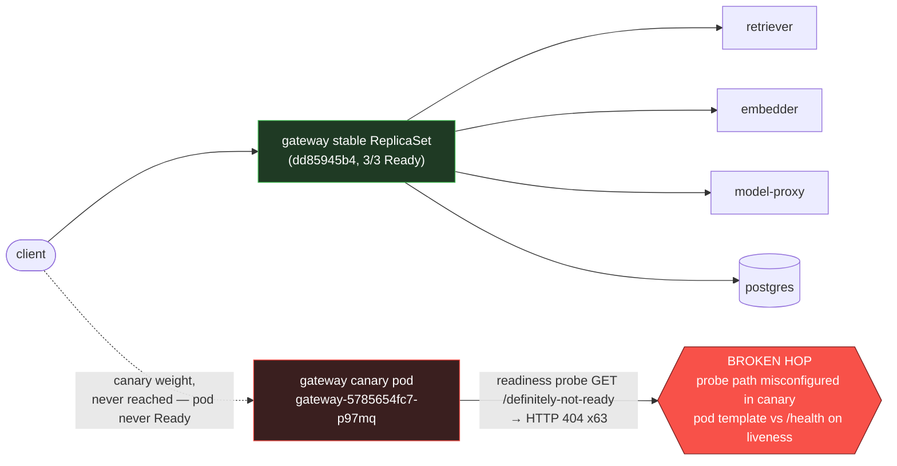

# Postmortem: subject/gateway-5785654fc7-p97mq has been not-ready for 4 minutes (readiness probe or startup trouble)

- **Status:** open
- **Severity:** sev1
- **Verified:** no
- **Opened:** 2026-08-04 18:35:27Z
- **Resolved:** (still open)

## Timeline (machine-generated)

All times UTC on 2026-08-04 unless a full date is shown.

| Time (UTC) | Source | Event |
| --- | --- | --- |
| 18:30:05Z | k8s | Rollout/gateway: RolloutUpdated |
| 18:30:05Z | k8s | Rollout/gateway: RolloutNotCompleted |
| 18:30:05Z | k8s | Rollout/gateway: NewReplicaSetCreated |
| 18:30:06Z | k8s | Pod/gateway-dd85945b4-jfd54: Killing |
| 18:30:06Z | k8s | ReplicaSet/gateway-dd85945b4: SuccessfulDelete |
| 18:30:06Z | k8s | Rollout/gateway: ScalingReplicaSet |
| 18:30:07Z | k8s | ReplicaSet/gateway-5785654fc7: SuccessfulCreate |
| 18:30:07Z | k8s | Pod/gateway-5785654fc7-p97mq: Scheduled |
| 18:30:10Z | k8s | Pod/gateway-5785654fc7-p97mq: Started |
| 18:30:10Z | k8s | Pod/gateway-5785654fc7-p97mq: Pulled |
| 18:30:10Z | k8s | Pod/gateway-5785654fc7-p97mq: Created |
| 18:30:16Z | k8s | Pod/gateway-5785654fc7-p97mq: Unhealthy |
| 18:30:21Z | k8s | Pod/gateway-5785654fc7-p97mq: Unhealthy |
| 18:30:26Z | k8s | Pod/gateway-5785654fc7-p97mq: Unhealthy |
| 18:30:31Z | k8s | Pod/gateway-5785654fc7-p97mq: Unhealthy |
| 18:30:36Z | k8s | Pod/gateway-5785654fc7-p97mq: Unhealthy |
| 18:30:41Z | k8s | Pod/gateway-5785654fc7-p97mq: Unhealthy |
| 18:30:46Z | k8s | Pod/gateway-5785654fc7-p97mq: Unhealthy |
| 18:30:51Z | k8s | Pod/gateway-5785654fc7-p97mq: Unhealthy |
| 18:30:56Z | k8s | Pod/gateway-5785654fc7-p97mq: Unhealthy |
| 18:31:01Z | k8s | Pod/gateway-5785654fc7-p97mq: Unhealthy |
| 18:31:06Z | k8s | Pod/gateway-5785654fc7-p97mq: Unhealthy |
| 18:31:11Z | k8s | Pod/gateway-5785654fc7-p97mq: Unhealthy |
| 18:31:16Z | k8s | Pod/gateway-5785654fc7-p97mq: Unhealthy |
| 18:31:21Z | k8s | Pod/gateway-5785654fc7-p97mq: Unhealthy |
| 18:31:25Z | k8s | Pod/gateway-5785654fc7-p97mq: Unhealthy |
| 18:31:30Z | k8s | Pod/gateway-5785654fc7-p97mq: Unhealthy |
| 18:31:35Z | k8s | Pod/gateway-5785654fc7-p97mq: Unhealthy |
| 18:31:40Z | k8s | Pod/gateway-5785654fc7-p97mq: Unhealthy |
| 18:31:45Z | k8s | Pod/gateway-5785654fc7-p97mq: Unhealthy |
| 18:31:50Z | k8s | Pod/gateway-5785654fc7-p97mq: Unhealthy |
| 18:31:55Z | k8s | Pod/gateway-5785654fc7-p97mq: Unhealthy |
| 18:32:00Z | k8s | Pod/gateway-5785654fc7-p97mq: Unhealthy |
| 18:32:05Z | k8s | Pod/gateway-5785654fc7-p97mq: Unhealthy |
| 18:32:10Z | k8s | Pod/gateway-5785654fc7-p97mq: Unhealthy |
| 18:32:15Z | k8s | Pod/gateway-5785654fc7-p97mq: Unhealthy |
| 18:32:21Z | log-spike | log-spike onset: error: Malformed JSON in request body |
| 18:34:50Z | alert | alert firing: KubePodNotReady |
| 18:35:19Z | k8s | Pod/gateway-5785654fc7-p97mq: Unhealthy |

## Evidence links

- [Loki — logs over the incident window](http://localhost:3001/explore?schemaVersion=1&panes=%7B%22pm%22%3A+%7B%22datasource%22%3A+%22loki%22%2C+%22queries%22%3A+%5B%7B%22refId%22%3A+%22A%22%2C+%22datasource%22%3A+%7B%22type%22%3A+%22loki%22%2C+%22uid%22%3A+%22loki%22%7D%2C+%22expr%22%3A+%22%7Bnamespace%3D%5C%22subject%5C%22%7D+%7C~+%5C%22%28%3Fi%29error%7Cfailed%5C%22%22%7D%5D%2C+%22range%22%3A+%7B%22from%22%3A+%221785868527108%22%2C+%22to%22%3A+%221785868690964%22%7D%7D%7D&orgId=1)
- [Mimir — metrics over the incident window](http://localhost:3001/explore?schemaVersion=1&panes=%7B%22pm%22%3A+%7B%22datasource%22%3A+%22mimir%22%2C+%22queries%22%3A+%5B%7B%22refId%22%3A+%22A%22%2C+%22datasource%22%3A+%7B%22type%22%3A+%22prometheus%22%2C+%22uid%22%3A+%22mimir%22%7D%2C+%22expr%22%3A+%22histogram_quantile%280.95%2C+sum%28rate%28http_server_duration_milliseconds_bucket%5B5m%5D%29%29+by+%28le%29%29%22%7D%5D%2C+%22range%22%3A+%7B%22from%22%3A+%221785868527108%22%2C+%22to%22%3A+%221785868690964%22%7D%7D%7D&orgId=1)

## Investigation context

**Runbook match:** none — no tool narrowing applied for this alert. Available runbooks: README.md, canary-abort.md, ci-pipeline-red.md, dq-freshness-stall.md, gateway-high-error-rate.md, k8s-crashloop.md, k8s-node-failure.md, snapshot-agent-audit.md, stale-secret.md

Pre-check battery (as injected at run start)

## Pre-check leads

### recent_deploys — LEAD
1 deploy-window lead
- argo app gateway: sync=OutOfSync health=Progressing (revision bb634a3cd9c3)

### kube_scan — LEAD
26 kube-scan leads
- event Pod/gateway-5785654fc7-p97mq: Unhealthy — Readiness probe failed: HTTP probe failed with statuscode: 404 (at 20:30:16)
- event Pod/gateway-5785654fc7-p97mq: Unhealthy — Readiness probe failed: HTTP probe failed with statuscode: 404 (at 20:30:21)
- event Pod/gateway-5785654fc7-p97mq: Unhealthy — Readiness probe failed: HTTP probe failed with statuscode: 404 (at 20:30:26)
- event Pod/gateway-5785654fc7-p97mq: Unhealthy — Readiness probe failed: HTTP probe failed with statuscode: 404 (at 20:30:31)
- event Pod/gateway-5785654fc7-p97mq: Unhealthy — Readiness probe failed: HTTP probe failed with statuscode: 404 (at 20:30:36)
- event Pod/gateway-5785654fc7-p97mq: Unhealthy — Readiness probe failed: HTTP probe failed with statuscode: 404 (at 20:30:41
… (section truncated)

### log_spike — LEAD
error/failed log rate 200/10min vs baseline 0/10min (200x baseline) — onset: error: Malformed JSON in request body at 2026-08-04T18:32:21.164990+00:00
- error/failed log rate 200/10min vs baseline 0/10min (200x baseline) — onset: error: Malformed JSON in request body at 2026-08-04T18:32:21.164990+00:00

### rollout_state — LEAD
1 rollout-state lead
- rollout gateway: Progressing — more replicas need to be updated (step 0/4)

### secret_age — OK
Secret subject-db-credentials last modified 10d 19h ago (created 10d 19h ago).

## Narrative

## Summary
`KubePodNotReady` fired for `subject/gateway-5785654fc7-p97mq`, the single canary replica of the `gateway` Argo Rollout. The pod has been stuck `Ready: False` continuously since it started, failing its readiness probe on every check.

## Impact
Blast radius was contained: the 3 stable replicas (`gateway-dd85945b4-*`, pod-template-hash `dd85945b4`) stayed `Ready: True` for the entire window and continued serving all real traffic — `kube_pod_status_ready` for those pods is a flat `1` throughout. Only the canary pod, 1 of 4 desired replicas for this Rollout step, was affected, and because it was never marked Ready it never received real client traffic (zero application log lines were ever emitted by that pod). The Rollout itself is wedged at step 0/4 and cannot progress until the bad revision is dealt with.

## Root cause
`kubectl describe pod gateway-5785654fc7-p97mq` shows the canary's readiness probe configured as `http-get http://:http/definitely-not-ready` (period 5s, failure threshold 3) — a nonexistent path — while the liveness probe on the same container correctly targets `http-get http://:http/health` and has never failed (container `Running`, 0 restarts). This is a broken probe path baked into the canary's pod template by the current Argo sync (Application `gateway` is `OutOfSync`/`Progressing` at revision `bb634a3cd9c3`), not an application-level crash or overload: the process is healthy and answering `/health` fine, it is simply being probed against a path that will 404 by construction. Kubernetes event stream confirms 63 consecutive `Unhealthy` readiness failures (`statuscode: 404`) over 5m50s.

A separate, unrelated symptom was investigated and ruled out as a contributor: a burst of `error: Malformed JSON in request body` log lines (~200/10min vs 0 baseline) is occurring, but exclusively on the **stable** pods (`gateway-dd85945b4-*`), not the canary — it does not touch readiness and is not part of this incident's causal chain.

## What fixed it
Nothing yet — remediation was **not applied**. The proposed fix (`rollout_abort` on the `gateway` Rollout, to stop the wedged canary from continuing to hold a broken pod-template and fall back cleanly to the 3/3 healthy stable replicas) was dry-run successfully (`status.abort=true` patch) but the operator **denied** the approval request. Per policy, no further remediation was attempted after the denial. `alert_status` was re-queried and `KubePodNotReady` is still **active** (firing since 18:34:50Z). The incident remains open; the canary pod will continue failing readiness until either the rollout is aborted/rolled back or the gitops manifest's readiness probe path is corrected and re-synced.

## Lessons
- The canary pod-template's readiness probe path diverges from its own liveness probe path (`/definitely-not-ready` vs `/health`) — this should be caught by a pre-merge manifest lint/diff check in the gitops pipeline before Argo syncs it.
- Because the Rollout gates traffic on readiness, this class of bug is safely contained to the canary weight and never reaches real users — but it does silently wedge the Rollout indefinitely (no automatic abort-on-probe-failure), so `KubePodNotReady` + rollout step stuck at 0/4 should be the standard pairing to alert on for "bad canary probe" going forward. No runbook currently matches `KubePodNotReady` — worth authoring one that starts with "diff the probe path against the sibling stable ReplicaSet" given how fast that isolated this case.
- Don't conflate concurrent-but-unrelated log signals: the malformed-JSON spike on stable pods looked alarming in the pre-check leads but had zero bearing on this alert; correlating alert scope (which pod/hash) against symptom scope (which pod/hash) rules it out quickly.

