# Postmortem: gateway availability error budget burning slowly (10% of the 28d budget in 6h; 30m & 6h windows)

- **Status:** open
- **Severity:** sev2
- **Verified:** no
- **Opened:** 2026-08-04 18:48:44Z
- **Resolved:** (still open)

## Timeline (machine-generated)

All times UTC on 2026-08-04 unless a full date is shown.

| Time (UTC) | Source | Event |
| --- | --- | --- |
| 18:30:05Z | k8s | Rollout/gateway: RolloutUpdated |
| 18:30:05Z | k8s | Rollout/gateway: RolloutNotCompleted |
| 18:30:05Z | k8s | Rollout/gateway: NewReplicaSetCreated |
| 18:30:06Z | k8s | Pod/gateway-dd85945b4-jfd54: Killing |
| 18:30:06Z | k8s | ReplicaSet/gateway-dd85945b4: SuccessfulDelete |
| 18:30:06Z | k8s | Rollout/gateway: ScalingReplicaSet |
| 18:30:07Z | k8s | ReplicaSet/gateway-5785654fc7: SuccessfulCreate |
| 18:30:07Z | k8s | Pod/gateway-5785654fc7-p97mq: Scheduled |
| 18:30:10Z | k8s | Pod/gateway-5785654fc7-p97mq: Started |
| 18:30:10Z | k8s | Pod/gateway-5785654fc7-p97mq: Pulled |
| 18:30:10Z | k8s | Pod/gateway-5785654fc7-p97mq: Created |
| 18:30:16Z | k8s | Pod/gateway-5785654fc7-p97mq: Unhealthy |
| 18:30:21Z | k8s | Pod/gateway-5785654fc7-p97mq: Unhealthy |
| 18:30:26Z | k8s | Pod/gateway-5785654fc7-p97mq: Unhealthy |
| 18:30:31Z | k8s | Pod/gateway-5785654fc7-p97mq: Unhealthy |
| 18:30:36Z | k8s | Pod/gateway-5785654fc7-p97mq: Unhealthy |
| 18:30:41Z | k8s | Pod/gateway-5785654fc7-p97mq: Unhealthy |
| 18:30:46Z | k8s | Pod/gateway-5785654fc7-p97mq: Unhealthy |
| 18:30:51Z | k8s | Pod/gateway-5785654fc7-p97mq: Unhealthy |
| 18:30:56Z | k8s | Pod/gateway-5785654fc7-p97mq: Unhealthy |
| 18:31:01Z | k8s | Pod/gateway-5785654fc7-p97mq: Unhealthy |
| 18:31:06Z | k8s | Pod/gateway-5785654fc7-p97mq: Unhealthy |
| 18:31:11Z | k8s | Pod/gateway-5785654fc7-p97mq: Unhealthy |
| 18:31:16Z | k8s | Pod/gateway-5785654fc7-p97mq: Unhealthy |
| 18:31:21Z | k8s | Pod/gateway-5785654fc7-p97mq: Unhealthy |
| 18:31:25Z | k8s | Pod/gateway-5785654fc7-p97mq: Unhealthy |
| 18:31:30Z | k8s | Pod/gateway-5785654fc7-p97mq: Unhealthy |
| 18:31:35Z | k8s | Pod/gateway-5785654fc7-p97mq: Unhealthy |
| 18:31:40Z | k8s | Pod/gateway-5785654fc7-p97mq: Unhealthy |
| 18:31:45Z | k8s | Pod/gateway-5785654fc7-p97mq: Unhealthy |
| 18:31:50Z | k8s | Pod/gateway-5785654fc7-p97mq: Unhealthy |
| 18:31:55Z | k8s | Pod/gateway-5785654fc7-p97mq: Unhealthy |
| 18:32:00Z | k8s | Pod/gateway-5785654fc7-p97mq: Unhealthy |
| 18:32:05Z | k8s | Pod/gateway-5785654fc7-p97mq: Unhealthy |
| 18:32:10Z | k8s | Pod/gateway-5785654fc7-p97mq: Unhealthy |
| 18:32:15Z | k8s | Pod/gateway-5785654fc7-p97mq: Unhealthy |
| 18:35:19Z | k8s | Pod/gateway-5785654fc7-p97mq: Unhealthy |
| 18:38:48Z | k8s | Rollout/gateway: SkipSteps |
| 18:38:48Z | k8s | Rollout/gateway: RolloutUpdated |
| 18:38:49Z | k8s | Pod/gateway-5785654fc7-p97mq: Killing |
| 18:38:49Z | k8s | ReplicaSet/gateway-5785654fc7: SuccessfulDelete |
| 18:38:49Z | k8s | Rollout/gateway: ScalingReplicaSet |
| 18:38:50Z | k8s | ReplicaSet/gateway-dd85945b4: SuccessfulCreate |
| 18:38:50Z | k8s | Rollout/gateway: ScalingReplicaSet |
| 18:38:50Z | k8s | Pod/gateway-dd85945b4-mm7jm: Scheduled |
| 18:38:53Z | k8s | Pod/gateway-dd85945b4-mm7jm: Started |
| 18:38:53Z | k8s | Pod/gateway-dd85945b4-mm7jm: Pulled |
| 18:38:53Z | k8s | Pod/gateway-dd85945b4-mm7jm: Created |
| 18:48:10Z | alert | alert firing: SLO gateway availability — slow burn |
| 18:55:26Z | verification | recovery NOT verified — deadline armed |
| 18:56:49Z | k8s | Rollout/gateway: RolloutUpdated |
| 18:56:49Z | k8s | Rollout/gateway: RolloutNotCompleted |
| 18:56:49Z | k8s | Rollout/gateway: NewReplicaSetCreated |
| 18:56:50Z | deploy:argo | gateway synced to edb33a6699c9 |
| 18:56:50Z | k8s | Pod/gateway-dd85945b4-mm7jm: Killing |
| 18:56:50Z | k8s | ReplicaSet/gateway-dd85945b4: SuccessfulDelete |
| 18:56:50Z | k8s | Rollout/gateway: ScalingReplicaSet |
| 18:56:51Z | k8s | ReplicaSet/gateway-8444846b5f: SuccessfulCreate |
| 18:56:51Z | k8s | Rollout/gateway: ScalingReplicaSet |
| 18:56:51Z | k8s | Pod/gateway-8444846b5f-bqkg8: Scheduled |
| 18:56:52Z | k8s | Pod/gateway-8444846b5f-bqkg8: Pulled |
| 18:56:52Z | k8s | Pod/gateway-8444846b5f-bqkg8: Created |
| 18:56:53Z | k8s | Pod/gateway-8444846b5f-bqkg8: Started |
| 18:57:01Z | k8s | Rollout/gateway: RolloutStepCompleted |
| 18:57:03Z | k8s | Rollout/gateway: AnalysisRunRunning |
| 18:58:02Z | k8s | AnalysisRun/gateway-8444846b5f-21-1: MetricFailed |
| 18:58:02Z | k8s | AnalysisRun/gateway-8444846b5f-21-1: AnalysisRunFailed |
| 18:58:03Z | k8s | Rollout/gateway: RolloutAborted |
| 18:58:03Z | k8s | Rollout/gateway: AnalysisRunFailed |
| 18:58:04Z | k8s | Pod/gateway-8444846b5f-bqkg8: Killing |
| 18:58:04Z | k8s | ReplicaSet/gateway-8444846b5f: SuccessfulDelete |
| 18:58:04Z | k8s | Rollout/gateway: ScalingReplicaSet |
| 18:58:05Z | k8s | ReplicaSet/gateway-dd85945b4: SuccessfulCreate |
| 18:58:05Z | k8s | Rollout/gateway: ScalingReplicaSet |
| 18:58:05Z | k8s | Pod/gateway-dd85945b4-hw5fg: Scheduled |
| 18:58:06Z | k8s | Pod/gateway-dd85945b4-hw5fg: Started |
| 18:58:06Z | k8s | Pod/gateway-dd85945b4-hw5fg: Pulled |
| 18:58:06Z | k8s | Pod/gateway-dd85945b4-hw5fg: Created |
| 18:59:18Z | log-spike | log-spike onset: error: Malformed JSON in request body |
| 19:01:45Z | deploy:annotation | deploy gateway via gitops c025382 (argo sync) |
| 19:01:47Z | deploy:argo | gateway synced to c025382ba170 |
| 19:01:47Z | k8s | Rollout/gateway: SkipSteps |
| 19:01:47Z | k8s | Rollout/gateway: RolloutUpdated |

## Evidence links

- [Loki — logs over the incident window](http://localhost:3001/explore?schemaVersion=1&panes=%7B%22pm%22%3A+%7B%22datasource%22%3A+%22loki%22%2C+%22queries%22%3A+%5B%7B%22refId%22%3A+%22A%22%2C+%22datasource%22%3A+%7B%22type%22%3A+%22loki%22%2C+%22uid%22%3A+%22loki%22%7D%2C+%22expr%22%3A+%22%7Bnamespace%3D%5C%22subject%5C%22%7D+%7C~+%5C%22%28%3Fi%29error%7Cfailed%5C%22%22%7D%5D%2C+%22range%22%3A+%7B%22from%22%3A+%221785869324326%22%2C+%22to%22%3A+%221785870907517%22%7D%7D%7D&orgId=1)
- [Mimir — metrics over the incident window](http://localhost:3001/explore?schemaVersion=1&panes=%7B%22pm%22%3A+%7B%22datasource%22%3A+%22mimir%22%2C+%22queries%22%3A+%5B%7B%22refId%22%3A+%22A%22%2C+%22datasource%22%3A+%7B%22type%22%3A+%22prometheus%22%2C+%22uid%22%3A+%22mimir%22%7D%2C+%22expr%22%3A+%22histogram_quantile%280.95%2C+sum%28rate%28http_server_duration_milliseconds_bucket%5B5m%5D%29%29+by+%28le%29%29%22%7D%5D%2C+%22range%22%3A+%7B%22from%22%3A+%221785869324326%22%2C+%22to%22%3A+%221785870907517%22%7D%7D%7D&orgId=1)

## Investigation context

**Runbook match:** none — no tool narrowing applied for this alert. Available runbooks: README.md, canary-abort.md, ci-pipeline-red.md, dq-freshness-stall.md, gateway-high-error-rate.md, k8s-crashloop.md, k8s-node-failure.md, snapshot-agent-audit.md, stale-secret.md

Pre-check battery (as injected at run start)

## Pre-check leads

### recent_deploys — LEAD
1 deploy-window lead
- deploy annotation at 2026-08-04T19:01:45.359000+00:00: deploy gateway via gitops c025382 (argo sync)

### kube_scan — LEAD
5 kube-scan leads
- event AnalysisRun/gateway-8444846b5f-21-1: MetricFailed — Metric 'canary-error-rate' Completed. Result: Failed (at 20:58:02)
- event AnalysisRun/gateway-8444846b5f-21-1: MetricFailed — Metric 'canary-p95' Completed. Result: Failed (at 20:58:02)
- event AnalysisRun/gateway-8444846b5f-21-1: AnalysisRunFailed — Analysis Completed. Result: Failed (at 20:58:02)
- event Rollout/gateway: RolloutAborted — Rollout aborted update to revision 21: Step-based analysis phase error/failed: Metric \"canary-error-rate\" assessed Failed due to failed (2) > fai… (truncated)
- event Rollout/gateway: AnalysisRunFailed — Step Analysis Run 'gateway-8444846b5f-21-1' Status New: 'Failed' Previous: 'Running' (at 20:58:03)

### log_spike — LEAD
error/failed log rate 200/10min vs baseline 0/10min (200x baseline) — onset: error: Malformed JSON in request body at 2026-08-04T18:59:18.366646+00:00
- error/failed log rate 200/10min vs baseline 0/10min (200x baseline) — onset: error: Malformed JSON in request body at 2026-08-04T18:59:18.366646+00:00

### rollout_state — LEAD
1 rollout-state lead
- analysisrun for gateway (gateway-8444846b5f-21-1): Failed — Metric "canary-error-rate" assessed Failed due to failed (2) > failureLimit (1)

### secret_age — OK
Secret subject-db-credentials last modified 10d 19h ago (created 10d 19h ago).

## Narrative

## Summary
Second look at the same paging alert (`SLO gateway availability — slow burn`, sev2, tenant acme). The prior diagnosis (revision-19 readiness-probe canary, self-healed) was real but only explains an earlier, separate error bump. Re-investigating with fresh telemetry found a **second, distinct regression** inside the same 30m/6h burn windows: gitops revision 21 (`edb33a6699c9`, canary pod-template-hash `8444846b5f`) shipped a gateway build that failed catastrophically under canary analysis, and the fallout briefly elevated error rates on the *stable* pods too. By the time this investigation reached live telemetry, the system had already self-corrected.

## Impact
`slo:gateway_availability:error_ratio5m` shows two separate bursts inside the alert's lookback: an earlier ~7-8min bump around 6-8% (the previously-diagnosed readiness-probe incident) and a second, worse bump peaking at **18.6% error ratio** for several minutes. Live success ratio (`slo:gateway_availability:sli_ratio5m`) is back to 1 (100%) and has held there for multiple consecutive samples at time of writing — current user traffic is healthy. The alert remains `active` in `alert_status` because its 30m/6h aggregation windows still contain the now-historical spike; that is expected burn-rate-alert behavior, not an unresolved outage.

## Root cause
Argo CD synced gateway (and, per the same gitops commit, embedder/model-proxy/retriever/load-generator/platform) to revision `edb33a6699c9`. The Rollout controller created canary ReplicaSet `gateway-8444846b5f` (revision 21) and ran the standard `canary-analysis` step. Both gates failed hard and fast:
- `canary-error-rate` measured **0.9345** then **0.9176** (vs. failureLimit 1) — i.e. the canary was failing ~92-93% of its requests.
- `canary-p95` measured **4.76s** then **5.94s**.

`AnalysisRun gateway-8444846b5f-21-1` was marked `Failed` at 18:58:02Z, and the Rollout controller correctly auto-aborted and rolled back (`SkipSteps: Rollback to stable ReplicaSets`, revision 21 scaled 1→0). In the following ~2-3 minutes, while the rollback was still settling, the *stable* pods (`gateway-dd85945b4-*`, 44h-old, unrelated to the bad canary image) logged a burst of `error: Malformed JSON in request body` — this is the log-spike lead (onset 18:59:18Z, 200x baseline) and it maps exactly onto the second bump in the SLO error-ratio series. This is the actual capacity/availability hit the burn-rate rule caught for this incident. A follow-up gitops commit `c025382ba170` was synced at 19:01:47Z across the same set of apps; the Rollout is now `Healthy`, 4/4 available, `stableHash == canaryHash == dd85945b4` (i.e. back on the pre-revision-21 pod template), and `slo:gateway_availability:error_ratio5m` has read 0 for every sample since ~19:07Z.

Ruled out while re-investigating: no stuck/red CI pipeline behind the fix (latest `main` CI run, #113, is green and unrelated to this gitops commit — gitops-repo commits here aren't built through the app-repo CI at all, so "stuck pipeline" doesn't apply); no OOM/restart signal on gateway pods (0 restarts on all 4); no live traffic anomaly right now (recent traces are plain `GET /health`, and `inferences` has zero new rows for tenant acme in the last 30m, consistent with a real user-traffic lull rather than an active parsing failure).

## What fixed it
Nothing executed in this session — same as the prior finding, Argo Rollouts' own canary-analysis gate did its job (correctly failed and auto-aborted revision 21 before it could fully replace stable capacity) and a subsequent gitops commit (`c025382ba170`) restored the known-good pod template. Live telemetry (`error_ratio5m` = 0, `sli_ratio5m` = 1, Rollout Healthy, Argo Synced/Healthy across all 6 apps) confirms recovery. No remediation tool was executed here: there was no live target for `restart_workload`/`scale_deployment`/`rollout_undo`/`rollout_abort` to act on, and running one against an already-healthy rollout would have been a blind action, not a fix. `alert_status` will keep reporting `active` until its 30m/6h windows roll forward past the recorded spike — that is a property of the burn-rate window, not evidence the fix failed.

## Lessons
- Author a runbook for `SLO gateway availability — slow burn` (still none matched) that tells the next responder to check `slo:gateway_availability:error_ratio5m/30m/6h` directly and cross-reference `AnalysisRun` measurements before assuming a single cause — this incident's window contained two independent regressions back to back.
- The canary's own gate worked; what didn't work is blast-radius isolation — the Rollout's Service appears to route/settle traffic across both revisions during abort/rollback, and the malformed-JSON burst landing on **stable** pods (not just the canary) after the canary was already gone suggests the rollback churn itself (rapid scale-down/up) is briefly harming stable capacity. Worth a dedicated investigation into `maxUnavailable`/`minReadySeconds` tuning for this Rollout.
- Same open follow-up as last time: `edb33a6699c9`/`c025382ba170` are gitops-repo revisions with no matching CI run in `obs/obs-lab` — confirm what pipeline (if any) gates gitops-repo commits before they reach Argo, since a build this broken (93% error rate) reaching canary at all is itself worth a process fix upstream of the Rollout gate.

```mermaid
flowchart LR
    A["gitops commit edb33a6699c9"] --> B["Argo CD sync: gateway, embedder,\nmodel-proxy, retriever, load-generator, platform"]
    B --> C["Argo Rollout gateway\ncanary revision 21 (8444846b5f)"]
    C -->|"canary-error-rate 0.93\ncanary-p95 5.9s"| D[["AnalysisRun\ngateway-8444846b5f-21-1\nFAILED"]]
    D --> E["Auto-abort + rollback\nto stable dd85945b4"]
    E --> F["Stable pods log malformed-JSON\nerror burst during rollback churn\n(peak 18.6% error ratio)"]
    F --> G["gitops commit c025382ba170 synced"]
    G --> H["Rollout Healthy 4/4\nerror ratio back to 0%"]
    style C fill:#7a1f1f,stroke:#ff6b6b,color:#fff
    style D fill:#7a1f1f,stroke:#ff6b6b,color:#fff
    style F fill:#7a1f1f,stroke:#ff6b6b,color:#fff
    style H fill:#1f7a34,stroke:#5fe08a,color:#fff
```

