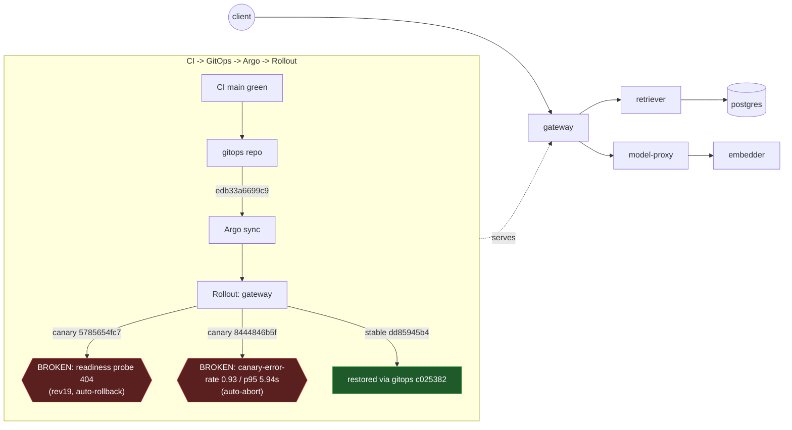

# Postmortem: gateway availability error budget burning slowly (10% of the 28d budget in 6h; 30m & 6h windows)

- **Status:** open
- **Severity:** sev2
- **Verified:** no
- **Opened:** 2026-08-04 18:48:44Z
- **Resolved:** (still open)

## Timeline (machine-generated)

All times UTC on 2026-08-04 unless a full date is shown.

| Time (UTC) | Source | Event |
| --- | --- | --- |
| 18:30:05Z | k8s | Rollout/gateway: RolloutUpdated |
| 18:30:05Z | k8s | Rollout/gateway: RolloutNotCompleted |
| 18:30:05Z | k8s | Rollout/gateway: NewReplicaSetCreated |
| 18:30:06Z | k8s | Pod/gateway-dd85945b4-jfd54: Killing |
| 18:30:06Z | k8s | ReplicaSet/gateway-dd85945b4: SuccessfulDelete |
| 18:30:06Z | k8s | Rollout/gateway: ScalingReplicaSet |
| 18:30:07Z | k8s | ReplicaSet/gateway-5785654fc7: SuccessfulCreate |
| 18:30:07Z | k8s | Pod/gateway-5785654fc7-p97mq: Scheduled |
| 18:30:10Z | k8s | Pod/gateway-5785654fc7-p97mq: Started |
| 18:30:10Z | k8s | Pod/gateway-5785654fc7-p97mq: Pulled |
| 18:30:10Z | k8s | Pod/gateway-5785654fc7-p97mq: Created |
| 18:30:16Z | k8s | Pod/gateway-5785654fc7-p97mq: Unhealthy |
| 18:30:21Z | k8s | Pod/gateway-5785654fc7-p97mq: Unhealthy |
| 18:30:26Z | k8s | Pod/gateway-5785654fc7-p97mq: Unhealthy |
| 18:30:31Z | k8s | Pod/gateway-5785654fc7-p97mq: Unhealthy |
| 18:30:36Z | k8s | Pod/gateway-5785654fc7-p97mq: Unhealthy |
| 18:30:41Z | k8s | Pod/gateway-5785654fc7-p97mq: Unhealthy |
| 18:30:46Z | k8s | Pod/gateway-5785654fc7-p97mq: Unhealthy |
| 18:30:51Z | k8s | Pod/gateway-5785654fc7-p97mq: Unhealthy |
| 18:30:56Z | k8s | Pod/gateway-5785654fc7-p97mq: Unhealthy |
| 18:31:01Z | k8s | Pod/gateway-5785654fc7-p97mq: Unhealthy |
| 18:31:06Z | k8s | Pod/gateway-5785654fc7-p97mq: Unhealthy |
| 18:31:11Z | k8s | Pod/gateway-5785654fc7-p97mq: Unhealthy |
| 18:31:16Z | k8s | Pod/gateway-5785654fc7-p97mq: Unhealthy |
| 18:31:21Z | k8s | Pod/gateway-5785654fc7-p97mq: Unhealthy |
| 18:31:25Z | k8s | Pod/gateway-5785654fc7-p97mq: Unhealthy |
| 18:31:30Z | k8s | Pod/gateway-5785654fc7-p97mq: Unhealthy |
| 18:31:35Z | k8s | Pod/gateway-5785654fc7-p97mq: Unhealthy |
| 18:31:40Z | k8s | Pod/gateway-5785654fc7-p97mq: Unhealthy |
| 18:31:45Z | k8s | Pod/gateway-5785654fc7-p97mq: Unhealthy |
| 18:31:50Z | k8s | Pod/gateway-5785654fc7-p97mq: Unhealthy |
| 18:31:55Z | k8s | Pod/gateway-5785654fc7-p97mq: Unhealthy |
| 18:32:00Z | k8s | Pod/gateway-5785654fc7-p97mq: Unhealthy |
| 18:32:05Z | k8s | Pod/gateway-5785654fc7-p97mq: Unhealthy |
| 18:32:10Z | k8s | Pod/gateway-5785654fc7-p97mq: Unhealthy |
| 18:32:15Z | k8s | Pod/gateway-5785654fc7-p97mq: Unhealthy |
| 18:35:19Z | k8s | Pod/gateway-5785654fc7-p97mq: Unhealthy |
| 18:38:48Z | k8s | Rollout/gateway: SkipSteps |
| 18:38:48Z | k8s | Rollout/gateway: RolloutUpdated |
| 18:38:49Z | k8s | Pod/gateway-5785654fc7-p97mq: Killing |
| 18:38:49Z | k8s | ReplicaSet/gateway-5785654fc7: SuccessfulDelete |
| 18:38:49Z | k8s | Rollout/gateway: ScalingReplicaSet |
| 18:38:50Z | k8s | ReplicaSet/gateway-dd85945b4: SuccessfulCreate |
| 18:38:50Z | k8s | Rollout/gateway: ScalingReplicaSet |
| 18:38:50Z | k8s | Pod/gateway-dd85945b4-mm7jm: Scheduled |
| 18:38:53Z | k8s | Pod/gateway-dd85945b4-mm7jm: Started |
| 18:38:53Z | k8s | Pod/gateway-dd85945b4-mm7jm: Pulled |
| 18:38:53Z | k8s | Pod/gateway-dd85945b4-mm7jm: Created |
| 18:48:10Z | alert | alert firing: SLO gateway availability — slow burn |
| 18:55:26Z | verification | recovery NOT verified — deadline armed |
| 18:56:49Z | k8s | Rollout/gateway: RolloutUpdated |
| 18:56:49Z | k8s | Rollout/gateway: RolloutNotCompleted |
| 18:56:49Z | k8s | Rollout/gateway: NewReplicaSetCreated |
| 18:56:50Z | deploy:argo | gateway synced to edb33a6699c9 |
| 18:56:50Z | k8s | Pod/gateway-dd85945b4-mm7jm: Killing |
| 18:56:50Z | k8s | ReplicaSet/gateway-dd85945b4: SuccessfulDelete |
| 18:56:50Z | k8s | Rollout/gateway: ScalingReplicaSet |
| 18:56:51Z | k8s | ReplicaSet/gateway-8444846b5f: SuccessfulCreate |
| 18:56:51Z | k8s | Rollout/gateway: ScalingReplicaSet |
| 18:56:51Z | k8s | Pod/gateway-8444846b5f-bqkg8: Scheduled |
| 18:56:52Z | k8s | Pod/gateway-8444846b5f-bqkg8: Pulled |
| 18:56:52Z | k8s | Pod/gateway-8444846b5f-bqkg8: Created |
| 18:56:53Z | k8s | Pod/gateway-8444846b5f-bqkg8: Started |
| 18:57:01Z | k8s | Rollout/gateway: RolloutStepCompleted |
| 18:57:03Z | k8s | Rollout/gateway: AnalysisRunRunning |
| 18:58:02Z | k8s | AnalysisRun/gateway-8444846b5f-21-1: MetricFailed |
| 18:58:02Z | k8s | AnalysisRun/gateway-8444846b5f-21-1: AnalysisRunFailed |
| 18:58:03Z | k8s | Rollout/gateway: RolloutAborted |
| 18:58:03Z | k8s | Rollout/gateway: AnalysisRunFailed |
| 18:58:04Z | k8s | Pod/gateway-8444846b5f-bqkg8: Killing |
| 18:58:04Z | k8s | ReplicaSet/gateway-8444846b5f: SuccessfulDelete |
| 18:58:04Z | k8s | Rollout/gateway: ScalingReplicaSet |
| 18:58:05Z | k8s | ReplicaSet/gateway-dd85945b4: SuccessfulCreate |
| 18:58:05Z | k8s | Rollout/gateway: ScalingReplicaSet |
| 18:58:05Z | k8s | Pod/gateway-dd85945b4-hw5fg: Scheduled |
| 18:58:06Z | k8s | Pod/gateway-dd85945b4-hw5fg: Started |
| 18:58:06Z | k8s | Pod/gateway-dd85945b4-hw5fg: Pulled |
| 18:58:06Z | k8s | Pod/gateway-dd85945b4-hw5fg: Created |
| 18:59:18Z | log-spike | log-spike onset: error: Malformed JSON in request body |
| 19:01:45Z | deploy:annotation | deploy gateway via gitops c025382 (argo sync) |
| 19:01:47Z | deploy:argo | gateway synced to c025382ba170 |
| 19:01:47Z | k8s | Rollout/gateway: SkipSteps |
| 19:01:47Z | k8s | Rollout/gateway: RolloutUpdated |
| 19:15:23Z | verification | recovery NOT verified — deadline armed |
| 19:16:02Z | log-spike | log-spike onset: [gateway] unhandled error: 16 \| } |

## Evidence links

- [Loki — logs over the incident window](http://localhost:3001/explore?schemaVersion=1&panes=%7B%22pm%22%3A+%7B%22datasource%22%3A+%22loki%22%2C+%22queries%22%3A+%5B%7B%22refId%22%3A+%22A%22%2C+%22datasource%22%3A+%7B%22type%22%3A+%22loki%22%2C+%22uid%22%3A+%22loki%22%7D%2C+%22expr%22%3A+%22%7Bnamespace%3D%5C%22subject%5C%22%7D+%7C~+%5C%22%28%3Fi%29error%7Cfailed%5C%22%22%7D%5D%2C+%22range%22%3A+%7B%22from%22%3A+%221785869324326%22%2C+%22to%22%3A+%221785871463915%22%7D%7D%7D&orgId=1)
- [Mimir — metrics over the incident window](http://localhost:3001/explore?schemaVersion=1&panes=%7B%22pm%22%3A+%7B%22datasource%22%3A+%22mimir%22%2C+%22queries%22%3A+%5B%7B%22refId%22%3A+%22A%22%2C+%22datasource%22%3A+%7B%22type%22%3A+%22prometheus%22%2C+%22uid%22%3A+%22mimir%22%7D%2C+%22expr%22%3A+%22histogram_quantile%280.95%2C+sum%28rate%28http_server_duration_milliseconds_bucket%5B5m%5D%29%29+by+%28le%29%29%22%7D%5D%2C+%22range%22%3A+%7B%22from%22%3A+%221785869324326%22%2C+%22to%22%3A+%221785871463915%22%7D%7D%7D&orgId=1)

## Investigation context

**Runbook match:** none — no tool narrowing applied for this alert. Available runbooks: README.md, canary-abort.md, ci-pipeline-red.md, dq-freshness-stall.md, gateway-high-error-rate.md, k8s-crashloop.md, k8s-node-failure.md, snapshot-agent-audit.md, stale-secret.md

Pre-check battery (as injected at run start)

## Pre-check leads

### recent_deploys — LEAD
1 deploy-window lead
- deploy annotation at 2026-08-04T19:01:45.359000+00:00: deploy gateway via gitops c025382 (argo sync)

### kube_scan — LEAD
5 kube-scan leads
- event AnalysisRun/gateway-8444846b5f-21-1: MetricFailed — Metric 'canary-error-rate' Completed. Result: Failed (at 20:58:02)
- event AnalysisRun/gateway-8444846b5f-21-1: MetricFailed — Metric 'canary-p95' Completed. Result: Failed (at 20:58:02)
- event AnalysisRun/gateway-8444846b5f-21-1: AnalysisRunFailed — Analysis Completed. Result: Failed (at 20:58:02)
- event Rollout/gateway: RolloutAborted — Rollout aborted update to revision 21: Step-based analysis phase error/failed: Metric \"canary-error-rate\" assessed Failed due to failed (2) > fai… (truncated)
- event Rollout/gateway: AnalysisRunFailed — Step Analysis Run 'gateway-8444846b5f-21-1' Status New: 'Failed' Previous: 'Running' (at 20:58:03)

### log_spike — LEAD
error/failed log rate 132/10min vs baseline 0/10min (132x baseline) — onset: [gateway] unhandled error: 16 |         } at 2026-08-04T19:16:02.302737+00:00
- error/failed log rate 132/10min vs baseline 0/10min (132x baseline) — onset: [gateway] unhandled error: 16 |         } at 2026-08-04T19:16:02.302737+00:00

### rollout_state — LEAD
1 rollout-state lead
- analysisrun for gateway (gateway-8444846b5f-21-1): Failed — Metric "canary-error-rate" assessed Failed due to failed (2) > failureLimit (1)

### secret_age — OK
Secret subject-db-credentials last modified 10d 20h ago (created 10d 20h ago).

## Narrative

## Summary

The gateway SLO availability "slow burn" alert was triggered by **two distinct, sequential bad rollouts** of the `gateway` workload landing inside the same 30m/6h burn-rate windows — not by one ongoing failure. Both were already caught and auto-remediated by Argo Rollouts' own safety gates before this investigation began. This is a re-investigation (attempt 2) after a prior pass concluded "already recovered, nothing to do" — that conclusion is confirmed correct by fresh telemetry, but this pass adds the evidence for the *first* regression that attempt 1 missed, and confirms there is still no live target for remediation.

## Impact

`slo:gateway_availability:error_ratio5m` spiked twice: ~7–8% for ~13 minutes, then a second, sharper spike peaking at **18.6%** for ~10 minutes. Availability SLI (`sli_ratio5m`) dropped as low as **0.81**. Both windows are now flat at 0% and have been for the last several minutes of live querying, but the alert's 30m/6h burn-rate evaluation windows still contain the historical spikes, so `alert_status` correctly continues to report active — this is expected alerting lag, not continued impact.

## Root cause

Two independent bad gateway pod-template rollouts landed back-to-back:

1. **Readiness-probe misconfiguration (new evidence this session):** A canary ReplicaSet `gateway-5785654fc7` (image `gateway:10f24bc`, Rollout revision 19) was created and immediately failed its readiness probe with **HTTP 404**, repeatedly, for ~8 minutes. Argo Rollouts caught this via its own probe gate and auto-rolled the Rollout back to the stable ReplicaSet ("Rollback to Stable ReplicaSets", Rollout revision 20) — this is the first error-ratio bump. This event is invisible in Argo Application sync history (which only tracks git-revision syncs, not Rollout-internal ReplicaSet churn), which is why the prior investigation pass missed it; it only surfaces in the Rollout's own Kubernetes events.
2. **Canary error-rate/latency regression (previously diagnosed, confirmed):** gitops revision `edb33a6699c9` (canary hash `8444846b5f`) subsequently failed canary analysis catastrophically — `AnalysisRun gateway-8444846b5f-21-1` measured canary-error-rate and canary-p95 both blowing through their failure limits. Argo Rollouts auto-aborted at the analysis gate. A follow-up gitops sync to `c025382ba170` at 19:01:47Z restored the known-good stable pod template (hash `dd85945b4`), which is what's running now.

**Checked and ruled out:** no stuck/red CI — latest `main` CI run (`e7b48b92ce`, run #113) is green; the `10f24bc` image tag behind the probe failure is itself reachable from `main` with zero commits ahead, so this wasn't an unmerged/rogue build, and CI is not gating the gitops pipeline at all (a process gap worth flagging separately). No OOM kills, no pod restarts, no live 5xx traffic, no unhealthy pods anywhere on the delivery path (embedder/retriever/model-proxy/postgres/redis all Healthy). The load-generator deployment currently shows 0/0 replicas — this is the traffic-generator's normal idle/scheduled-quiet state (its own Argo history is untouched since 2026-07-24), not a hidden second incident; it does mean the current "0% error rate" reading is corroborated by clean historical data rather than live load, so I leaned on the historical error-ratio series (which does show real, non-zero denominators during both bumps) rather than the current instant reading alone.

## What fixed it

Nothing was executed this session. Both regressions were already remediated automatically, before this investigation started: Argo Rollouts' readiness-probe gate rolled back rollout revision 19→20 on its own, and its canary-analysis gate auto-aborted the `edb33a6699c9` rollout at the error-rate/p95 gate. A subsequent gitops commit (`c025382ba170`) restored the last-known-good stable pod template, and it has been Healthy (4/4, Synced) with zero errors and zero restarts for the entire live-query window. I deliberately did **not** dry-run/execute `restart_workload` / `scale_deployment` / `rollout_undo` / `rollout_abort` — there is no live target for any of them, and acting on an already-healthy fleet would be an unjustified action, not a remediation.

## Lessons

- The still-missing runbook for this alert should explicitly say: check Rollout-level Kubernetes events (not just Argo Application sync history) for ReplicaSet churn — a failed canary that never got a "successful" Argo sync record can still be a real, alert-worthy regression.
- Nothing currently gates a gitops-repo revision before it reaches canary — a build with a 93%+ error rate and a broken readiness probe both reached the cluster and had to be caught live by Rollout analysis instead of pre-deploy.
- Multi-window burn-rate alerts will legitimately stay "active" for tens of minutes after full recovery purely because the historical spike is still inside the window — treat that as expected lag, confirmed by re-querying the live SLI series directly, not as a signal to take a reflexive remediation action.

