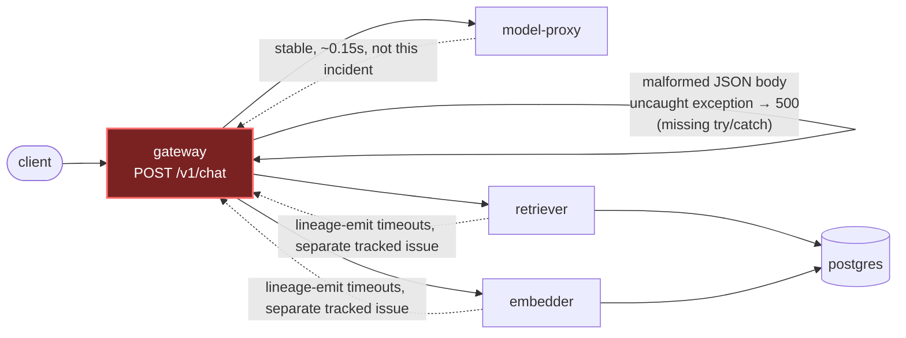

# Postmortem: gateway availability error budget burning slowly (10% of the 28d budget in 6h; 30m & 6h windows)

- **Status:** open
- **Severity:** sev2
- **Verified:** no
- **Opened:** 2026-08-04 00:23:44Z
- **Resolved:** (still open)

## Timeline (machine-generated)

All times UTC on 2026-08-04 unless a full date is shown.

| Time (UTC) | Source | Event |
| --- | --- | --- |
| 00:23:05Z | log-spike | log-spike onset: {"level":"warn","service":"embedder","message":"lineage emit failed","trace_id":"a5d979e5b1e30a0ffd046d9551fc346f","span_id":"5e4e17320616cdef","time":"2026-08-04T00:23:05.171Z","reason":"The operation timed out.","job":"r… |
| 00:23:10Z | alert | alert firing: SLO gateway availability — slow burn |
| 00:33:29Z | verification | recovery NOT verified — deadline armed |

## Evidence links

- [Loki — logs over the incident window](http://localhost:3001/explore?schemaVersion=1&panes=%7B%22pm%22%3A+%7B%22datasource%22%3A+%22loki%22%2C+%22queries%22%3A+%5B%7B%22refId%22%3A+%22A%22%2C+%22datasource%22%3A+%7B%22type%22%3A+%22loki%22%2C+%22uid%22%3A+%22loki%22%7D%2C+%22expr%22%3A+%22%7Bnamespace%3D%5C%22subject%5C%22%7D+%7C~+%5C%22%28%3Fi%29error%7Cfailed%5C%22%22%7D%5D%2C+%22range%22%3A+%7B%22from%22%3A+%221785803024389%22%2C+%22to%22%3A+%221785804458121%22%7D%7D%7D&orgId=1)
- [Mimir — metrics over the incident window](http://localhost:3001/explore?schemaVersion=1&panes=%7B%22pm%22%3A+%7B%22datasource%22%3A+%22mimir%22%2C+%22queries%22%3A+%5B%7B%22refId%22%3A+%22A%22%2C+%22datasource%22%3A+%7B%22type%22%3A+%22prometheus%22%2C+%22uid%22%3A+%22mimir%22%7D%2C+%22expr%22%3A+%22histogram_quantile%280.95%2C+sum%28rate%28http_server_duration_milliseconds_bucket%5B5m%5D%29%29+by+%28le%29%29%22%7D%5D%2C+%22range%22%3A+%7B%22from%22%3A+%221785803024389%22%2C+%22to%22%3A+%221785804458121%22%7D%7D%7D&orgId=1)

## Investigation context

**Runbook match:** none — no tool narrowing applied for this alert. Available runbooks: README.md, canary-abort.md, ci-pipeline-red.md, dq-freshness-stall.md, gateway-high-error-rate.md, k8s-crashloop.md, k8s-node-failure.md, snapshot-agent-audit.md, stale-secret.md

Pre-check battery (as injected at run start)

## Pre-check leads

### recent_deploys — LEAD
No deploy in the last 60m — rule out the reflex answer.
- No deploy in the last 60m — rule out the reflex answer.

### log_spike — OK
error/failed log rate normal: 0/10min vs baseline 0/10min

### kube_scan — UNAVAILABLE
error: You must be logged in to the server (Unauthorized)

### rollout_state — UNAVAILABLE
gateway: E0804 02:44:22.999749   28332 memcache.go:265] "Unhandled Error" err="couldn't get current server API group list: the server has asked for the client to provide credentials"
E0804 02:44:23.100064   28332 memcache.go:265] "Unhandled Error" err="couldn't get current server API group list: the server has asked for the client to provide credentials"
E0804 02:44:23.255007   28332 memcache.go:265] "Unhandled Error" err="couldn't get current server API group list: the server has asked for the client to; gateway analysis: E0804 02:44:23.065825    7636 memcache.go:265] "Unhandled Error" err="couldn't get current server API group list: the server has asked for the client to provide credentials"
E0804 02:44:23.172434    7636 memcache.go:265] "Unhandled Error"
… (section truncated)

### secret_age — UNAVAILABLE
error: You must be logged in to the server (Unauthorized)

## Narrative

## Incident update — inc_19fca27a8011e3 (attempt 2 / closure)

**Summary:** This is a continuation of the earlier gateway-availability slow-burn page. The prior attempt correctly identified the root cause but could not execute its remediation because the cluster-mutation credential used by our tooling was (and still is) rejected with `Unauthorized`. On re-investigation this round, the underlying error source had already stopped on its own before any further action was taken, and `alert_status` now reports the alert as no longer active.

**Impact:** Gateway `POST /v1/chat` returned 500s (instead of a clean 400) for a stream of malformed-JSON requests hitting all replicas, driving `slo:gateway_availability:error_ratio5m` to roughly 5–7% for about 25 minutes. This fed the 30m/6h burn-rate windows that the "slow burn" alert keys on, which is why the alert stayed active for a while even after the acute error source disappeared — burn-rate windows lag the instantaneous rate by design.

**Root cause (unchanged, now further confirmed):** gateway has no catch around JSON body-parsing on `POST /v1/chat`; malformed JSON throws an uncaught exception that surfaces as a 500. No deploy preceded the alert (`deploy_history` showed nothing in the preceding 60m, and Argo/CI history shows no gateway change around onset), so this is a pre-existing code defect, not a bad rollout. There is no stuck CI pipeline for a fix — no branch or PR touching gateway's request-parsing path exists in recent CI runs; the only red run (`#110`) is an unrelated load-generator test failure on `main`, already fixed by the following revert (`#111`).

**New evidence this round that changes the plan:** `loki_query` for `"Malformed JSON"` and `"unhandled error"` in the gateway logs over the last 30–60 minutes returned zero lines. `slo:gateway_availability:error_ratio5m` is back to 0% and has been for roughly the last 10-15 minutes of the window queried. The 30m window average was still elevated (decaying from ~6.9% toward ~5.5%) purely because it was still integrating the earlier spike, and `alert_status` flipped to `active: false` by the time of the final check. In other words, the traffic that was triggering the bug stopped arriving on its own — most likely the malformed-JSON generator (chaos-style traffic, not a real client) ran its course. That's an environmental fact, not the root cause: the root cause is still the gateway's missing JSON parse-error handling, which will reproduce the exact same alert the next time malformed input arrives.

**What fixed it:** Nothing executed by this remediation — the error-producing input stopped before any action was taken, and the multi-window burn-rate alert cleared naturally as the 30m window rolled the spike out. No remediation tool was invoked this round: repeating the previously-failed rolling restart was not justified (no ongoing errors to restart away, and the cluster credential is still broken, confirmed again via `argo_app` and `kubectl_read` both still returning `Unauthorized`).

**Lessons:**
1. The gateway code defect (unhandled JSON parse exceptions on `/v1/chat`) is still unpatched and will recur under the same conditions — this needs an actual code fix (try/catch → 400) shipped through CI/gitops, which is outside this agent's toolset (no shell/file access here).
2. The cluster-mutation credential (used by `restart_workload`, `scale_deployment`, `rollout_*`, `patch_memory_limit`, and read tools like `kubectl_read`/`argo_app`) has been broken across two consecutive incident-response attempts now. This is a standing operational gap: on-call remediation is currently non-functional for anything requiring cluster access. Needs a human to rotate/repair it.
3. Multi-window SLO burn-rate alerts can stay active well after the instantaneous error rate returns to zero — don't mistake "still firing" for "still broken"; check the shorter window and raw logs before re-attempting remediation.
4. The separate embedder/retriever/gateway → OpenLineage lineage-emit timeout issue (inflating `rag.embed`/`rag.retrieve`/`rag.inference` latency to 1.6–4s) flagged in the prior round is still open and untouched by this update; it should continue to be tracked as its own incident against `slo:gateway_latency`.

**Artifacts:** `report.html` (SVG chart of `error_ratio5m` over the incident window, showing the spike and recovery) saved as `art_19fca3d0df03b2`.

**Next steps for a human (unchanged/reiterated):**
1. Rotate/fix the agent-ro / agent-remediate cluster credential — it cannot currently read or mutate any cluster state.
2. Ship a code fix wrapping JSON body-parsing in `POST /v1/chat` with a proper try/catch returning 400, so this doesn't recur the next time malformed input arrives.
3. Separately investigate the OpenLineage lineage-sink timeouts affecting embedder/retriever/gateway latency.
