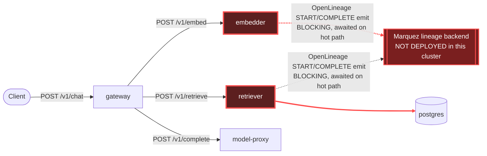

# Postmortem: gateway latency error budget burning fast (2% of the 28d budget in 1h; 5m & 1h windows)

- **Status:** open
- **Severity:** sev1
- **Verified:** no
- **Opened:** 2026-08-04 21:14:45Z
- **Resolved:** (still open)

## Timeline (machine-generated)

All times UTC on 2026-08-04 unless a full date is shown.

| Time (UTC) | Source | Event |
| --- | --- | --- |
| 21:11:44Z | log-spike | log-spike onset: error: Malformed JSON in request body |
| 21:14:10Z | alert | alert firing: SLO gateway latency — fast burn |

## Evidence links

- [Loki — logs over the incident window](http://localhost:3001/explore?schemaVersion=1&panes=%7B%22pm%22%3A+%7B%22datasource%22%3A+%22loki%22%2C+%22queries%22%3A+%5B%7B%22refId%22%3A+%22A%22%2C+%22datasource%22%3A+%7B%22type%22%3A+%22loki%22%2C+%22uid%22%3A+%22loki%22%7D%2C+%22expr%22%3A+%22%7Bnamespace%3D%5C%22subject%5C%22%7D+%7C~+%5C%22%28%3Fi%29error%7Cfailed%5C%22%22%7D%5D%2C+%22range%22%3A+%7B%22from%22%3A+%221785878085773%22%2C+%22to%22%3A+%221785878556542%22%7D%7D%7D&orgId=1)
- [Mimir — metrics over the incident window](http://localhost:3001/explore?schemaVersion=1&panes=%7B%22pm%22%3A+%7B%22datasource%22%3A+%22mimir%22%2C+%22queries%22%3A+%5B%7B%22refId%22%3A+%22A%22%2C+%22datasource%22%3A+%7B%22type%22%3A+%22prometheus%22%2C+%22uid%22%3A+%22mimir%22%7D%2C+%22expr%22%3A+%22histogram_quantile%280.95%2C+sum%28rate%28http_server_duration_milliseconds_bucket%5B5m%5D%29%29+by+%28le%29%29%22%7D%5D%2C+%22range%22%3A+%7B%22from%22%3A+%221785878085773%22%2C+%22to%22%3A+%221785878556542%22%7D%7D%7D&orgId=1)

## Investigation context

**Runbook match:** none — no tool narrowing applied for this alert. Available runbooks: README.md, canary-abort.md, ci-pipeline-red.md, dq-freshness-stall.md, gateway-high-error-rate.md, k8s-crashloop.md, k8s-node-failure.md, snapshot-agent-audit.md, stale-secret.md

Pre-check battery (as injected at run start)

## Pre-check leads

### recent_deploys — LEAD
No deploy in the last 60m — rule out the reflex answer.
- No deploy in the last 60m — rule out the reflex answer.

### log_spike — LEAD
error/failed log rate 200/10min vs baseline 0/10min (200x baseline) — onset: error: Malformed JSON in request body at 2026-08-04T21:11:44.079985+00:00
- error/failed log rate 200/10min vs baseline 0/10min (200x baseline) — onset: error: Malformed JSON in request body at 2026-08-04T21:11:44.079985+00:00

### attribution — LEAD
errors concentrate on gateway (25.7%); time concentrates in gateway's own handler (~4.3s of 7.8s) over the last 10m — which is not necessarily the workload named on the alert:
- gateway: 25.7% of its OWN responses are 5xx (10m)
- retriever: 24.7% of its OWN responses are 5xx (10m)
- model-proxy: 1.6% of its OWN responses are 5xx (10m)
- gateway → POST retriever: 25.1% of those outbound calls failed
- gateway → POST model-proxy: 7.9% of those outbound calls failed
- own-handler p95 (server p95 minus its slowest outbound call — a ranking, not a measurement): gateway ~4.3s of 7.8s end to end, embedder ~3.4s of 3.4s end to end, retriever ~3.0s of 3.0s end to end
- gateway → POST embedder: p95 3.4s outbound
- gateway → POST retriever: p95 3.0s outbound

### rollout_state — LEAD
1 rollout-state lead
- analysisrun for gateway (gateway-8444846b5f-21-1): Failed — Metric "canary-error-rate" assessed Failed due to failed (2) > failureLimit (1)

### kube_scan — OK
all pods Ready, no notable cluster events

### secret_age — OK
Secret subject-db-credentials last modified 10d 21h ago (created 10d 21h ago).

## Narrative

## Summary
The `SLO gateway latency — fast burn` alert fired for tenant `acme`. Investigation traced the burn to `retriever` and `embedder`, not to `gateway` itself: both services synchronously await OpenLineage START/COMPLETE emit calls on every `rag.retrieve`/`rag.embed` request, and every one of those calls times out because no Marquez (lineage) backend is deployed anywhere in this cluster. The alert never matched an existing runbook, so this incident should seed a new one.

## Impact
Gateway `POST /v1/chat` p95 rose to ~7.8s end-to-end (sampled Tempo traces during the window ran 5.5–7.4s each, consistently, not just as isolated spikes). Pre-check attribution showed gateway's own-handler time at ~4.3s of the 7.8s total, with the two outbound legs — embedder (p95 3.4s) and retriever (p95 3.0s) — accounting for the overwhelming majority of it. The gateway latency SLO burned 2% of its 28-day budget in a single hour (fast-burn, 5m & 1h windows). The alert was still active at last check.

## Root cause
`retriever` and `embedder` each log `"lineage emit failed", reason: "The operation timed out."` for both the START and COMPLETE event of essentially every request (`job: rag.retrieve` / `job: rag.embed`), confirmed over a 6h lookback — this is a standing condition, not a fresh regression. `kubectl get pods -A` across every namespace (subject, argocd, argo-rollouts, kube-system, monitoring) shows no Marquez/lineage-backend pod exists in this cluster at all, so the lineage HTTP client has nothing to talk to and blocks until its own timeout on every call. Because the emit calls are awaited on the request-serving path rather than fire-and-forget, that timeout latency is added directly to user-facing response time on every RAG request, compounding through gateway's sequential embedder→retriever fan-out.

Ruled out along the way, with evidence:
- **Bad deploy** — no deploy landed on gateway/retriever/embedder/platform in the last several hours; `platform` (the app that would own any lineage-backend manifests) last synced two days ago; gateway's own canary fully promoted over two hours before the alert and is Healthy. `retriever`'s previous ReplicaSet revision uses the *identical* image, and `embedder`'s previous revision is a stale image from initial cluster provisioning ten days ago — dry-running `rollout_undo` on both confirmed neither rollback would change the faulty behavior, so neither was executed.
- **Canary/AnalysisRun failure** — the failed `gateway-8444846b5f-21-1` canary-error-rate AnalysisRun is ~2.5h stale; the gateway Rollout is currently Healthy at step 4/4 with canary hash == stable hash. Unrelated to this alert.
- **The "Malformed JSON" log spike** — real (onset 21:11:44, ~200x baseline, driving gateway's own 25.7% and retriever's 24.7% 5xx rates), but this is an *error-rate* problem returning fast 4xx/5xx responses, not a latency contributor to a *latency* SLO — a separate, parallel issue from the burn investigated here.
- **Resource starvation** — `kubectl top` shows retriever at 226m CPU / 131Mi and embedder at 244m CPU / 98Mi, both far under their 512Mi memory limits with no CPU throttling metrics recorded. Not a capacity problem.

## What fixed it
Nothing — this incident is **unresolved**. None of the available runtime remediation actions (restart, scale, memory-limit patch, rollout undo/abort/promote, DB-secret rotation) changes a blocking `await` on a dependency that structurally does not exist in this environment; taking one of those actions anyway would not have moved the SLI and was not executed. The real fix has to be a code change in `retriever`/`embedder`: make the OpenLineage emit calls fire-and-forget (or wrap them in a short timeout that can't dominate response latency), or stand up a reachable Marquez endpoint for this k8s profile and point the lineage client at it. Re-querying `alert_status` after investigation confirms the alert is still firing — recovery was not observed and should not be assumed.

## Lessons
- Instrumentation/observability side-calls (lineage, audit, analytics) must never be awaited synchronously on the primary request path — a dependency-that-doesn't-exist should degrade to "no lineage data," not "add seconds to every response."
- This environment (k8s Profile A) apparently never carried over a Marquez deployment from the original docker-compose lab, yet the application code still assumes one is reachable — an environment/parity gap worth closing explicitly or feature-flagging.
- No runbook matched `SLO gateway latency — fast burn`; a new runbook should tell the next on-call to check `retriever`/`embedder` logs for `"lineage emit failed"` before chasing gateway-local causes, since the attribution split (own-handler vs. outbound legs) is the fastest way to see the fault is downstream.

