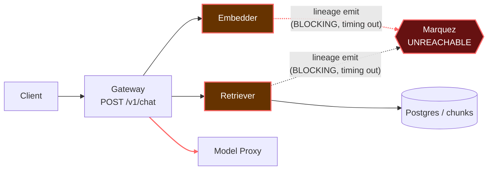

# Postmortem: gateway latency error budget burning fast (2% of the 28d budget in 1h; 5m & 1h windows)

- **Status:** open
- **Severity:** sev1
- **Verified:** no
- **Opened:** 2026-08-04 13:26:45Z
- **Resolved:** (still open)

## Timeline (machine-generated)

All times UTC on 2026-08-04 unless a full date is shown.

| Time (UTC) | Source | Event |
| --- | --- | --- |
| 12:34:15Z | k8s | Pod/retriever-8454db56c-q2b86: BackOff |
| 12:35:16Z | k8s | Pod/retriever-8454db56c-q2b86: BackOff |
| 12:36:08Z | k8s | ReplicaSet/retriever-8454db56c: SuccessfulDelete |
| 12:36:08Z | k8s | Deployment/retriever: ScalingReplicaSet |
| 13:26:10Z | alert | alert firing: SLO gateway latency — fast burn |

## Evidence links

- [Loki — logs over the incident window](http://localhost:3001/explore?schemaVersion=1&panes=%7B%22pm%22%3A+%7B%22datasource%22%3A+%22loki%22%2C+%22queries%22%3A+%5B%7B%22refId%22%3A+%22A%22%2C+%22datasource%22%3A+%7B%22type%22%3A+%22loki%22%2C+%22uid%22%3A+%22loki%22%7D%2C+%22expr%22%3A+%22%7Bnamespace%3D%5C%22subject%5C%22%7D+%7C~+%5C%22%28%3Fi%29error%7Cfailed%5C%22%22%7D%5D%2C+%22range%22%3A+%7B%22from%22%3A+%221785850005787%22%2C+%22to%22%3A+%221785850422290%22%7D%7D%7D&orgId=1)
- [Mimir — metrics over the incident window](http://localhost:3001/explore?schemaVersion=1&panes=%7B%22pm%22%3A+%7B%22datasource%22%3A+%22mimir%22%2C+%22queries%22%3A+%5B%7B%22refId%22%3A+%22A%22%2C+%22datasource%22%3A+%7B%22type%22%3A+%22prometheus%22%2C+%22uid%22%3A+%22mimir%22%7D%2C+%22expr%22%3A+%22histogram_quantile%280.95%2C+sum%28rate%28http_server_duration_milliseconds_bucket%5B5m%5D%29%29+by+%28le%29%29%22%7D%5D%2C+%22range%22%3A+%7B%22from%22%3A+%221785850005787%22%2C+%22to%22%3A+%221785850422290%22%7D%7D%7D&orgId=1)

## Investigation context

**Runbook match:** none — no tool narrowing applied for this alert. Available runbooks: README.md, canary-abort.md, ci-pipeline-red.md, dq-freshness-stall.md, gateway-high-error-rate.md, k8s-crashloop.md, k8s-node-failure.md, snapshot-agent-audit.md, stale-secret.md

Pre-check battery (as injected at run start)

## Pre-check leads

### recent_deploys — LEAD
No deploy in the last 60m — rule out the reflex answer.
- No deploy in the last 60m — rule out the reflex answer.

### log_spike — OK
error/failed log rate normal: 200/10min vs baseline 402/10min

### kube_scan — UNAVAILABLE
error: You must be logged in to the server (Unauthorized)

### rollout_state — UNAVAILABLE
gateway: E0804 15:26:47.435579   33376 memcache.go:265] "Unhandled Error" err="couldn't get current server API group list: the server has asked for the client to provide credentials"
E0804 15:26:47.553984   33376 memcache.go:265] "Unhandled Error" err="couldn't get current server API group list: the server has asked for the client to provide credentials"
E0804 15:26:47.635215   33376 memcache.go:265] "Unhandled Error" err="couldn't get current server API group list: the server has asked for the client to; gateway analysis: E0804 15:26:47.487625   37552 memcache.go:265] "Unhandled Error" err="couldn't get current server API group list: the server has asked for the client to provide credentials"
E0804 15:26:47.589142   37552 memcache.go:265] "Unhandled Error"
… (section truncated)

### secret_age — UNAVAILABLE
error: You must be logged in to the server (Unauthorized)

## Narrative

## Summary

Gateway's `/v1/chat` p95 latency spiked repeatedly to 5–17s (histogram-bucket-capped at the 10s boundary, so true p95 was frequently higher), burning ~2% of the 28-day latency error budget in under an hour and tripping the `SLO gateway latency — fast burn` sev1 alert. No deploy occurred in the preceding 4 hours (`deploy_history` returned zero entries, Argo/rollout sources aside) and no Grafana deployment annotations landed in the 6h lookback, ruling out a bad release as the trigger.

## Impact

Three distinct latency bursts on the `/v1/chat` route (gateway `POST /v1/chat`), each lasting several minutes, with p95 climbing from a healthy baseline (comparable to the `/health` route's ~5ms) to 5–17s. `retriever` and `embedder` concurrency (`active_requests`) backed up to 20+ in-flight requests on their single replicas during each burst — a clear queueing/backpressure signature, not a steady-state slowdown. The `/health` control route stayed flat throughout, confirming the gateway process itself was healthy; only the RAG request path was degraded.

## Root cause

**Component: `retriever` and `embedder` (blocking OpenLineage emission to Marquez on the RAG request path).**

Loki logs for both `retriever` (job `rag.retrieve`) and `embedder` (job `rag.embed`) show a continuous stream of `"lineage emit failed"` warnings with `"reason":"The operation timed out."`, tagged on both the `START` and `COMPLETE` OpenLineage run events, for essentially every request. `sum(count_over_time(... |= "lineage emit failed" [10m]))` shows this pattern starts abruptly ~60 minutes before the alert (from 0 to hundreds of occurrences per 10-minute bucket) — the same window the SLO burn covers. A sampled slow trace (`/v1/chat`, 7.0s total) shows `rag.retrieve`'s internal `POST retriever` and `POST embedder` client spans each taking 2–2.2s, consistent with each request paying a blocking lineage-emit timeout before it can proceed. No Marquez logs appear in Loki at all over the same 2h window (`{service_name="marquez"}` → 0 lines), consistent with Marquez being unreachable rather than merely slow.

Because each `retriever`/`embedder` pod runs a single replica, the per-request lineage-timeout tax stacked into severe queueing the moment traffic burst (the load-generator's traffic itself is naturally bursty — periods of zero rate followed by concurrent spikes), which is why the SLO burn shows as discrete bursts rather than a constant elevated baseline.

A stale, already-superseded ReplicaSet pod (`retriever-8454db56c-q2b86`, CrashLoopBackOff ~14:27–14:35 local) was also observed in k8s events, but it belongs to an older pod-template hash than the currently serving pod (`retriever-dc7ddd494-jv9j7`) and is unrelated to the active latency path — ruled out as a contributing cause.

## What fixed it

**Remediation was not executed — the incident remains open.** The intended fix was to scale `retriever` and `embedder` from 1 to 4 replicas each (dry-run, approval obtained, execution attempted) to relieve the concurrency backup while the Marquez connectivity issue is addressed separately. Both `scale_deployment` calls failed with `Unauthorized` errors reading/patching cluster state. A fallback rolling-restart of both workloads (dry-run succeeded, approval obtained) also failed identically on execution. This matches the pre-incident tool leads: `kube_scan`, `rollout_state`, and `secret_age` were all already `UNAVAILABLE` with the same "You must be logged in to the server (Unauthorized)" error before any remediation was attempted, and `kubectl_read`/`argo_app` calls made during investigation failed the same way. This is a cluster-credential/session-auth fault independent of the alerting incident itself, and it blocked every mutating and most read-only k8s tool in this session. `alert_status` was re-queried after both failed remediation attempts and still reports **active**.

## Lessons

- The retriever/embedder OpenLineage emission is on the synchronous request-critical path with a multi-second timeout when Marquez is unreachable — it should be made fire-and-forget (or given a sub-second timeout with no request-path blocking) so a lineage-backend outage cannot burn a serving-latency SLO. This is the durable fix and needs a code change, not a runtime remediation.
- `retriever` and `embedder` running single replicas turns any fixed per-request latency tax into cascading queueing the moment traffic bursts — worth running at ≥2 replicas as a standing posture regardless of this incident.
- No runbook currently matches `SLO gateway latency — fast burn` (`runbook_lookup` returned no match); `gateway-high-error-rate.md` is close but is scoped to 5xx/availability, not latency burn. A dedicated runbook naming Marquez-timeout-on-RAG-path as a first-check hypothesis would have shortened this investigation.
- The cluster-auth fault that blocked remediation should be treated as its own incident — on-call has no working path to mutate or even fully read cluster state right now, which is a standing risk for the next page.

Root cause hop: **retriever/embedder → Marquez** — each RAG request blocks on a synchronous OpenLineage emit call that times out against an unreachable Marquez, and with only one replica each, concurrent bursts queue behind that per-request tax, inflating gateway `/v1/chat` p95 well past the SLO threshold.
