# Postmortem: gateway latency error budget burning slowly (10% of the 28d budget in 6h; 30m & 6h windows)

- **Status:** open
- **Severity:** sev2
- **Verified:** no
- **Opened:** 2026-08-04 13:20:47Z
- **Resolved:** (still open)

## Timeline (machine-generated)

All times UTC on 2026-08-04 unless a full date is shown.

| Time (UTC) | Source | Event |
| --- | --- | --- |
| 12:27:06Z | k8s | ReplicaSet/retriever-8454db56c: SuccessfulCreate |
| 12:27:06Z | k8s | Deployment/retriever: ScalingReplicaSet |
| 12:27:06Z | k8s | Pod/retriever-8454db56c-q2b86: Scheduled |
| 12:27:08Z | k8s | Pod/retriever-8454db56c-q2b86: Pulled |
| 12:27:09Z | k8s | Pod/retriever-8454db56c-q2b86: Started |
| 12:27:09Z | k8s | Pod/retriever-8454db56c-q2b86: Created |
| 12:27:11Z | k8s | Pod/retriever-8454db56c-q2b86: Started |
| 12:27:11Z | k8s | Pod/retriever-8454db56c-q2b86: Pulled |
| 12:27:11Z | k8s | Pod/retriever-8454db56c-q2b86: Created |
| 12:27:13Z | k8s | Pod/retriever-8454db56c-q2b86: BackOff |
| 12:27:14Z | k8s | Pod/retriever-8454db56c-q2b86: BackOff |
| 12:27:16Z | k8s | Pod/retriever-8454db56c-q2b86: BackOff |
| 12:27:24Z | k8s | Pod/retriever-8454db56c-q2b86: Started |
| 12:27:24Z | k8s | Pod/retriever-8454db56c-q2b86: Pulled |
| 12:27:24Z | k8s | Pod/retriever-8454db56c-q2b86: Created |
| 12:27:27Z | k8s | Pod/retriever-8454db56c-q2b86: BackOff |
| 12:27:36Z | k8s | Pod/retriever-8454db56c-q2b86: BackOff |
| 12:27:47Z | k8s | Pod/retriever-8454db56c-q2b86: Started |
| 12:27:47Z | k8s | Pod/retriever-8454db56c-q2b86: Pulled |
| 12:27:47Z | k8s | Pod/retriever-8454db56c-q2b86: Created |
| 12:27:49Z | k8s | Pod/retriever-8454db56c-q2b86: BackOff |
| 12:27:50Z | k8s | Pod/retriever-8454db56c-q2b86: BackOff |
| 12:27:56Z | k8s | Pod/retriever-8454db56c-q2b86: BackOff |
| 12:28:43Z | k8s | Pod/retriever-8454db56c-q2b86: Started |
| 12:28:43Z | k8s | Pod/retriever-8454db56c-q2b86: Pulled |
| 12:28:43Z | k8s | Pod/retriever-8454db56c-q2b86: Created |
| 12:28:46Z | k8s | Pod/retriever-8454db56c-q2b86: BackOff |
| 12:28:47Z | k8s | Pod/retriever-8454db56c-q2b86: BackOff |
| 12:29:48Z | k8s | Pod/retriever-8454db56c-q2b86: BackOff |
| 12:30:10Z | k8s | Pod/retriever-8454db56c-q2b86: Started |
| 12:30:10Z | k8s | Pod/retriever-8454db56c-q2b86: Pulled |
| 12:30:10Z | k8s | Pod/retriever-8454db56c-q2b86: Created |
| 12:30:13Z | k8s | Pod/retriever-8454db56c-q2b86: BackOff |
| 12:30:16Z | k8s | Pod/retriever-8454db56c-q2b86: BackOff |
| 12:31:26Z | k8s | Pod/retriever-8454db56c-q2b86: BackOff |
| 12:32:37Z | k8s | Pod/retriever-8454db56c-q2b86: BackOff |
| 12:32:57Z | k8s | Pod/retriever-8454db56c-q2b86: Started |
| 12:32:57Z | k8s | Pod/retriever-8454db56c-q2b86: Pulled |
| 12:32:57Z | k8s | Pod/retriever-8454db56c-q2b86: Created |
| 12:32:59Z | k8s | Pod/retriever-8454db56c-q2b86: BackOff |
| 12:33:03Z | k8s | Pod/retriever-8454db56c-q2b86: BackOff |
| 12:33:06Z | k8s | Pod/retriever-8454db56c-q2b86: BackOff |
| 12:34:15Z | k8s | Pod/retriever-8454db56c-q2b86: BackOff |
| 12:35:16Z | k8s | Pod/retriever-8454db56c-q2b86: BackOff |
| 12:36:08Z | k8s | ReplicaSet/retriever-8454db56c: SuccessfulDelete |
| 12:36:08Z | k8s | Deployment/retriever: ScalingReplicaSet |
| 13:20:10Z | alert | alert firing: SLO gateway latency — slow burn |
| 13:20:21Z | log-spike | log-spike onset: [gateway] unhandled error: 16 \| } |
| 13:27:15Z | verification | recovery NOT verified — deadline armed |
| 13:44:34Z | verification | recovery NOT verified — deadline armed |
| 13:44:42Z | k8s | Rollout/gateway: RolloutUpdated |
| 13:44:42Z | k8s | Rollout/gateway: NewReplicaSetCreated |
| 13:44:43Z | k8s | Pod/gateway-dd85945b4-pwg4s: Killing |
| 13:44:43Z | k8s | ReplicaSet/gateway-dd85945b4: SuccessfulDelete |
| 13:44:43Z | k8s | Rollout/gateway: ScalingReplicaSet |
| 13:44:43Z | k8s | Rollout/gateway: RolloutNotCompleted |
| 13:44:44Z | k8s | ReplicaSet/gateway-865966ff97: SuccessfulCreate |
| 13:44:44Z | k8s | Rollout/gateway: ScalingReplicaSet |
| 13:44:44Z | k8s | Pod/gateway-865966ff97-zhm57: Scheduled |
| 13:44:46Z | k8s | Pod/gateway-865966ff97-zhm57: Failed |
| 13:44:46Z | k8s | Pod/gateway-865966ff97-zhm57: Pulling |
| 13:44:47Z | k8s | Pod/gateway-865966ff97-zhm57: Failed |
| 13:44:47Z | k8s | Pod/gateway-865966ff97-zhm57: BackOff |
| 13:44:57Z | k8s | Pod/gateway-865966ff97-zhm57: Failed |
| 13:44:57Z | k8s | Pod/gateway-865966ff97-zhm57: Pulling |
| 13:45:08Z | k8s | Pod/gateway-865966ff97-zhm57: Failed |
| 13:45:08Z | k8s | Pod/gateway-865966ff97-zhm57: BackOff |
| 13:45:19Z | k8s | Pod/gateway-865966ff97-zhm57: Failed |
| 13:45:19Z | k8s | Pod/gateway-865966ff97-zhm57: Pulling |
| 13:45:33Z | k8s | Pod/gateway-865966ff97-zhm57: Failed |
| 13:45:33Z | k8s | Pod/gateway-865966ff97-zhm57: BackOff |
| 13:45:39Z | log-spike | log-spike onset: [gateway] unhandled error: 16 \| } |
| 13:45:46Z | k8s | Pod/gateway-865966ff97-zhm57: Failed |
| 13:45:46Z | k8s | Pod/gateway-865966ff97-zhm57: BackOff |
| 13:45:57Z | k8s | Pod/gateway-865966ff97-zhm57: Failed |
| 13:45:57Z | k8s | Pod/gateway-865966ff97-zhm57: BackOff |
| 13:46:10Z | k8s | Pod/gateway-865966ff97-zhm57: Failed |
| 13:46:10Z | k8s | Pod/gateway-865966ff97-zhm57: Pulling |
| 13:46:24Z | k8s | Pod/gateway-865966ff97-zhm57: Failed |
| 13:46:24Z | k8s | Pod/gateway-865966ff97-zhm57: BackOff |
| 13:46:37Z | k8s | Pod/gateway-865966ff97-zhm57: Failed |
| 13:46:37Z | k8s | Pod/gateway-865966ff97-zhm57: BackOff |
| 13:46:48Z | k8s | Pod/gateway-865966ff97-zhm57: Failed |
| 13:46:48Z | k8s | Pod/gateway-865966ff97-zhm57: BackOff |
| 13:47:00Z | k8s | Pod/gateway-865966ff97-zhm57: Failed |
| 13:47:00Z | k8s | Pod/gateway-865966ff97-zhm57: BackOff |
| 13:47:13Z | k8s | Pod/gateway-865966ff97-zhm57: Failed |
| 13:47:13Z | k8s | Pod/gateway-865966ff97-zhm57: BackOff |
| 13:47:27Z | k8s | Pod/gateway-865966ff97-zhm57: Failed |
| 13:47:27Z | k8s | Pod/gateway-865966ff97-zhm57: BackOff |
| 13:47:38Z | k8s | Pod/gateway-865966ff97-zhm57: Failed |
| 13:47:38Z | k8s | Pod/gateway-865966ff97-zhm57: Pulling |
| 13:47:49Z | k8s | Pod/gateway-865966ff97-zhm57: Failed |
| 13:47:49Z | k8s | Pod/gateway-865966ff97-zhm57: BackOff |
| 13:48:03Z | k8s | Pod/gateway-865966ff97-zhm57: Failed |
| 13:48:03Z | k8s | Pod/gateway-865966ff97-zhm57: BackOff |
| 13:48:16Z | k8s | Pod/gateway-865966ff97-zhm57: Failed |
| 13:48:16Z | k8s | Pod/gateway-865966ff97-zhm57: BackOff |
| 13:48:31Z | k8s | Pod/gateway-865966ff97-zhm57: Failed |
| 13:48:31Z | k8s | Pod/gateway-865966ff97-zhm57: BackOff |
| 13:48:44Z | k8s | Pod/gateway-865966ff97-zhm57: BackOff |
| 13:48:56Z | k8s | Pod/gateway-865966ff97-zhm57: BackOff |
| 13:49:10Z | k8s | Pod/gateway-865966ff97-zhm57: BackOff |
| 13:49:21Z | k8s | Pod/gateway-865966ff97-zhm57: BackOff |
| 13:49:35Z | k8s | Pod/gateway-865966ff97-zhm57: BackOff |
| 13:49:48Z | k8s | Pod/gateway-865966ff97-zhm57: Failed |
| 13:49:48Z | k8s | Pod/gateway-865966ff97-zhm57: BackOff |
| 13:54:47Z | k8s | Pod/gateway-865966ff97-zhm57: Failed |
| 13:54:47Z | k8s | Pod/gateway-865966ff97-zhm57: BackOff |
| 13:54:49Z | verification | recovery NOT verified — deadline armed |
| 13:55:31Z | k8s | Rollout/gateway: SkipSteps |
| 13:55:31Z | k8s | Rollout/gateway: RolloutUpdated |
| 13:55:32Z | k8s | ReplicaSet/gateway-dd85945b4: SuccessfulCreate |
| 13:55:32Z | k8s | ReplicaSet/gateway-865966ff97: SuccessfulDelete |
| 13:55:32Z | k8s | Rollout/gateway: ScalingReplicaSet |
| 13:55:32Z | k8s | Pod/gateway-dd85945b4-jfd54: Scheduled |
| 13:55:35Z | k8s | Pod/gateway-dd85945b4-jfd54: Started |
| 13:55:35Z | k8s | Pod/gateway-dd85945b4-jfd54: Pulled |
| 13:55:35Z | k8s | Pod/gateway-dd85945b4-jfd54: Created |

## Evidence links

- [Loki — logs over the incident window](http://localhost:3001/explore?schemaVersion=1&panes=%7B%22pm%22%3A+%7B%22datasource%22%3A+%22loki%22%2C+%22queries%22%3A+%5B%7B%22refId%22%3A+%22A%22%2C+%22datasource%22%3A+%7B%22type%22%3A+%22loki%22%2C+%22uid%22%3A+%22loki%22%7D%2C+%22expr%22%3A+%22%7Bnamespace%3D%5C%22subject%5C%22%7D+%7C~+%5C%22%28%3Fi%29error%7Cfailed%5C%22%22%7D%5D%2C+%22range%22%3A+%7B%22from%22%3A+%221785849647209%22%2C+%22to%22%3A+%221785852241657%22%7D%7D%7D&orgId=1)
- [Mimir — metrics over the incident window](http://localhost:3001/explore?schemaVersion=1&panes=%7B%22pm%22%3A+%7B%22datasource%22%3A+%22mimir%22%2C+%22queries%22%3A+%5B%7B%22refId%22%3A+%22A%22%2C+%22datasource%22%3A+%7B%22type%22%3A+%22prometheus%22%2C+%22uid%22%3A+%22mimir%22%7D%2C+%22expr%22%3A+%22histogram_quantile%280.95%2C+sum%28rate%28http_server_duration_milliseconds_bucket%5B5m%5D%29%29+by+%28le%29%29%22%7D%5D%2C+%22range%22%3A+%7B%22from%22%3A+%221785849647209%22%2C+%22to%22%3A+%221785852241657%22%7D%7D%7D&orgId=1)

## Investigation context

**Runbook match:** none — no tool narrowing applied for this alert. Available runbooks: README.md, canary-abort.md, ci-pipeline-red.md, dq-freshness-stall.md, gateway-high-error-rate.md, k8s-crashloop.md, k8s-node-failure.md, snapshot-agent-audit.md, stale-secret.md

Pre-check battery (as injected at run start)

## Pre-check leads

### recent_deploys — LEAD
No deploy in the last 60m — rule out the reflex answer.
- No deploy in the last 60m — rule out the reflex answer.

### log_spike — OK
error/failed log rate normal: 200/10min vs baseline 454/10min

### kube_scan — UNAVAILABLE
error: You must be logged in to the server (Unauthorized)

### rollout_state — UNAVAILABLE
gateway: E0804 15:58:11.682424   54200 memcache.go:265] "Unhandled Error" err="couldn't get current server API group list: the server has asked for the client to provide credentials"
E0804 15:58:11.760052   54200 memcache.go:265] "Unhandled Error" err="couldn't get current server API group list: the server has asked for the client to provide credentials"
E0804 15:58:11.919494   54200 memcache.go:265] "Unhandled Error" err="couldn't get current server API group list: the server has asked for the client to; gateway analysis: E0804 15:58:11.740103   31740 memcache.go:265] "Unhandled Error" err="couldn't get current server API group list: the server has asked for the client to provide credentials"
E0804 15:58:11.903108   31740 memcache.go:265] "Unhandled Error"
… (section truncated)

### secret_age — UNAVAILABLE
error: You must be logged in to the server (Unauthorized)

## Narrative

## Summary

Third consecutive on-call pass on the same `SLO gateway latency — slow burn` page. The two previously identified root causes are both reconfirmed still active from fresh telemetry, and this pass adds decisive new evidence that the blocker is a **systemic cluster-credential/API-discovery outage** for the remediation identity — not a quirk of any one tool or workload. No red CI pipeline is holding anything up (`main` CI is green as of run #111); the block is entirely at the cluster-write layer.

## Impact

Gateway p95 latency has been elevated continuously since the alert onset, burning ~10% of the 28-day error-budget in 6h (slow-burn, sev2, tenant `acme`). No outright outage — a chronic degradation, evidenced by a "lineage emit failed" log rate that stays in the hundreds per 10-minute window for the entire investigation window and never drops to zero.

## Root cause (two, evidence-backed, both reconfirmed live)

1. **Primary, unchanged across all three passes:** `retriever`'s synchronous OpenLineage emission to Marquez on every `/v1/retrieve` call is timing out (`"lineage emit failed"`, `reason: "The operation timed out."`) continuously — live Loki logs show this recurring every ~1-2 seconds on the currently-serving pod (`retriever-dc7ddd494-jv9j7`) right up to seconds before this check. The retriever pod itself is healthy (zero k8s events in the last 20 minutes — no crashloop, no OOM); this is a blocking synchronous call to an external dependency, not a pod-health problem.
2. **Compounding, unchanged:** Argo Rollout `gateway`'s canary (image tag `gateway:phantom`, which was never built by CI — `gitea_compare` shows zero commits behind main) is still stuck in `ImagePullBackOff`, with fresh `Failed`/`BackOff` events recurring as recently as a few minutes before this check. This holds gateway below desired replica capacity, adding queueing latency on top of the lineage-timeout tax.

## What was attempted, and the new finding

Prior passes tried `restart_workload`(gateway) and `rollout_abort`(gateway) — both failed with `Unauthorized`. This pass deliberately targeted a **new, previously-untried remediation**: a rolling restart of **retriever** itself (not gateway), on the new hypothesis that a stuck/stale connection or cached DNS resolution to a rescheduled Marquez pod could explain a *sustained* (not occasional) synchronous timeout on every call. `restart_workload` dry-run for retriever returned cleanly with no read error — different from `scale_deployment`/`patch_memory_limit` dry-runs against gateway, which failed immediately trying to read live state (`Unauthorized`). This looked like a live, new avenue, so it was escalated for approval and approved.

Execution (`dry_run=false`) then failed with the identical `Unauthorized` error. This is decisive: three independent remediation targets across two passes (`rollout_abort`/gateway, `restart_workload`/retriever, plus failed reads underneath `scale_deployment` and `patch_memory_limit`) have now all hit the same wall. The dry-run success for `restart_workload` was misleading — it returns a static diff without touching the API server, so it doesn't actually probe write credentials; only the real PATCH does, and that PATCH is rejected cluster-wide. `kubectl_read`, `argo_app`, and `rollout_status` are also all failing with the same discovery/credential error. This is unambiguously a systemic outage of the remediation identity's cluster access, not a tool- or resource-type-specific issue — confirmed for the third time, now with broader coverage.

No further remediation was attempted per instructions: there is no new evidence that would make a fourth cluster-write attempt succeed where three have failed.

## What fixed it

Nothing — the incident is **unresolved**. `alert_status` re-queried after the attempted retriever restart still reports the alert active (`since: 2026-08-04T13:20:10Z`, unchanged). The lineage-emit-failed log rate remains sustained in the hundreds per 10-minute window through the end of this investigation.

## Lessons

- **This needs a human with cluster credentials**, not another agent pass: restore the on-call remediation identity's API-server credentials/discovery cache (affecting reads and writes alike — `kubectl_read`, `argo_app`, `rollout_status`, `scale_deployment`, `patch_memory_limit`, `restart_workload`, `rollout_abort` all fail identically). Until that's fixed, no remediation tool in this on-call toolkit can touch the cluster, regardless of how well the root cause is diagnosed.
- Fix retriever's synchronous, blocking OpenLineage emission call (make it async / fire-and-forget with a short timeout and circuit breaker) so a slow or unreachable Marquez cannot directly tax every `/v1/retrieve` request's latency.
- Investigate how the Argo Rollout for gateway ever reached a CI-unbuilt `phantom` image tag with zero commits behind main — this bypassed the normal CI→gitops→Argo path entirely and should not be reachable without a corresponding build.
- Runbook gap: no runbook currently matches this alert (`SLO gateway latency — slow burn`); a "gateway latency slow burn" runbook should be authored covering the retriever→Marquez synchronous-emission and canary-phantom-tag hypotheses, plus an explicit check for the cluster-credential health of the remediation identity itself before attempting any k8s-write remediation.

```mermaid
flowchart LR
    client([client]) --> gateway[gateway\nrollout stuck: canary=gateway:phantom\nImagePullBackOff, below desired replicas]
    gateway --> retriever[retriever\nhealthy pod, no crashloop]
    retriever -- "BROKEN HOP\nsynchronous lineage emit\ntimes out on ~every call" --> marquez[(Marquez)]
    gateway --> modelproxy[model-proxy]
    modelproxy --> postgres[(postgres)]

    style retriever fill:#3a1f1f,stroke:#ff6b6b,stroke-width:2px
    style marquez fill:#3a1f1f,stroke:#ff6b6b,stroke-width:2px
    style gateway fill:#3a2f1f,stroke:#e8a33d,stroke-width:2px

    classDef broken stroke:#ff6b6b,stroke-width:3px;
    class retriever,marquez broken;
```

