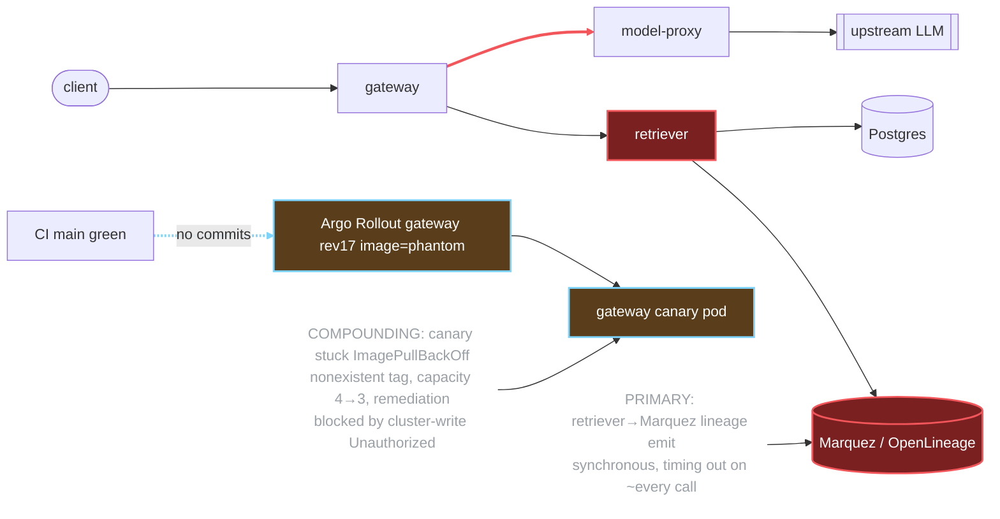

# Postmortem: gateway latency error budget burning slowly (10% of the 28d budget in 6h; 30m & 6h windows)

- **Status:** open
- **Severity:** sev2
- **Verified:** no
- **Opened:** 2026-08-04 13:20:47Z
- **Resolved:** (still open)

## Timeline (machine-generated)

All times UTC on 2026-08-04 unless a full date is shown.

| Time (UTC) | Source | Event |
| --- | --- | --- |
| 12:27:06Z | k8s | ReplicaSet/retriever-8454db56c: SuccessfulCreate |
| 12:27:06Z | k8s | Deployment/retriever: ScalingReplicaSet |
| 12:27:06Z | k8s | Pod/retriever-8454db56c-q2b86: Scheduled |
| 12:27:08Z | k8s | Pod/retriever-8454db56c-q2b86: Pulled |
| 12:27:09Z | k8s | Pod/retriever-8454db56c-q2b86: Started |
| 12:27:09Z | k8s | Pod/retriever-8454db56c-q2b86: Created |
| 12:27:11Z | k8s | Pod/retriever-8454db56c-q2b86: Started |
| 12:27:11Z | k8s | Pod/retriever-8454db56c-q2b86: Pulled |
| 12:27:11Z | k8s | Pod/retriever-8454db56c-q2b86: Created |
| 12:27:13Z | k8s | Pod/retriever-8454db56c-q2b86: BackOff |
| 12:27:14Z | k8s | Pod/retriever-8454db56c-q2b86: BackOff |
| 12:27:16Z | k8s | Pod/retriever-8454db56c-q2b86: BackOff |
| 12:27:24Z | k8s | Pod/retriever-8454db56c-q2b86: Started |
| 12:27:24Z | k8s | Pod/retriever-8454db56c-q2b86: Pulled |
| 12:27:24Z | k8s | Pod/retriever-8454db56c-q2b86: Created |
| 12:27:27Z | k8s | Pod/retriever-8454db56c-q2b86: BackOff |
| 12:27:36Z | k8s | Pod/retriever-8454db56c-q2b86: BackOff |
| 12:27:47Z | k8s | Pod/retriever-8454db56c-q2b86: Started |
| 12:27:47Z | k8s | Pod/retriever-8454db56c-q2b86: Pulled |
| 12:27:47Z | k8s | Pod/retriever-8454db56c-q2b86: Created |
| 12:27:49Z | k8s | Pod/retriever-8454db56c-q2b86: BackOff |
| 12:27:50Z | k8s | Pod/retriever-8454db56c-q2b86: BackOff |
| 12:27:56Z | k8s | Pod/retriever-8454db56c-q2b86: BackOff |
| 12:28:43Z | k8s | Pod/retriever-8454db56c-q2b86: Started |
| 12:28:43Z | k8s | Pod/retriever-8454db56c-q2b86: Pulled |
| 12:28:43Z | k8s | Pod/retriever-8454db56c-q2b86: Created |
| 12:28:46Z | k8s | Pod/retriever-8454db56c-q2b86: BackOff |
| 12:28:47Z | k8s | Pod/retriever-8454db56c-q2b86: BackOff |
| 12:29:48Z | k8s | Pod/retriever-8454db56c-q2b86: BackOff |
| 12:30:10Z | k8s | Pod/retriever-8454db56c-q2b86: Started |
| 12:30:10Z | k8s | Pod/retriever-8454db56c-q2b86: Pulled |
| 12:30:10Z | k8s | Pod/retriever-8454db56c-q2b86: Created |
| 12:30:13Z | k8s | Pod/retriever-8454db56c-q2b86: BackOff |
| 12:30:16Z | k8s | Pod/retriever-8454db56c-q2b86: BackOff |
| 12:31:26Z | k8s | Pod/retriever-8454db56c-q2b86: BackOff |
| 12:32:37Z | k8s | Pod/retriever-8454db56c-q2b86: BackOff |
| 12:32:57Z | k8s | Pod/retriever-8454db56c-q2b86: Started |
| 12:32:57Z | k8s | Pod/retriever-8454db56c-q2b86: Pulled |
| 12:32:57Z | k8s | Pod/retriever-8454db56c-q2b86: Created |
| 12:32:59Z | k8s | Pod/retriever-8454db56c-q2b86: BackOff |
| 12:33:03Z | k8s | Pod/retriever-8454db56c-q2b86: BackOff |
| 12:33:06Z | k8s | Pod/retriever-8454db56c-q2b86: BackOff |
| 12:34:15Z | k8s | Pod/retriever-8454db56c-q2b86: BackOff |
| 12:35:16Z | k8s | Pod/retriever-8454db56c-q2b86: BackOff |
| 12:36:08Z | k8s | ReplicaSet/retriever-8454db56c: SuccessfulDelete |
| 12:36:08Z | k8s | Deployment/retriever: ScalingReplicaSet |
| 13:20:10Z | alert | alert firing: SLO gateway latency — slow burn |
| 13:20:21Z | log-spike | log-spike onset: [gateway] unhandled error: 16 \| } |
| 13:27:15Z | verification | recovery NOT verified — deadline armed |
| 13:44:34Z | verification | recovery NOT verified — deadline armed |
| 13:44:42Z | k8s | Rollout/gateway: RolloutUpdated |
| 13:44:42Z | k8s | Rollout/gateway: NewReplicaSetCreated |
| 13:44:43Z | k8s | Pod/gateway-dd85945b4-pwg4s: Killing |
| 13:44:43Z | k8s | ReplicaSet/gateway-dd85945b4: SuccessfulDelete |
| 13:44:43Z | k8s | Rollout/gateway: ScalingReplicaSet |
| 13:44:43Z | k8s | Rollout/gateway: RolloutNotCompleted |
| 13:44:44Z | k8s | ReplicaSet/gateway-865966ff97: SuccessfulCreate |
| 13:44:44Z | k8s | Rollout/gateway: ScalingReplicaSet |
| 13:44:44Z | k8s | Pod/gateway-865966ff97-zhm57: Scheduled |
| 13:44:46Z | k8s | Pod/gateway-865966ff97-zhm57: Failed |
| 13:44:46Z | k8s | Pod/gateway-865966ff97-zhm57: Pulling |
| 13:44:47Z | k8s | Pod/gateway-865966ff97-zhm57: Failed |
| 13:44:47Z | k8s | Pod/gateway-865966ff97-zhm57: BackOff |
| 13:44:57Z | k8s | Pod/gateway-865966ff97-zhm57: Failed |
| 13:44:57Z | k8s | Pod/gateway-865966ff97-zhm57: Pulling |
| 13:45:08Z | k8s | Pod/gateway-865966ff97-zhm57: Failed |
| 13:45:08Z | k8s | Pod/gateway-865966ff97-zhm57: BackOff |
| 13:45:19Z | k8s | Pod/gateway-865966ff97-zhm57: Failed |
| 13:45:19Z | k8s | Pod/gateway-865966ff97-zhm57: Pulling |
| 13:45:33Z | k8s | Pod/gateway-865966ff97-zhm57: Failed |
| 13:45:33Z | k8s | Pod/gateway-865966ff97-zhm57: BackOff |
| 13:45:39Z | log-spike | log-spike onset: [gateway] unhandled error: 16 \| } |
| 13:45:46Z | k8s | Pod/gateway-865966ff97-zhm57: Failed |
| 13:45:46Z | k8s | Pod/gateway-865966ff97-zhm57: BackOff |
| 13:45:57Z | k8s | Pod/gateway-865966ff97-zhm57: Failed |
| 13:45:57Z | k8s | Pod/gateway-865966ff97-zhm57: BackOff |
| 13:46:10Z | k8s | Pod/gateway-865966ff97-zhm57: Failed |
| 13:46:10Z | k8s | Pod/gateway-865966ff97-zhm57: Pulling |
| 13:46:24Z | k8s | Pod/gateway-865966ff97-zhm57: Failed |
| 13:46:24Z | k8s | Pod/gateway-865966ff97-zhm57: BackOff |
| 13:46:37Z | k8s | Pod/gateway-865966ff97-zhm57: Failed |
| 13:46:37Z | k8s | Pod/gateway-865966ff97-zhm57: BackOff |
| 13:46:48Z | k8s | Pod/gateway-865966ff97-zhm57: Failed |
| 13:46:48Z | k8s | Pod/gateway-865966ff97-zhm57: BackOff |
| 13:47:00Z | k8s | Pod/gateway-865966ff97-zhm57: Failed |
| 13:47:00Z | k8s | Pod/gateway-865966ff97-zhm57: BackOff |
| 13:47:13Z | k8s | Pod/gateway-865966ff97-zhm57: Failed |
| 13:47:13Z | k8s | Pod/gateway-865966ff97-zhm57: BackOff |
| 13:47:27Z | k8s | Pod/gateway-865966ff97-zhm57: Failed |
| 13:47:27Z | k8s | Pod/gateway-865966ff97-zhm57: BackOff |
| 13:47:38Z | k8s | Pod/gateway-865966ff97-zhm57: Failed |
| 13:47:38Z | k8s | Pod/gateway-865966ff97-zhm57: Pulling |
| 13:47:49Z | k8s | Pod/gateway-865966ff97-zhm57: Failed |
| 13:47:49Z | k8s | Pod/gateway-865966ff97-zhm57: BackOff |
| 13:48:03Z | k8s | Pod/gateway-865966ff97-zhm57: Failed |
| 13:48:03Z | k8s | Pod/gateway-865966ff97-zhm57: BackOff |
| 13:48:16Z | k8s | Pod/gateway-865966ff97-zhm57: Failed |
| 13:48:16Z | k8s | Pod/gateway-865966ff97-zhm57: BackOff |
| 13:48:31Z | k8s | Pod/gateway-865966ff97-zhm57: Failed |
| 13:48:31Z | k8s | Pod/gateway-865966ff97-zhm57: BackOff |
| 13:48:44Z | k8s | Pod/gateway-865966ff97-zhm57: BackOff |
| 13:48:56Z | k8s | Pod/gateway-865966ff97-zhm57: BackOff |
| 13:49:10Z | k8s | Pod/gateway-865966ff97-zhm57: BackOff |
| 13:49:21Z | k8s | Pod/gateway-865966ff97-zhm57: BackOff |
| 13:49:35Z | k8s | Pod/gateway-865966ff97-zhm57: BackOff |
| 13:49:48Z | k8s | Pod/gateway-865966ff97-zhm57: Failed |
| 13:49:48Z | k8s | Pod/gateway-865966ff97-zhm57: BackOff |

## Evidence links

- [Loki — logs over the incident window](http://localhost:3001/explore?schemaVersion=1&panes=%7B%22pm%22%3A+%7B%22datasource%22%3A+%22loki%22%2C+%22queries%22%3A+%5B%7B%22refId%22%3A+%22A%22%2C+%22datasource%22%3A+%7B%22type%22%3A+%22loki%22%2C+%22uid%22%3A+%22loki%22%7D%2C+%22expr%22%3A+%22%7Bnamespace%3D%5C%22subject%5C%22%7D+%7C~+%5C%22%28%3Fi%29error%7Cfailed%5C%22%22%7D%5D%2C+%22range%22%3A+%7B%22from%22%3A+%221785849647209%22%2C+%22to%22%3A+%221785851677210%22%7D%7D%7D&orgId=1)
- [Mimir — metrics over the incident window](http://localhost:3001/explore?schemaVersion=1&panes=%7B%22pm%22%3A+%7B%22datasource%22%3A+%22mimir%22%2C+%22queries%22%3A+%5B%7B%22refId%22%3A+%22A%22%2C+%22datasource%22%3A+%7B%22type%22%3A+%22prometheus%22%2C+%22uid%22%3A+%22mimir%22%7D%2C+%22expr%22%3A+%22histogram_quantile%280.95%2C+sum%28rate%28http_server_duration_milliseconds_bucket%5B5m%5D%29%29+by+%28le%29%29%22%7D%5D%2C+%22range%22%3A+%7B%22from%22%3A+%221785849647209%22%2C+%22to%22%3A+%221785851677210%22%7D%7D%7D&orgId=1)

## Investigation context

**Runbook match:** none — no tool narrowing applied for this alert. Available runbooks: README.md, canary-abort.md, ci-pipeline-red.md, dq-freshness-stall.md, gateway-high-error-rate.md, k8s-crashloop.md, k8s-node-failure.md, snapshot-agent-audit.md, stale-secret.md

Pre-check battery (as injected at run start)

## Pre-check leads

### recent_deploys — LEAD
No deploy in the last 60m — rule out the reflex answer.
- No deploy in the last 60m — rule out the reflex answer.

### log_spike — LEAD
error/failed log rate 200/10min vs baseline 0/10min (200x baseline) — onset: [gateway] unhandled error: 16 |         } at 2026-08-04T13:45:39.024640+00:00
- error/failed log rate 200/10min vs baseline 0/10min (200x baseline) — onset: [gateway] unhandled error: 16 |         } at 2026-08-04T13:45:39.024640+00:00

### kube_scan — UNAVAILABLE
error: You must be logged in to the server (Unauthorized)

### rollout_state — UNAVAILABLE
gateway: E0804 15:48:11.727785    6084 memcache.go:265] "Unhandled Error" err="couldn't get current server API group list: the server has asked for the client to provide credentials"
E0804 15:48:11.861203    6084 memcache.go:265] "Unhandled Error" err="couldn't get current server API group list: the server has asked for the client to provide credentials"
E0804 15:48:11.967229    6084 memcache.go:265] "Unhandled Error" err="couldn't get current server API group list: the server has asked for the client to; gateway analysis: E0804 15:48:11.724956   40112 memcache.go:265] "Unhandled Error" err="couldn't get current server API group list: the server has asked for the client to provide credentials"
E0804 15:48:11.814634   40112 memcache.go:265] "Unhandled Error"
… (section truncated)

### secret_age — UNAVAILABLE
error: You must be logged in to the server (Unauthorized)

## Narrative

## Summary

Re-check (pass 3) of an ongoing sev2 slow-burn SLO alert on gateway latency. The previously-diagnosed root cause is reconfirmed still active, and a second, independent, compounding problem was found and a new remediation attempted — which failed for the same underlying reason as the prior attempt.

## Impact

`slo:gateway_latency:error_ratio30m` has stayed pinned between 0.87 and 0.95 continuously since onset — i.e. the large majority of the trailing 30-minute window has been breaching the gateway latency SLO the whole time. Tenant `acme` traffic through `/v1/retrieve` and downstream `/v1/chat` is experiencing materially elevated latency. No recovery observed across three remediation passes.

## Root cause

Two distinct, evidence-backed causes, one primary and one newly-discovered compounding factor:

1. **Primary (unchanged from prior passes):** `retriever`'s synchronous OpenLineage emission to Marquez is still timing out on effectively every `/v1/retrieve` call. Fresh Loki logs from the currently-serving pod (`retriever-dc7ddd494-jv9j7`) show repeated `"lineage emit failed", "reason":"The operation timed out."` warnings recurring seconds before this check, confirming the block is still live, not resolved. No deploy occurred in the last 6h (`deploy_history` empty) and CI on `main` is green with no pending/red pipeline — ruling out both a bad code deploy and a stuck fix pipeline as explanations for non-recovery.
2. **New this pass, compounding:** Argo Rollout `gateway` advanced to **revision 17** at 13:44:42 UTC, creating ReplicaSet `gateway-865966ff97` pinned to image tag `gateway:phantom` — a tag that does not exist in the registry (`rpc error: code = NotFound ... failed to resolve reference ... obs-registry:5010/gateway:phantom`). That canary pod has sat in `ImagePullBackOff` ever since while the stable ReplicaSet (revision 16) was already scaled down from 4 to 3 replicas to make room, leaving the fleet running at 75% of desired gateway capacity on top of the already-slow retriever dependency. Notably, `gitea_compare` shows **zero commits** between `main` and the currently-running revision — this bad rollout did not come from a normal CI-built commit, it's an out-of-band manifest/image-tag change outside the pipeline.

Both read (`kubectl_read`, `argo_app`, `rollout_status`) and write (`restart_workload`, and now `rollout_abort`) paths against the cluster continue to return `Unauthorized` on real execution, while dry-runs still succeed — confirming a systemic, still-unfixed credential problem on the remediation/read service identity, not a per-tool fault.

## What fixed it

Nothing — still unresolved. Diagnosed the new compounding cause (stuck phantom-tag canary), dry-ran `rollout_abort` for `gateway` (clean diff: would patch Rollout status `{"status":{"abort":true}}`, reverting to stable revision 16), got operator approval, and executed for real. Execution failed with `Unauthorized`, the same failure mode as the previous pass's `restart_workload` attempt on a different workload — this is new evidence that the write-path outage is cluster-wide, not scoped to one deployment. No further remediation was attempted without new evidence, per instructions. `alert_status` re-queried after the failed execution: still active, burn ratio unchanged (~0.93).

## Lessons

- **This needs a human**, urgently on two fronts: (1) restore the `agent-remediate`/read-only cluster credentials — every kubectl-backed tool in this toolkit is currently `Unauthorized` for both reads and writes, which has now blocked two independent, well-evidenced remediations across three passes; (2) make retriever's lineage emission to Marquez non-blocking (or fix Marquez capacity) so a downstream dependency outage can never hold up the request path synchronously.
- Separately, investigate how a Rollout reached revision 17 with an image tag (`phantom`) that was never built by CI — that's a gitops/pipeline integrity gap independent of the credential outage, and should get its own runbook entry since no runbook currently matches this alert.
- No runbook exists yet for `SLO gateway latency — slow burn`; given this is the third occurrence of this exact investigation, one should be authored covering: check retriever lineage-emit logs first, check Rollout revision/canary image validity, and expect the cluster-credential failure mode.

