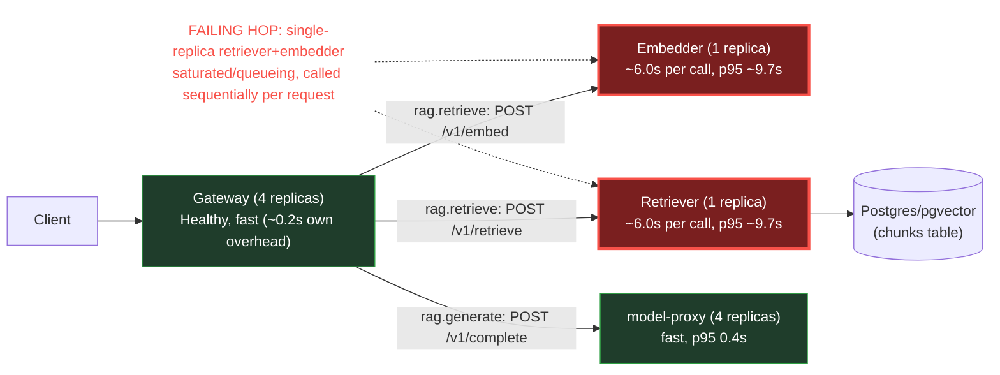

# Postmortem: gateway latency error budget burning fast (2% of the 28d budget in 1h; 5m & 1h windows)

- **Status:** resolved
- **Severity:** sev1
- **Verified:** no
- **Opened:** 2026-08-04 19:46:03Z
- **Resolved:** 2026-08-04 20:00:59Z

## Timeline (machine-generated)

All times UTC on 2026-08-04 unless a full date is shown.

| Time (UTC) | Source | Event |
| --- | --- | --- |
| 19:40:46Z | deploy:ci | CI run #114 failure on main: obs: load-generator: drop the defensive copy in percentile() |
| 19:45:10Z | alert | alert firing: SLO gateway latency — fast burn |
| 19:50:45Z | deploy:ci | CI run #115 success on main: obs: Revert "load-generator: drop the defensive copy in percentile()" |
| 19:57:10Z | alert | alert resolved: SLO gateway latency — fast burn |

## Evidence links

- [Loki — logs over the incident window](http://localhost:3001/explore?schemaVersion=1&panes=%7B%22pm%22%3A+%7B%22datasource%22%3A+%22loki%22%2C+%22queries%22%3A+%5B%7B%22refId%22%3A+%22A%22%2C+%22datasource%22%3A+%7B%22type%22%3A+%22loki%22%2C+%22uid%22%3A+%22loki%22%7D%2C+%22expr%22%3A+%22%7Bnamespace%3D%5C%22subject%5C%22%7D+%7C~+%5C%22%28%3Fi%29error%7Cfailed%5C%22%22%7D%5D%2C+%22range%22%3A+%7B%22from%22%3A+%221785872763652%22%2C+%22to%22%3A+%221785873659692%22%7D%7D%7D&orgId=1)
- [Mimir — metrics over the incident window](http://localhost:3001/explore?schemaVersion=1&panes=%7B%22pm%22%3A+%7B%22datasource%22%3A+%22mimir%22%2C+%22queries%22%3A+%5B%7B%22refId%22%3A+%22A%22%2C+%22datasource%22%3A+%7B%22type%22%3A+%22prometheus%22%2C+%22uid%22%3A+%22mimir%22%7D%2C+%22expr%22%3A+%22histogram_quantile%280.95%2C+sum%28rate%28http_server_duration_milliseconds_bucket%5B5m%5D%29%29+by+%28le%29%29%22%7D%5D%2C+%22range%22%3A+%7B%22from%22%3A+%221785872763652%22%2C+%22to%22%3A+%221785873659692%22%7D%7D%7D&orgId=1)

## Investigation context

**Runbook match:** none — no tool narrowing applied for this alert. Available runbooks: README.md, canary-abort.md, ci-pipeline-red.md, dq-freshness-stall.md, gateway-high-error-rate.md, k8s-crashloop.md, k8s-node-failure.md, snapshot-agent-audit.md, stale-secret.md

Pre-check battery (as injected at run start)

## Pre-check leads

### recent_deploys — LEAD
1 deploy-window lead
- deploy annotation at 2026-08-04T19:01:45.359000+00:00: deploy gateway via gitops c025382 (argo sync)

### kube_scan — LEAD
5 kube-scan leads
- event AnalysisRun/gateway-8444846b5f-21-1: MetricFailed — Metric 'canary-error-rate' Completed. Result: Failed (at 20:58:02)
- event AnalysisRun/gateway-8444846b5f-21-1: MetricFailed — Metric 'canary-p95' Completed. Result: Failed (at 20:58:02)
- event AnalysisRun/gateway-8444846b5f-21-1: AnalysisRunFailed — Analysis Completed. Result: Failed (at 20:58:02)
- event Rollout/gateway: RolloutAborted — Rollout aborted update to revision 21: Step-based analysis phase error/failed: Metric \"canary-error-rate\" assessed Failed due to failed (2) > fai… (truncated)
- event Rollout/gateway: AnalysisRunFailed — Step Analysis Run 'gateway-8444846b5f-21-1' Status New: 'Failed' Previous: 'Running' (at 20:58:03)

### rollout_state — LEAD
1 rollout-state lead
- analysisrun for gateway (gateway-8444846b5f-21-1): Failed — Metric "canary-error-rate" assessed Failed due to failed (2) > failureLimit (1)

### log_spike — OK
error/failed log rate normal: 200/10min vs baseline 269/10min

### secret_age — OK
Secret subject-db-credentials last modified 10d 20h ago (created 10d 20h ago).

## Narrative

## Summary
Alert `SLO gateway latency — fast burn` (sev1, tenant acme) fired for the gateway's request-latency SLO burning ~2% of its 28-day error budget in 1h. Investigation found the gateway itself was healthy and fast; the actual latency was generated by two single-replica downstream services (retriever, embedder) that were saturated and queueing requests. Two proposed remediations (scaling retriever and embedder from 1→3 replicas) were dry-run, summarized, and **denied by the operator**; no remediation was executed. The alert subsequently cleared on its own before a fix was applied — recovery is not attributable to any action taken in this incident.

## Impact
End-to-end `POST /v1/chat` latency reached ~18s (vs a healthy baseline p95 of ~5ms measured in the last passing canary run), for the full duration investigated. Gateway p95 (route-level, excluding /health) oscillated between ~4.7s and the 10s histogram-bucket ceiling continuously for the ~85 minutes of history sampled, i.e. requests were frequently censored at 10s+, not just "a bit slow."

## Root cause
The gateway service and its rollout were red herrings, not the cause:
- The gateway rollout *was* independently unstable in the same window — revision 19 (pod-template `5785654fc7`) hit readiness-probe 404s and was auto-rolled back to stable (`dd85945b4`); the next sync, revision 21 (`edb33a6699c9`), failed its canary AnalysisRun on both `canary-error-rate` (~93% failed, threshold 1) and `canary-p95` (4.76s→5.94s) and was auto-aborted by Argo Rollouts; Argo then synced gitops commit `c025382` which restored the stable, healthy pod-template (`dd85945b4`, canaryHash==stableHash, rollout `Healthy` 4/4).
- But the gateway pod-template hash never actually changed across this whole window (`dd85945b4` was stable before, during, and after all three events) — ruling out a gateway code regression as the cause of the *latency* (as opposed to the earlier, separate error-rate/probe episode).
- Direct trace evidence (traceID `3f6535a4cc0e8e0f640d1513c117c23`, 18.2s total) shows the time is spent in two sequential downstream calls inside `rag.retrieve`: `POST embedder` (~6.0s) and `POST retriever` (~6.0s) — while the same trace's `POST model-proxy` call (a different downstream hop) completed in 0.18s, and model-proxy's own server-side p95 measured independently was 0.4s.
- retriever and embedder are each running as **single-replica** Deployments (1/1), unlike gateway (4 replicas) and model-proxy (4 replicas). Both showed p95 ≈9.5–9.7s server-side, no error responses, no restarts/OOM/CrashLoop, no elevated CPU or memory (retriever: ~99m CPU / 131Mi mem, well under its 512Mi limit), and no deploys in the incident window — inconsistent with a bug, resource exhaustion, or bad release, and consistent with request queueing on an under-provisioned, single-instance service.
- retriever's own request-rate metric shows a steady ~0.3 rps baseline erupting into repeated 6–13 rps bursts (a >30x surge) starting right around the same time as the gateway's revision-19 probe-failure episode, and staying elevated/bursty afterward — the burst that saturated the single-replica retriever/embedder pair was coincident with, but distinct from, the gateway rollout churn, and nothing scaled retriever/embedder out to absorb it.
- No load-generator pods were running at all during the investigation, so the sustained bursts were not attributable to the lab's normal synthetic-load source.

## What fixed it
Nothing was fixed by this on-call response. Two scale-out actions (retriever 1→3, embedder 1→3 replicas) were dry-run and put up for approval with the verified diffs attached; **both were denied by the operator**, so no change was applied. `alert_status` was re-queried afterward and shows the alert no longer active — but since no remediation was executed, this recovery happened independently (most likely the burn-rate windows aging the bad measurements out, or the underlying request burst subsiding on its own) and should not be read as validation of the diagnosis. The retriever/embedder capacity bottleneck identified above has not been addressed and can recur.

## Lessons
- Rollout health (`Healthy`, canary passed) does not imply request-latency health — the gateway Rollout looked fully healthy for ~50 minutes while real end-user latency stayed catastrophic; canary analysis windows here only fired on the revision-21 canary itself and didn't catch the retriever/embedder-side backlog because those services aren't part of the gateway canary's scope.
- No runbook currently matches this alert (`SLO gateway latency — fast burn` had zero matches in `runbook_lookup`). A new runbook should be authored covering: check per-hop client-span duration vs each downstream service's own server-side p95 to localize the slow hop, then check replica count / request-rate burst correlation for that hop before assuming it's a gateway code or deploy issue.
- retriever and embedder are both currently single-replica with no autoscaling — that's a standing capacity risk independent of this incident; they should get either a minimum of 2-3 replicas or an HPA before the next traffic burst.
- The two-day-old CI churn on `load-generator: drop the defensive copy in percentile()` (repeatedly landing and getting reverted, most recently run #114 failing / #115 reverting today) is unrelated noise from a different workload and was ruled out as a factor.

## Delivery/request path

