# Postmortem: gateway latency error budget burning slowly (10% of the 28d budget in 6h; 30m & 6h windows)

- **Status:** open
- **Severity:** sev2
- **Verified:** no
- **Opened:** 2026-08-04 13:20:47Z
- **Resolved:** (still open)

## Timeline (machine-generated)

All times UTC on 2026-08-04 unless a full date is shown.

| Time (UTC) | Source | Event |
| --- | --- | --- |
| 12:27:06Z | k8s | ReplicaSet/retriever-8454db56c: SuccessfulCreate |
| 12:27:06Z | k8s | Deployment/retriever: ScalingReplicaSet |
| 12:27:06Z | k8s | Pod/retriever-8454db56c-q2b86: Scheduled |
| 12:27:08Z | k8s | Pod/retriever-8454db56c-q2b86: Pulled |
| 12:27:09Z | k8s | Pod/retriever-8454db56c-q2b86: Started |
| 12:27:09Z | k8s | Pod/retriever-8454db56c-q2b86: Created |
| 12:27:11Z | k8s | Pod/retriever-8454db56c-q2b86: Started |
| 12:27:11Z | k8s | Pod/retriever-8454db56c-q2b86: Pulled |
| 12:27:11Z | k8s | Pod/retriever-8454db56c-q2b86: Created |
| 12:27:13Z | k8s | Pod/retriever-8454db56c-q2b86: BackOff |
| 12:27:14Z | k8s | Pod/retriever-8454db56c-q2b86: BackOff |
| 12:27:16Z | k8s | Pod/retriever-8454db56c-q2b86: BackOff |
| 12:27:24Z | k8s | Pod/retriever-8454db56c-q2b86: Started |
| 12:27:24Z | k8s | Pod/retriever-8454db56c-q2b86: Pulled |
| 12:27:24Z | k8s | Pod/retriever-8454db56c-q2b86: Created |
| 12:27:27Z | k8s | Pod/retriever-8454db56c-q2b86: BackOff |
| 12:27:36Z | k8s | Pod/retriever-8454db56c-q2b86: BackOff |
| 12:27:47Z | k8s | Pod/retriever-8454db56c-q2b86: Started |
| 12:27:47Z | k8s | Pod/retriever-8454db56c-q2b86: Pulled |
| 12:27:47Z | k8s | Pod/retriever-8454db56c-q2b86: Created |
| 12:27:49Z | k8s | Pod/retriever-8454db56c-q2b86: BackOff |
| 12:27:50Z | k8s | Pod/retriever-8454db56c-q2b86: BackOff |
| 12:27:56Z | k8s | Pod/retriever-8454db56c-q2b86: BackOff |
| 12:28:43Z | k8s | Pod/retriever-8454db56c-q2b86: Started |
| 12:28:43Z | k8s | Pod/retriever-8454db56c-q2b86: Pulled |
| 12:28:43Z | k8s | Pod/retriever-8454db56c-q2b86: Created |
| 12:28:46Z | k8s | Pod/retriever-8454db56c-q2b86: BackOff |
| 12:28:47Z | k8s | Pod/retriever-8454db56c-q2b86: BackOff |
| 12:29:48Z | k8s | Pod/retriever-8454db56c-q2b86: BackOff |
| 12:30:10Z | k8s | Pod/retriever-8454db56c-q2b86: Started |
| 12:30:10Z | k8s | Pod/retriever-8454db56c-q2b86: Pulled |
| 12:30:10Z | k8s | Pod/retriever-8454db56c-q2b86: Created |
| 12:30:13Z | k8s | Pod/retriever-8454db56c-q2b86: BackOff |
| 12:30:16Z | k8s | Pod/retriever-8454db56c-q2b86: BackOff |
| 12:31:26Z | k8s | Pod/retriever-8454db56c-q2b86: BackOff |
| 12:32:37Z | k8s | Pod/retriever-8454db56c-q2b86: BackOff |
| 12:32:57Z | k8s | Pod/retriever-8454db56c-q2b86: Started |
| 12:32:57Z | k8s | Pod/retriever-8454db56c-q2b86: Pulled |
| 12:32:57Z | k8s | Pod/retriever-8454db56c-q2b86: Created |
| 12:32:59Z | k8s | Pod/retriever-8454db56c-q2b86: BackOff |
| 12:33:03Z | k8s | Pod/retriever-8454db56c-q2b86: BackOff |
| 12:33:06Z | k8s | Pod/retriever-8454db56c-q2b86: BackOff |
| 12:34:15Z | k8s | Pod/retriever-8454db56c-q2b86: BackOff |
| 12:35:16Z | k8s | Pod/retriever-8454db56c-q2b86: BackOff |
| 12:36:08Z | k8s | ReplicaSet/retriever-8454db56c: SuccessfulDelete |
| 12:36:08Z | k8s | Deployment/retriever: ScalingReplicaSet |
| 13:20:10Z | alert | alert firing: SLO gateway latency — slow burn |
| 13:20:21Z | log-spike | log-spike onset: [gateway] unhandled error: 16 \| } |
| 13:27:15Z | verification | recovery NOT verified — deadline armed |

## Evidence links

- [Loki — logs over the incident window](http://localhost:3001/explore?schemaVersion=1&panes=%7B%22pm%22%3A+%7B%22datasource%22%3A+%22loki%22%2C+%22queries%22%3A+%5B%7B%22refId%22%3A+%22A%22%2C+%22datasource%22%3A+%7B%22type%22%3A+%22loki%22%2C+%22uid%22%3A+%22loki%22%7D%2C+%22expr%22%3A+%22%7Bnamespace%3D%5C%22subject%5C%22%7D+%7C~+%5C%22%28%3Fi%29error%7Cfailed%5C%22%22%7D%5D%2C+%22range%22%3A+%7B%22from%22%3A+%221785849647209%22%2C+%22to%22%3A+%221785851062546%22%7D%7D%7D&orgId=1)
- [Mimir — metrics over the incident window](http://localhost:3001/explore?schemaVersion=1&panes=%7B%22pm%22%3A+%7B%22datasource%22%3A+%22mimir%22%2C+%22queries%22%3A+%5B%7B%22refId%22%3A+%22A%22%2C+%22datasource%22%3A+%7B%22type%22%3A+%22prometheus%22%2C+%22uid%22%3A+%22mimir%22%7D%2C+%22expr%22%3A+%22histogram_quantile%280.95%2C+sum%28rate%28http_server_duration_milliseconds_bucket%5B5m%5D%29%29+by+%28le%29%29%22%7D%5D%2C+%22range%22%3A+%7B%22from%22%3A+%221785849647209%22%2C+%22to%22%3A+%221785851062546%22%7D%7D%7D&orgId=1)

## Investigation context

**Runbook match:** none — no tool narrowing applied for this alert. Available runbooks: README.md, canary-abort.md, ci-pipeline-red.md, dq-freshness-stall.md, gateway-high-error-rate.md, k8s-crashloop.md, k8s-node-failure.md, snapshot-agent-audit.md, stale-secret.md

Pre-check battery (as injected at run start)

## Pre-check leads

### recent_deploys — LEAD
No deploy in the last 60m — rule out the reflex answer.
- No deploy in the last 60m — rule out the reflex answer.

### log_spike — OK
error/failed log rate normal: 122/10min vs baseline 500/10min

### kube_scan — UNAVAILABLE
error: You must be logged in to the server (Unauthorized)

### rollout_state — UNAVAILABLE
gateway: E0804 15:38:09.667163   23396 memcache.go:265] "Unhandled Error" err="couldn't get current server API group list: the server has asked for the client to provide credentials"
E0804 15:38:09.727190   23396 memcache.go:265] "Unhandled Error" err="couldn't get current server API group list: the server has asked for the client to provide credentials"
E0804 15:38:09.796514   23396 memcache.go:265] "Unhandled Error" err="couldn't get current server API group list: the server has asked for the client to; gateway analysis: E0804 15:38:09.653788   47256 memcache.go:265] "Unhandled Error" err="couldn't get current server API group list: the server has asked for the client to provide credentials"
E0804 15:38:09.715472   47256 memcache.go:265] "Unhandled Error"
… (section truncated)

### secret_age — UNAVAILABLE
error: You must be logged in to the server (Unauthorized)

## Narrative

## Summary — unresolved, root cause reconfirmed, remediation still blocked

This is a re-examination of a prior diagnosis for the same underlying incident (the gateway latency slow-burn SLO alert). The earlier fix did not restore service; this pass re-verifies the diagnosis end-to-end with fresh evidence rather than assuming staleness, and finds the same root cause still active, plus a fuller picture of why the fix hasn't landed.

## Impact

`slo:gateway_latency:error_ratio30m` jumped from 0 to ~0.95 at onset and has stayed in the 0.87–0.95 band continuously since — i.e. the large majority of `gateway POST /v1/chat` requests are still breaching the latency SLO. Confirmed still active at time of writing (instant value 0.915).

## Root cause (reconfirmed with new evidence)

`retriever`'s OpenLineage emission to Marquez is still on the synchronous request path and is still timing out on `/v1/retrieve` calls. A fresh Loki query on the *currently serving* retriever pod (`retriever-dc7ddd494-jv9j7`, 0 container restarts, healthy per `kube_pod_status_phase`) shows `"lineage emit failed"` / `"reason":"The operation timed out."` warnings recurring every few hundred milliseconds as of moments before this report. A live Tempo trace shows the `POST retriever` client span alone costing ~1.28s of a 4.08s total `/v1/chat` trace, on top of elevated embedder (~0.6s) and model-proxy (~0.56s) spans — consistent with system-wide contention layered on top of the retriever's blocking lineage call.

Two things ruled out this pass:
- **Not a bad deploy.** `gitea_compare(main, 10f24bc)` — the sha currently running on retriever — shows 0 commits of diff from `main`. No CI run has executed since 2026‑08‑03; nothing shipped today. This is a runtime dependency failure, not a release.
- **Not a stuck CI-based fix.** No red pipeline, no open PR touching retriever/lineage code was found in the last 20 CI runs. There is no in-flight code fix to unblock — the earlier "fix" was strictly the operational restart, not a code change.

A secondary, related but distinct signal: a different retriever ReplicaSet (`retriever-8454db56c`, pod `q2b86`) was observed `CrashLoopBackOff`'ing (`BackOff`, seen x20+) in a roughly 8-minute window overlapping the SLO burn's onset, before disappearing from the event stream. Same unmodified image (`10f24bc`) — most consistent with an extra replica/canary pod whose liveness probe also depends on the same blocked lineage path, failing under load and getting bounced, rather than a second independent fault. It is not the sustained root cause: the pod serving traffic throughout (`dc7ddd494`) never restarted and has been emitting the same timeout warnings the whole time.

## What fixed it — nothing yet; remediation is blocked, not wrong

Re-ran the previously-attempted mitigation (rolling restart of `retriever`, the runbook's "restart the failing downstream" step) with a new hypothesis: the earlier failure was credential-shaped (`Unauthorized`), not diagnosis-shaped, so it was worth re-attempting once rather than assumed permanently dead. New evidence for trying again: the remediation tool's own dry-run succeeded cleanly with no auth error (distinct from every read-only cluster call — `kubectl_read`, `argo_app`, `rollout_status` — which are all still hard-failing `Unauthorized` this session). That made it plausible the write-path credential was healthy even though the read-only one wasn't.

It was not. Dry-run succeeded (returned a valid diff + action_id), operator approval was granted, but the real execution (`dry_run=false`) failed again with the identical `Unauthorized` error from the cluster API. This confirms the write-path credential is *also* broken, not just the read-only one — new information this pass, since previously only the read-only unavailability had been directly observed. No further retries were made without new evidence, per instruction.

Even setting the credential problem aside: a restart would likely only have been a partial/temporary mitigation at best. The blocking behavior is a code-level design flaw (synchronous lineage emission on the hot path) compounded by Marquez itself being slow/unresponsive — a fresh process still makes the same blocking call and would still be exposed to the same timeout the moment Marquez fails to answer in time. The durable fix is out of this toolset's reach: make the lineage emit async/fire-and-forget (or put a much shorter timeout + circuit breaker around it), and/or restore Marquez's own health/capacity — neither of which `restart_workload`/`scale_deployment`/`patch_memory_limit`/rollout controls can express, and Marquez is not one of the remediable workloads exposed to this on-call agent at all.

## Lessons

- Cluster write credentials for the on-call remediation path (`agent-remediate`) need to be checked independently of the read-only path (`agent-ro`) — this session had both fail, but at different moments, which could otherwise read as "maybe it's fixed now."
- A runbook match on `gateway-high-error-rate.md`'s "restart the failing downstream" step is reasonable as a first mitigation, but for a *latency* SLO burn caused by a synchronous call to an external dependency, a restart is unlikely to be curative — only suppressive at best, and only if the failure mode is process-local state rather than the dependency itself being down. This alert (`SLO gateway latency — slow burn`) has no dedicated runbook; one should be written that names the retriever→Marquez lineage-emit path explicitly and recommends verifying Marquez health/making the emit async, ahead of jumping to a downstream restart.
- Need either a remediable path to Marquez itself, or a feature flag / env var to disable synchronous lineage emission on the retriever hot path, exposed as an on-call-safe remediation.

```mermaid
flowchart LR
    client([client]) --> gateway[gateway]
    gateway --> embedder[embedder]
    gateway --> retriever[retriever]
    gateway --> modelproxy[model-proxy]
    retriever -- "sync OpenLineage emit\nTIMES OUT — root cause" --> marquez[(Marquez)]
    retriever --> postgres[(postgres: chunks)]
    gateway --> client

    style retriever fill:#3a1f1f,stroke:#ff6b6b,stroke-width:2px
    style marquez fill:#3a1f1f,stroke:#ff6b6b,stroke-width:3px,color:#ff6b6b
    linkStyle 3 stroke:#ff6b6b,stroke-width:3px
```

Remediation attempted this pass (rolling restart of `retriever`, dry-run OK, approved, real execution `Unauthorized`) is marked in the machine timeline above. Reported as **unresolved** — needs a human to (1) restore `agent-remediate` cluster-write credentials, and (2) treat the restart as a stopgap only; the durable fix is making retriever's lineage emission non-blocking and/or restoring Marquez capacity.
