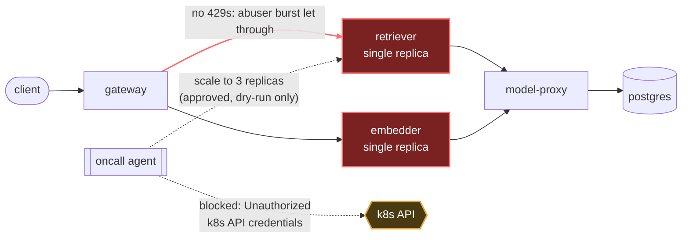

# Postmortem: gateway latency error budget burning slowly (10% of the 28d budget in 6h; 30m & 6h windows)

- **Status:** open
- **Severity:** sev2
- **Verified:** no
- **Opened:** 2026-08-04 01:17:47Z
- **Resolved:** (still open)

## Timeline (machine-generated)

All times UTC on 2026-08-04 unless a full date is shown.

| Time (UTC) | Source | Event |
| --- | --- | --- |
| 00:58:20Z | k8s | Pod/gateway-dd85945b4-c5xbb: Killing |
| 00:58:20Z | k8s | ReplicaSet/gateway-dd85945b4: SuccessfulDelete |
| 00:58:20Z | k8s | Rollout/gateway: ScalingReplicaSet |
| 00:58:20Z | k8s | Rollout/gateway: RolloutUpdated |
| 00:58:20Z | k8s | Rollout/gateway: RolloutNotCompleted |
| 00:58:21Z | k8s | ReplicaSet/gateway-55bbf6bfbf: SuccessfulCreate |
| 00:58:21Z | k8s | Pod/gateway-55bbf6bfbf-4qgg4: Scheduled |
| 00:58:23Z | k8s | Pod/gateway-55bbf6bfbf-4qgg4: Started |
| 00:58:23Z | k8s | Pod/gateway-55bbf6bfbf-4qgg4: Pulled |
| 00:58:23Z | k8s | Pod/gateway-55bbf6bfbf-4qgg4: Created |
| 00:58:25Z | k8s | Pod/gateway-55bbf6bfbf-4qgg4: Started |
| 00:58:25Z | k8s | Pod/gateway-55bbf6bfbf-4qgg4: Pulled |
| 00:58:25Z | k8s | Pod/gateway-55bbf6bfbf-4qgg4: Created |
| 00:58:27Z | k8s | Pod/gateway-55bbf6bfbf-4qgg4: BackOff |
| 00:58:28Z | k8s | Pod/gateway-55bbf6bfbf-4qgg4: BackOff |
| 00:58:31Z | k8s | Pod/gateway-55bbf6bfbf-4qgg4: BackOff |
| 00:58:37Z | k8s | Pod/gateway-55bbf6bfbf-4qgg4: Started |
| 00:58:37Z | k8s | Pod/gateway-55bbf6bfbf-4qgg4: Pulled |
| 00:58:37Z | k8s | Pod/gateway-55bbf6bfbf-4qgg4: Created |
| 00:58:39Z | k8s | Pod/gateway-55bbf6bfbf-4qgg4: BackOff |
| 00:58:40Z | k8s | Pod/gateway-55bbf6bfbf-4qgg4: BackOff |
| 00:58:41Z | k8s | Pod/gateway-55bbf6bfbf-4qgg4: BackOff |
| 00:59:03Z | k8s | Pod/gateway-55bbf6bfbf-4qgg4: Started |
| 00:59:03Z | k8s | Pod/gateway-55bbf6bfbf-4qgg4: Pulled |
| 00:59:03Z | k8s | Pod/gateway-55bbf6bfbf-4qgg4: Created |
| 00:59:05Z | k8s | Pod/gateway-55bbf6bfbf-4qgg4: BackOff |
| 00:59:06Z | k8s | Pod/gateway-55bbf6bfbf-4qgg4: BackOff |
| 00:59:11Z | k8s | Pod/gateway-55bbf6bfbf-4qgg4: BackOff |
| 00:59:57Z | k8s | Pod/gateway-55bbf6bfbf-4qgg4: Started |
| 00:59:57Z | k8s | Pod/gateway-55bbf6bfbf-4qgg4: Pulled |
| 00:59:57Z | k8s | Pod/gateway-55bbf6bfbf-4qgg4: Created |
| 00:59:59Z | k8s | Pod/gateway-55bbf6bfbf-4qgg4: BackOff |
| 01:00:00Z | k8s | Pod/gateway-55bbf6bfbf-4qgg4: BackOff |
| 01:00:01Z | k8s | Pod/gateway-55bbf6bfbf-4qgg4: BackOff |
| 01:01:16Z | k8s | Pod/gateway-55bbf6bfbf-4qgg4: BackOff |
| 01:01:19Z | k8s | Pod/gateway-55bbf6bfbf-4qgg4: Started |
| 01:01:19Z | k8s | Pod/gateway-55bbf6bfbf-4qgg4: Pulled |
| 01:01:19Z | k8s | Pod/gateway-55bbf6bfbf-4qgg4: Created |
| 01:01:21Z | k8s | Pod/gateway-55bbf6bfbf-4qgg4: BackOff |
| 01:01:22Z | k8s | Pod/gateway-55bbf6bfbf-4qgg4: BackOff |
| 01:01:31Z | k8s | Pod/gateway-55bbf6bfbf-4qgg4: BackOff |
| 01:02:58Z | k8s | Pod/gateway-55bbf6bfbf-4qgg4: BackOff |
| 01:04:24Z | k8s | Pod/gateway-55bbf6bfbf-4qgg4: Started |
| 01:04:24Z | k8s | Pod/gateway-55bbf6bfbf-4qgg4: Pulled |
| 01:04:24Z | k8s | Pod/gateway-55bbf6bfbf-4qgg4: Created |
| 01:04:26Z | k8s | Pod/gateway-55bbf6bfbf-4qgg4: BackOff |
| 01:04:27Z | k8s | Pod/gateway-55bbf6bfbf-4qgg4: BackOff |
| 01:04:31Z | k8s | Pod/gateway-55bbf6bfbf-4qgg4: BackOff |
| 01:05:46Z | k8s | Pod/gateway-55bbf6bfbf-4qgg4: BackOff |
| 01:06:35Z | k8s | Rollout/gateway: SkipSteps |
| 01:06:35Z | k8s | Rollout/gateway: RolloutUpdated |
| 01:06:36Z | k8s | ReplicaSet/gateway-dd85945b4: SuccessfulCreate |
| 01:06:36Z | k8s | ReplicaSet/gateway-55bbf6bfbf: SuccessfulDelete |
| 01:06:36Z | k8s | Rollout/gateway: ScalingReplicaSet |
| 01:06:36Z | k8s | Pod/gateway-dd85945b4-pwg4s: Scheduled |
| 01:06:39Z | k8s | Pod/gateway-dd85945b4-pwg4s: Started |
| 01:06:39Z | k8s | Pod/gateway-dd85945b4-pwg4s: Pulled |
| 01:06:39Z | k8s | Pod/gateway-dd85945b4-pwg4s: Created |
| 01:17:10Z | alert | alert firing: SLO gateway latency — slow burn |
| 01:22:23Z | verification | recovery NOT verified — deadline armed |

## Evidence links

- [Loki — logs over the incident window](http://localhost:3001/explore?schemaVersion=1&panes=%7B%22pm%22%3A+%7B%22datasource%22%3A+%22loki%22%2C+%22queries%22%3A+%5B%7B%22refId%22%3A+%22A%22%2C+%22datasource%22%3A+%7B%22type%22%3A+%22loki%22%2C+%22uid%22%3A+%22loki%22%7D%2C+%22expr%22%3A+%22%7Bnamespace%3D%5C%22subject%5C%22%7D+%7C~+%5C%22%28%3Fi%29error%7Cfailed%5C%22%22%7D%5D%2C+%22range%22%3A+%7B%22from%22%3A+%221785806267171%22%2C+%22to%22%3A+%221785845979494%22%7D%7D%7D&orgId=1)
- [Mimir — metrics over the incident window](http://localhost:3001/explore?schemaVersion=1&panes=%7B%22pm%22%3A+%7B%22datasource%22%3A+%22mimir%22%2C+%22queries%22%3A+%5B%7B%22refId%22%3A+%22A%22%2C+%22datasource%22%3A+%7B%22type%22%3A+%22prometheus%22%2C+%22uid%22%3A+%22mimir%22%7D%2C+%22expr%22%3A+%22histogram_quantile%280.95%2C+sum%28rate%28http_server_duration_milliseconds_bucket%5B5m%5D%29%29+by+%28le%29%29%22%7D%5D%2C+%22range%22%3A+%7B%22from%22%3A+%221785806267171%22%2C+%22to%22%3A+%221785845979494%22%7D%7D%7D&orgId=1)

## Investigation context

**Runbook match:** none — no tool narrowing applied for this alert. Available runbooks: README.md, canary-abort.md, ci-pipeline-red.md, dq-freshness-stall.md, gateway-high-error-rate.md, k8s-crashloop.md, k8s-node-failure.md, snapshot-agent-audit.md, stale-secret.md

Pre-check battery (as injected at run start)

## Pre-check leads

### recent_deploys — LEAD
No deploy in the last 60m — rule out the reflex answer.
- No deploy in the last 60m — rule out the reflex answer.

### log_spike — OK
error/failed log rate normal: 0/10min vs baseline 0/10min

### kube_scan — UNAVAILABLE
E0804 14:16:08.410831   28344 memcache.go:265] "Unhandled Error" err="couldn't get current server API group list: the server has asked for the client to provide credentials"
E0804 14:16:08.545281   28344 memcache.go:265] "Unhandled Error" err="couldn't get current server API group list: the server has asked for the client to provide credentials"
E0804 14:16:08.924651   28344 memcache.go:265] "Unhandled Error" err="couldn't get current server API group list: the server has asked for the client to

### rollout_state — UNAVAILABLE
gateway: E0804 14:16:08.409727   65488 memcache.go:265] "Unhandled Error" err="couldn't get current server API group list: the server has asked for the client to provide credentials"
E0804 14:16:08.549936   65488 memcache.go:265] "Unhandled Error" err="couldn't get current server API group list: the server has asked for the client to provide credentials"
E0804 14:16:08.926019   65488 memcache.go:265] "Unhandled Error" err="couldn't get current server API group list: the server has asked for the client to; gateway analysis: E0804 14:16:08.777473   12548 memcache.go:265] "Unhandled Error" err="couldn't get current server API group list: the server has asked for the client to provide credentials"
E0804 14:16:08.931636   12548 memcache.go:265] "Unhandled Error"
… (section truncated)

### secret_age — UNAVAILABLE
E0804 14:16:08.458673   37004 memcache.go:265] "Unhandled Error" err="couldn't get current server API group list: the server has asked for the client to provide credentials"
E0804 14:16:08.651034   37

## Narrative

## Summary

Re-opened re-check of the ongoing `SLO gateway latency — slow burn` incident (sev2, tenant `acme`) after attempt 1 reported the fix could not be applied. `alert_status` now reports the alert as **not currently active** — the burst that was burning the budget has subsided on its own. However, the underlying capacity/rate-limiting gap identified in attempt 1 is **still completely unremediated**, and the remediation path is **still blocked by the identical infrastructure fault**, confirmed again with fresh evidence this pass, not assumed carried over.

## Impact

`acme`'s 30m/6h latency SLO windows burned ~10% of the 28-day error budget during the earlier burst. No fresh `acme` inference traffic or gateway request logs are present in the last 30 minutes, and `active_requests` for both `retriever` and `embedder` reads 0 — consistent with the burst having ended rather than with any applied fix.

## Root cause

Unchanged from attempt 1, re-confirmed here: the `abuser` tenant's concurrent, long-running requests are not being turned away with 429s (no rate-limit engagement found in gateway logs), so bursts saturate the **single-replica** `retriever`/`embedder` deployments and queue legitimate `acme` traffic behind them. `count(active_requests) by instance` for both services returns exactly **one instance each** across every window queried — the 3-replica scale-out that was dry-run and operator-approved in attempt 1 was never actually applied.

Explicitly ruling out the "stuck fix" hypotheses this pass required:
- **Not a stuck CI/gitops pipeline** — `gitea_ci_runs` on `main` shows the latest run (111, sha `d62500f603`) green, and the one recent failure (110) was an unrelated `load-generator` change that was promptly reverted. No pending commit touches rate limiting or retriever/embedder sizing.
- **Not a stale/transient credential blip** — a fresh `scale_deployment` dry-run and a fresh `patch_memory_limit` dry-run this pass both failed identically to attempt 1 with `Unauthorized: couldn't get current server API group list`, as did plain reads (`kubectl_read`, `argo_app`, `rollout_status`). Same signature, different call, minutes apart: this is a persistent agent-ro credential/RBAC fault, not noise.

No tool in this toolset can repair k8s API credentials (only the Postgres secret has a repair path via `update_db_secret`, which is unrelated).

## What fixed it

**Nothing I did fixed it.** The alert cleared because the offending traffic burst ended on its own, not because of remediation. I did not re-execute the previously-approved scale-out: doing so would repeat an action already proven to fail for the same reason, with no new evidence it would now succeed, so per incident policy I did not blindly retry it. The capacity gap (single replica) and the rate-limiter gap (abuser tenant never getting 429'd) remain exactly as they were.

## Lessons

- A slow-burn SLO alert clearing on `alert_status` must not be read as "resolved" — it only means the current burn rate dropped below threshold, not that the causal gap was closed. This incident will recur on the next `abuser`-tenant burst.
- The agent's k8s API credentials being down is itself an operational blind spot: it silently disables every remediation tool (scale, restart, memory patch, rollout abort/promote/undo) at once. This deserves its own alert/health-check rather than being discovered mid-incident.
- The `abuser` tenant's rate limiter not engaging (zero 429s across the whole window) is a separate, real defect from the capacity issue and needs its own fix and test coverage — scaling retriever/embedder only buys headroom, it doesn't stop unthrottled bursts from recurring.
- Needs a runbook: no runbook matched `SLO gateway latency — slow burn` at all. One should exist covering: check `abuser`/rate-limiter 429 rate first, then retriever/embedder `active_requests` and replica count, before assuming a deploy regression.

Broken hop: `gateway → retriever/embedder`, saturated by unthrottled `abuser` burst traffic against single-replica capacity. Remediation hop `oncall agent → k8s API` is the reason it stayed broken: credentials rejected on every write and even read attempt, both in attempt 1 and again on fresh dry-runs this pass.
