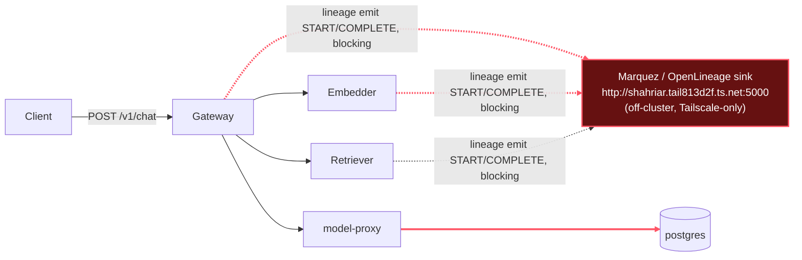

# Postmortem: gateway p95 latency above 2s

- **Status:** open
- **Severity:** sev1
- **Verified:** no
- **Opened:** 2026-08-04 19:22:41Z
- **Resolved:** (still open)

## Timeline (machine-generated)

All times UTC on 2026-08-04 unless a full date is shown.

| Time (UTC) | Source | Event |
| --- | --- | --- |
| 18:30:05Z | k8s | Rollout/gateway: RolloutUpdated |
| 18:30:05Z | k8s | Rollout/gateway: RolloutNotCompleted |
| 18:30:05Z | k8s | Rollout/gateway: NewReplicaSetCreated |
| 18:30:06Z | k8s | Pod/gateway-dd85945b4-jfd54: Killing |
| 18:30:06Z | k8s | ReplicaSet/gateway-dd85945b4: SuccessfulDelete |
| 18:30:06Z | k8s | Rollout/gateway: ScalingReplicaSet |
| 18:30:07Z | k8s | ReplicaSet/gateway-5785654fc7: SuccessfulCreate |
| 18:30:07Z | k8s | Pod/gateway-5785654fc7-p97mq: Scheduled |
| 18:30:10Z | k8s | Pod/gateway-5785654fc7-p97mq: Started |
| 18:30:10Z | k8s | Pod/gateway-5785654fc7-p97mq: Pulled |
| 18:30:10Z | k8s | Pod/gateway-5785654fc7-p97mq: Created |
| 18:30:16Z | k8s | Pod/gateway-5785654fc7-p97mq: Unhealthy |
| 18:30:21Z | k8s | Pod/gateway-5785654fc7-p97mq: Unhealthy |
| 18:30:26Z | k8s | Pod/gateway-5785654fc7-p97mq: Unhealthy |
| 18:30:31Z | k8s | Pod/gateway-5785654fc7-p97mq: Unhealthy |
| 18:30:36Z | k8s | Pod/gateway-5785654fc7-p97mq: Unhealthy |
| 18:30:41Z | k8s | Pod/gateway-5785654fc7-p97mq: Unhealthy |
| 18:30:46Z | k8s | Pod/gateway-5785654fc7-p97mq: Unhealthy |
| 18:30:51Z | k8s | Pod/gateway-5785654fc7-p97mq: Unhealthy |
| 18:30:56Z | k8s | Pod/gateway-5785654fc7-p97mq: Unhealthy |
| 18:31:01Z | k8s | Pod/gateway-5785654fc7-p97mq: Unhealthy |
| 18:31:06Z | k8s | Pod/gateway-5785654fc7-p97mq: Unhealthy |
| 18:31:11Z | k8s | Pod/gateway-5785654fc7-p97mq: Unhealthy |
| 18:31:16Z | k8s | Pod/gateway-5785654fc7-p97mq: Unhealthy |
| 18:31:21Z | k8s | Pod/gateway-5785654fc7-p97mq: Unhealthy |
| 18:31:25Z | k8s | Pod/gateway-5785654fc7-p97mq: Unhealthy |
| 18:31:30Z | k8s | Pod/gateway-5785654fc7-p97mq: Unhealthy |
| 18:31:35Z | k8s | Pod/gateway-5785654fc7-p97mq: Unhealthy |
| 18:31:40Z | k8s | Pod/gateway-5785654fc7-p97mq: Unhealthy |
| 18:31:45Z | k8s | Pod/gateway-5785654fc7-p97mq: Unhealthy |
| 18:31:50Z | k8s | Pod/gateway-5785654fc7-p97mq: Unhealthy |
| 18:31:55Z | k8s | Pod/gateway-5785654fc7-p97mq: Unhealthy |
| 18:32:00Z | k8s | Pod/gateway-5785654fc7-p97mq: Unhealthy |
| 18:32:05Z | k8s | Pod/gateway-5785654fc7-p97mq: Unhealthy |
| 18:32:10Z | k8s | Pod/gateway-5785654fc7-p97mq: Unhealthy |
| 18:32:15Z | k8s | Pod/gateway-5785654fc7-p97mq: Unhealthy |
| 18:35:19Z | k8s | Pod/gateway-5785654fc7-p97mq: Unhealthy |
| 18:38:48Z | k8s | Rollout/gateway: SkipSteps |
| 18:38:48Z | k8s | Rollout/gateway: RolloutUpdated |
| 18:38:49Z | k8s | Pod/gateway-5785654fc7-p97mq: Killing |
| 18:38:49Z | k8s | ReplicaSet/gateway-5785654fc7: SuccessfulDelete |
| 18:38:49Z | k8s | Rollout/gateway: ScalingReplicaSet |
| 18:38:50Z | k8s | ReplicaSet/gateway-dd85945b4: SuccessfulCreate |
| 18:38:50Z | k8s | Rollout/gateway: ScalingReplicaSet |
| 18:38:50Z | k8s | Pod/gateway-dd85945b4-mm7jm: Scheduled |
| 18:38:53Z | k8s | Pod/gateway-dd85945b4-mm7jm: Started |
| 18:38:53Z | k8s | Pod/gateway-dd85945b4-mm7jm: Pulled |
| 18:38:53Z | k8s | Pod/gateway-dd85945b4-mm7jm: Created |
| 18:56:49Z | k8s | Rollout/gateway: RolloutUpdated |
| 18:56:49Z | k8s | Rollout/gateway: RolloutNotCompleted |
| 18:56:49Z | k8s | Rollout/gateway: NewReplicaSetCreated |
| 18:56:50Z | deploy:argo | gateway synced to edb33a6699c9 |
| 18:56:50Z | k8s | Pod/gateway-dd85945b4-mm7jm: Killing |
| 18:56:50Z | k8s | ReplicaSet/gateway-dd85945b4: SuccessfulDelete |
| 18:56:50Z | k8s | Rollout/gateway: ScalingReplicaSet |
| 18:56:51Z | k8s | ReplicaSet/gateway-8444846b5f: SuccessfulCreate |
| 18:56:51Z | k8s | Rollout/gateway: ScalingReplicaSet |
| 18:56:51Z | k8s | Pod/gateway-8444846b5f-bqkg8: Scheduled |
| 18:56:52Z | k8s | Pod/gateway-8444846b5f-bqkg8: Pulled |
| 18:56:52Z | k8s | Pod/gateway-8444846b5f-bqkg8: Created |
| 18:56:53Z | k8s | Pod/gateway-8444846b5f-bqkg8: Started |
| 18:57:01Z | k8s | Rollout/gateway: RolloutStepCompleted |
| 18:57:03Z | k8s | Rollout/gateway: AnalysisRunRunning |
| 18:58:02Z | k8s | AnalysisRun/gateway-8444846b5f-21-1: MetricFailed |
| 18:58:02Z | k8s | AnalysisRun/gateway-8444846b5f-21-1: AnalysisRunFailed |
| 18:58:03Z | k8s | Rollout/gateway: RolloutAborted |
| 18:58:03Z | k8s | Rollout/gateway: AnalysisRunFailed |
| 18:58:04Z | k8s | Pod/gateway-8444846b5f-bqkg8: Killing |
| 18:58:04Z | k8s | ReplicaSet/gateway-8444846b5f: SuccessfulDelete |
| 18:58:04Z | k8s | Rollout/gateway: ScalingReplicaSet |
| 18:58:05Z | k8s | ReplicaSet/gateway-dd85945b4: SuccessfulCreate |
| 18:58:05Z | k8s | Rollout/gateway: ScalingReplicaSet |
| 18:58:05Z | k8s | Pod/gateway-dd85945b4-hw5fg: Scheduled |
| 18:58:06Z | k8s | Pod/gateway-dd85945b4-hw5fg: Started |
| 18:58:06Z | k8s | Pod/gateway-dd85945b4-hw5fg: Pulled |
| 18:58:06Z | k8s | Pod/gateway-dd85945b4-hw5fg: Created |
| 19:01:45Z | deploy:annotation | deploy gateway via gitops c025382 (argo sync) |
| 19:01:47Z | deploy:argo | gateway synced to c025382ba170 |
| 19:01:47Z | k8s | Rollout/gateway: SkipSteps |
| 19:01:47Z | k8s | Rollout/gateway: RolloutUpdated |
| 19:22:10Z | alert | alert firing: Gateway p95 latency > 2s |
| 19:22:13Z | log-spike | log-spike onset: {"level":"warn","service":"gateway","message":"lineage emit failed","trace_id":"d2516e1c63967e388312e6080a1f1aa5","span_id":"8c07953f36910f53","time":"2026-08-04T19:22:13.189Z","reason":"The operation timed out.","job":"ra… |

## Evidence links

- [Loki — logs over the incident window](http://localhost:3001/explore?schemaVersion=1&panes=%7B%22pm%22%3A+%7B%22datasource%22%3A+%22loki%22%2C+%22queries%22%3A+%5B%7B%22refId%22%3A+%22A%22%2C+%22datasource%22%3A+%7B%22type%22%3A+%22loki%22%2C+%22uid%22%3A+%22loki%22%7D%2C+%22expr%22%3A+%22%7Bnamespace%3D%5C%22subject%5C%22%7D+%7C~+%5C%22%28%3Fi%29error%7Cfailed%5C%22%22%7D%5D%2C+%22range%22%3A+%7B%22from%22%3A+%221785871361829%22%2C+%22to%22%3A+%221785871774692%22%7D%7D%7D&orgId=1)
- [Mimir — metrics over the incident window](http://localhost:3001/explore?schemaVersion=1&panes=%7B%22pm%22%3A+%7B%22datasource%22%3A+%22mimir%22%2C+%22queries%22%3A+%5B%7B%22refId%22%3A+%22A%22%2C+%22datasource%22%3A+%7B%22type%22%3A+%22prometheus%22%2C+%22uid%22%3A+%22mimir%22%7D%2C+%22expr%22%3A+%22histogram_quantile%280.95%2C+sum%28rate%28http_server_duration_milliseconds_bucket%5B5m%5D%29%29+by+%28le%29%29%22%7D%5D%2C+%22range%22%3A+%7B%22from%22%3A+%221785871361829%22%2C+%22to%22%3A+%221785871774692%22%7D%7D%7D&orgId=1)

## Investigation context

**Runbook match:** none — no tool narrowing applied for this alert. Available runbooks: README.md, canary-abort.md, ci-pipeline-red.md, dq-freshness-stall.md, gateway-high-error-rate.md, k8s-crashloop.md, k8s-node-failure.md, snapshot-agent-audit.md, stale-secret.md

Pre-check battery (as injected at run start)

## Pre-check leads

### recent_deploys — LEAD
2 deploy-window leads
- deploy annotation at 2026-08-04T19:01:45.359000+00:00: deploy gateway via gitops c025382 (argo sync)
- argo app platform: sync=OutOfSync health=Healthy (revision c025382ba170)

### kube_scan — LEAD
5 kube-scan leads
- event AnalysisRun/gateway-8444846b5f-21-1: MetricFailed — Metric 'canary-error-rate' Completed. Result: Failed (at 20:58:02)
- event AnalysisRun/gateway-8444846b5f-21-1: MetricFailed — Metric 'canary-p95' Completed. Result: Failed (at 20:58:02)
- event AnalysisRun/gateway-8444846b5f-21-1: AnalysisRunFailed — Analysis Completed. Result: Failed (at 20:58:02)
- event Rollout/gateway: RolloutAborted — Rollout aborted update to revision 21: Step-based analysis phase error/failed: Metric \"canary-error-rate\" assessed Failed due to failed (2) > fai… (truncated)
- event Rollout/gateway: AnalysisRunFailed — Step Analysis Run 'gateway-8444846b5f-21-1' Status New: 'Failed' Previous: 'Running' (at 20:58:03)

### log_spike — LEAD
error/failed log rate 200/10min vs baseline 0/10min (200x baseline) — onset: {"level":"warn","service":"gateway","message":"lineage emit failed","trace_id":"d2516e1c63967e388312e6080a1f1aa5","span_id":"8c07953f36910f53","time":"2026-08-04T19:22:13.189Z","reason":"The operation timed out.","job":"rag.inference","eventType":"START"} at 2026-08-04T19:22:13.190307+00:00
- error/failed log rate 200/10min vs baseline 0/10min (200x baseline) — onset: {"level":"warn","service":"gateway","message":"lineage emit failed","trace_id":"d2516e1c63967e388312e6080a1f1a… (truncated)

### rollout_state — LEAD
1 rollout-state lead
- analysisrun for gateway (gateway-8444846b5f-21-1): Failed — Metric "canary-error-rate" assessed Failed due to failed (2) > failureLimit (1)

### secret_age — OK
Secret subject-db-credentials last modified 10d 20h ago (created 10d 20h ago).

## Narrative

## Summary

`Gateway p95 latency > 2s` fired for tenant acme. The gateway itself was healthy (rollout `Healthy`, step 4/4, current revision `c025382ba170`/hash `dd85945b4`, 4/4 pods ready, zero k8s warning events, zero OOM/restarts). The latency blew out because every RAG request now spends multiple seconds blocked on a synchronous OpenLineage "lineage emit" call, on every stage of the pipeline, to a lineage sink that is unreachable.

## Impact

Sampled `POST /v1/chat` root traces during the window ran 5.7s–13.9s end-to-end (see `report.html`), 3–7x over the 2s SLO. Every sampled trace showed multi-second spans inside `gateway`, `embedder`, and `retriever`, each paired with a `"lineage emit failed"` / `"reason":"The operation timed out."` warning log for `eventType` START/COMPLETE across `job` values `rag.inference`, `rag.embed`, and `rag.retrieve`. `model-proxy` was not affected (it does not emit lineage events), which is why its own span in the same traces stayed fast (~150-380ms).

## Root cause

The `subject-telemetry` ConfigMap (10 days old, unchanged) sets `MARQUEZ_URL=http://shahriar.tail813d2f.ts.net:5000` — an off-cluster OpenLineage/Marquez endpoint reachable only over the operator's Tailscale network, not a service inside the `subject` namespace or the k3d cluster (confirmed: no `marquez` Deployment/Service exists anywhere in this cluster). `gateway`, `embedder`, and `retriever` each call this endpoint **synchronously, inline in the request path**, once per lifecycle event (START/COMPLETE/FAIL) per RAG stage. With that endpoint currently unreachable, every one of those calls hangs for its full timeout (~2.5s observed consistently) before the request can proceed — and because a single chat request touches 3 lineage-emitting stages, the blocking time stacks, pushing total request latency into double-digit seconds.

This is not the canary/deploy failure visible in the pre-check leads: `AnalysisRun gateway-8444846b5f-21-1` (canary p95 4.8–5.9s, error rate ~92-93%) belongs to the *previous* rollout of revision `edb33a6699c9`, which Argo Rollouts had already auto-aborted and rolled back **before** `c025382ba170` was synced at 19:01:47Z — over 20 minutes before this alert's onset at 19:22:10Z. That earlier canary failure is resolved and unrelated; it should not be re-remediated.

I also ruled out a resource/scheduling cause: the newest gateway pod (26 minutes old, so post-dating any prior remediation) shows the identical lineage timeout behavior as the 44-hour-old pods, and there were zero k8s warning events (no OOM kills, no probe failures, no restarts) in the incident window — this is a pure application hot-path dependency-blocking issue, not a capacity issue.

## What fixed it

Nothing — I did not execute a remediation. None of the tools available to on-call infra response (`restart_workload`, `scale_deployment`, `patch_memory_limit`, `rollout_undo`/`abort`/`promote`, `update_db_secret`) touch the `MARQUEZ_URL` configuration or the blocking lineage-emit call path, and the pod-age evidence above shows a restart would not clear the condition (a fresh pod already exhibits it). Running one of those actions anyway would not have addressed the root cause, so I did not dry-run/request approval for a remediation I already have evidence would be ineffective. Re-queried `alert_status` after investigation: still `active` (since 19:22:10Z) — **incident remains unresolved**.

## Lessons

- The lineage-emit call in `gateway`/`embedder`/`retriever` needs to be fire-and-forget (or fronted by a short client-side timeout + circuit breaker) so an unreachable OpenLineage sink can never add wall-clock latency to the user-facing request path — this is the actual fix, and it's a code/config change outside this session's remediation toolset.
- Pointing production-path telemetry at a dependency that only exists on the operator's personal Tailscale node is a single point of failure; the lineage sink should either run in-cluster or the emit path should degrade gracefully (already-fire-and-forget) when it's unreachable.
- Pre-check leads pointed at the aborted canary AnalysisRun, which was a real but already-resolved incident (Argo Rollouts self-healed it); worth double-checking timestamps against alert onset before treating a pre-check lead as the active cause.
- No runbook currently covers "gateway p95 latency" as its own alert — this incident's diagnostic path (trace → per-hop span attribution → log correlation → ConfigMap inspection) should become a new runbook.

The three dashed red edges (Gateway/Embedder/Retriever → Marquez) are the broken hop: each is a synchronous call that now blocks ~2.5s per event on an unreachable external endpoint, stacking across the 3 RAG stages to produce the 5.7–13.9s end-to-end latencies behind this alert.
