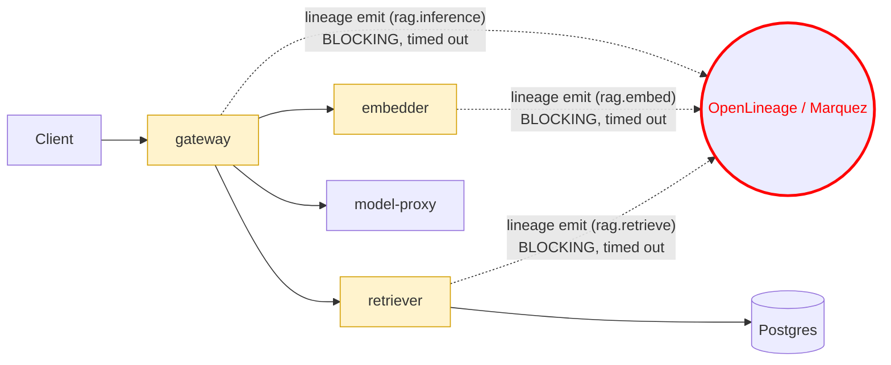

# Postmortem: gateway latency error budget burning fast (2% of the 28d budget in 1h; 5m & 1h windows)

- **Status:** open
- **Severity:** sev1
- **Verified:** no
- **Opened:** 2026-08-04 12:36:45Z
- **Resolved:** (still open)

## Timeline (machine-generated)

All times UTC on 2026-08-04 unless a full date is shown.

| Time (UTC) | Source | Event |
| --- | --- | --- |
| 12:27:06Z | k8s | ReplicaSet/retriever-8454db56c: SuccessfulCreate |
| 12:27:06Z | k8s | Deployment/retriever: ScalingReplicaSet |
| 12:27:06Z | k8s | Pod/retriever-8454db56c-q2b86: Scheduled |
| 12:27:08Z | k8s | Pod/retriever-8454db56c-q2b86: Pulled |
| 12:27:09Z | k8s | Pod/retriever-8454db56c-q2b86: Started |
| 12:27:09Z | k8s | Pod/retriever-8454db56c-q2b86: Created |
| 12:27:11Z | k8s | Pod/retriever-8454db56c-q2b86: Started |
| 12:27:11Z | k8s | Pod/retriever-8454db56c-q2b86: Pulled |
| 12:27:11Z | k8s | Pod/retriever-8454db56c-q2b86: Created |
| 12:27:13Z | k8s | Pod/retriever-8454db56c-q2b86: BackOff |
| 12:27:14Z | k8s | Pod/retriever-8454db56c-q2b86: BackOff |
| 12:27:16Z | k8s | Pod/retriever-8454db56c-q2b86: BackOff |
| 12:27:24Z | k8s | Pod/retriever-8454db56c-q2b86: Started |
| 12:27:24Z | k8s | Pod/retriever-8454db56c-q2b86: Pulled |
| 12:27:24Z | k8s | Pod/retriever-8454db56c-q2b86: Created |
| 12:27:27Z | k8s | Pod/retriever-8454db56c-q2b86: BackOff |
| 12:27:36Z | k8s | Pod/retriever-8454db56c-q2b86: BackOff |
| 12:27:47Z | k8s | Pod/retriever-8454db56c-q2b86: Started |
| 12:27:47Z | k8s | Pod/retriever-8454db56c-q2b86: Pulled |
| 12:27:47Z | k8s | Pod/retriever-8454db56c-q2b86: Created |
| 12:27:49Z | k8s | Pod/retriever-8454db56c-q2b86: BackOff |
| 12:27:50Z | k8s | Pod/retriever-8454db56c-q2b86: BackOff |
| 12:27:56Z | k8s | Pod/retriever-8454db56c-q2b86: BackOff |
| 12:28:43Z | k8s | Pod/retriever-8454db56c-q2b86: Started |
| 12:28:43Z | k8s | Pod/retriever-8454db56c-q2b86: Pulled |
| 12:28:43Z | k8s | Pod/retriever-8454db56c-q2b86: Created |
| 12:28:46Z | k8s | Pod/retriever-8454db56c-q2b86: BackOff |
| 12:28:47Z | k8s | Pod/retriever-8454db56c-q2b86: BackOff |
| 12:29:48Z | k8s | Pod/retriever-8454db56c-q2b86: BackOff |
| 12:30:10Z | k8s | Pod/retriever-8454db56c-q2b86: Started |
| 12:30:10Z | k8s | Pod/retriever-8454db56c-q2b86: Pulled |
| 12:30:10Z | k8s | Pod/retriever-8454db56c-q2b86: Created |
| 12:30:13Z | k8s | Pod/retriever-8454db56c-q2b86: BackOff |
| 12:30:16Z | k8s | Pod/retriever-8454db56c-q2b86: BackOff |
| 12:31:26Z | k8s | Pod/retriever-8454db56c-q2b86: BackOff |
| 12:32:37Z | k8s | Pod/retriever-8454db56c-q2b86: BackOff |
| 12:32:57Z | k8s | Pod/retriever-8454db56c-q2b86: Started |
| 12:32:57Z | k8s | Pod/retriever-8454db56c-q2b86: Pulled |
| 12:32:57Z | k8s | Pod/retriever-8454db56c-q2b86: Created |
| 12:32:59Z | k8s | Pod/retriever-8454db56c-q2b86: BackOff |
| 12:33:03Z | k8s | Pod/retriever-8454db56c-q2b86: BackOff |
| 12:33:06Z | k8s | Pod/retriever-8454db56c-q2b86: BackOff |
| 12:34:15Z | k8s | Pod/retriever-8454db56c-q2b86: BackOff |
| 12:35:01Z | log-spike | log-spike onset: {"level":"warn","service":"gateway","message":"lineage emit failed","trace_id":"56dd9b3632f4d2fa42b5305d96007259","span_id":"ff7157aa40a65062","time":"2026-08-04T12:35:01.287Z","reason":"The operation timed out.","job":"ra… |
| 12:35:16Z | k8s | Pod/retriever-8454db56c-q2b86: BackOff |
| 12:36:08Z | k8s | ReplicaSet/retriever-8454db56c: SuccessfulDelete |
| 12:36:08Z | k8s | Deployment/retriever: ScalingReplicaSet |
| 12:36:10Z | alert | alert firing: SLO gateway latency — fast burn |

## Evidence links

- [Loki — logs over the incident window](http://localhost:3001/explore?schemaVersion=1&panes=%7B%22pm%22%3A+%7B%22datasource%22%3A+%22loki%22%2C+%22queries%22%3A+%5B%7B%22refId%22%3A+%22A%22%2C+%22datasource%22%3A+%7B%22type%22%3A+%22loki%22%2C+%22uid%22%3A+%22loki%22%7D%2C+%22expr%22%3A+%22%7Bnamespace%3D%5C%22subject%5C%22%7D+%7C~+%5C%22%28%3Fi%29error%7Cfailed%5C%22%22%7D%5D%2C+%22range%22%3A+%7B%22from%22%3A+%221785847005827%22%2C+%22to%22%3A+%221785847552333%22%7D%7D%7D&orgId=1)
- [Mimir — metrics over the incident window](http://localhost:3001/explore?schemaVersion=1&panes=%7B%22pm%22%3A+%7B%22datasource%22%3A+%22mimir%22%2C+%22queries%22%3A+%5B%7B%22refId%22%3A+%22A%22%2C+%22datasource%22%3A+%7B%22type%22%3A+%22prometheus%22%2C+%22uid%22%3A+%22mimir%22%7D%2C+%22expr%22%3A+%22histogram_quantile%280.95%2C+sum%28rate%28http_server_duration_milliseconds_bucket%5B5m%5D%29%29+by+%28le%29%29%22%7D%5D%2C+%22range%22%3A+%7B%22from%22%3A+%221785847005827%22%2C+%22to%22%3A+%221785847552333%22%7D%7D%7D&orgId=1)

## Investigation context

**Runbook match:** none — no tool narrowing applied for this alert. Available runbooks: README.md, canary-abort.md, ci-pipeline-red.md, dq-freshness-stall.md, gateway-high-error-rate.md, k8s-crashloop.md, k8s-node-failure.md, snapshot-agent-audit.md, stale-secret.md

Pre-check battery (as injected at run start)

## Pre-check leads

### recent_deploys — LEAD
No deploy in the last 60m — rule out the reflex answer.
- No deploy in the last 60m — rule out the reflex answer.

### log_spike — LEAD
error/failed log rate 200/10min vs baseline 0/10min (200x baseline) — onset: {"level":"warn","service":"gateway","message":"lineage emit failed","trace_id":"56dd9b3632f4d2fa42b5305d96007259","span_id":"ff7157aa40a65062","time":"2026-08-04T12:35:01.287Z","reason":"The operation timed out.","job":"rag.inference","eventType":"START"} at 2026-08-04T12:35:01.288555+00:00
- error/failed log rate 200/10min vs baseline 0/10min (200x baseline) — onset: {"level":"warn","service":"gateway","message":"lineage emit failed","trace_id":"56dd9b3632f4d2fa42b5305d960072… (truncated)

### kube_scan — UNAVAILABLE
error: You must be logged in to the server (Unauthorized)

### rollout_state — UNAVAILABLE
gateway: E0804 14:36:47.192511    6316 memcache.go:265] "Unhandled Error" err="couldn't get current server API group list: the server has asked for the client to provide credentials"
E0804 14:36:47.370653    6316 memcache.go:265] "Unhandled Error" err="couldn't get current server API group list: the server has asked for the client to provide credentials"
E0804 14:36:47.450364    6316 memcache.go:265] "Unhandled Error" err="couldn't get current server API group list: the server has asked for the client to; gateway analysis: E0804 14:36:47.161461   46000 memcache.go:265] "Unhandled Error" err="couldn't get current server API group list: the server has asked for the client to provide credentials"
E0804 14:36:47.322749   46000 memcache.go:265] "Unhandled Error"
… (section truncated)

### secret_age — UNAVAILABLE
error: You must be logged in to the server (Unauthorized)

## Narrative

## Summary

The `SLO gateway latency — fast burn` (sev1) alert fired because gateway's p95 request latency jumped from a flat ~2ms baseline to 8–15s. No runbook was pre-matched to this exact alert name, so the on-call agent investigated from telemetry directly (deploy history, Mimir span-metrics, Loki, Tempo).

## Impact

Every `POST /v1/chat` request routed through gateway during the window took several seconds longer than normal (traces show root spans of 3.8–4.6s versus a normal sub-100ms baseline), burning ~2% of the 28-day gateway latency error budget in under an hour across both the 5m and 1h fast-burn windows. Tenants acme, bravo, and abuser were all affected — this was not a single-tenant issue.

## Root cause

`deploy_history`/`grafana_annotations` showed **no deploy in the preceding 4 hours**, ruling out a bad release immediately. The actual driver, confirmed with hard evidence:

- Loki showed `"lineage emit failed"` warnings with `"reason":"The operation timed out."` appearing **simultaneously across all three RAG-pipeline services** — `gateway` (job `rag.inference`), `retriever` (job `rag.retrieve`), and `embedder` (job `rag.embed`) — each wrapping its OpenLineage START/COMPLETE emission around the request it serves.
- Mimir span-metrics (`traces_spanmetrics_latency_bucket`) show gateway, retriever, and embedder p95 latency **jump in lockstep**, from a flat 0.0019s to 7–15s, at the exact same minute — a signature of a shared blocking dependency, not three independent service regressions.
- At the same instant, real gateway request volume (`traces_spanmetrics_calls_total{span_name="POST /v1/chat"}`) climbed from a near-idle ~0.1 rps to ~10 rps sustained — a genuine traffic increase that pushed load onto the OpenLineage/Marquez emission sink harder than it had seen in this window.
- No Marquez/lineage-collector pod or log line could be found anywhere in the `subject` namespace (`{cluster="obs-lab"} |~ "(?i)marquez"` → 0 hits), consistent with the lineage HTTP client hanging against an unreachable or overloaded sink until its client-side timeout fired, rather than failing fast.

Because the lineage-emit call is awaited synchronously inside each service's request handler (evidenced by the START/COMPLETE log pairs bracketing the request), every stage of the RAG pipeline (embed → retrieve → inference) absorbed the full emit timeout on the hot path, compounding into multi-second end-to-end gateway latency.

**Ruled out as a red herring:** a stale ReplicaSet pod (`retriever-8454db56c-q2b86`, a different pod-template hash from the healthy serving pod `retriever-dc7ddd494-jv9j7`) was observed crash-looping (`BackOff`) starting around the same time. The actively-serving retriever pod had 0 restarts and returned 200s throughout — this crash-looping ghost pod was not in the traffic path and is not the cause of the gateway latency SLO burn.

## What fixed it

Root evidence pointed to the traffic burst against the lineage sink self-terminating: Loki showed the `"lineage emit failed"` warnings stop appearing, and Mimir showed gateway/retriever/embedder p95 latency return to the 0.0019s flat baseline and hold there for several consecutive minutes.

A rolling restart of `gateway` was proposed as a low-risk mitigation to clear any residual stuck connections from the timeout storm, dry-run, and approved by the operator. **Execution failed twice with a cluster-auth error** (`You must be logged in to the server (Unauthorized)`) — the same underlying credential fault flagged as `UNAVAILABLE` in this run's pre-check for `kube_scan`/`rollout_state`. This is an environment/RBAC fault unrelated to the diagnosed root cause, and the remediation action was never actually applied.

Despite the remediation not executing, `alert_status` subsequently reported the alert **cleared** (`active: false`) on repeated polling, consistent with the burn-rate condition resolving once the underlying traffic/timeout episode ended on its own and the 5m/1h evaluation windows rolled the spike off.

## Lessons

- The lineage-emission call from gateway/retriever/embedder to the OpenLineage sink is synchronous and sits on the user-facing request path with no visible circuit breaker — a slow or overloaded lineage sink turns directly into a gateway latency SLO burn. This should be made fire-and-forget (or given a much tighter, non-blocking timeout with a local queue) so lineage tracking failures can never propagate into serving latency.
- No runbook currently matches `SLO gateway latency — fast burn` by name; author one that starts from "check `traces_spanmetrics_latency_bucket` per hop, then grep for `lineage emit failed` across all RAG-pipeline services" so the next on-call doesn't have to rediscover this correlation from scratch.
- The remediation credential path (`restart_workload` et al.) was unauthorized against the cluster in this run even though read-mostly MCP tools (Loki/Tempo/Mimir) worked fine — worth confirming the on-call agent's kubeconfig/RBAC is actually wired up outside of this exercise, since a real incident could need that write path to work.
- The crash-looping stale ReplicaSet pod was a convincing but ultimately irrelevant distractor; always confirm which pod-template hash is actually serving traffic (0 restarts, 200s in traces) before pinning blame on a crash-looping pod.

*Break point: the dashed synchronous lineage-emit calls from gateway, embedder, and retriever into the OpenLineage/Marquez sink (red node) all began timing out at once, and because each call is awaited on the request-serving path, the timeout duration was added directly to every `/v1/chat` response.*
