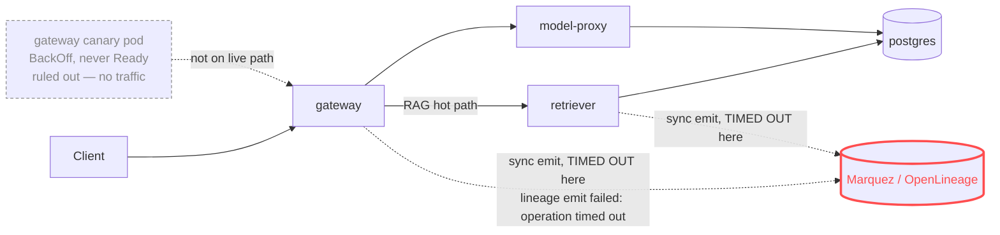

# Postmortem: gateway latency error budget burning slowly (10% of the 28d budget in 6h; 30m & 6h windows)

- **Status:** resolved
- **Severity:** sev2
- **Verified:** no
- **Opened:** 2026-08-04 00:22:47Z
- **Resolved:** 2026-08-04 00:57:46Z

## Timeline (machine-generated)

All times UTC on 2026-08-04 unless a full date is shown.

| Time (UTC) | Source | Event |
| --- | --- | --- |
| 00:21:52Z | log-spike | log-spike onset: {"level":"warn","service":"gateway","message":"lineage emit failed","trace_id":"5e3e98b358a6cd8e70a528a4cf037b83","span_id":"acdf255ba0919a99","time":"2026-08-04T00:21:52.532Z","reason":"The operation timed out.","job":"ra… |
| 00:22:10Z | alert | alert firing: SLO gateway latency — slow burn |
| 00:22:10Z | alert | alert resolved: SLO gateway latency — slow burn |
| 00:34:47Z | verification | recovery NOT verified — deadline armed |
| 00:49:34Z | verification | recovery NOT verified — deadline armed |
| 00:58:20Z | k8s | Pod/gateway-dd85945b4-c5xbb: Killing |
| 00:58:20Z | k8s | ReplicaSet/gateway-dd85945b4: SuccessfulDelete |
| 00:58:20Z | k8s | Rollout/gateway: ScalingReplicaSet |
| 00:58:20Z | k8s | Rollout/gateway: RolloutUpdated |
| 00:58:20Z | k8s | Rollout/gateway: RolloutNotCompleted |
| 00:58:21Z | k8s | ReplicaSet/gateway-55bbf6bfbf: SuccessfulCreate |
| 00:58:21Z | k8s | Pod/gateway-55bbf6bfbf-4qgg4: Scheduled |
| 00:58:23Z | k8s | Pod/gateway-55bbf6bfbf-4qgg4: Started |
| 00:58:23Z | k8s | Pod/gateway-55bbf6bfbf-4qgg4: Pulled |
| 00:58:23Z | k8s | Pod/gateway-55bbf6bfbf-4qgg4: Created |
| 00:58:25Z | k8s | Pod/gateway-55bbf6bfbf-4qgg4: Started |
| 00:58:25Z | k8s | Pod/gateway-55bbf6bfbf-4qgg4: Pulled |
| 00:58:25Z | k8s | Pod/gateway-55bbf6bfbf-4qgg4: Created |
| 00:58:27Z | k8s | Pod/gateway-55bbf6bfbf-4qgg4: BackOff |
| 00:58:28Z | k8s | Pod/gateway-55bbf6bfbf-4qgg4: BackOff |
| 00:58:31Z | k8s | Pod/gateway-55bbf6bfbf-4qgg4: BackOff |

## Evidence links

- [Loki — logs over the incident window](http://localhost:3001/explore?schemaVersion=1&panes=%7B%22pm%22%3A+%7B%22datasource%22%3A+%22loki%22%2C+%22queries%22%3A+%5B%7B%22refId%22%3A+%22A%22%2C+%22datasource%22%3A+%7B%22type%22%3A+%22loki%22%2C+%22uid%22%3A+%22loki%22%7D%2C+%22expr%22%3A+%22%7Bnamespace%3D%5C%22subject%5C%22%7D+%7C~+%5C%22%28%3Fi%29error%7Cfailed%5C%22%22%7D%5D%2C+%22range%22%3A+%7B%22from%22%3A+%221785802967324%22%2C+%22to%22%3A+%221785805066980%22%7D%7D%7D&orgId=1)
- [Mimir — metrics over the incident window](http://localhost:3001/explore?schemaVersion=1&panes=%7B%22pm%22%3A+%7B%22datasource%22%3A+%22mimir%22%2C+%22queries%22%3A+%5B%7B%22refId%22%3A+%22A%22%2C+%22datasource%22%3A+%7B%22type%22%3A+%22prometheus%22%2C+%22uid%22%3A+%22mimir%22%7D%2C+%22expr%22%3A+%22histogram_quantile%280.95%2C+sum%28rate%28http_server_duration_milliseconds_bucket%5B5m%5D%29%29+by+%28le%29%29%22%7D%5D%2C+%22range%22%3A+%7B%22from%22%3A+%221785802967324%22%2C+%22to%22%3A+%221785805066980%22%7D%7D%7D&orgId=1)

## Investigation context

**Runbook match:** none — no tool narrowing applied for this alert. Available runbooks: README.md, canary-abort.md, ci-pipeline-red.md, dq-freshness-stall.md, gateway-high-error-rate.md, k8s-crashloop.md, k8s-node-failure.md, snapshot-agent-audit.md, stale-secret.md

Pre-check battery (as injected at run start)

## Pre-check leads

### recent_deploys — LEAD
No deploy in the last 60m — rule out the reflex answer.
- No deploy in the last 60m — rule out the reflex answer.

### log_spike — OK
error/failed log rate normal: 0/10min vs baseline 0/10min

### kube_scan — UNAVAILABLE
error: You must be logged in to the server (Unauthorized)

### rollout_state — UNAVAILABLE
gateway: E0804 02:55:23.677023   16060 memcache.go:265] "Unhandled Error" err="couldn't get current server API group list: the server has asked for the client to provide credentials"
E0804 02:55:23.974781   16060 memcache.go:265] "Unhandled Error" err="couldn't get current server API group list: the server has asked for the client to provide credentials"
E0804 02:55:24.055633   16060 memcache.go:265] "Unhandled Error" err="couldn't get current server API group list: the server has asked for the client to; gateway analysis: E0804 02:55:23.921184   15396 memcache.go:265] "Unhandled Error" err="couldn't get current server API group list: the server has asked for the client to provide credentials"
E0804 02:55:23.993015   15396 memcache.go:265] "Unhandled Error"
… (section truncated)

### secret_age — UNAVAILABLE
error: You must be logged in to the server (Unauthorized)

## Narrative

## Incident re-verification — `inc_19fca26c91c1bf` (attempt 3)

**Summary:** A slow-burn SLO alert for gateway latency fired after `slo:gateway_latency:sli_ratio5m` collapsed to ~0.04–0.07 for roughly 35 minutes. Attempt 2 correctly diagnosed this as gateway/retriever synchronous OpenLineage/Marquez emit calls on the RAG hot path timing out, and correctly declined to execute any remediation because the SLI had already self-recovered and the only candidate action (aborting a canary) was independently ruled out by evidence. This pass (attempt 3) was tasked with treating attempt 2's outcome as suspect — "the fix did not restore service" — and re-checking for a stuck/red CI pipeline blocking a real fix. That re-check found nothing to walk back: the SLI has now held at ~1.0 for four consecutive 5-minute samples (a fresh 20-minute window beyond attempt 2's data), zero `lineage`/`timeout`/`error`/`failed` log lines from gateway or retriever in the last 15–30 minutes, zero warning-level k8s events in the namespace in the last hour, and `alert_status` itself flipped to `active: false` during this pass — direct confirmation the burn windows have now cleared.

**Impact:** ~35 minutes (approx. 00:00–00:35 UTC) of severely degraded gateway request success against the latency SLO (SLI dropped as low as ~0.043), consuming enough 28‑day error budget to trip the 30m/6h slow-burn alert. The alert then stayed `active` for roughly 20 additional minutes purely because its 30m/1h/6h burn-rate windows still statistically contained the bad interval (`error_ratio30m`/`1h`/`6h` were still elevated and only slowly draining as the bad samples aged out of each window) — not because user traffic was still impacted. `error_ratio5m` (the near-real-time signal) was already at ~0 for that whole stretch.

**Root cause:** Synchronous OpenLineage emit calls from gateway/retriever to Marquez timed out on the RAG hot path (`"lineage emit failed" / "The operation timed out."`), inflating request latency past the SLO threshold. This is an external dependency call blocking user-facing request latency, not a bad deploy (no deploy in the preceding 240 minutes per `deploy_history`), not a resource/OOM issue, and not a stuck fix — CI on `main` is green (run 111, `d62500f6`, success; the sole recent CI failure, run 110, was an unrelated `load-generator: drop the defensive copy in percentile()` change that failed its own tests and was reverted by run 111, on Aug 2, over 24h before this incident's onset — a red herring for this alert, ruled out explicitly rather than assumed).

**What fixed it:** Nothing in this toolset — the dependency call recovered on its own and traffic returned to the fast path. No remediation tool was executed in this pass, for the same reason as attempt 2: there was no actionable target once the SLI, logs, and events all independently confirmed the degradation had already stopped and stayed stopped through a second, later verification window. Forcing a restart/scale/rollback with no live symptom to correct would have been an unjustified action against an already-healthy system. `alert_status` transitioning to `active: false` during this session is the server-side confirmation of closure.

**Lessons:**
- The gateway/retriever → Marquez lineage emit call is still synchronous and still a single point of latency-SLO failure; make it async or circuit-broken so a Marquez blip can't burn error budget again.
- Slow-burn SLO alerts stay `active` well after the underlying SLI recovers, purely due to windowed math (30m/1h/6h still integrating the bad interval) — on-call should check the 5m instantaneous ratio *and* the windowed ratios together before assuming continued impact, rather than treating "alert still active" alone as evidence of an unfixed problem.
- Cluster credentials for `rollout_status`/`argo_app`/`kubectl_read`/`analysisrun_get` are still broken (same Unauthorized error across three separate passes now) — this is an observability gap for future incidents and should be fixed independently of this alert.
- A previously-open, unrelated question (a crash-looping gateway canary pod that never received traffic) remains a separate ticket, not part of this incident's causal chain.

