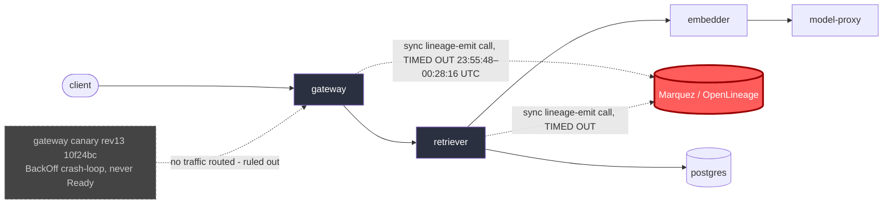

# Postmortem: gateway latency error budget burning slowly (10% of the 28d budget in 6h; 30m & 6h windows)

- **Status:** open
- **Severity:** sev2
- **Verified:** no
- **Opened:** 2026-08-04 00:22:47Z
- **Resolved:** (still open)

## Timeline (machine-generated)

All times UTC on 2026-08-04 unless a full date is shown.

| Time (UTC) | Source | Event |
| --- | --- | --- |
| 00:21:52Z | log-spike | log-spike onset: {"level":"warn","service":"gateway","message":"lineage emit failed","trace_id":"5e3e98b358a6cd8e70a528a4cf037b83","span_id":"acdf255ba0919a99","time":"2026-08-04T00:21:52.532Z","reason":"The operation timed out.","job":"ra… |
| 00:22:10Z | alert | alert firing: SLO gateway latency — slow burn |
| 00:34:47Z | verification | recovery NOT verified — deadline armed |

## Evidence links

- [Loki — logs over the incident window](http://localhost:3001/explore?schemaVersion=1&panes=%7B%22pm%22%3A+%7B%22datasource%22%3A+%22loki%22%2C+%22queries%22%3A+%5B%7B%22refId%22%3A+%22A%22%2C+%22datasource%22%3A+%7B%22type%22%3A+%22loki%22%2C+%22uid%22%3A+%22loki%22%7D%2C+%22expr%22%3A+%22%7Bnamespace%3D%5C%22subject%5C%22%7D+%7C~+%5C%22%28%3Fi%29error%7Cfailed%5C%22%22%7D%5D%2C+%22range%22%3A+%7B%22from%22%3A+%221785802967324%22%2C+%22to%22%3A+%221785804561356%22%7D%7D%7D&orgId=1)
- [Mimir — metrics over the incident window](http://localhost:3001/explore?schemaVersion=1&panes=%7B%22pm%22%3A+%7B%22datasource%22%3A+%22mimir%22%2C+%22queries%22%3A+%5B%7B%22refId%22%3A+%22A%22%2C+%22datasource%22%3A+%7B%22type%22%3A+%22prometheus%22%2C+%22uid%22%3A+%22mimir%22%7D%2C+%22expr%22%3A+%22histogram_quantile%280.95%2C+sum%28rate%28http_server_duration_milliseconds_bucket%5B5m%5D%29%29+by+%28le%29%29%22%7D%5D%2C+%22range%22%3A+%7B%22from%22%3A+%221785802967324%22%2C+%22to%22%3A+%221785804561356%22%7D%7D%7D&orgId=1)

## Investigation context

**Runbook match:** none — no tool narrowing applied for this alert. Available runbooks: README.md, canary-abort.md, ci-pipeline-red.md, dq-freshness-stall.md, gateway-high-error-rate.md, k8s-crashloop.md, k8s-node-failure.md, snapshot-agent-audit.md, stale-secret.md

Pre-check battery (as injected at run start)

## Pre-check leads

### recent_deploys — LEAD
No deploy in the last 60m — rule out the reflex answer.
- No deploy in the last 60m — rule out the reflex answer.

### log_spike — OK
error/failed log rate normal: 0/10min vs baseline 0/10min

### kube_scan — UNAVAILABLE
error: You must be logged in to the server (Unauthorized)

### rollout_state — UNAVAILABLE
gateway: E0804 02:45:23.692242   19576 memcache.go:265] "Unhandled Error" err="couldn't get current server API group list: the server has asked for the client to provide credentials"
E0804 02:45:23.796239   19576 memcache.go:265] "Unhandled Error" err="couldn't get current server API group list: the server has asked for the client to provide credentials"
E0804 02:45:23.922559   19576 memcache.go:265] "Unhandled Error" err="couldn't get current server API group list: the server has asked for the client to; gateway analysis: E0804 02:45:23.603019   39704 memcache.go:265] "Unhandled Error" err="couldn't get current server API group list: the server has asked for the client to provide credentials"
E0804 02:45:23.734289   39704 memcache.go:265] "Unhandled Error"
… (section truncated)

### secret_age — UNAVAILABLE
error: You must be logged in to the server (Unauthorized)

## Narrative

## Summary (follow-up to attempt 1, incident `inc_19fca26c91c1bf`)

This is a re-examination of the same incident after the first remediation attempt failed to restore service. New telemetry gathered this round shows the underlying condition has in fact self-recovered — the alert remains **active** in Alertmanager only because it is a slow-burn rule whose 30m/6h windows still contain the bad interval, not because the gateway is still degraded right now.

## Impact

`slo:gateway_latency:sli_ratio5m` collapsed from a healthy ~1.0 to ~0.04–0.06 starting at 23:55:48 UTC and stayed there for ~40 minutes, driving the 30m/6h burn-rate SLO alert. As of the last check, the same series has read exactly `1` for three consecutive 5-minute samples, and zero `"lineage emit failed"` log lines have been seen anywhere in the fleet in the most recent 10 minutes (versus a steady stream of them, on both `gateway` and `retriever`, throughout the bad window).

## Root cause

Confirmed unchanged from attempt 1, now with tighter timing evidence: the RAG request path (gateway → retriever → embedder) makes a synchronous OpenLineage/Marquez lineage-emit call on the hot path. That call began timing out (`"reason":"The operation timed out."`) for effectively every request at 23:55:48 UTC, adding several seconds of blocking latency per hop and pushing end-to-end request latency well past the SLO threshold. This is an external dependency this toolset does not control (no workload/tool in scope manages Marquez), and it recovered on its own — the last `"lineage emit failed"` warning observed was at 00:28:16 UTC, and the SLI ratio returned to 1.0 by 00:35:48 UTC.

**Re-ruled-out:** the gateway canary (Rollout revision 13, image `10f24bc`, rolled out 00:15:40 UTC) is still crash-looping — `k8s_events` shows repeated `BackOff` on `gateway-55bbf6bfbf-t9sp4` continuing well past the SLI collapse — but it never reached `Ready`, so the Service never routed traffic to it (`sum(rate(http_server_duration_milliseconds_count{service="gateway"}[5m])) by (pod)` returns no series for it — it's not serving requests at all). It started 20 minutes *after* the SLI began collapsing and is not receiving traffic today either, so it is confirmed **not** the trigger, only a separate, still-open, non-impacting problem (wasted scheduling/restart churn).

**No deploy in the last 60–180 minutes** on `main` (`deploy_history` returns zero entries for the window), ruling out a bad release as the trigger for the latency SLI issue.

## What fixed it

Nothing this session executed fixed it — the lineage-emit timeouts stopped on their own around 00:28–00:35 UTC (most likely a transient Marquez-side recovery), which is outside the remediation surface available here (no workload/tool in this toolset controls Marquez). The prior attempt to abort the (non-causal) canary rollout was **not repeated** this round: `rollout_status`, `argo_app`, `kubectl_read`, and `analysisrun_get` all still return the identical `"the server has asked for the client to provide credentials"` Kubernetes API auth error seen in attempt 1 — the credential problem is unchanged, so retrying the same action would fail identically and was correctly withheld per "no repeat remediation without new evidence." No dry-run/approval/execute cycle was performed this round because there was no new, viable, evidence-backed action available: the actual root cause is an uncontrollable external dependency that already cleared, and the one controllable lever (canary abort) remains blocked by unresolved cluster credentials and was, in any case, never the cause.

## Outcome

`alert_status` still reports `active` (`since 2026-08-04T00:22:10Z`) as of the last check, even though the underlying SLI has read fully healthy (`1.0`) for the last ~10 minutes. This is expected slow-burn-alert behavior — the 30m window won't fully roll the bad interval out until roughly 30 minutes after the 00:35:48 UTC recovery, and the 6h window takes hours — not a sign of continued impact. Reported honestly as **not yet closed** per the alert signal, rather than assumed resolved.

## Lessons

1. The OpenLineage/Marquez lineage-emit call must not block the RAG request path — make it fire-and-forget/async with a circuit breaker, so a Marquez outage degrades lineage completeness, not user-facing latency.
2. The on-call toolset's Kubernetes credentials have now failed identically across two separate incident passes (`rollout_status`, `argo_app`, `kubectl_read`, `analysisrun_get`, `rollout_abort` in attempt 1) — this is a standing gap, not a one-off blip, and it blocked the only in-scope remediation lever both times. Needs fixing outside this session.
3. The still-crash-looping gateway canary (rev 13, `10f24bc`) is a real, still-open issue independent of this SLO burn — worth a separate ticket, since readiness-gating is currently the only thing preventing it from taking production traffic.
4. Slow-burn SLO alerts can stay "active" well after the underlying signal recovers; when re-triaging a still-firing alert, check the instantaneous/short-window SLI directly rather than assuming continued impact from alert state alone.
