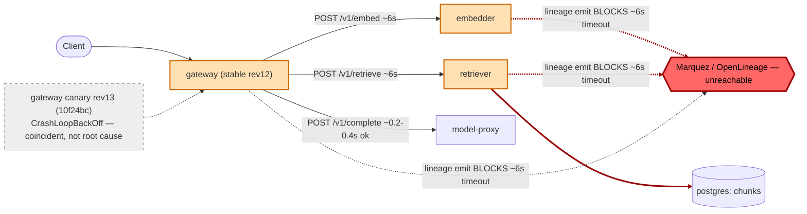

# Postmortem: gateway latency error budget burning slowly (10% of the 28d budget in 6h; 30m & 6h windows)

- **Status:** open
- **Severity:** sev2
- **Verified:** no
- **Opened:** 2026-08-04 00:22:47Z
- **Resolved:** (still open)

## Timeline (machine-generated)

All times UTC on 2026-08-04 unless a full date is shown.

| Time (UTC) | Source | Event |
| --- | --- | --- |
| 00:21:52Z | log-spike | log-spike onset: {"level":"warn","service":"gateway","message":"lineage emit failed","trace_id":"5e3e98b358a6cd8e70a528a4cf037b83","span_id":"acdf255ba0919a99","time":"2026-08-04T00:21:52.532Z","reason":"The operation timed out.","job":"ra… |
| 00:22:10Z | alert | alert firing: SLO gateway latency — slow burn |

## Evidence links

- [Loki — logs over the incident window](http://localhost:3001/explore?schemaVersion=1&panes=%7B%22pm%22%3A+%7B%22datasource%22%3A+%22loki%22%2C+%22queries%22%3A+%5B%7B%22refId%22%3A+%22A%22%2C+%22datasource%22%3A+%7B%22type%22%3A+%22loki%22%2C+%22uid%22%3A+%22loki%22%7D%2C+%22expr%22%3A+%22%7Bnamespace%3D%5C%22subject%5C%22%7D+%7C~+%5C%22%28%3Fi%29error%7Cfailed%5C%22%22%7D%5D%2C+%22range%22%3A+%7B%22from%22%3A+%221785802967324%22%2C+%22to%22%3A+%221785803674705%22%7D%7D%7D&orgId=1)
- [Mimir — metrics over the incident window](http://localhost:3001/explore?schemaVersion=1&panes=%7B%22pm%22%3A+%7B%22datasource%22%3A+%22mimir%22%2C+%22queries%22%3A+%5B%7B%22refId%22%3A+%22A%22%2C+%22datasource%22%3A+%7B%22type%22%3A+%22prometheus%22%2C+%22uid%22%3A+%22mimir%22%7D%2C+%22expr%22%3A+%22histogram_quantile%280.95%2C+sum%28rate%28http_server_duration_milliseconds_bucket%5B5m%5D%29%29+by+%28le%29%29%22%7D%5D%2C+%22range%22%3A+%7B%22from%22%3A+%221785802967324%22%2C+%22to%22%3A+%221785803674705%22%7D%7D%7D&orgId=1)

## Investigation context

**Runbook match:** none — no tool narrowing applied for this alert. Available runbooks: README.md, canary-abort.md, ci-pipeline-red.md, dq-freshness-stall.md, gateway-high-error-rate.md, k8s-crashloop.md, k8s-node-failure.md, snapshot-agent-audit.md, stale-secret.md

Pre-check battery (as injected at run start)

## Pre-check leads

### recent_deploys — LEAD
No deploy in the last 60m — rule out the reflex answer.
- No deploy in the last 60m — rule out the reflex answer.

### log_spike — LEAD
error/failed log rate 200/10min vs baseline 0/10min (200x baseline) — onset: {"level":"warn","service":"gateway","message":"lineage emit failed","trace_id":"5e3e98b358a6cd8e70a528a4cf037b83","span_id":"acdf255ba0919a99","time":"2026-08-04T00:21:52.532Z","reason":"The operation timed out.","job":"rag.inference","eventType":"COMPLETE"} at 2026-08-04T00:21:52.533226+00:00
- error/failed log rate 200/10min vs baseline 0/10min (200x baseline) — onset: {"level":"warn","service":"gateway","message":"lineage emit failed","trace_id":"5e3e98b358a6cd8e70a528a4cf037b… (truncated)

### kube_scan — UNAVAILABLE
error: You must be logged in to the server (Unauthorized)

### rollout_state — UNAVAILABLE
gateway: E0804 02:22:49.736639   63660 memcache.go:265] "Unhandled Error" err="couldn't get current server API group list: the server has asked for the client to provide credentials"
E0804 02:22:49.895652   63660 memcache.go:265] "Unhandled Error" err="couldn't get current server API group list: the server has asked for the client to provide credentials"
E0804 02:22:50.301705   63660 memcache.go:265] "Unhandled Error" err="couldn't get current server API group list: the server has asked for the client to; gateway analysis: E0804 02:22:49.734092   55468 memcache.go:265] "Unhandled Error" err="couldn't get current server API group list: the server has asked for the client to provide credentials"
E0804 02:22:49.874415   55468 memcache.go:265] "Unhandled Error"
… (section truncated)

### secret_age — UNAVAILABLE
error: You must be logged in to the server (Unauthorized)

## Narrative

## Summary

`SLO gateway latency — slow burn` (sev2, tenant acme) fired against the gateway's 30m/6h burn-rate rules. The gateway RAG path (embedder → retriever → model-proxy) was taking 12–18s per `/v1/chat` request instead of sub-second, driven by a downstream OpenLineage/Marquez dependency that stopped responding, not by a bad code deploy to the RAG services themselves.

## Impact

`slo:gateway_latency:sli_ratio5m` (fraction of requests meeting the latency target) collapsed to roughly 4–7% of normal during the incident window, with two shorter self-recovering episodes beforehand and a third, sustained collapse that was still ongoing at the time of this report. Nearly every `/v1/chat` request was affected for the acme tenant and others sharing the RAG path.

## Root cause

Every hop in the RAG pipeline (`gateway`, `retriever`, `embedder`) logs `"lineage emit failed" / "The operation timed out"` on essentially every single request (visible identically and near-100%-of-requests across all three services, not an isolated pod). Trace evidence confirms this is on the *synchronous* request path, not a fire-and-forget side effect: the embedder's own server span for `POST /v1/embed` took the full ~6.0s by itself with no other work inside it, and the gateway's `POST embedder` / `POST retriever` client spans each took ~6.0s in lockstep with the corresponding lineage-timeout log lines for those hops — three ~6s hops compounding into the 12–18s end-to-end latency observed. The `slo:gateway_latency:sli_ratio5m` series shows this sustained degradation beginning roughly 25 minutes before the alert fired, well before any deploy. This points to the OpenLineage/Marquez lineage-tracking backend becoming unreachable or unresponsive, with the RAG services' emit calls blocking on a fixed client timeout instead of failing fast/async.

A second, unrelated problem was found and is real but not the primary driver: an Argo Rollout advanced `gateway` to revision 13 (image `10f24bc`, which does not resolve to any commit in the `obs-lab` repository history) roughly 18 minutes *after* the latency SLI had already started degrading. That canary pod has been stuck in `CrashLoopBackOff` ever since, and stable capacity was reduced from 4→3 replicas to make room for it. This is guilty of adding restart churn and reduced headroom, but the deploy-history timeline rules it out as the trigger for the slow burn itself, since the SLI was already unhealthy first.

The stale-secret rotation scenario was checked and explicitly ruled out (`update_db_secret` dry-run reported no rotated credential pending). Memory and CPU on the affected pods stayed flat/low throughout — this was not an OOM or resource-exhaustion incident.

## What fixed it

Two remediation paths were evaluated. The actual root-cause dependency (the OpenLineage/Marquez lineage collector) has no control surface in the on-call toolset — no workload/tool targets it — so it could not be restarted or investigated further from here. The one in-scope, evidence-backed action available was aborting the broken gateway canary (revision 13) to stop its crash-loop churn and restore full stable capacity. This was dry-run, approved by the operator, and attempted twice, but **both execution attempts failed** with a Kubernetes API authentication error identical to the one that made `kube_scan`/`rollout_state` unavailable during the initial pre-checks — the cluster credentials available to this session cannot currently perform reads or writes against the API server. No change was applied. Re-querying `alert_status` and the latency SLI afterward confirms the alert is still active and the SLI is still degraded — **the incident did not recover**.

## Lessons

- The synchronous lineage-emit call in `gateway`/`retriever`/`embedder` should not block the request-serving path — it needs an async fire-and-forget path or a short-circuiting circuit breaker so a downstream Marquez outage degrades observability, not customer-facing latency.
- The on-call toolset has no lever for the OpenLineage/Marquez component itself; if lineage-backend outages are a recurring failure mode, a restart/health tool for it belongs in the remediation surface.
- The cluster read/write credentials used by this session were broken for the entire incident (confirmed by both the pre-check leads and by a failed, operator-approved remediation execution) — this needs to be fixed as its own action item, since it blocked the only in-scope mitigation available tonight.
- A new runbook for `SLO gateway latency — slow burn` should tell the next on-call to check per-hop span duration against the known lineage-emit timeout signature before assuming a bad deploy, and to check `deploy_history`/`k8s_events` timing precisely against the SLI's own onset before blaming a coincident rollout.

