# Postmortem: gateway latency error budget burning fast (2% of the 28d budget in 1h; 5m & 1h windows)

- **Status:** resolved
- **Severity:** sev1
- **Verified:** no
- **Opened:** 2026-08-04 00:12:46Z
- **Resolved:** 2026-08-04 00:37:46Z

## Timeline (machine-generated)

All times UTC on 2026-08-04 unless a full date is shown.

| Time (UTC) | Source | Event |
| --- | --- | --- |
| 00:12:10Z | alert | alert firing: SLO gateway latency — fast burn |
| 00:12:25Z | log-spike | log-spike onset: {"level":"warn","service":"embedder","message":"lineage emit failed","trace_id":"f2ad8c466355ad348e3bb6c473ed62b5","span_id":"f40f0ec55c64f2ca","time":"2026-08-04T00:12:25.215Z","reason":"The operation timed out.","job":"r… |
| 00:22:46Z | verification | recovery NOT verified — deadline armed |
| 00:28:00Z | log-spike | log-spike onset: {"level":"warn","service":"retriever","message":"lineage emit failed","trace_id":"81a8fc854e56bca6088ca0349573d062","span_id":"a39ba5663582b24d","time":"2026-08-04T00:28:00.260Z","reason":"The operation timed out.","job":"… |
| 00:35:10Z | alert | alert resolved: SLO gateway latency — fast burn |

## Evidence links

- [Loki — logs over the incident window](http://localhost:3001/explore?schemaVersion=1&panes=%7B%22pm%22%3A+%7B%22datasource%22%3A+%22loki%22%2C+%22queries%22%3A+%5B%7B%22refId%22%3A+%22A%22%2C+%22datasource%22%3A+%7B%22type%22%3A+%22loki%22%2C+%22uid%22%3A+%22loki%22%7D%2C+%22expr%22%3A+%22%7Bnamespace%3D%5C%22subject%5C%22%7D+%7C~+%5C%22%28%3Fi%29error%7Cfailed%5C%22%22%7D%5D%2C+%22range%22%3A+%7B%22from%22%3A+%221785802366553%22%2C+%22to%22%3A+%221785803866074%22%7D%7D%7D&orgId=1)
- [Mimir — metrics over the incident window](http://localhost:3001/explore?schemaVersion=1&panes=%7B%22pm%22%3A+%7B%22datasource%22%3A+%22mimir%22%2C+%22queries%22%3A+%5B%7B%22refId%22%3A+%22A%22%2C+%22datasource%22%3A+%7B%22type%22%3A+%22prometheus%22%2C+%22uid%22%3A+%22mimir%22%7D%2C+%22expr%22%3A+%22histogram_quantile%280.95%2C+sum%28rate%28http_server_duration_milliseconds_bucket%5B5m%5D%29%29+by+%28le%29%29%22%7D%5D%2C+%22range%22%3A+%7B%22from%22%3A+%221785802366553%22%2C+%22to%22%3A+%221785803866074%22%7D%7D%7D&orgId=1)

## Investigation context

**Runbook match:** none — no tool narrowing applied for this alert. Available runbooks: README.md, canary-abort.md, ci-pipeline-red.md, dq-freshness-stall.md, gateway-high-error-rate.md, k8s-crashloop.md, k8s-node-failure.md, snapshot-agent-audit.md, stale-secret.md

Pre-check battery (as injected at run start)

## Pre-check leads

### recent_deploys — LEAD
No deploy in the last 60m — rule out the reflex answer.
- No deploy in the last 60m — rule out the reflex answer.

### log_spike — LEAD
error/failed log rate 200/10min vs baseline 0/10min (200x baseline) — onset: {"level":"warn","service":"retriever","message":"lineage emit failed","trace_id":"81a8fc854e56bca6088ca0349573d062","span_id":"a39ba5663582b24d","time":"2026-08-04T00:28:00.260Z","reason":"The operation timed out.","job":"rag.retrieve","eventType":"START"} at 2026-08-04T00:28:00.261490+00:00
- error/failed log rate 200/10min vs baseline 0/10min (200x baseline) — onset: {"level":"warn","service":"retriever","message":"lineage emit failed","trace_id":"81a8fc854e56bca6088ca0349573… (truncated)

### kube_scan — UNAVAILABLE
error: You must be logged in to the server (Unauthorized)

### rollout_state — UNAVAILABLE
gateway: E0804 02:33:22.761282   59180 memcache.go:265] "Unhandled Error" err="couldn't get current server API group list: the server has asked for the client to provide credentials"
E0804 02:33:22.930978   59180 memcache.go:265] "Unhandled Error" err="couldn't get current server API group list: the server has asked for the client to provide credentials"
E0804 02:33:23.075830   59180 memcache.go:265] "Unhandled Error" err="couldn't get current server API group list: the server has asked for the client to; gateway analysis: E0804 02:33:22.763116   20168 memcache.go:265] "Unhandled Error" err="couldn't get current server API group list: the server has asked for the client to provide credentials"
E0804 02:33:22.933988   20168 memcache.go:265] "Unhandled Error"
… (section truncated)

### secret_age — UNAVAILABLE
error: You must be logged in to the server (Unauthorized)

## Narrative

## Incident inc_19fca1d9e5af6 — SLO gateway latency, fast burn (follow-up to a failed first remediation attempt)

### Summary
The gateway p95-latency error-budget fast-burn alert re-fired for a continued page after a first remediation attempt (aborting a canary) failed on a cluster-authorization error. This follow-up re-investigated from scratch rather than blindly repeating the same action. It reconfirmed the same root cause with fresh trace/log evidence, found the previously-blamed "stuck canary" no longer exists, discovered that CI/gitops delivery was clean (ruling out a stuck fix pipeline), attempted a new, previously-untried remediation (rolling-restart of retriever/embedder), watched that remediation also fail on the identical cluster-authorization error, and then observed the alert clear on its own — a recovery this report explicitly does **not** credit to any action taken through this toolset.

### Impact
`acme` (and other tenants sharing the gateway) continued to see p95 request latency around 17–18s on `/v1/chat` (versus a normal sub-second baseline), driven by two serialized ~6s hangs per request (embedder call, then retriever call). The gateway-latency SLI (`slo:gateway_latency:sli_ratio5m`) was pinned near 4–6% (from a 100% baseline) for the duration, before recovering to 100%.

### Root cause (re-confirmed, unchanged from the prior diagnosis)
`gateway`, `retriever`, and `embedder` all emit OpenLineage events synchronously in the request hot path (`rag.embed`/`rag.retrieve`/`rag.inference`, START and COMPLETE), and those lineage-emit calls were timing out against the Marquez lineage sink (`"reason":"The operation timed out."`, still present in gateway logs during this follow-up). A freshly pulled trace during this investigation showed the exact mechanism live: the `POST embedder` span took 6.01s and the `POST retriever` span took 5.7s (both consistent with a ~6s client timeout being hit), while `POST model-proxy` — uninvolved in lineage — returned in 114ms, cleanly isolating the fault to the lineage-emit call site on the other two hops. No CI build or gitops deploy landed near onset (CI's most recent run on `main` was green, reverting an unrelated `load-generator` change from the day before), so a bad deploy — and a "stuck red pipeline" blocking a fix — are both ruled out. Postgres and the app tier showed no memory pressure, no OOM, and no warning-level k8s events, so this is not a resource-exhaustion story. Marquez itself is entirely outside this toolset's observability surface — no Mimir target, no logs, no k8s events reference it — so its internal state could not be directly inspected.

**Correction to the prior diagnosis:** the previously-reported "compounding factor" — a gateway canary stuck in CrashLoopBackOff — no longer exists. All four current gateway pods are on a single stable ReplicaSet revision with zero restarts and `Running` phase. (A separate, unrelated `kube_deployment_spec_replicas{deployment="gateway"}` series read 0 for the full window investigated — this is a stale/unused metric because Argo Rollouts manages ReplicaSets directly rather than through a literal Deployment object, and it was mistakenly flagged as a possible total-outage signal before pod-level phase/readiness data ruled that out. Noted here as a lesson, not a cause.)

### What fixed it
**Not a remediation executed through this toolset.** Two remediation attempts were made across the life of this incident, and both failed identically:
1. (Prior attempt) `rollout_abort` on the gateway canary — failed with a Kubernetes API authorization error.
2. (This attempt) Approved rolling restarts of `retriever` and `embedder`, targeting the exact two hops the fresh trace showed still blocking — both calls failed with the same `Unauthorized` error at execution time (`dry_run=false`), even though their dry-runs had reported a clean proposed patch. No spec or state change was ever applied to the cluster by either attempt.

Shortly after this second attempt, `slo:gateway_latency:sli_ratio5m` climbed from ~0.05 back to 1.0 and `alert_status` reports the alert as no longer active, with lineage-emit-timeout log lines and 6s-plus trace spans absent from the last several minutes. The most consistent explanation is that the upstream Marquez lineage sink became responsive again on its own, independent of anything this toolset executed. This report intentionally does not claim credit for the recovery. One caveat: recent traffic in the observed window was thin (only `/health` checks, no `/v1/chat` traces, in the last five minutes — the load-generator replica count reads 0), so the "fully recovered under real load" claim rests mainly on the recording-rule signal and the absence of renewed lineage-timeout log lines, not on a large fresh sample of real chat traffic.

### Lessons
1. **The cluster-authorization failure is systemic, not tool-specific.** Every Kubernetes-mutating and most Kubernetes-reading tools available here (`rollout_abort`, `rollout_status`, `argo_app`, `kubectl_read`, and now `restart_workload`) failed with the identical `"You must be logged in to the server (Unauthorized)"` error throughout this entire incident — matching the pre-check leads (`kube_scan`/`rollout_state`/`secret_age` all flagged UNAVAILABLE at page time). This is a standing credential/RBAC outage for the on-call service account that needs a human to restore before any cluster-level remediation from this toolset can execute at all. Escalate this as its own action item, separate from the application incident.
2. **Lineage emission should not be able to take down serving latency.** `gateway`/`retriever`/`embedder` block the customer request path on a call to an external, unmonitored dependency (Marquez). This needs to become async/fire-and-forget with a short bounded timeout and a circuit breaker so a lineage-sink outage degrades lineage completeness, not chat latency.
3. **Instrument Marquez.** It currently has no Mimir target, no log labels reaching Loki, and no k8s events surfaced — on-call had zero direct visibility into the actual root dependency and had to infer its state entirely from client-side symptoms.
4. **Don't trust `kube_deployment_*` metrics for Argo-Rollout-managed workloads at face value.** They can read 0 permanently because no real Deployment object backs the Rollout; corroborate with `kube_pod_status_phase`/`kube_pod_container_status_restarts_total` before concluding a replica outage.
5. **Before repeating a failed remediation, re-derive the hypothesis from fresh evidence.** Doing so here surfaced that the originally-blamed canary was gone, that CI/gitops was clean, and that the auth failure was systemic rather than isolated to one tool — all useful even though the specific new remediation (restart) also could not execute.

```mermaid
flowchart LR
    client([client]) --> gateway[gateway]
    gateway -->|rag.embed| embedder[embedder]
    gateway -->|rag.retrieve| retriever[retriever]
    gateway -->|rag.generate| modelproxy[model-proxy]
    retriever --> postgres[(postgres / pgvector)]
    gateway -.->|lineage emit\nSTART/COMPLETE| marquez{{Marquez lineage sink}}
    embedder -.->|lineage emit\nSTART/COMPLETE| marquez
    retriever -.->|lineage emit\nSTART/COMPLETE| marquez

    style marquez fill:#3a0d0d,stroke:#f85149,stroke-width:2px,color:#fff
    style embedder fill:#3a2a0d,stroke:#f0a848,stroke-width:2px
    style retriever fill:#3a2a0d,stroke:#f0a848,stroke-width:2px

    marquez -.->|"BROKEN HOP: lineage-emit calls\ntimed out (~6s each), and gateway/\nembedder/retriever block synchronously\non them in the request hot path"| embedder
```

### Remediation attempts this round (both failed to execute; recovery is unattributed)
- `restart_workload(retriever)`: dry-run clean → operator-approved → execution failed with `Unauthorized`.
- `restart_workload(embedder)`: dry-run clean → operator-approved → execution failed with `Unauthorized`.
- Re-queried `alert_status` after execution attempts: alert is inactive, SLI back to 1.0 — recovery observed but not caused by the above.
