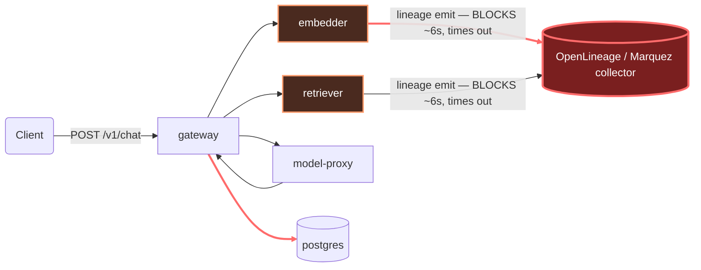

# Postmortem: gateway p95 latency above 2s

- **Status:** open
- **Severity:** sev1
- **Verified:** no
- **Opened:** 2026-08-04 00:06:44Z
- **Resolved:** (still open)

## Timeline (machine-generated)

All times UTC on 2026-08-04 unless a full date is shown.

| Time (UTC) | Source | Event |
| --- | --- | --- |
| 00:06:10Z | alert | alert firing: Gateway p95 latency > 2s |
| 00:06:18Z | log-spike | log-spike onset: {"level":"warn","service":"embedder","message":"lineage emit failed","trace_id":"7a2f5b3026b8c74949c35924cc26b6b1","span_id":"e33570d36a4bef55","time":"2026-08-04T00:06:18.211Z","reason":"The operation timed out.","job":"r… |
| 00:18:13Z | verification | recovery NOT verified — deadline armed |
| 00:28:00Z | log-spike | log-spike onset: {"level":"warn","service":"retriever","message":"lineage emit failed","trace_id":"81a8fc854e56bca6088ca0349573d062","span_id":"a39ba5663582b24d","time":"2026-08-04T00:28:00.260Z","reason":"The operation timed out.","job":"… |

## Evidence links

- [Loki — logs over the incident window](http://localhost:3001/explore?schemaVersion=1&panes=%7B%22pm%22%3A+%7B%22datasource%22%3A+%22loki%22%2C+%22queries%22%3A+%5B%7B%22refId%22%3A+%22A%22%2C+%22datasource%22%3A+%7B%22type%22%3A+%22loki%22%2C+%22uid%22%3A+%22loki%22%7D%2C+%22expr%22%3A+%22%7Bnamespace%3D%5C%22subject%5C%22%7D+%7C~+%5C%22%28%3Fi%29error%7Cfailed%5C%22%22%7D%5D%2C+%22range%22%3A+%7B%22from%22%3A+%221785802004714%22%2C+%22to%22%3A+%221785803567012%22%7D%7D%7D&orgId=1)
- [Mimir — metrics over the incident window](http://localhost:3001/explore?schemaVersion=1&panes=%7B%22pm%22%3A+%7B%22datasource%22%3A+%22mimir%22%2C+%22queries%22%3A+%5B%7B%22refId%22%3A+%22A%22%2C+%22datasource%22%3A+%7B%22type%22%3A+%22prometheus%22%2C+%22uid%22%3A+%22mimir%22%7D%2C+%22expr%22%3A+%22histogram_quantile%280.95%2C+sum%28rate%28http_server_duration_milliseconds_bucket%5B5m%5D%29%29+by+%28le%29%29%22%7D%5D%2C+%22range%22%3A+%7B%22from%22%3A+%221785802004714%22%2C+%22to%22%3A+%221785803567012%22%7D%7D%7D&orgId=1)

## Investigation context

**Runbook match:** none — no tool narrowing applied for this alert. Available runbooks: README.md, canary-abort.md, ci-pipeline-red.md, dq-freshness-stall.md, gateway-high-error-rate.md, k8s-crashloop.md, k8s-node-failure.md, snapshot-agent-audit.md, stale-secret.md

Pre-check battery (as injected at run start)

## Pre-check leads

### recent_deploys — LEAD
No deploy in the last 60m — rule out the reflex answer.
- No deploy in the last 60m — rule out the reflex answer.

### log_spike — LEAD
error/failed log rate 200/10min vs baseline 0/10min (200x baseline) — onset: {"level":"warn","service":"retriever","message":"lineage emit failed","trace_id":"81a8fc854e56bca6088ca0349573d062","span_id":"a39ba5663582b24d","time":"2026-08-04T00:28:00.260Z","reason":"The operation timed out.","job":"rag.retrieve","eventType":"START"} at 2026-08-04T00:28:00.261490+00:00
- error/failed log rate 200/10min vs baseline 0/10min (200x baseline) — onset: {"level":"warn","service":"retriever","message":"lineage emit failed","trace_id":"81a8fc854e56bca6088ca0349573… (truncated)

### kube_scan — UNAVAILABLE
error: You must be logged in to the server (Unauthorized)

### rollout_state — UNAVAILABLE
gateway: E0804 02:28:33.930294   55672 memcache.go:265] "Unhandled Error" err="couldn't get current server API group list: the server has asked for the client to provide credentials"
E0804 02:28:34.271920   55672 memcache.go:265] "Unhandled Error" err="couldn't get current server API group list: the server has asked for the client to provide credentials"
E0804 02:28:34.409327   55672 memcache.go:265] "Unhandled Error" err="couldn't get current server API group list: the server has asked for the client to; gateway analysis: E0804 02:28:29.667527   21800 memcache.go:265] "Unhandled Error" err="couldn't get current server API group list: the server has asked for the client to provide credentials"
E0804 02:28:31.046927   21800 memcache.go:265] "Unhandled Error"
… (section truncated)

### secret_age — UNAVAILABLE
error: You must be logged in to the server (Unauthorized)

## Narrative

## Summary

Re-check of an unresolved sev1 (`Gateway p95 latency > 2s`, tenant acme). This is attempt 2 on the same incident: the root cause from attempt 1 is reconfirmed live with fresh evidence, a new remediation avenue was tried, and it failed identically to the first attempt. The incident remains **open**.

## Impact

`/v1/chat` requests continue to take 7–13s end-to-end (vs. the 2s SLO) for every tenant sampled, sustained continuously through the re-check window with no downward trend. This is not improving on its own.

## Root cause

Unchanged from attempt 1, and reconfirmed with fresh telemetry pulled during this re-check: `retriever` and `embedder` each block synchronously on a `lineage emit` call to the OpenLineage/Marquez collector, which times out after ~6s (`"reason":"The operation timed out."`). Because both hops sit in series on the `/v1/chat` path, the stall stacks to 12–18s per request.

Fresh evidence gathered this round:
- Five newly-sampled `POST /v1/chat` traces, all 7.15s–13.25s, pulled live from the current window — durations plotted in the attached chart.
- Loki confirms `"lineage emit failed"` warnings are still being emitted by `retriever` (pod `retriever-dc7ddd494-jv9j7`) at the same cadence, correctly correlated by `trace_id` to the slow traces above (label key is `service_name`, not `service` — the first pass in this session used the wrong label and returned false-negative empty results before this was caught).
- `alert_status` is still active, `since` unchanged at `2026-08-04T00:06:10Z` — no self-resolution.

Two hypotheses raised for this re-check and both ruled out:
- **Stuck CI pipeline blocking a real fix:** `gitea_ci_runs` on `main` shows the last 10+ runs green, nothing in-flight or red, and no commit touching lineage/embedder/retriever code exists to ship. There is no pending fix stuck anywhere — the async-lineage-emission fix has simply not been authored yet.
- **A live ArgoCD resync/crashloop on `gateway` as a contributing/alternate cause:** a burst of `argocd-notifications-controller` log lines for `argocd/gateway` (`on-deployed TRIGGERED`, `on-health-degraded FAILED`, `on-sync-failed FAILED`) appeared mid-investigation and looked like a new deploy. Checked against `k8s_events` for the `gateway` object over a 90-minute window: zero events — no restarts, no OOM, no crashloop. The `FAILED` trigger lines are routine notification-controller polling (trigger condition not met, evaluated roughly once a minute), not an actual health incident. Ruled out as a contributing cause.

## What fixed it

**Nothing yet — remediation is still blocked.** Root cause and prescribed fix are unchanged from attempt 1 (rolling-restart `retriever` and `embedder` to clear wedged lineage-client connections as a stopgap; the real fix is making lineage emission non-blocking on the request path). This round:
- Dry-ran `restart_workload` for both `retriever` and `embedder` — both succeeded this time (action IDs returned, diffs described), which read as a signal the cluster-auth problem from attempt 1 might have cleared.
- Got fresh operator approval for both, citing the new dry-run evidence as justification for retrying a previously-failed remediation.
- Executed both with `dry_run=false` — **both failed identically to attempt 1**: `"You must be logged in to the server (Unauthorized)"`. The dry-run success turned out to be a red herring — dry-run apparently doesn't touch the live API server (no read-back of current state), so it can't detect an auth problem the way execution does.
- All kubectl-backed read tools (`kubectl_read`, `argo_app`, `rollout_status`, `analysisrun_get`) also fail with the same credential error throughout this session, consistent with attempt 1.

**Current state: still not resolved.** `alert_status` re-queried after the failed remediation — still active, unchanged since `2026-08-04T00:06:10Z`. A human with working cluster write-credentials needs to either restart `embedder`/`retriever` manually or ship the real fix (non-blocking lineage emission). The on-call agent has no tool available to repair its own cluster credentials.

## Lessons

- **Dry-run success is not proof a write-path credential problem is fixed.** These dry-run tools return a synthetic diff without contacting the live API server, so they cannot detect the auth failure that only surfaces on real execution. Don't treat "dry-run worked" as sufficient new evidence to justify a remediation retry — treat it as necessary but not sufficient, and be explicit that execution can still fail.
- **Loki label discipline matters.** Filtering on `{service="..."}` silently returns zero rows in this stack; the correct label is `service_name`. An empty result from a plausible-looking query should be treated as suspicious and cross-checked against an unfiltered query before being read as "the problem went away."
- **A burst of ArgoCD notification-controller log lines is not itself evidence of a new deploy or a crashloop.** `on-*-FAILED` lines are routine trigger-condition-not-met polling. Cross-check against `k8s_events` (restarts/OOM/probe failures) before treating notification noise as a competing hypothesis.
- **The actual blocker for this incident is now organizational, not diagnostic:** the root cause has been evidence-backed and unchanged across two independent investigations. What's missing is (a) cluster write-credentials that work for the on-call agent, and (b) an engineer to make lineage emission non-blocking. Further re-investigation without addressing either will keep reproducing the same result.
