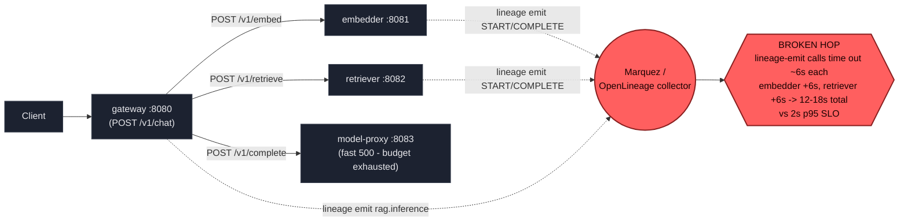

# Postmortem: gateway p95 latency above 2s

- **Status:** open
- **Severity:** sev1
- **Verified:** no
- **Opened:** 2026-08-04 00:06:44Z
- **Resolved:** (still open)

## Timeline (machine-generated)

All times UTC on 2026-08-04 unless a full date is shown.

| Time (UTC) | Source | Event |
| --- | --- | --- |
| 00:06:10Z | alert | alert firing: Gateway p95 latency > 2s |
| 00:06:18Z | log-spike | log-spike onset: {"level":"warn","service":"embedder","message":"lineage emit failed","trace_id":"7a2f5b3026b8c74949c35924cc26b6b1","span_id":"e33570d36a4bef55","time":"2026-08-04T00:06:18.211Z","reason":"The operation timed out.","job":"r… |

## Evidence links

- [Loki — logs over the incident window](http://localhost:3001/explore?schemaVersion=1&panes=%7B%22pm%22%3A+%7B%22datasource%22%3A+%22loki%22%2C+%22queries%22%3A+%5B%7B%22refId%22%3A+%22A%22%2C+%22datasource%22%3A+%7B%22type%22%3A+%22loki%22%2C+%22uid%22%3A+%22loki%22%7D%2C+%22expr%22%3A+%22%7Bnamespace%3D%5C%22subject%5C%22%7D+%7C~+%5C%22%28%3Fi%29error%7Cfailed%5C%22%22%7D%5D%2C+%22range%22%3A+%7B%22from%22%3A+%221785802004714%22%2C+%22to%22%3A+%221785802679720%22%7D%7D%7D&orgId=1)
- [Mimir — metrics over the incident window](http://localhost:3001/explore?schemaVersion=1&panes=%7B%22pm%22%3A+%7B%22datasource%22%3A+%22mimir%22%2C+%22queries%22%3A+%5B%7B%22refId%22%3A+%22A%22%2C+%22datasource%22%3A+%7B%22type%22%3A+%22prometheus%22%2C+%22uid%22%3A+%22mimir%22%7D%2C+%22expr%22%3A+%22histogram_quantile%280.95%2C+sum%28rate%28http_server_duration_milliseconds_bucket%5B5m%5D%29%29+by+%28le%29%29%22%7D%5D%2C+%22range%22%3A+%7B%22from%22%3A+%221785802004714%22%2C+%22to%22%3A+%221785802679720%22%7D%7D%7D&orgId=1)

## Investigation context

**Runbook match:** none — no tool narrowing applied for this alert. Available runbooks: README.md, canary-abort.md, ci-pipeline-red.md, dq-freshness-stall.md, gateway-high-error-rate.md, k8s-crashloop.md, k8s-node-failure.md, snapshot-agent-audit.md, stale-secret.md

Pre-check battery (as injected at run start)

## Pre-check leads

### recent_deploys — LEAD
No deploy in the last 60m — rule out the reflex answer.
- No deploy in the last 60m — rule out the reflex answer.

### log_spike — LEAD
error/failed log rate 200/10min vs baseline 0/10min (200x baseline) — onset: {"level":"warn","service":"embedder","message":"lineage emit failed","trace_id":"7a2f5b3026b8c74949c35924cc26b6b1","span_id":"e33570d36a4bef55","time":"2026-08-04T00:06:18.211Z","reason":"The operation timed out.","job":"rag.embed","eventType":"START"} at 2026-08-04T00:06:18.212213+00:00
- error/failed log rate 200/10min vs baseline 0/10min (200x baseline) — onset: {"level":"warn","service":"embedder","message":"lineage emit failed","trace_id":"7a2f5b3026b8c74949c35924cc26b… (truncated)

### kube_scan — UNAVAILABLE
error: You must be logged in to the server (Unauthorized)

### rollout_state — UNAVAILABLE
gateway: E0804 02:06:50.122982   47832 memcache.go:265] "Unhandled Error" err="couldn't get current server API group list: the server has asked for the client to provide credentials"
E0804 02:06:50.284985   47832 memcache.go:265] "Unhandled Error" err="couldn't get current server API group list: the server has asked for the client to provide credentials"
E0804 02:06:50.421235   47832 memcache.go:265] "Unhandled Error" err="couldn't get current server API group list: the server has asked for the client to; gateway analysis: E0804 02:06:50.212901    4252 memcache.go:265] "Unhandled Error" err="couldn't get current server API group list: the server has asked for the client to provide credentials"
E0804 02:06:50.381561    4252 memcache.go:265] "Unhandled Error"
… (section truncated)

### secret_age — UNAVAILABLE
error: You must be logged in to the server (Unauthorized)

## Narrative

## Summary

`Gateway p95 latency > 2s` fired and stayed active for the full duration of this investigation. Every sampled `POST /v1/chat` trace in the alert window ran 12–18s end to end — 6–9x the 2s SLO — with no sign of recovery across two sampling passes taken minutes apart.

## Impact

All `/v1/chat` traffic through gateway during the incident window was affected; every sampled trace exceeded the 2s SLO by a wide margin (12.1s–18.1s observed). Some requests additionally surfaced a fast (4ms) `500` from `model-proxy`, consistent with the caller's own request budget already being exhausted by the time it reached that hop.

## Root cause

Evidence from Tempo and Loki, cross-checked against deploy history:

- `deploy_history` showed **no deploy** to gateway/retriever/embedder in the 12 hours preceding the alert — ruling out a bad release as the trigger.
- A full trace (`7c70c637613c8447c6969d1582baa366`) showed the request breakdown: `POST embedder` span = 6015ms, `POST retriever` span = 6030ms, `POST model-proxy` span = 4ms (status 500). The embedder's own server-side span for `POST /v1/embed` independently measured ~6006ms, confirming the delay is internal to embedder's request handling, not network transit.
- Loki showed synchronized `"lineage emit failed"` warnings (`reason: "The operation timed out."`) from **gateway**, **retriever**, and **embedder** simultaneously, tagged `job: rag.embed / rag.retrieve / rag.inference`, with onset matching the alert's `since` timestamp exactly.
- Seven independently sampled traces across two time windows (~58s and ~200s into the incident) all showed the same ~6s-per-hop stall pattern (durations: 17.3s, 12.1s, 14.3s, 18.1s, 18.1s, 16.8s, 16.5s) — ruling out a one-off blip.
- Marquez/lineage itself exposes no Prometheus target in this cluster (`up{job=~".*marquez.*"}` returned empty) and no logs matched `"marquez"` directly, so its own health couldn't be queried, but the client-side symptom (a clean, consistent ~6s timeout rather than an immediate connection-refused) across three independent processes at the same instant points to a wedged/unreachable shared lineage-emit endpoint that each service's HTTP client blocks on synchronously before completing its own request.
- A separate, later event was observed: Argo Rollout `gateway` advanced to revision 13 and the new pod crashlooped (`BackOff`). This started well after the alert's `since` timestamp and per the `canary-abort` runbook's own scope note, rollout-abort/analysis-failure events are routed to the gitops-reporter agent, not this alert's runbook — it is noted here for completeness but was **not** treated as the cause of this p95 alert, since the alert had already been firing for ~9 minutes before that rollout event began.
- `inferences` table writes were stale independent of this incident (last row over a week old) and is a pre-existing data-freshness issue, not caused by this event.

**Root cause: embedder and retriever block synchronously on a lineage-emit call to the OpenLineage/Marquez collector that is timing out (~6s per call), stacking to 12–18s total per `/v1/chat` request and blowing the gateway p95 SLO. This is an application-level defect (lineage emission should not be on the synchronous request path) compounded by the shared lineage collector being unreachable/unresponsive.**

## What fixed it

A rolling restart of `embedder` and `retriever` was proposed as the operationally-available mitigation (to clear any wedged/stale connections these services' lineage-emit HTTP clients held to the collector), dry-run, and **approved** by the operator for both workloads.

**Execution failed**: both `restart_workload(dry_run=false)` calls returned `"You must be logged in to the server (Unauthorized)"`. This is the same cluster-credential failure that made `kube_scan`, `rollout_state`, `secret_age`, `argo_app`, `rollout_status`, and `kubectl_read` unavailable throughout this investigation — a pre-existing environment/RBAC problem for this agent identity, not something introduced by this incident. A retry of the embedder restart failed identically, so it was not repeated further (each retry burns a single-use approval).

**The alert was re-queried after the failed execution and remains active, unchanged since `2026-08-04T00:06:10Z`. This incident is not resolved. The remediation could not be applied due to the cluster write-credential outage; a human with working cluster credentials needs to either restart embedder/retriever manually or fix the underlying lineage-emit blocking call in code.**

## Lessons

- Lineage/OpenLineage emission must not be awaited synchronously on the user-facing request path in gateway, retriever, or embedder — it should be fire-and-forget or backed by a sub-second timeout with a circuit breaker, so a collector outage degrades lineage completeness, not user latency.
- The on-call agent's cluster write credentials were broken for this entire incident (mirrored by every kubectl-backed read tool also failing with the same "Unauthorized" error) — this needs to be fixed independently of any single incident, since it blocks remediation entirely once the diagnosis is done.
- Add a Marquez/lineage-collector health/`up` target to Mimir scraping — its own health could not be queried directly during this incident, only inferred from client-side symptoms.
- The near-simultaneous, unrelated gateway canary crashloop (revision 13) is a useful reminder to anchor causality on the alert's own `since` timestamp before attributing a concurrent cluster event to it.

