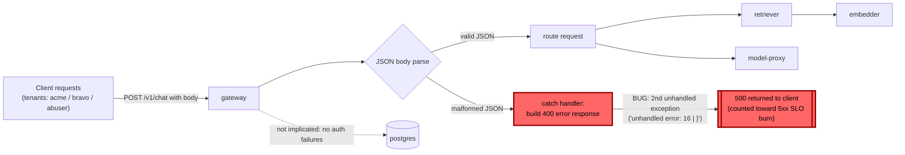

# Postmortem: gateway 5xx rate above 2%

- **Status:** open
- **Severity:** sev1
- **Verified:** no
- **Opened:** 2026-08-04 12:56:40Z
- **Resolved:** (still open)

## Timeline (machine-generated)

All times UTC on 2026-08-04 unless a full date is shown.

| Time (UTC) | Source | Event |
| --- | --- | --- |
| 12:27:06Z | k8s | ReplicaSet/retriever-8454db56c: SuccessfulCreate |
| 12:27:06Z | k8s | Deployment/retriever: ScalingReplicaSet |
| 12:27:06Z | k8s | Pod/retriever-8454db56c-q2b86: Scheduled |
| 12:27:08Z | k8s | Pod/retriever-8454db56c-q2b86: Pulled |
| 12:27:09Z | k8s | Pod/retriever-8454db56c-q2b86: Started |
| 12:27:09Z | k8s | Pod/retriever-8454db56c-q2b86: Created |
| 12:27:11Z | k8s | Pod/retriever-8454db56c-q2b86: Started |
| 12:27:11Z | k8s | Pod/retriever-8454db56c-q2b86: Pulled |
| 12:27:11Z | k8s | Pod/retriever-8454db56c-q2b86: Created |
| 12:27:13Z | k8s | Pod/retriever-8454db56c-q2b86: BackOff |
| 12:27:14Z | k8s | Pod/retriever-8454db56c-q2b86: BackOff |
| 12:27:16Z | k8s | Pod/retriever-8454db56c-q2b86: BackOff |
| 12:27:24Z | k8s | Pod/retriever-8454db56c-q2b86: Started |
| 12:27:24Z | k8s | Pod/retriever-8454db56c-q2b86: Pulled |
| 12:27:24Z | k8s | Pod/retriever-8454db56c-q2b86: Created |
| 12:27:27Z | k8s | Pod/retriever-8454db56c-q2b86: BackOff |
| 12:27:36Z | k8s | Pod/retriever-8454db56c-q2b86: BackOff |
| 12:27:47Z | k8s | Pod/retriever-8454db56c-q2b86: Started |
| 12:27:47Z | k8s | Pod/retriever-8454db56c-q2b86: Pulled |
| 12:27:47Z | k8s | Pod/retriever-8454db56c-q2b86: Created |
| 12:27:49Z | k8s | Pod/retriever-8454db56c-q2b86: BackOff |
| 12:27:50Z | k8s | Pod/retriever-8454db56c-q2b86: BackOff |
| 12:27:56Z | k8s | Pod/retriever-8454db56c-q2b86: BackOff |
| 12:28:43Z | k8s | Pod/retriever-8454db56c-q2b86: Started |
| 12:28:43Z | k8s | Pod/retriever-8454db56c-q2b86: Pulled |
| 12:28:43Z | k8s | Pod/retriever-8454db56c-q2b86: Created |
| 12:28:46Z | k8s | Pod/retriever-8454db56c-q2b86: BackOff |
| 12:28:47Z | k8s | Pod/retriever-8454db56c-q2b86: BackOff |
| 12:29:48Z | k8s | Pod/retriever-8454db56c-q2b86: BackOff |
| 12:30:10Z | k8s | Pod/retriever-8454db56c-q2b86: Started |
| 12:30:10Z | k8s | Pod/retriever-8454db56c-q2b86: Pulled |
| 12:30:10Z | k8s | Pod/retriever-8454db56c-q2b86: Created |
| 12:30:13Z | k8s | Pod/retriever-8454db56c-q2b86: BackOff |
| 12:30:16Z | k8s | Pod/retriever-8454db56c-q2b86: BackOff |
| 12:31:26Z | k8s | Pod/retriever-8454db56c-q2b86: BackOff |
| 12:32:37Z | k8s | Pod/retriever-8454db56c-q2b86: BackOff |
| 12:32:57Z | k8s | Pod/retriever-8454db56c-q2b86: Started |
| 12:32:57Z | k8s | Pod/retriever-8454db56c-q2b86: Pulled |
| 12:32:57Z | k8s | Pod/retriever-8454db56c-q2b86: Created |
| 12:32:59Z | k8s | Pod/retriever-8454db56c-q2b86: BackOff |
| 12:33:03Z | k8s | Pod/retriever-8454db56c-q2b86: BackOff |
| 12:33:06Z | k8s | Pod/retriever-8454db56c-q2b86: BackOff |
| 12:34:15Z | k8s | Pod/retriever-8454db56c-q2b86: BackOff |
| 12:35:16Z | k8s | Pod/retriever-8454db56c-q2b86: BackOff |
| 12:36:08Z | k8s | ReplicaSet/retriever-8454db56c: SuccessfulDelete |
| 12:36:08Z | k8s | Deployment/retriever: ScalingReplicaSet |
| 12:54:07Z | log-spike | log-spike onset: error: Malformed JSON in request body |
| 12:56:10Z | alert | alert firing: Gateway 5xx rate > 2% |

## Evidence links

- [Loki — logs over the incident window](http://localhost:3001/explore?schemaVersion=1&panes=%7B%22pm%22%3A+%7B%22datasource%22%3A+%22loki%22%2C+%22queries%22%3A+%5B%7B%22refId%22%3A+%22A%22%2C+%22datasource%22%3A+%7B%22type%22%3A+%22loki%22%2C+%22uid%22%3A+%22loki%22%7D%2C+%22expr%22%3A+%22%7Bnamespace%3D%5C%22subject%5C%22%7D+%7C~+%5C%22%28%3Fi%29error%7Cfailed%5C%22%22%7D%5D%2C+%22range%22%3A+%7B%22from%22%3A+%221785848200098%22%2C+%22to%22%3A+%221785848527033%22%7D%7D%7D&orgId=1)
- [Mimir — metrics over the incident window](http://localhost:3001/explore?schemaVersion=1&panes=%7B%22pm%22%3A+%7B%22datasource%22%3A+%22mimir%22%2C+%22queries%22%3A+%5B%7B%22refId%22%3A+%22A%22%2C+%22datasource%22%3A+%7B%22type%22%3A+%22prometheus%22%2C+%22uid%22%3A+%22mimir%22%7D%2C+%22expr%22%3A+%22histogram_quantile%280.95%2C+sum%28rate%28http_server_duration_milliseconds_bucket%5B5m%5D%29%29+by+%28le%29%29%22%7D%5D%2C+%22range%22%3A+%7B%22from%22%3A+%221785848200098%22%2C+%22to%22%3A+%221785848527033%22%7D%7D%7D&orgId=1)

## Investigation context

**Runbook match (2):** `gateway-high-error-rate.md`, `stale-secret.md` — toolset narrowed to 13 tools: alert_status, deploy_history, kubectl_read, loki_query, mimir_query, publish_postmortem, request_approval, restart_workload, runbook_lookup, runbook_read, save_artifact, tempo_query, update_db_secret

Pre-check battery (as injected at run start)

## Pre-check leads

### recent_deploys — LEAD
No deploy in the last 60m — rule out the reflex answer.
- No deploy in the last 60m — rule out the reflex answer.

### log_spike — LEAD
error/failed log rate 200/10min vs baseline 0/10min (200x baseline) — onset: error: Malformed JSON in request body at 2026-08-04T12:54:07.256856+00:00
- error/failed log rate 200/10min vs baseline 0/10min (200x baseline) — onset: error: Malformed JSON in request body at 2026-08-04T12:54:07.256856+00:00

### kube_scan — UNAVAILABLE
error: You must be logged in to the server (Unauthorized)

### rollout_state — UNAVAILABLE
gateway: E0804 14:56:40.880747   64372 memcache.go:265] "Unhandled Error" err="couldn't get current server API group list: the server has asked for the client to provide credentials"
E0804 14:56:40.968641   64372 memcache.go:265] "Unhandled Error" err="couldn't get current server API group list: the server has asked for the client to provide credentials"
E0804 14:56:41.065391   64372 memcache.go:265] "Unhandled Error" err="couldn't get current server API group list: the server has asked for the client to; gateway analysis: E0804 14:56:40.926784   57592 memcache.go:265] "Unhandled Error" err="couldn't get current server API group list: the server has asked for the client to provide credentials"
E0804 14:56:41.021643   57592 memcache.go:265] "Unhandled Error"
… (section truncated)

### secret_age — UNAVAILABLE
error: You must be logged in to the server (Unauthorized)

## Narrative

## Summary

`Gateway 5xx rate > 2%` fired for tenant `acme`. Investigation traced the 5xx spike to an unhandled exception inside the gateway's own JSON body-parsing error handler — not a downstream dependency, not a bad deploy, and not a stale database credential. A rolling restart of `deployment/gateway` was proposed, dry-run, and approved, but execution failed: the on-call agent's cluster credentials returned `Unauthorized`, the same failure mode that made the `kube_scan`, `rollout_state`, and `secret_age` prechecks unavailable at the start of this incident. The alert remains **active** — this incident did not recover.

## Impact

`slo:gateway_availability:error_ratio5m` climbed from a 0% baseline to a sustained ~7.3% (well above the 2% threshold), consistently across all four gateway replicas (`pwg4s`, `bnt4c`, `f9rwq`, `lvg8w`) and spanning multiple tenants (`acme`, `bravo`, `abuser` all showed successful `chat completed` events interleaved with failures — this is not a single-tenant rate-limit condition). A near-identical, smaller spike occurred roughly 25 minutes earlier and self-resolved without intervention; the current spike began independently and has not cleared.

## Root cause

Every 5xx traces back to gateway log lines `error: Malformed JSON in request body` immediately followed by `[gateway] unhandled error: 16 |         }` on the same pod. The gateway correctly *catches* the initial JSON parse failure (which should produce a 400), but the code path that builds the error response itself throws a second, unhandled exception — turning a client-side bad-request into a server-side 500. This reproduced identically on all four replicas, ruling out a single bad pod.

Both runbook-suggested causes were checked and excluded with evidence:
- **Bad deploy** — `deploy_history` returned zero gateway entries for both a 60-minute and a 24-hour window; no code shipped that could have introduced this regression recently.
- **Stale database secret** — `loki_query` for `"password authentication failed"` over the incident window returned zero hits; the failure signature is entirely JSON-parsing/exception-handling, unrelated to Postgres auth.

The two runbook hypotheses about a failing downstream or a mistimed timeout also don't fit: the failure originates inside the gateway process itself, not in `retriever`/`embedder`/`model-proxy` calls.

## What fixed it

Nothing — remediation did not complete. `restart_workload` was dry-run (clean rolling-restart annotation patch, no spec change), the diff-backed summary was sent to `request_approval`, and the operator **approved** it. Both real-execution attempts (`dry_run=false`) against the approved action then failed with `error: You must be logged in to the server (Unauthorized)` — an environmental/cluster-credential fault affecting the agent's kubeconfig identity, not a code or approval problem. `alert_status` was re-queried after both attempts and still reports the alert **active** since it first fired. No further remediation attempts were made without a fresh approval per policy.

## Lessons

1. The unhandled second exception in the gateway's malformed-JSON error handler is a real code defect (not just a symptom of chaos/test traffic) and needs a proper fix in the request-body parsing middleware so parse failures return a clean 400 instead of falling through to an unrelated crash.
2. The on-call agent's cluster credentials were already degraded for every read-only diagnostic this incident touched (`kube_scan`, `rollout_state`, `secret_age` all pre-failed as `Unauthorized`) and that same fault turned out to also block the *write* path (`restart_workload`), silently turning an approved, actionable remediation into a no-op. Credential health for the agent's own kubeconfig should be an explicit, alerted signal — right now its failure only surfaces mid-incident as tool errors.
3. Because remediation never executed, this incident should stay open/escalated to a human operator with cluster access to (a) restart the gateway deployment directly and (b) schedule the error-handler code fix.

