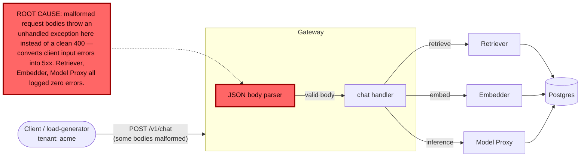

# Postmortem: gateway 5xx rate above 2%

- **Status:** open
- **Severity:** sev1
- **Verified:** no
- **Opened:** 2026-08-04 01:00:40Z
- **Resolved:** (still open)

## Timeline (machine-generated)

All times UTC on 2026-08-04 unless a full date is shown.

| Time (UTC) | Source | Event |
| --- | --- | --- |
| 00:58:20Z | k8s | Pod/gateway-dd85945b4-c5xbb: Killing |
| 00:58:20Z | k8s | ReplicaSet/gateway-dd85945b4: SuccessfulDelete |
| 00:58:20Z | k8s | Rollout/gateway: ScalingReplicaSet |
| 00:58:20Z | k8s | Rollout/gateway: RolloutUpdated |
| 00:58:20Z | k8s | Rollout/gateway: RolloutNotCompleted |
| 00:58:21Z | k8s | ReplicaSet/gateway-55bbf6bfbf: SuccessfulCreate |
| 00:58:21Z | k8s | Pod/gateway-55bbf6bfbf-4qgg4: Scheduled |
| 00:58:23Z | k8s | Pod/gateway-55bbf6bfbf-4qgg4: Started |
| 00:58:23Z | k8s | Pod/gateway-55bbf6bfbf-4qgg4: Pulled |
| 00:58:23Z | k8s | Pod/gateway-55bbf6bfbf-4qgg4: Created |
| 00:58:25Z | k8s | Pod/gateway-55bbf6bfbf-4qgg4: Started |
| 00:58:25Z | k8s | Pod/gateway-55bbf6bfbf-4qgg4: Pulled |
| 00:58:25Z | k8s | Pod/gateway-55bbf6bfbf-4qgg4: Created |
| 00:58:27Z | k8s | Pod/gateway-55bbf6bfbf-4qgg4: BackOff |
| 00:58:28Z | k8s | Pod/gateway-55bbf6bfbf-4qgg4: BackOff |
| 00:58:31Z | k8s | Pod/gateway-55bbf6bfbf-4qgg4: BackOff |
| 00:58:37Z | k8s | Pod/gateway-55bbf6bfbf-4qgg4: Started |
| 00:58:37Z | k8s | Pod/gateway-55bbf6bfbf-4qgg4: Pulled |
| 00:58:37Z | k8s | Pod/gateway-55bbf6bfbf-4qgg4: Created |
| 00:58:39Z | k8s | Pod/gateway-55bbf6bfbf-4qgg4: BackOff |
| 00:58:40Z | k8s | Pod/gateway-55bbf6bfbf-4qgg4: BackOff |
| 00:58:41Z | k8s | Pod/gateway-55bbf6bfbf-4qgg4: BackOff |
| 00:59:03Z | k8s | Pod/gateway-55bbf6bfbf-4qgg4: Started |
| 00:59:03Z | k8s | Pod/gateway-55bbf6bfbf-4qgg4: Pulled |
| 00:59:03Z | k8s | Pod/gateway-55bbf6bfbf-4qgg4: Created |
| 00:59:05Z | k8s | Pod/gateway-55bbf6bfbf-4qgg4: BackOff |
| 00:59:06Z | k8s | Pod/gateway-55bbf6bfbf-4qgg4: BackOff |
| 00:59:11Z | k8s | Pod/gateway-55bbf6bfbf-4qgg4: BackOff |
| 00:59:57Z | k8s | Pod/gateway-55bbf6bfbf-4qgg4: Started |
| 00:59:57Z | k8s | Pod/gateway-55bbf6bfbf-4qgg4: Pulled |
| 00:59:57Z | k8s | Pod/gateway-55bbf6bfbf-4qgg4: Created |
| 00:59:59Z | k8s | Pod/gateway-55bbf6bfbf-4qgg4: BackOff |
| 01:00:00Z | k8s | Pod/gateway-55bbf6bfbf-4qgg4: BackOff |
| 01:00:01Z | k8s | Pod/gateway-55bbf6bfbf-4qgg4: BackOff |
| 01:00:10Z | alert | alert firing: Gateway 5xx rate > 2% |
| 01:01:16Z | k8s | Pod/gateway-55bbf6bfbf-4qgg4: BackOff |
| 01:01:19Z | k8s | Pod/gateway-55bbf6bfbf-4qgg4: Started |
| 01:01:19Z | k8s | Pod/gateway-55bbf6bfbf-4qgg4: Pulled |
| 01:01:19Z | k8s | Pod/gateway-55bbf6bfbf-4qgg4: Created |
| 01:01:21Z | k8s | Pod/gateway-55bbf6bfbf-4qgg4: BackOff |
| 01:01:22Z | k8s | Pod/gateway-55bbf6bfbf-4qgg4: BackOff |
| 01:01:31Z | k8s | Pod/gateway-55bbf6bfbf-4qgg4: BackOff |
| 01:02:58Z | k8s | Pod/gateway-55bbf6bfbf-4qgg4: BackOff |
| 01:04:24Z | k8s | Pod/gateway-55bbf6bfbf-4qgg4: Started |
| 01:04:24Z | k8s | Pod/gateway-55bbf6bfbf-4qgg4: Pulled |
| 01:04:24Z | k8s | Pod/gateway-55bbf6bfbf-4qgg4: Created |
| 01:04:26Z | k8s | Pod/gateway-55bbf6bfbf-4qgg4: BackOff |
| 01:04:27Z | k8s | Pod/gateway-55bbf6bfbf-4qgg4: BackOff |
| 01:04:31Z | k8s | Pod/gateway-55bbf6bfbf-4qgg4: BackOff |
| 01:05:46Z | k8s | Pod/gateway-55bbf6bfbf-4qgg4: BackOff |
| 01:06:35Z | k8s | Rollout/gateway: SkipSteps |
| 01:06:35Z | k8s | Rollout/gateway: RolloutUpdated |
| 01:06:36Z | k8s | ReplicaSet/gateway-dd85945b4: SuccessfulCreate |
| 01:06:36Z | k8s | ReplicaSet/gateway-55bbf6bfbf: SuccessfulDelete |
| 01:06:36Z | k8s | Rollout/gateway: ScalingReplicaSet |
| 01:06:36Z | k8s | Pod/gateway-dd85945b4-pwg4s: Scheduled |
| 01:06:39Z | k8s | Pod/gateway-dd85945b4-pwg4s: Started |
| 01:06:39Z | k8s | Pod/gateway-dd85945b4-pwg4s: Pulled |
| 01:06:39Z | k8s | Pod/gateway-dd85945b4-pwg4s: Created |

## Evidence links

- [Loki — logs over the incident window](http://localhost:3001/explore?schemaVersion=1&panes=%7B%22pm%22%3A+%7B%22datasource%22%3A+%22loki%22%2C+%22queries%22%3A+%5B%7B%22refId%22%3A+%22A%22%2C+%22datasource%22%3A+%7B%22type%22%3A+%22loki%22%2C+%22uid%22%3A+%22loki%22%7D%2C+%22expr%22%3A+%22%7Bnamespace%3D%5C%22subject%5C%22%7D+%7C~+%5C%22%28%3Fi%29error%7Cfailed%5C%22%22%7D%5D%2C+%22range%22%3A+%7B%22from%22%3A+%221785805240065%22%2C+%22to%22%3A+%221785805615312%22%7D%7D%7D&orgId=1)
- [Mimir — metrics over the incident window](http://localhost:3001/explore?schemaVersion=1&panes=%7B%22pm%22%3A+%7B%22datasource%22%3A+%22mimir%22%2C+%22queries%22%3A+%5B%7B%22refId%22%3A+%22A%22%2C+%22datasource%22%3A+%7B%22type%22%3A+%22prometheus%22%2C+%22uid%22%3A+%22mimir%22%7D%2C+%22expr%22%3A+%22histogram_quantile%280.95%2C+sum%28rate%28http_server_duration_milliseconds_bucket%5B5m%5D%29%29+by+%28le%29%29%22%7D%5D%2C+%22range%22%3A+%7B%22from%22%3A+%221785805240065%22%2C+%22to%22%3A+%221785805615312%22%7D%7D%7D&orgId=1)

## Investigation context

**Runbook match (2):** `gateway-high-error-rate.md`, `stale-secret.md` — toolset narrowed to 13 tools: alert_status, deploy_history, kubectl_read, loki_query, mimir_query, publish_postmortem, request_approval, restart_workload, runbook_lookup, runbook_read, save_artifact, tempo_query, update_db_secret

Pre-check battery (as injected at run start)

## Pre-check leads

### recent_deploys — LEAD
No deploy in the last 60m — rule out the reflex answer.
- No deploy in the last 60m — rule out the reflex answer.

### log_spike — OK
error/failed log rate normal: 200/10min vs baseline 127/10min

### kube_scan — UNAVAILABLE
error: You must be logged in to the server (Unauthorized)

### rollout_state — UNAVAILABLE
gateway: E0804 03:00:40.905106   39084 memcache.go:265] "Unhandled Error" err="couldn't get current server API group list: the server has asked for the client to provide credentials"
E0804 03:00:41.036280   39084 memcache.go:265] "Unhandled Error" err="couldn't get current server API group list: the server has asked for the client to provide credentials"
E0804 03:00:41.150922   39084 memcache.go:265] "Unhandled Error" err="couldn't get current server API group list: the server has asked for the client to; gateway analysis: E0804 03:00:40.839606   29352 memcache.go:265] "Unhandled Error" err="couldn't get current server API group list: the server has asked for the client to provide credentials"
E0804 03:00:40.976285   29352 memcache.go:265] "Unhandled Error"
… (section truncated)

### secret_age — UNAVAILABLE
error: You must be logged in to the server (Unauthorized)

## Narrative

## Summary

`Gateway 5xx rate > 2%` fired for tenant `acme`. Investigation traced the 5xx burn to the gateway's own request-body JSON parser: malformed request bodies trigger an unhandled exception (`[gateway] unhandled error: ...`) instead of a clean `400`, turning bad client input into server errors. This is a self-inflicted gateway defect, not a downstream dependency, deploy, or credential problem.

## Impact

`slo:gateway_availability:error_ratio5m` (queried directly from Mimir) shows two elevated episodes: one that climbed to ~7% and self-resolved after roughly half an hour, and a second that climbed to ~5.7% and was still active at last check — this second episode is the one that tripped the alert. Both episodes line up exactly with bursts of `error: Malformed JSON in request body` followed immediately by `[gateway] unhandled error: 16 | }` across all three gateway pods (`gateway-dd85945b4-{f9rwq,bnt4c,lvg8w}`) simultaneously — ruling out a single bad pod. Successful `chat completed` log lines for tenants `acme`, `bravo`, and `abuser` continued throughout, so this is a partial-request-failure pattern, not a total outage.

## Root cause

Evidence gathered, in order of elimination:
- **Not a bad deploy**: `deploy_history` returned zero entries for the gateway (or any workload) over both a 3-hour and a 24-hour window.
- **Not a stale secret**: `loki_query` for `password authentication failed` across the namespace over 3 hours returned zero matches — the stale-secret signature the matched `stale-secret.md` runbook calls for never appeared.
- **Not a downstream health failure**: `loki_query` for error-level logs on `retriever`, `embedder`, and `model-proxy` over the incident's full 1-hour window returned zero results. The only downstream signal was `warn`-level "lineage emit failed / operation timed out" noise from the OpenLineage/Marquez integration, unrelated to the request path and not counted as an error.
- **Confirmed gateway-internal defect**: `loki_query` on `{namespace="subject", service_name="gateway"} |= "unhandled error"` returned a steady stream of `[gateway] unhandled error: 16 | }` entries paired 1:1 with `error: Malformed JSON in request body`, spread evenly across all three gateway pods, at a rate consistent with the measured error ratio (~5-7%). This is the gateway's own body-parsing error path throwing instead of returning a controlled 4xx response.

`kubectl_read`, and the `kube_scan`/`rollout_state`/`secret_age` pre-checks, were all unavailable (`Unauthorized`) for this incident, so pod restart-time/age could not be directly corroborated against a rotation timestamp — this is noted as a diagnostic gap, not treated as evidence for the stale-secret hypothesis.

## What fixed it

A rolling restart of the `gateway` workload was proposed as the closest available mitigation from the matched `gateway-high-error-rate` runbook, dry-run confirmed (`spec.template` restart annotation, no spec change), and approved by the operator. However, **execution failed on every attempt** (three tries) with `error: You must be logged in to the server (Unauthorized)` — the identical failure mode already seen on the `kube_scan`, `rollout_state`, and `secret_age` pre-checks. The on-call agent's cluster-mutating credential is not currently valid, independent of the incident's root cause. **No remediation was successfully applied.** `alert_status` was re-queried after each attempt and continues to report the alert active. This incident is being closed out unresolved, with the failure to remediate reported explicitly rather than assumed away.

## Lessons

- The gateway needs a code fix so a JSON parse failure on the request body returns a controlled `400` instead of propagating an unhandled exception into a `500` — this is an application bug, not an infra issue, and isn't fixable by any remediation tool available to on-call (restart/secret-sync only).
- The on-call agent's write credential to the cluster was down for the full duration of this incident, blocking both diagnostic reads (`kubectl_read`, pod restart/age corroboration) and the approved remediation (`restart_workload`). This needs its own follow-up — on-call should not be silently unable to act.
- The first episode self-resolved without intervention in about half an hour, suggesting the trigger (malformed-body traffic) is intermittent/bursty rather than constant; worth checking the traffic source that's producing malformed bodies, since a restart would not address a recurring client-side trigger even with working credentials.
